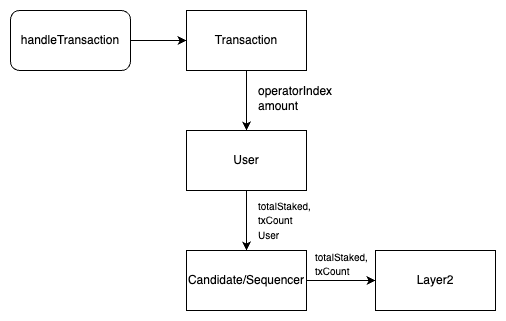

[[Staking/DAO v2 Subgraph Architecture v0.1]] 

## Graph schema

schema
  - layer2

```graphql
type Layer2 @entity {
  # layer2 manager address
  id: ID!
  layer2SequencerCount: BigInt!
  layer2CandidateCount: BigInt!
  stakingTxCount: BigInt!
  depositTxCount: BigInt!
  # staked & deposited value
  totalStakedTON: BigInt!
  totalPendingWithdrawal: BigInt!
  totalDepositedTON: BigInt!
}
```

  - sequencer

```graphql
type Sequencer @entity {
  # sequencer index
  id: ID!
  # sequencer name
  name: String!
  sequencer: Bytes!
	# owner of sequencer
	owner: Bytes!
  candidateCount: BigInt!
  candidate: [Candidate!]!
  txCount: BigInt!
	# l1bridge address
	l1Bridge: Bytes!
  # l1bridge address
	l2Bridge: Bytes!
	# ton adress deployed in this l2
	l2ton: Bytes!
	# commision rate
	commissionRate: BigDecimal!
	# deposited amount of this operator
	depositAmount: BigDecimal!
  # staked amount of this sequencer
	stakedAmount: BigInt!
	pendingWithdrawalAmount: BigInt!
  # user info who are staking to this sequencer
	stakedUser: [User!]!
  # derived values
  staked: [Staked]! @derivedFrom(field: "sequencer")
  unstaked: [Unstaked]! @derivedFrom(field: "sequencer")
  restaked: [Restaked]! @derivedFrom(field: "sequencer")
	withdrawal: [Withdrawal]! @derivedFrom(field: "sequencer")
	# deposited: [Deposit]! @derivedFrom(field: "transaction")
}
```

  - candidate

```graphql
type Candidate @entity {
  # candidate index
  id: ID!
  # sequencer name
  name: String!
	# owner of sequencer
	owner: Bytes!
	# mapping for sequencer
	sequencerIndex: BigDecimal!
	# staked amount of this candidate
	stakedAmount: BigInt!
  pendingWithdrawalAmount: BigInt!
  txCount: BigInt!
  commissionRate: BigDecimal!
  # user info who are staking to this candidate
	user: [User!]!
  # derived values
  staked: [Staked]! @derivedFrom(field: "candidate")
  unstaked: [Unstaked]! @derivedFrom(field: "candidate")
  restaked: [Restaked]! @derivedFrom(field: "candidate")
	withdrawal: [Withdrawal]! @derivedFrom(field: "candidate")
	# deposited: [Deposit]! @derivedFrom(field: "transaction")
}
```

  - UpdatedSeigniorage

```graphql
type UpdatedSeigniorage @entity {
	lastSeigBlock: BigDecimal!
	increaseSeig: BigInt!
	totalSupplyOfTon: BigInt!
	amount: Object
	prevIndex: BigDecimal!
	index: BigDecimal!
}
```

  - Claimed

```graphql
type UpdatedSeigniorage @entity {
	index: BigDecimal!
	sequencer: ID!
	amount: BigInt!
}
```

  - Distributed

```graphql
type UpdatedSeigniorage @entity {
	lastSeigBlock: BigDecimal!
	distributedAmount: BigInt!
}
```

  - User

```graphql
type User @entity {
	# user address
  id: ID!
	# deposited amount of this user
	totalStaked: BigInt!
  pendingWithdrawalAmount: BigInt!
	# amount of TON from seigniorage 
	totalEarnedSeig: BigInt!
	# deposited amount of this user
	totalDeposited: BigInt!
  userLton: BigInt!
  userStaked: [UserStaked!]!
  userDeposited: [UserDeposited!]!
	# derived values
  staked: [Staked]! @derivedFrom(field: "user")
  unstaked: [Unstaked]! @derivedFrom(field: "user")
  restaked: [Restaked]! @derivedFrom(field: "user")
	withdrawal: [Withdrawal]! @derivedFrom(field: "user")
	# deposited: [Deposit]! @derivedFrom(field: "transaction")
	# list of provided fast withdraw
	# fastWithdrawalClaim: [FastWithdrawalClaim]! @derivedFrom(field: "transaction")
}
```

  - Agenda(after DAO contract implemented)

```graphql
type Agenda @entity {

}
```

  - Transactions

```graphql
type Transaction @entity {
  # txn hash
  id: ID!
  # block txn was included in
  blockNumber: BigInt!
  # timestamp txn was confirmed
  timestamp: BigInt!
  # gas used during txn execution
  gasUsed: BigInt!
  gasPrice: BigInt!
  # derived values
  staked: [Staked]! @derivedFrom(field: "transaction")
  unstaked: [Unstaked]! @derivedFrom(field: "transaction")
  restaked: [Restaked]! @derivedFrom(field: "transaction")
	withdrawal: [Withdrawal]! @derivedFrom(field: "transaction")
	#deposited: [Deposit]! @derivedFrom(field: "transaction")
	fastWithdrawalClaim: [FastWithdrawalClaim]! @derivedFrom(field: "transaction")
  fastWithdrawalStaked: [FastWithdrawalStaked]! @derivedFrom(field: "transaction")
}
```

  - Staked

```graphql
type Staked @entity(immutable: true) {
  id: ID!
  transaction: Transaction!
  timestamp: BigInt!
  sequencer: Sequencer!
  candidate: Candidate!
  user: User!
  sender: Bytes! # address
  amount: BigInt! # uint256
  lton: BigInt! # uint256
  commissionTo: Bytes! # address
  commission: Int! # uint16
}
```

  - Unstake

```graphql
type Unstaked @entity(immutable: true) {
  id: ID!
  transaction: Transaction!
  timestamp: BigInt!
  sequencer: Sequencer!
  candidate: Candidate!
  user: User!
  sender: Bytes! # address
  amount: BigInt! # uint256
  lton: BigInt! # uint256
}
```

  - Restake

```graphql
type Restaked @entity(immutable: true) {
  id: ID!
  transaction: Transaction!
  timestamp: BigInt!
  sequencer: Sequencer!
  candidate: Candidate!
  user: User!
  sender: Bytes! # address
  amount: BigInt! # uint256
  lton: BigInt! # uint256
}
```

  - Withdraw

```graphql
type Withdrawal @entity(immutable: true) {
  id: ID!
  transaction: Transaction!
  timestamp: BigInt!
  sequencer: Sequencer!
  candidate: Candidate!
  user: User!
  sender: Bytes! # address
  amount: BigInt! # uint256
}
```

  - FastWithdraw

```graphql
# transaction hash + "#" + index in staked Transaction array
  id: ID!
  # which txn the stake was included in
  transaction: Transaction!
  # time of txn
  timestamp: BigInt!
	# owner of sequencer or candidate where FW occured to
  owner: Bytes!
  # the address that sta
  sender: Bytes
  # txn origin
  origin: Bytes! # the EOA that initiated the txn
  # amount of FW
  amount: BigInt!
	# fee of FW
  fee: BigInt!
	# position within the transactions
  logIndex: BigInt
```

  - day data
    - 총 스테이킹량
  - hour data

event listening
  - staking 관련 이벤트 발생시
    - 영향 받는 스키마
      - Layer2, Sequencer/Candidate, User, Transaction


    - **handleTransaction:** handleStake, handleWithdraw 등
    - **수량 관련:** staked amount, pending amount, lton
    - 해당 candidate에 staking한 유저들, 수량, pending 물량 확인 가능
    - 유저들이 어디에 스테이킹했는지 파악
    - candidate 별 스테이킹량, 전체 스테이킹량 확인 가능, 
    - 시간별 통계 필요?
  - 시뇨리지 관련
  - FW 관련