[Link](https://github.com/tokamak-network/ton-staking-v2/issues/309)

# **CON-01 | Centralization Risks
**

Severity : Major 

Location: 

> [!tip]
> 💡 
> ### **Definition of Centralization Risks**
> 
> Centralization risks are vulnerabilities that can be exploited both by malicious developers of a project as well as malicious outside attackers. They can be taken advantage of in rug pulls, infinite minting exploits, and many other types of attacks.

### **Description**

In the contract `CandidateAddOnV1_1` the role `DEFAULT_ADMIN_ROLE` has authority over the functions shown in the diagram below. Any compromise to the `DEFAULT_ADMIN_ROLE` account may allow the hacker to take advantage of this authority and:

- function `initialize`, to set the state variables `candidate`, `isLayer2Candidate`, `committee`, `seigManager`, `memo`, `ton`, and `wton`.
- function `setMemo`, to set the state variable `memo`.

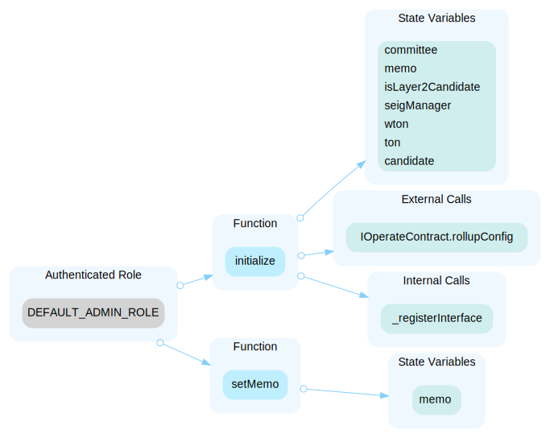

In the contract `CandidateAddOnV1_1` the role `candidate` has authority over the functions shown in the diagram below. Any compromise to the `candidate` account may allow the hacker to take advantage of this authority and:

- function `changeMember`, to become a member.
- function `retireMember`, to retire a member.
- function `castVote`, to vote on an agenda.
- function `claimActivityReward`, to cliam an activity reward.

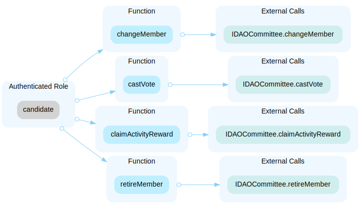

In the contract `DAOCommittee_V1` the role `DEFAULT_ADMIN_ROLE` has authority over the functions shown in the diagram below. Any compromise to the `DEFAULT_ADMIN_ROLE` account may allow the hacker to take advantage of this authority and:

- function `createCandidateOwner`, to create a candidate.
- function `registerLayer2CandidateByOwner`, to registers the exist layer2 on DAO by owner.
- function `setAgendaStatus`, to set status and result of specific agenda.

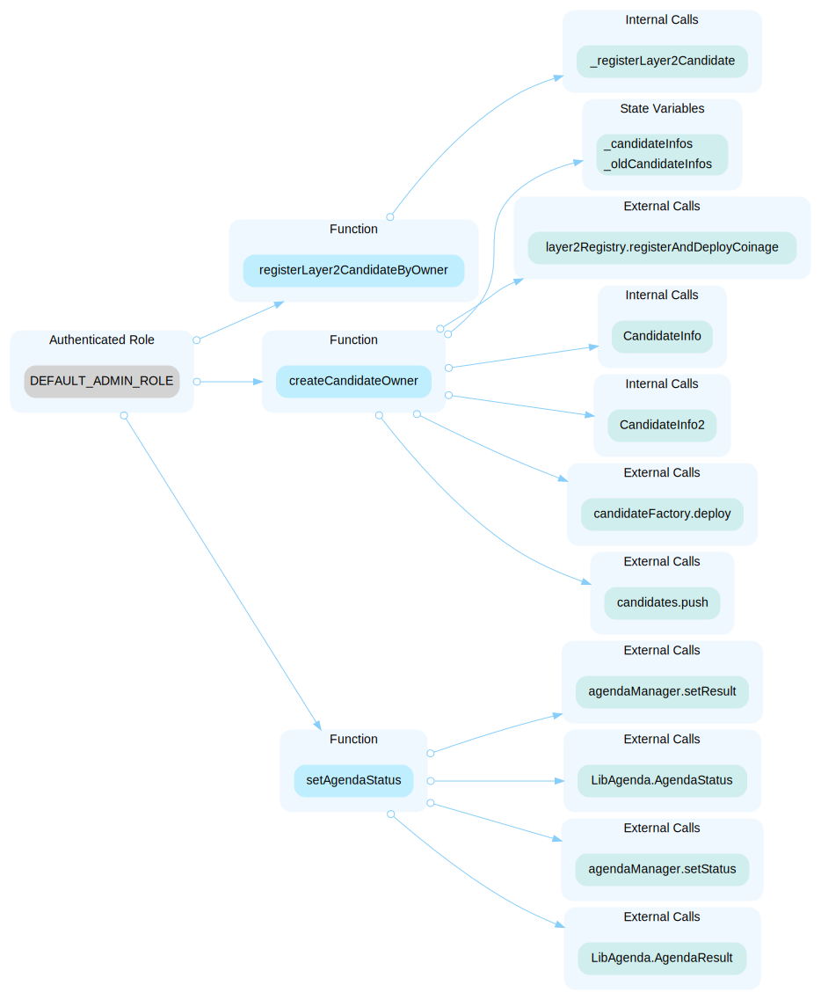

In the contract `DAOCommittee_V1` the role `_membercontract` has authority over the functions shown in the diagram below. Any compromise to the `_membercontract` account may allow the hacker to take advantage of this authority and:

- function `retireMember`, to retire member.

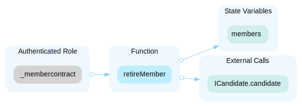

In the contract `DAOCommitteeProxy2` the role `DEFAULT_ADMIN_ROLE` has authority over the functions shown in the diagram below. Any compromise to the `DEFAULT_ADMIN_ROLE` account may allow the hacker to take advantage of this authority and:

- function `upgradeTo2`, to set implementation contract.
- function `setImplementation2`, to set implementation contract.
- function `setAliveImplementation2`, to implementation contract.
- function `setSelectorImplementations2`, to set `selectorImplementation`.

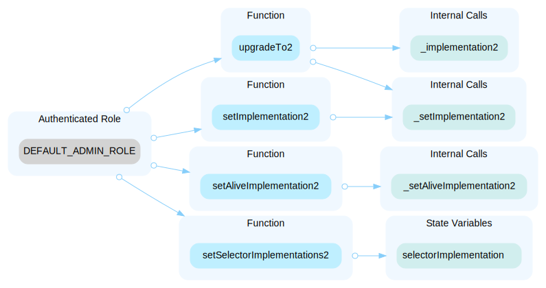

In the contract `DAOCommitteeOwner` the role `DEFAULT_ADMIN_ROLE` has authority over the functions shown in the diagram below. Any compromise to the `DEFAULT_ADMIN_ROLE` account may allow the hacker to take advantage of this authority and:

- function `setCandidateAddOnFactory`, to set the `candidateAddOnFactory`.
- function `setLayer2Manager`, to set the `layer2Manager`.
- function `setTargetSetLayer2Manager`, to set the layer2 manager.
- function `setTargetSetL1BridgeRegistry`, to set the target L1 bridge registry.
- function `setTargetLayer2StartBlock`, to set the layer2 start block.
- function `setTargetSetImplementation2`, to set the implmentation contract.
- function `setTargetSetSelectorImplementations2`, to set the selector implementation.
- function `setSeigManager`, to set the seig manager.
- function `setTargetSeigManager`, to set the target seig manaer.
- function `setSeigPause`, to set the seig manager paused.
- function `setSeigUnpause`, to set the seig manager unpaused.
- function `setTargetGlobalWithdrawalDelay`, to set the global withdrawal delay.
- function `setTargetAddMinter`, to set the target add minter.
- function `setTargetUpgradeTo`, to upgrade logic.
- function `setTargetSetTON`, to set the TON addr.
- function `setTargetSetWTON`, to set the target WTON addr.
- function `setDaoVault`, to set the dao vault.
- function `setLayer2Registry`, to set the layer2 registry.
- function `setAgendaManager`, to set DAOAgendaManager contract address.
- function `setCandidateFactory`, to set CandidateFactory contract address.
- function `setTon`, to set the ton addr.
- function `setWton`, to set the wton addr.
- function `increaseMaxMember`, to increase the number of member slot.
- function `setQuorum`, to set new quorum.
- function `decreaseMaxMember`, to decreases the number of member slot.
- function `setActivityRewardPerSecond`, to set the `activityRewardPerSecond`.
- function `setCandidatesSeigManager`, to set SeigManager contract address on candidate contracts.
- function `setCandidatesCommittee`, to set DAOCommitteeProxy contract address on candidate contracts.
- function `setCreateAgendaFees`, to set fee amount of creating an agenda.
- function `setMinimumNoticePeriodSeconds`, to set the minimum notice period.
- function `setMinimumVotingPeriodSeconds`, to set the minimum voting period.
- function `setExecutingPeriodSeconds`, to set the executing period.
- function `setBurntAmountAtDAO`, to set the burnt amount at dao.

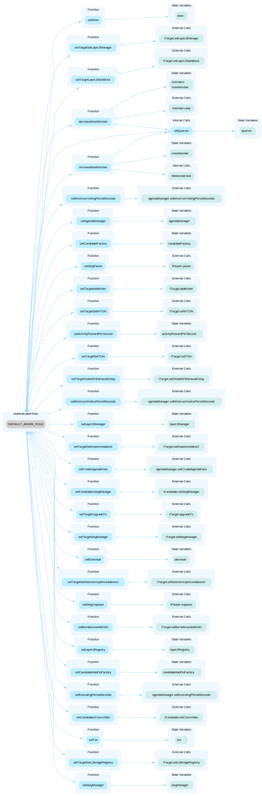

In the contract `L1BridgeRegistryV1_1` the role `DEFAULT_ADMIN_ROLE` has authority over the functions shown in the diagram below. Any compromise to the `DEFAULT_ADMIN_ROLE` account may allow the hacker to take advantage of this authority and:

- function `setAddresses`, to set the state variables `layer2Manager`, `seigManager`, and `ton`.
- function `setSeigniorageCommittee`, to set the state variable `seigniorageCommittee`.

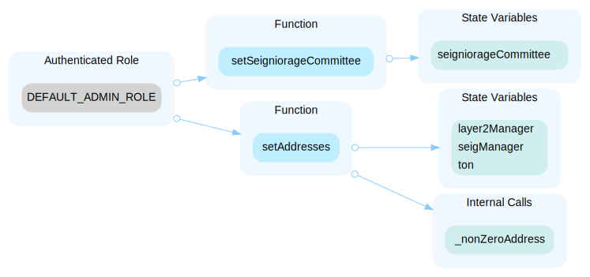

In the contract `L1BridgeRegistryV1_1` the role `MANAGER_ROLE` has authority over the functions shown in the diagram below. Any compromise to the `MANAGER_ROLE` account may allow the hacker to take advantage of this authority and:

- function `registerRollupConfigByManager`, to registers Layer2 for a specific rollupConfig by the manager.

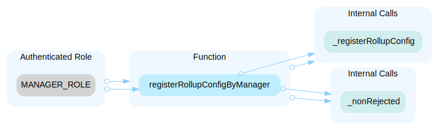

In the contract `L1BridgeRegistryV1_1` the role `REGISTRANT_ROLE` has authority over the functions shown in the diagram below. Any compromise to the `REGISTRANT_ROLE` account may allow the hacker to take advantage of this authority and:

- function `registerRollupConfig`, to registers Layer2 for a specific rollupConfig by Registrant.
- function `changeType`, to change the Layer2 type for a specific rollupConfig by Registrant.

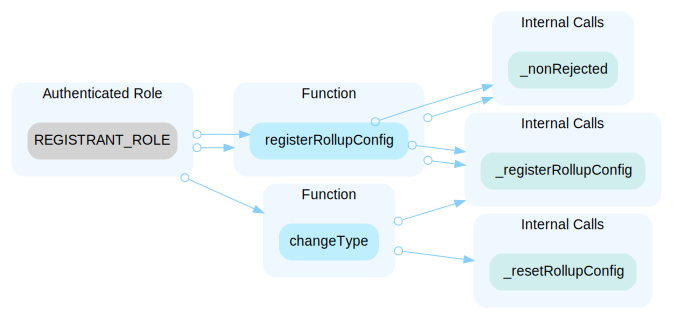

In the contract `L1BridgeRegistryV1_1` the role `seigniorageCommittee` has authority over the functions shown in the diagram below. Any compromise to the `seigniorageCommittee` account may allow the hacker to take advantage of this authority and:

- function `rejectCandidateAddOn`, to stop issuing seigniorage to the layer 2 sequencer of a specific rollupConfig.
- function `restoreCandidateAddOn`, to restore cancel stopping seigniorage to the layer 2 sequencer of a specific rollupConfig.

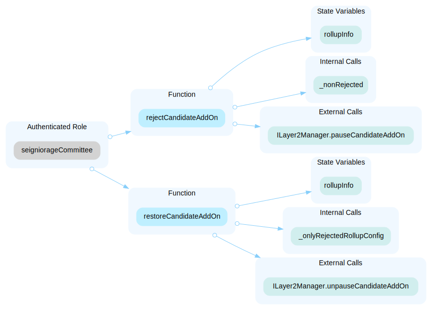

In the contract `Layer2ManagerV1_1` the role `DEFAULT_ADMIN_ROLE` has authority over the functions shown in the diagram below. Any compromise to the `DEFAULT_ADMIN_ROLE` account may allow the hacker to take advantage of this authority and:

- function `setAddresses`, to set the state variables `l1BridgeRegistry`, `operatorManagerFactory`, `ton`, `wton`, `dao`, `depositManager`, `seigManager`, and `swapProxy`.
- function `setOperatorManagerFactory`, to set the state variable `operatorManagerFactory`.
- function `setMinimumInitialDepositAmount`, to set the state variable `minimumInitialDepositAmount`.

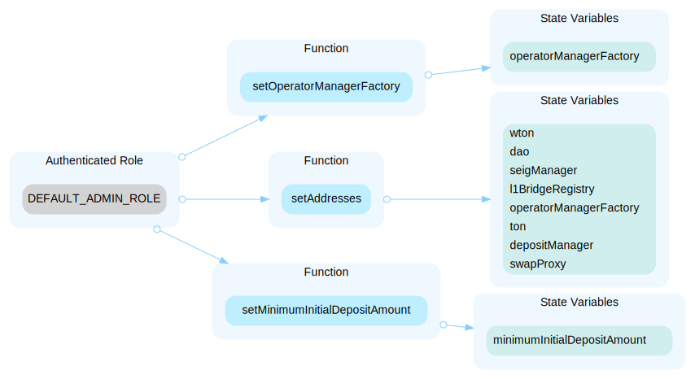

In the contract `Layer2ManagerV1_1` the role `_l1bridgeregistry` has authority over the functions shown in the diagram below. Any compromise to the `_l1bridgeregistry` account may allow the hacker to take advantage of this authority and:

- function `pauseCandidateAddOn`, to pause the CandidateAddOn.
- function `unpauseCandidateAddOn`, to unpause the CandidateAddOn.

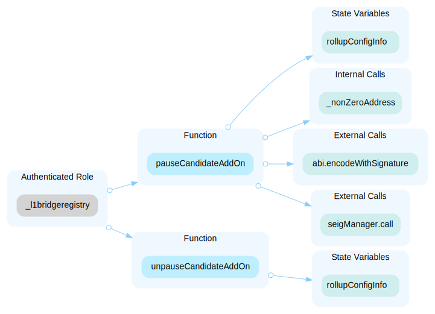

In the contract `Layer2ManagerV1_1` the role `seigManager` has authority over the functions shown in the diagram below. Any compromise to the `seigManager` account may allow the hacker to take advantage of this authority and:

- function `updateSeigniorage`, to settle the seigniorage to the Operator of Layer 2.

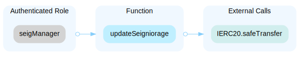

In the contract `OperatorManagerV1_1` the role `DEFAULT_ADMIN_ROLE` has authority over the functions shown in the diagram below. Any compromise to the `DEFAULT_ADMIN_ROLE` account may allow the hacker to take advantage of this authority and:

- function `setAddresses`, to set the state variables `layer2Manager`, `depositManager`, `wton`, and `ton`.

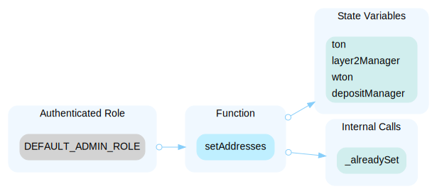

In the contract `OperatorManagerV1_1` the role `_candidateaddon` has authority over the functions shown in the diagram below. Any compromise to the `_candidateaddon` account may allow the hacker to take advantage of this authority and:

- function `depositByCandidateAddOn`, to deposit wton amount to DepositManager as named manager(EOA).
- function `claimByCandidateAddOn`, to claim WTON to a manager.

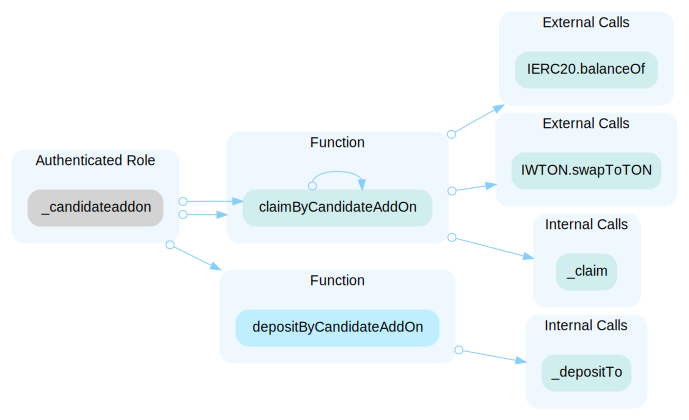

In the contract `OperatorManagerV1_1` the role `_ownerormanager` has authority over the functions shown in the diagram below. Any compromise to the `_ownerormanager` account may allow the hacker to take advantage of this authority and:

- function `transferManager`, to set the state variable `manager`.
- function `claimETH`, to give ETH to a manager.
- function `claimERC20`, to give ERC20 to a manager.
- function `requestWithdrawal`, to request withdrawal the staked ton.
- function `processRequest`, to process the withdrawal request.
- function `processRequests`, to process the withdrawal requests.

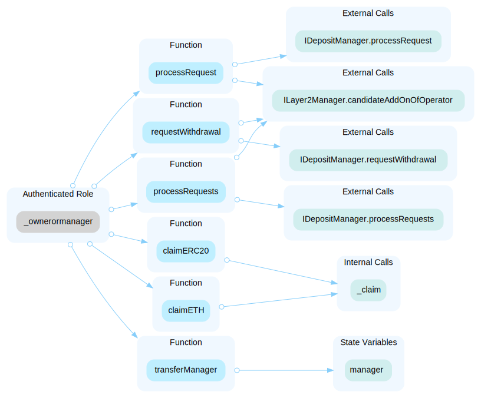

In the contract `DepositManagerV1_1` the role `DEFAULT_ADMIN_ROLE` has authority over the functions shown in the diagram below. Any compromise to the `DEFAULT_ADMIN_ROLE` account may allow the hacker to take advantage of this authority and:

- function `setMinDepositGasLimit`, set the state variable `minDepositGasLimit`.
- function `setAddresses`, set the state variables `l1BridgeRegistry` and `layer2Manager`.

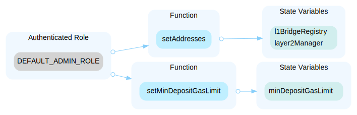

In the contract `SeigManagerV1_3` the role `DEFAULT_ADMIN_ROLE` has authority over the functions shown in the diagram below. Any compromise to the `DEFAULT_ADMIN_ROLE` account may allow the hacker to take advantage of this authority and:

- function `setLayer2Manager`, to set the state variable `layer2Manager`.
- function `setLayer2StartBlock`, to set the start block number of issuing a l2 seigniorage.
- function `setL1BridgeRegistry`, to set the l1BridgeRegistry address.
- function `resetL2RewardPerUint`, to set the state variable `l2RewardPerUint`.

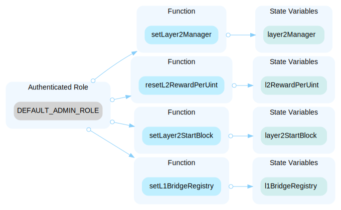

All the contracts inherit upgradeable contracts, indicating that it is part of an upgradeable system. Upgradeable contracts often pair with a proxy contract that is responsible for managing contract upgrades. The `privileged roles` of the proxy often have the authority to update the implementation contract. Any compromise of the privileged account could allow a hacker to exploit this authority, potentially altering the implementation contract pointed to by the proxy and thus executing malicious functionality within the implementation contract.

**Recommendation**
The risk describes the current project design and potentially makes iterations to improve in the security operation and level of decentralization, which in most cases cannot be resolved entirely at the present stage. We advise the client to carefully manage the privileged account's private key to avoid any potential risks of being hacked. In general, we strongly recommend centralized privileges or roles in the protocol be improved via a decentralized mechanism or smart-contract-based accounts with enhanced security practices, e.g., multisignature wallets. Indicatively, here are some feasible suggestions that would also mitigate the potential risk at a different level in terms of short-term, long-term and permanent:**
Short Term:**
Timelock and Multi sign (⅔, ⅗) combination *mitigate* by delaying the sensitive operation and avoiding a single point of key management failure.
• Time-lock with reasonable latency, e.g., 48 hours, for awareness on privileged operations;AND
• Assignment of privileged roles to multi-signature wallets to prevent a single point of failure due to the private key compromised;AND
• A medium/blog link for sharing the timelock contract and multi-signers addresses information with the public audience.**
Long Term:**
Timelock and DAO, the combination, *mitigate* by applying decentralization and transparency.
• Time-lock with reasonable latency, e.g., 48 hours, for awareness on privileged operations;AND
• Introduction of a DAO/governance/voting module to increase transparency and user involvement.AND
• A medium/blog link for sharing the timelock contract, multi-signers addresses, and DAO information with the public audience.**
Permanent:**
Renouncing the ownership or removing the function can be considered *fully resolved*.
• Renounce the ownership and never claim back the privileged roles.OR
• Remove the risky functionality.

- Time-lock with reasonable latency, e.g., 48 hours, for awareness on privileged operations;AND
- Assignment of privileged roles to multi-signature wallets to prevent a single point of failure due to the private key compromised;AND
- A medium/blog link for sharing the timelock contract and multi-signers addresses information with the public audience.
- Time-lock with reasonable latency, e.g., 48 hours, for awareness on privileged operations;AND
- Introduction of a DAO/governance/voting module to increase transparency and user involvement.AND
- A medium/blog link for sharing the timelock contract, multi-signers addresses, and DAO information with the public audience.
- Renounce the ownership and never claim back the privileged roles.OR
- Remove the risky functionality.