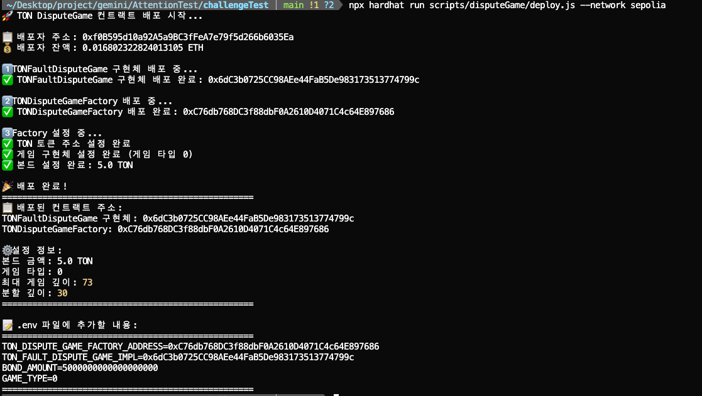
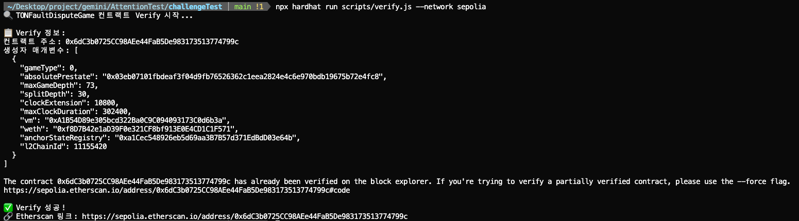
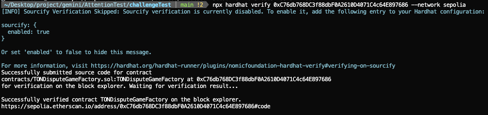
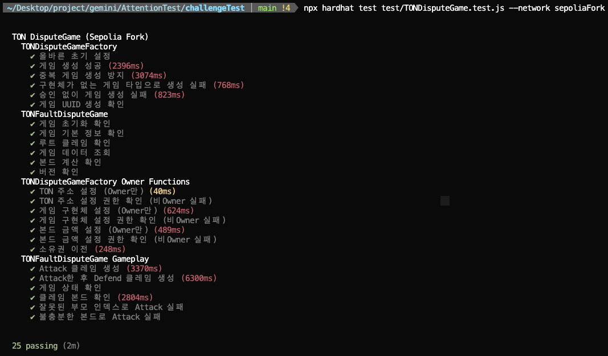
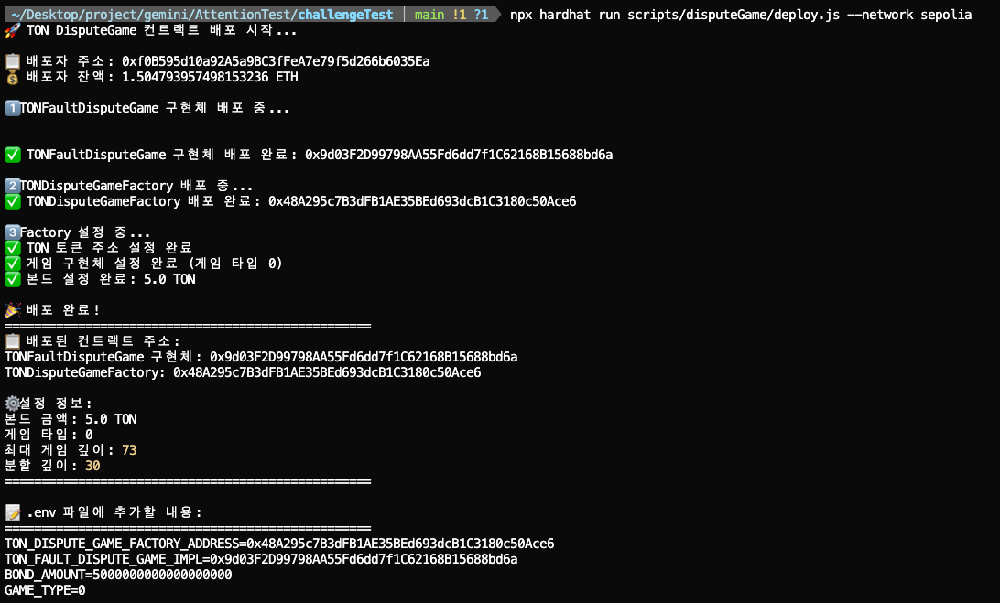
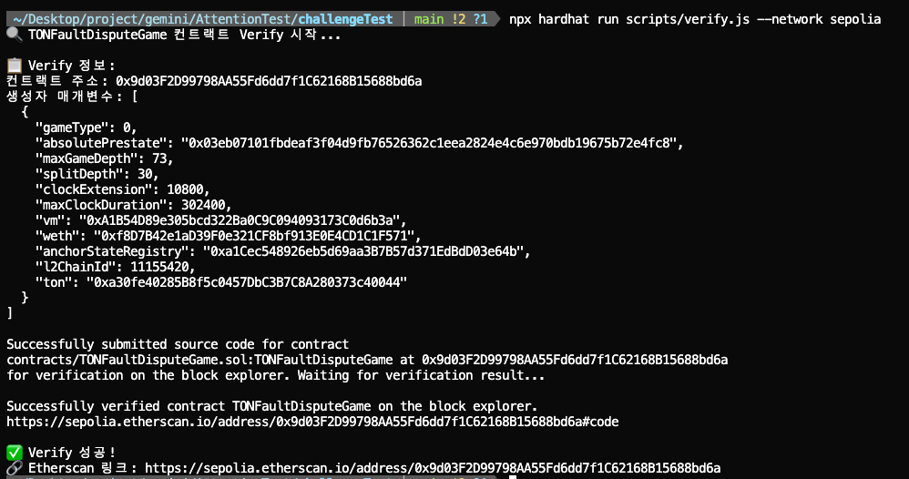
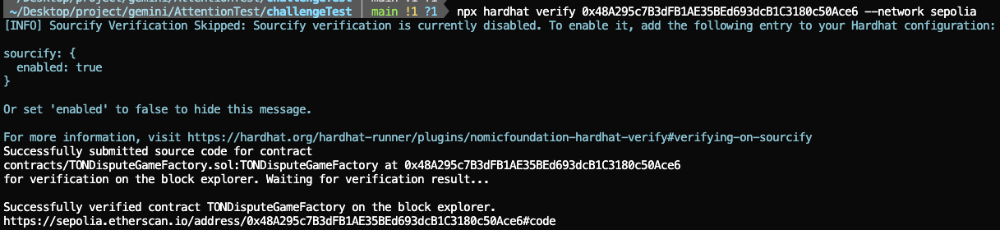
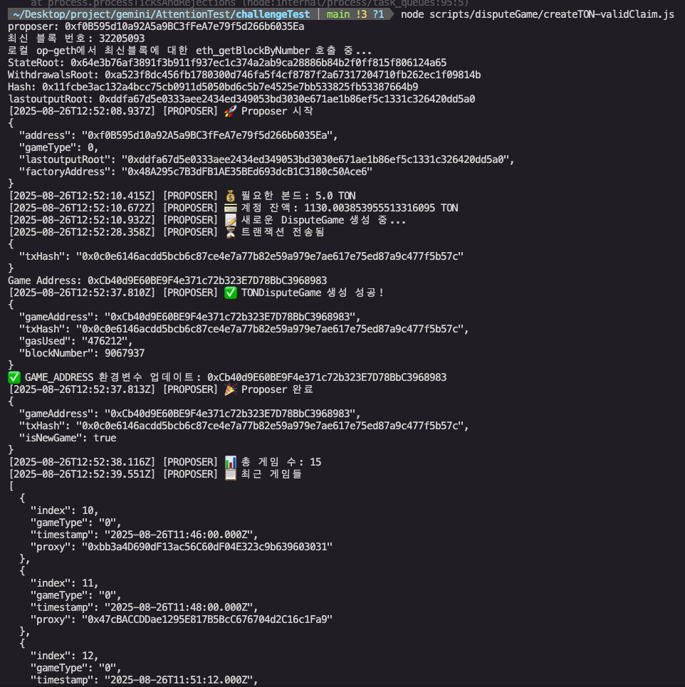
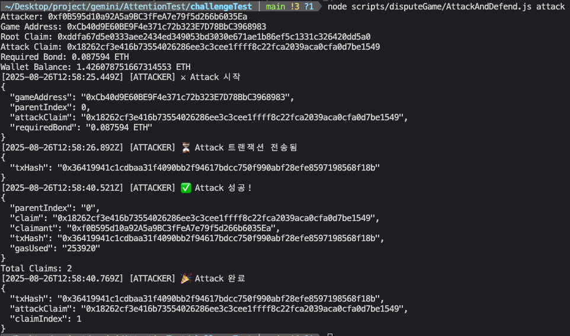
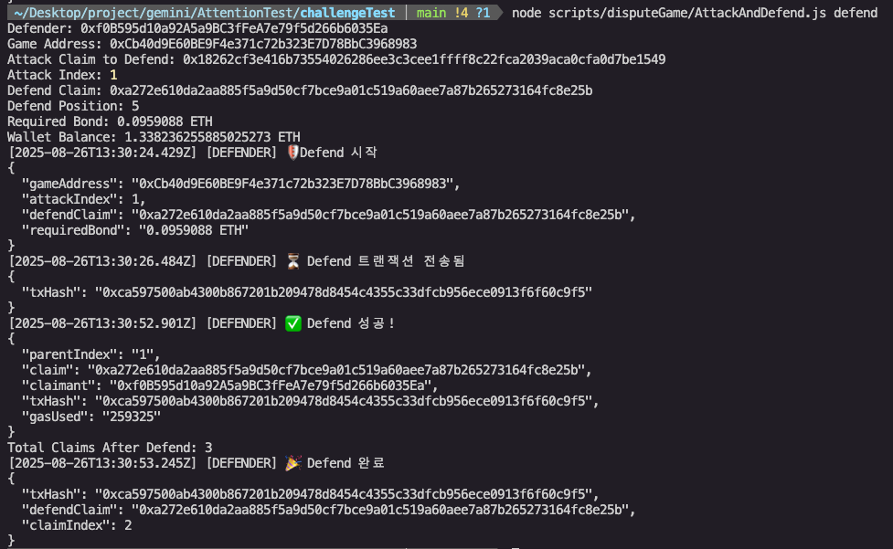

repo : [https://github.com/tokamak-network/DisputeGameTest](https://github.com/tokamak-network/DisputeGameTest)

1. 프로젝트 클론 및 설치
```javascript
git clone https://github.com/tokamak-network/DisputeGameTest.git
```

```javascript
npm install

npx hardhat compile
```
1. 환경변수 설정
```javascript
cp env.example .env
```
1. Sepolia 배포
```javascript
npx hardhat run scripts/disputeGame/deploy.js --network sepolia
```
1. 배포 결과


  1. TONDisputeGameFactory : [0xC76db768DC3f88dbF0A2610D4071C4c64E897686](https://sepolia.etherscan.io/address/0xC76db768DC3f88dbF0A2610D4071C4c64E897686)
  1. TONDisputeGame : [0x6dC3b0725CC98AEe44FaB5De983173513774799c](https://sepolia.etherscan.io/address/0xF4d2C862FAC965a018911BD189a3F80B874D0437#code)
1. Verify 방법
```javascript
// 1. TONDisputeGame
// scripts에 배포된 주소로 수정
npx hardhat run scripts/verify.js --network sepolia

// 2. TONDisputeGameFactory
npx hardhat verify deployed-address --network sepolia
```
1. Verify 결과
  1. TONDisputeGame

  1. TONDisputeGameFactory

1. TONDisputeGameFactory Test
  1. npx hardhat test test/TONDisputeGame.test.js --network sepoliaFork 

1. 재배포
```javascript
npx hardhat run scripts/disputeGame/deploy.js --network sepolia
```
1. 배포 결과
```javascript
📋 배포된 컨트랙트 주소:
TONFaultDisputeGame : 0x9d03F2D99798AA55Fd6dd7f1C62168B15688bd6a
TONDisputeGameFactory: 0x48A295c7B3dFB1AE35BEd693dcB1C3180c50Ace6
```


1. Verify 결과
```javascript
// 1. TONDisputeGame
// scripts에 배포된 주소로 수정
npx hardhat run scripts/verify.js --network sepolia

// 2. TONDisputeGameFactory
npx hardhat verify deployed-address --network sepolia
```

  1. TONDisputeGame

  1. TONDisputeGameFactory

1. Create & Attack Test
```solidity
# 1-1. Invalid Claim으로 게임 생성 (자동으로 GAME_ADDRESS 업데이트됨)
node scripts/disputeGame/createTON-InvalidClaim.js

# 1-2. Valid Claim으로 게임 생성 (자동으로 GAME_ADDRESS 업데이트됨)
node scripts/disputeGame/createTON-validClaim.js

# 2. Attack 실행 (환경변수에서 자동으로 게임 주소 읽음)
node scripts/disputeGame/AttackAndDefend.js attack

# 3. Defend 실행
node scripts/disputeGame/AttackAndDefend.js defend

# 4. 게임 상태 확인
node scripts/disputeGame/AttackAndDefend.js status
```

  1. Create
    1. tx : [https://sepolia.etherscan.io/tx/0x0c0e6146acdd5bcb6c87ce4e7a77b82e59a979e7ae617e75ed87a9c477f5b57c](https://sepolia.etherscan.io/tx/0x0c0e6146acdd5bcb6c87ce4e7a77b82e59a979e7ae617e75ed87a9c477f5b57c)
    1. Result

  1. Attack
    1. tx : [https://sepolia.etherscan.io/tx/0x36419941c1cdbaa31f4090bb2f94617bdcc750f990abf28efe8597198568f18b](https://sepolia.etherscan.io/tx/0x36419941c1cdbaa31f4090bb2f94617bdcc750f990abf28efe8597198568f18b)
    1. Result 

  1. Defend
    1. tx : [https://sepolia.etherscan.io/tx/0xca597500ab4300b867201b209478d8454c4355c33dfcb956ece0913f6f60c9f5](https://sepolia.etherscan.io/tx/0xca597500ab4300b867201b209478d8454c4355c33dfcb956ece0913f6f60c9f5)
    1. Result 
