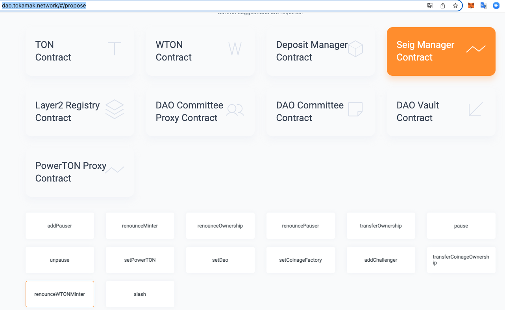

How to ceasing the seigniorage in existed TON staking ? 

# Looking at contracts related to seigniorage

## TON 

- TON: [0x2be5e8c109e2197D077D13A82dAead6a9b3433C5](https://etherscan.io/address/0x2be5e8c109e2197D077D13A82dAead6a9b3433C5)
```java
SeigManagerI public seigManager;
bool public callbackEnabled;
```
- owner : [0xDD9f0cCc044B0781289Ee318e5971b0139602C26      ](https://etherscan.io/address/0xDD9f0cCc044B0781289Ee318e5971b0139602C26)
  - [**DAOCommitteeProxy**](https://etherscan.io/address/0xDD9f0cCc044B0781289Ee318e5971b0139602C26#code)** **
- callbackEnabled : false 
- seigManager : [0x0000000000000000000000000000000000000000](https://etherscan.io/address/0x0000000000000000000000000000000000000000) 

## WTON 

- WTON : [0xc4A11aaf6ea915Ed7Ac194161d2fC9384F15bff2](https://etherscan.io/address/0xc4A11aaf6ea915Ed7Ac194161d2fC9384F15bff2)
```java
ERC20Mintable public ton;
```
- owner : [0xDD9f0cCc044B0781289Ee318e5971b0139602C26](https://etherscan.io/address/0xDD9f0cCc044B0781289Ee318e5971b0139602C26)
  - [**DAOCommitteeProxy**](https://etherscan.io/address/0xDD9f0cCc044B0781289Ee318e5971b0139602C26#code)** **
- decimals : 27 
- ton : [0x2be5e8c109e2197D077D13A82dAead6a9b3433C5](https://etherscan.io/address/0x2be5e8c109e2197D077D13A82dAead6a9b3433C5)
- seigManager : [0x710936500aC59e8551331871Cbad3D33d5e0D909](https://etherscan.io/address/0x710936500aC59e8551331871Cbad3D33d5e0D909)
- callbackEnabled : false 
- isMinter ( owner: [**DAOCommitteeProxy**](https://etherscan.io/address/0xDD9f0cCc044B0781289Ee318e5971b0139602C26#code)** ** ) : true   The owner must have minter authority. (shouldn't be without). 
- isMinter ( current seigManager ) : true  ⇒ Seignorage cannot be issued if seigManager's minter authority is removed.
  - seigManager.renounceWTONMinter() ⇒ **The owner of seigManager can call the renounceWTONMinter() function. **
  - 

## DepositManager

## SeigManager

- SeigManager: [0x710936500aC59e8551331871Cbad3D33d5e0D909](https://etherscan.io/address/0x710936500aC59e8551331871Cbad3D33d5e0D909)
```java

```

  - WTON : [0xc4A11aaf6ea915Ed7Ac194161d2fC9384F15bff2](https://etherscan.io/address/0xc4A11aaf6ea915Ed7Ac194161d2fC9384F15bff2)
  - tot : [0x6FC20Ca22E67aAb397Adb977F092245525f7AeE](https://etherscan.io/address/0x6FC20Ca22E67aAb397Adb977F092245525f7AeEf)
  - ton : [0x2be5e8c109e2197D077D13A82dAead6a9b3433C5](https://etherscan.io/address/0x2be5e8c109e2197D077D13A82dAead6a9b3433C5) 
  - seigPerBlock: [3920000000000000000000000000](https://etherscan.io/unitconverter?wei=3920000000000000000000000000)
  - relativeSeigRate : [400000000000000000000000000](https://etherscan.io/unitconverter?wei=400000000000000000000000000)
  - registry : [0x0b3E174A2170083e770D5d4Cf56774D221b7063e](https://etherscan.io/address/0x0b3E174A2170083e770D5d4Cf56774D221b7063e)
  - powerton : [0x970298189050aBd4dc4F119ccae14ee145ad9371](https://etherscan.io/address/0x970298189050aBd4dc4F119ccae14ee145ad9371)
  - powertonSeig : [100000000000000000000000000](https://etherscan.io/unitconverter?wei=100000000000000000000000000)
  - paused : false 
  - **owner : **[**0xDD9f0cCc044B0781289Ee318e5971b0139602C26**](https://etherscan.io/address/0xDD9f0cCc044B0781289Ee318e5971b0139602C26)
    - [**DAOCommitteeProxy**](https://etherscan.io/address/0xDD9f0cCc044B0781289Ee318e5971b0139602C26#code)** **
  - minimumAmount : [1000000000000000000000000000000](https://etherscan.io/unitconverter?wei=1000000000000000000000000000000)
  - lastSeigPerBlock :
  - factory : [0x5b40841eeCfB429452AB25216Afc1e1650C07747](https://etherscan.io/address/0x5b40841eeCfB429452AB25216Afc1e1650C07747)
  - depositManager : [0x56E465f654393fa48f007Ed7346105c7195CEe43](https://etherscan.io/address/0x56E465f654393fa48f007Ed7346105c7195CEe43)
  - daoSeigRate : [500000000000000000000000000](https://etherscan.io/unitconverter?wei=500000000000000000000000000)
  - dao : [0x2520CD65BAa2cEEe9E6Ad6EBD3F45490C42dd30](https://etherscan.io/address/0x2520CD65BAa2cEEe9E6Ad6EBD3F45490C42dd303)
  - adjustCommissionDelay : 93096
  - accRelativeSeig : [7372771191624027931502569260634108](https://etherscan.io/unitconverter?wei=7372771191624027931502569260634108)
  - MIN_VALID_COMMISSION : [10000000000000000000000000](https://etherscan.io/unitconverter?wei=10000000000000000000000000)
  - MAX_VALID_COMMISSION : [1000000000000000000000000000](https://etherscan.io/unitconverter?wei=1000000000000000000000000000)

 

- **`We creates an agenda that calls seigManager.renounceWTONMinter(), and executes the agenda for seigManager.renounceWTONMinter through the DAO page.`**
[https://dao.tokamak.network/#/propose](https://dao.tokamak.network/#/propose)

