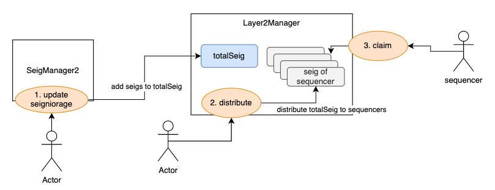

 

1. DAO Candidate 에 L2 오퍼레이터 정보를 어떻게 추가하거나 통합할것인가? 
  1. DAO candidate에 기존의 operator 주소는 이미 존재한다. 
  1. `Layer2Manager 컨트랙을 추가하여, L2 레이어 정보를 관리한다. L2 레이어 정보를 추가할때, 해당되는 Candidate 주소를 입력하고, 해당 Candidate operator가 등록하도록 해야 한다. ` 
    1. 추가항목 : candidate operator 가 추가할 수 있다.  
      1. **addressManager** <address>  
        1. “candidate_주소(소문자)” : 오퍼레이터 주소…   
      1. L1Bridge <address> : fw 로직에서 사용하려고 저장해둠 
      1. L2Bridge <address> : fw 로직에서 사용하려고 저장해둠 
      1. L2Ton <address> 
    1. L2 verifyFlag : 토카막에서 해당 L2에 대한 verify를 해줄것인가? 컨트랙을 직접 만들어서 등록하면 어떻게 하는가? 
1. the minimum security deposit 의 개념이 존재하는가?  
  1.  the minimum security deposit 은 L2의 TON TVL의 양의 몇퍼센트만큼의 deposit을 L2 operator가 해야 한다는 룰 이었음. 
  1. The operator must deposit the minimum security deposit according to the TVL of Layer 2 
    - If the minimum security deposit is not deposited, operator can’t be provided the seignorage.
    - **`Amount of minimum security deposit = max ( fixed minimum security deposit, TVL * ratioOfDeposit ) `**
⇒ ratioOfDeposit is determined by DAO. Initial setting is 0%  
1. 시뇨리지 발행시, L2 오퍼레이터에게 어떻게 시뇨리지를 발급할 것인가?
  1. 기존의 시뇨리지 발행 
    1. tos = (tonTotalSupply.sub(tonBalanceOfWton).sub(tonBalanceOfZero).sub(tonBalanceOfOne)).mul(RAYDIFF).add(totTotalSupply)
    1. stakedSeig1 = maxSeig * totTotalSuplly / tos  
    1. unstakedSeig =  maxSeig - stakedSeig1
    1. stakedSeig = stakedSeig1 + (unstakedSeig * 0.4) 
    1. DAO seig = (unstakedSeig * 0.4) 
    1. PowerTON seig = (unstakedSeig * 0.1) 
    1. L2Operator seig = (unstakedSeig * 0.1) ⇒ L2 operator를 위한 seig 부분을 추가한다. 
  1. `Layer2Manager 컨트랙을 추가한다. 해당 컨트랙에 L2 seig를 보내고 L2 operator가 클래임할 수 있게 한다. `
    1. SeigManager.updateSeigniorage 
    1. Layer2Manager.distribute
    1. Layer2Manager.claim(key) 

1. L2 에서 Fast Withdraw 요청시 어떻게 liquidity를 지급할 것인가? 
  1. L1: FwReceipt 
    1. 유동성 제공자에 의한 빠른 출금 지원 함수    
  1. L1: DepositManager 
    1. RefactorCoinageSnapshot 
    1. 유동성 제공자에 의해 빠른 출금 지원 