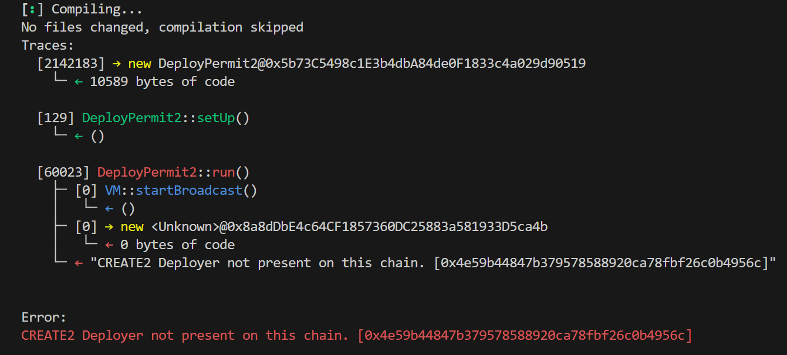

1. Permit2 Deploy
  1. [https://github.com/Uniswap/permit2](https://github.com/Uniswap/permit2)
  1. deploy script : `forge script --broadcast --rpc-url https://goerli.optimism.tokamak.network --private-key <프라이빗키> --verify script/DeployPermit2.s.sol:DeployPermit2`



  - CREATE2 Deployer가 tokamak goerli에 0x4e59b44847b379578588920ca78fbf26c0b4956c의 주소로 존재하지 않는다. 
    - CREATE2를 사용해서 똑같은 주소인0x4e59b44847b379578588920ca78fbf26c0b4956c 의 주소로 CREATE2 Deployer라는 것을 배포해야하는지 확인필요…
      - 배포해야한다면 salt값은 어떻게 알수있을것인가?

[Link](https://github.com/Arachnid/deterministic-deployment-proxy)

    - 이 github를 통해서 rawTransaction 데이터를 구할 수 있음.
    - BigNumber { value: "100000000000000000" }
insufficient funds for intrinsic transaction cost 
    - [https://github.com/Zoltu/deterministic-deployment-proxy/issues/7](https://github.com/Zoltu/deterministic-deployment-proxy/issues/7)

[[deployment.json]]

CREAT2 사용하지 않고 배포완료

1.  Deploy Universal Router + Permit2 스크립트.

```
forge script --legacy --broadcast \
--rpc-url https://goerli.optimism.tokamak.network \
--private-key <privateKey> \
--sig 'run()' \
script/deployParameters/DeployTokamak.s.sol:DeployTokamak \
--etherscan-api-key WM7SZ8W48JWGVZ7CA2QHJMM76SW45UPB38 \
--verify
```

실행결과 : 

실행결과 : 에러
root@DESKTOP-O52U9FN:/home/dmltl/universal-router# forge script --legacy --broadcast \
--rpc-url [https://goerli.optimism.tokamak.network](https://goerli.optimism.tokamak.network/) \
--private-key 6905ecfd90d76c1b934e5c2a55141f20e9595eeae455c3ac9b716756d8d2b060  \
--sig 'run()' \
script/deployParameters/DeployTokamak.s.sol:DeployTokamak \
--etherscan-api-key WM7SZ8W48JWGVZ7CA2QHJMM76SW45UPB38 \
--verify
[⠰] Compiling...
No files changed, compilation skipped
Script ran successfully.

== Return ==
router: contract UniversalRouter 0xb8A9e7279b7f134736668bE3394CDAe5DFaD9e62

== Logs ==
Permit2 Deployed: 0xc70dC211f18F64C4813a727Cf1b0BEF78d2FD163
UnsupportedProtocol deployed: 0xaC3260661D37c36B9592A0FE1c4c7C0272C66663
permit2: 0xc70dC211f18F64C4813a727Cf1b0BEF78d2FD163
weth9: 0x4200000000000000000000000000000000000006
seaportV1_5: 0xaC3260661D37c36B9592A0FE1c4c7C0272C66663
seaportV1_4: 0xaC3260661D37c36B9592A0FE1c4c7C0272C66663
openseaConduit: 0xaC3260661D37c36B9592A0FE1c4c7C0272C66663
nftxZap: 0xaC3260661D37c36B9592A0FE1c4c7C0272C66663
x2y2: 0xaC3260661D37c36B9592A0FE1c4c7C0272C66663
foundation: 0xaC3260661D37c36B9592A0FE1c4c7C0272C66663
sudoswap: 0xaC3260661D37c36B9592A0FE1c4c7C0272C66663
elementMarket: 0xaC3260661D37c36B9592A0FE1c4c7C0272C66663
nft20Zap: 0xaC3260661D37c36B9592A0FE1c4c7C0272C66663
cryptopunks: 0xaC3260661D37c36B9592A0FE1c4c7C0272C66663
looksRareV2: 0xaC3260661D37c36B9592A0FE1c4c7C0272C66663
routerRewardsDistributor: 0xaC3260661D37c36B9592A0FE1c4c7C0272C66663
looksRareRewardsDistributor: 0xaC3260661D37c36B9592A0FE1c4c7C0272C66663
looksRareToken: 0xaC3260661D37c36B9592A0FE1c4c7C0272C66663
v2Factory: 0xaC3260661D37c36B9592A0FE1c4c7C0272C66663
v3Factory: 0x31eac92F79C2B3232174C2d5Ad4DBf810022E807
Universal Router Deployed: 0xb8A9e7279b7f134736668bE3394CDAe5DFaD9e62

## Setting up (1) EVMs.

==========================

Chain 5050

Estimated gas price: 0.00025 gwei

Estimated total gas used for script: 7884696

Estimated amount required: 0.000001971174 ETH

==========================

### 

Finding wallets for all the necessary addresses...

## 

Sending transactions [0 - 2].

Transactions saved to: /home/dmltl/universal-router/broadcast/DeployTokamak.s.sol/5050/run-latest.json

Sensitive values saved to: /home/dmltl/universal-router/cache/DeployTokamak.s.sol/5050/run-latest.json

Error:
(code: -32000, message: invalid transaction: nonce too low, data: None)
root@DESKTOP-O52U9FN:/home/dmltl/universal-router#

실행결과 :성공
root@DESKTOP-O52U9FN:/home/dmltl/universal-router# forge script --legacy --broadcast --rpc-url [https://goerli.optimism.tokamak.network](https://goerli.optimism.tokamak.network/) --private-key 6905ecfd90d76c1b934e5c2a55141f20e9595eeae455c3ac9b716756d8d2b060  --sig 'run()' script/deployParameters/DeployTokamak.s.sol:DeployTokamak --etherscan-api-key WM7SZ8W48JWGVZ7CA2QHJMM76SW45UPB38 --verify
[⠆] Compiling...
[⠒] Compiling 1 files with 0.8.17
[⠘] Solc 0.8.17 finished in 22.22s
Compiler run successful!
Script ran successfully.

== Return ==
router: contract UniversalRouter 0xb8A9e7279b7f134736668bE3394CDAe5DFaD9e62

== Logs ==
UnsupportedProtocol deployed: 0xaC3260661D37c36B9592A0FE1c4c7C0272C66663
permit2: 0xc70dC211f18F64C4813a727Cf1b0BEF78d2FD163
weth9: 0x4200000000000000000000000000000000000006
seaportV1_5: 0xaC3260661D37c36B9592A0FE1c4c7C0272C66663
seaportV1_4: 0xaC3260661D37c36B9592A0FE1c4c7C0272C66663
openseaConduit: 0xaC3260661D37c36B9592A0FE1c4c7C0272C66663
nftxZap: 0xaC3260661D37c36B9592A0FE1c4c7C0272C66663
x2y2: 0xaC3260661D37c36B9592A0FE1c4c7C0272C66663
foundation: 0xaC3260661D37c36B9592A0FE1c4c7C0272C66663
sudoswap: 0xaC3260661D37c36B9592A0FE1c4c7C0272C66663
elementMarket: 0xaC3260661D37c36B9592A0FE1c4c7C0272C66663
nft20Zap: 0xaC3260661D37c36B9592A0FE1c4c7C0272C66663
cryptopunks: 0xaC3260661D37c36B9592A0FE1c4c7C0272C66663
looksRareV2: 0xaC3260661D37c36B9592A0FE1c4c7C0272C66663
routerRewardsDistributor: 0xaC3260661D37c36B9592A0FE1c4c7C0272C66663
looksRareRewardsDistributor: 0xaC3260661D37c36B9592A0FE1c4c7C0272C66663
looksRareToken: 0xaC3260661D37c36B9592A0FE1c4c7C0272C66663
v2Factory: 0xaC3260661D37c36B9592A0FE1c4c7C0272C66663
v3Factory: 0x31eac92F79C2B3232174C2d5Ad4DBf810022E807
Universal Router Deployed: 0xb8A9e7279b7f134736668bE3394CDAe5DFaD9e62

## Setting up (1) EVMs.

==========================

Chain 5050

Estimated gas price: 0.00025 gwei

Estimated total gas used for script: 5245647

Estimated amount required: 0.00000131141175 ETH

==========================

### 

Finding wallets for all the necessary addresses...

## 

Sending transactions [0 - 1].
⠉ [00:00:00] [####################################################################] 2/2 txes (0.0s)
Transactions saved to: /home/dmltl/universal-router/broadcast/DeployTokamak.s.sol/5050/run-latest.json

Sensitive values saved to: /home/dmltl/universal-router/cache/DeployTokamak.s.sol/5050/run-latest.json

## 

Waiting for receipts.
⠙ [00:00:00] [################################################################] 2/2 receipts (0.0s)

### 5050

✅ Hash: 0x57b5638e355a94cdc4f67fc581150541542dbec67447289f7aede2b27a687a62
Contract Address: 0xac3260661d37c36b9592a0fe1c4c7c0272c66663
Block: 3796
Gas Used: 76425

### 5050

✅ Hash: 0x610130f65bb5d73f6521cf659a6991bce6fcba1f6a38cd7bd4395ff7ca321671
Contract Address: 0xb8a9e7279b7f134736668be3394cdae5dfad9e62
Block: 3797
Gas Used: 3958689

Transactions saved to: /home/dmltl/universal-router/broadcast/DeployTokamak.s.sol/5050/run-latest.json

Sensitive values saved to: /home/dmltl/universal-router/cache/DeployTokamak.s.sol/5050/run-latest.json

==========================

ONCHAIN EXECUTION COMPLETE & SUCCESSFUL.
Total Paid: 0. ETH (4035114 gas * avg 0 gwei)

Transactions saved to: /home/dmltl/universal-router/broadcast/DeployTokamak.s.sol/5050/run-latest.json

Sensitive values saved to: /home/dmltl/universal-router/cache/DeployTokamak.s.sol/5050/run-latest.json

Verified

[[Untitled]]

주소

"Permit2" : "0xc70dC211f18F64C4813a727Cf1b0BEF78d2FD163",
"UniversalRouter" : "0xb8A9e7279b7f134736668bE3394CDAe5DFaD9e62",

# Verifying Contract Errors (Foundry Forge 사용시 참고…)

foundryup --version nightly-94777647f6ea5d34572a1b15c9b57e35b8c77b41

버전 정보 : [https://github.com/foundry-rs/foundry/releases](https://github.com/foundry-rs/foundry/releases)

etherscan-api-key 가 nightly-87bc53fc6c874bd4c92d97ed180b949e3a36d78c (Nightly 2023-04-02) 버전 부터 인식이 안됨. 그래서 (버전을 하나씩 계속 내려보면서 시도)

[nightly-94777647f6ea5d34572a1b15c9b57e35b8c77b41](https://github.com/foundry-rs/foundry/tree/nightly-94777647f6ea5d34572a1b15c9b57e35b8c77b41) (Nightly 2023-03-02) 버전으로 rollback 후에 verify 진행. 

1. Permit2 Verify

스크립트

```json
forge verify-contract --chain 5050 --watch --verifier etherscan --verifier-url https://goerli.explorer.tokamak.network/api 0xc70dC211f18F64C4813a727Cf1b0BEF78d2FD163 lib/permit2/src/Permit2.sol:Permit2 WM7SZ8W48JWGVZ7CA2QHJMM76SW45UPB38
```

```json
forge verify-contract --chain 5050 --watch --verifier etherscan --verifier-url https://goerli.explorer.tokamak.network/api 0x66d2011D1C9a11a37c816180886f9aE975e7fE5F lib/permit2/src/Permit2.sol:Permit2 WM7SZ8W48JWGVZ7CA2QHJMM76SW45UPB38
```

1.5 unsppurted

```json
forge verify-contract --chain 5050 --watch --verifier etherscan --verifier-url https://goerli.explorer.tokamak.network/api 0x59c603458F8d3C5079a0D78eb1BA28A9FAe0a759 lib/permit2/src/Permit2.sol:Permit2 WM7SZ8W48JWGVZ7CA2QHJMM76SW45UPB38
```

완료

1. Univsersal Router verify

**foundryup --version nightly-a44159a5c23d2699d3a390e6d4889b89a0e5a5e0**

문제점들

- 이것도 맞는 버전이 있음. 이 버전 아니면 에러
1. Universal Router Verify
  1. Arguments

```json
(0xc70dC211f18F64C4813a727Cf1b0BEF78d2FD163, 0x4200000000000000000000000000000000000006, 0xaC3260661D37c36B9592A0FE1c4c7C0272C66663, 0xaC3260661D37c36B9592A0FE1c4c7C0272C66663, 0xaC3260661D37c36B9592A0FE1c4c7C0272C66663, 0xaC3260661D37c36B9592A0FE1c4c7C0272C66663, 0xaC3260661D37c36B9592A0FE1c4c7C0272C66663, 0xaC3260661D37c36B9592A0FE1c4c7C0272C66663, 0xaC3260661D37c36B9592A0FE1c4c7C0272C66663, 0xaC3260661D37c36B9592A0FE1c4c7C0272C66663, 0xaC3260661D37c36B9592A0FE1c4c7C0272C66663, 0xaC3260661D37c36B9592A0FE1c4c7C0272C66663, 0xaC3260661D37c36B9592A0FE1c4c7C0272C66663, 0xaC3260661D37c36B9592A0FE1c4c7C0272C66663, 0xaC3260661D37c36B9592A0FE1c4c7C0272C66663, 0xaC3260661D37c36B9592A0FE1c4c7C0272C66663, 0xaC3260661D37c36B9592A0FE1c4c7C0272C66663, 0x31eac92F79C2B3232174C2d5Ad4DBf810022E807, 0x0000000000000000000000000000000000000000000000000000000000000000, 0xa598dd2fba360510c5a8f02f44423a4468e902df5857dbce3ca162a43a3a31ff)
```

b. 스크립트 

```json
forge verify-contract --chain 5050 --watch --verifier etherscan --verifier-url https://goerli.explorer.tokamak.network/api 0xb8A9e7279b7f134736668bE3394CDAe5DFaD9e62 contracts/UniversalRouter.sol:UniversalRouter --constructor-args 0x000000000000000000000000c70dC211f18F64C4813a727Cf1b0BEF78d2FD1630000000000000000000000004200000000000000000000000000000000000006000000000000000000000000aC3260661D37c36B9592A0FE1c4c7C0272C66663000000000000000000000000aC3260661D37c36B9592A0FE1c4c7C0272C66663000000000000000000000000aC3260661D37c36B9592A0FE1c4c7C0272C66663000000000000000000000000aC3260661D37c36B9592A0FE1c4c7C0272C66663000000000000000000000000aC3260661D37c36B9592A0FE1c4c7C0272C66663000000000000000000000000aC3260661D37c36B9592A0FE1c4c7C0272C66663000000000000000000000000aC3260661D37c36B9592A0FE1c4c7C0272C66663000000000000000000000000aC3260661D37c36B9592A0FE1c4c7C0272C66663000000000000000000000000aC3260661D37c36B9592A0FE1c4c7C0272C66663000000000000000000000000aC3260661D37c36B9592A0FE1c4c7C0272C66663000000000000000000000000aC3260661D37c36B9592A0FE1c4c7C0272C66663000000000000000000000000aC3260661D37c36B9592A0FE1c4c7C0272C66663000000000000000000000000aC3260661D37c36B9592A0FE1c4c7C0272C66663000000000000000000000000aC3260661D37c36B9592A0FE1c4c7C0272C66663000000000000000000000000aC3260661D37c36B9592A0FE1c4c7C0272C6666300000000000000000000000031eac92F79C2B3232174C2d5Ad4DBf810022E8070000000000000000000000000000000000000000000000000000000000000000a598dd2fba360510c5a8f02f44423a4468e902df5857dbce3ca162a43a3a31ff YY46TZ8HN26I7RKV3PKH1YE6Y9CJN7VMMS
```

```json
forge verify-contract --chain 5050 --watch --verifier etherscan --verifier-url https://goerli.explorer.tokamak.network/api 0xFAFeE312F2A56b7B16634B8c2F9840aeF488B737 contracts/UniversalRouter.sol:UniversalRouter --constructor-args $(cast abi-encode "constructor((address,address,address,address,address,address,address,address,address,address,address,address,address,address,address,address,address,address,bytes32,bytes32))" "(0x66d2011D1C9a11a37c816180886f9aE975e7fE5F,0x4200000000000000000000000000000000000006,0x59c603458F8d3C5079a0D78eb1BA28A9FAe0a759,0x59c603458F8d3C5079a0D78eb1BA28A9FAe0a759,0x59c603458F8d3C5079a0D78eb1BA28A9FAe0a759,0x59c603458F8d3C5079a0D78eb1BA28A9FAe0a759,0x59c603458F8d3C5079a0D78eb1BA28A9FAe0a759,0x59c603458F8d3C5079a0D78eb1BA28A9FAe0a759,0x59c603458F8d3C5079a0D78eb1BA28A9FAe0a759,0x59c603458F8d3C5079a0D78eb1BA28A9FAe0a759,0x59c603458F8d3C5079a0D78eb1BA28A9FAe0a759,0x59c603458F8d3C5079a0D78eb1BA28A9FAe0a759,0x59c603458F8d3C5079a0D78eb1BA28A9FAe0a759,0x59c603458F8d3C5079a0D78eb1BA28A9FAe0a759,0x59c603458F8d3C5079a0D78eb1BA28A9FAe0a759,0x59c603458F8d3C5079a0D78eb1BA28A9FAe0a759,0x59c603458F8d3C5079a0D78eb1BA28A9FAe0a759,0x8C2351935011CfEccA4Ea08403F127FB782754AC,0x0000000000000000000000000000000000000000000000000000000000000000,0xa598dd2fba360510c5a8f02f44423a4468e902df5857dbce3ca162a43a3a31ff)") YY46TZ8HN26I7RKV3PKH1YE6Y9CJN7VMMS
```

콘솔
root@DESKTOP-O52U9FN:/home/dmltl/universal-router# forge verify-contract --chain 5050 --watch --verifier etherscan --verifier-url [https://goerli.explorer.tokamak.network/api](https://goerli.explorer.tokamak.network/api) 0xb8A9e7279b7f134736668bE3394CDAe5DFaD9e62 contracts/UniversalRouter.sol:UniversalRouter --constructor-args 0x000000000000000000000000c70dC211f18F64C4813a727Cf1b0BEF78d2FD1630000000000000000000000004200000000000000000000000000000000000006000000000000000000000000aC3260661D37c36B9592A0FE1c4c7C0272C66663000000000000000000000000aC3260661D37c36B9592A0FE1c4c7C0272C66663000000000000000000000000aC3260661D37c36B9592A0FE1c4c7C0272C66663000000000000000000000000aC3260661D37c36B9592A0FE1c4c7C0272C66663000000000000000000000000aC3260661D37c36B9592A0FE1c4c7C0272C66663000000000000000000000000aC3260661D37c36B9592A0FE1c4c7C0272C66663000000000000000000000000aC3260661D37c36B9592A0FE1c4c7C0272C66663000000000000000000000000aC3260661D37c36B9592A0FE1c4c7C0272C66663000000000000000000000000aC3260661D37c36B9592A0FE1c4c7C0272C66663000000000000000000000000aC3260661D37c36B9592A0FE1c4c7C0272C66663000000000000000000000000aC3260661D37c36B9592A0FE1c4c7C0272C66663000000000000000000000000aC3260661D37c36B9592A0FE1c4c7C0272C66663000000000000000000000000aC3260661D37c36B9592A0FE1c4c7C0272C66663000000000000000000000000aC3260661D37c36B9592A0FE1c4c7C0272C66663000000000000000000000000aC3260661D37c36B9592A0FE1c4c7C0272C6666300000000000000000000000031eac92F79C2B3232174C2d5Ad4DBf810022E8070000000000000000000000000000000000000000000000000000000000000000a598dd2fba360510c5a8f02f44423a4468e902df5857dbce3ca162a43a3a31ff YY46TZ8HN26I7RKV3PKH1YE6Y9CJN7VMMS
Start verifying contract `0xb8a9e7279b7f134736668be3394cdae5dfad9e62` deployed on 5050

Submitting verification for [contracts/UniversalRouter.sol:UniversalRouter] "0xb8A9e7279b7f134736668bE3394CDAe5DFaD9e62".
Submitted contract for verification:
Response: `OK`
GUID: `b8a9e7279b7f134736668be3394cdae5dfad9e62647f1a8a`
URL:
[https://goerli.explorer.tokamak.network/apiaddress/0xb8a9e7279b7f134736668be3394cdae5dfad9e62](https://goerli.explorer.tokamak.network/apiaddress/0xb8a9e7279b7f134736668be3394cdae5dfad9e62)
Contract verification status:
Response: `OK`
Details: `Unknown UID`
root@DESKTOP-O52U9FN:/home/dmltl/universal-router#

  - OK가 나와도 실제 verify되는데 오래 걸렸음.

완료