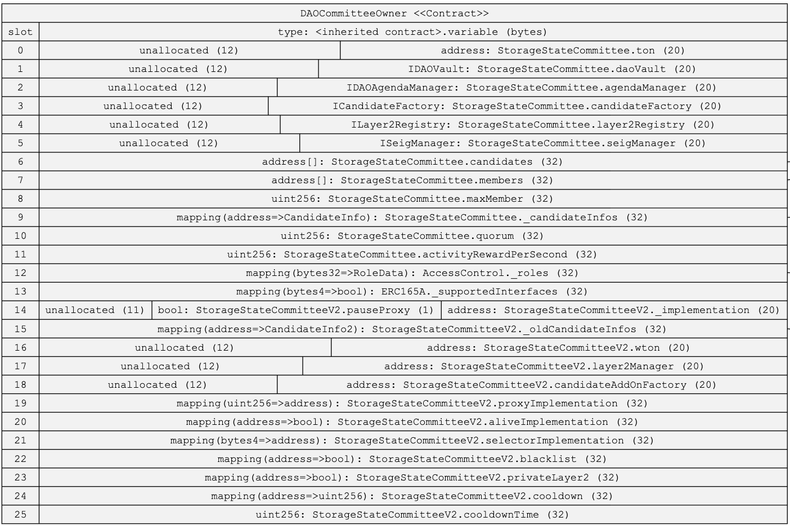
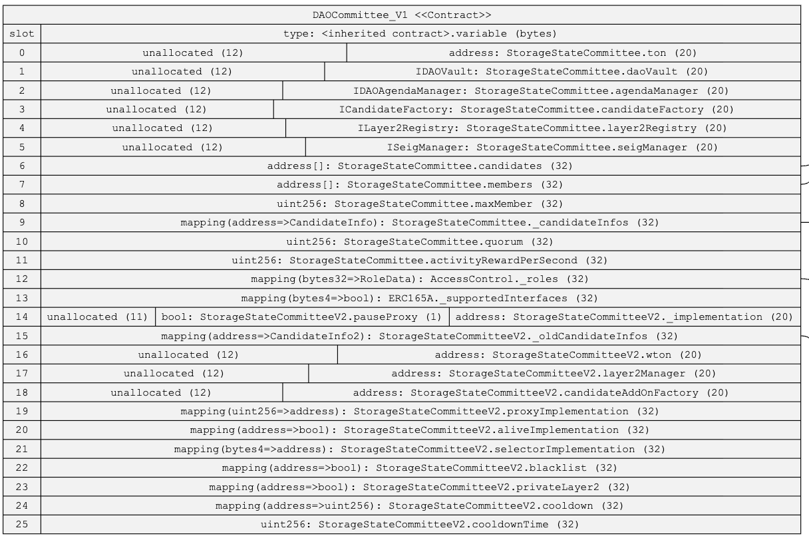

**index**

### Storage Layout

> ***DAOCommitteeProxy2, DAOCommitteeOwner, 그리고 DAOCommittee_V1 컨트랙트의 storage layout은 모두 동일하다.***
> 

### Functions

1. *`setCooldownTime`**: cooldownTime 설정*
1. *`setCandidateAddOnFactory`**: candidateAddOnFactory 주소 설정*
1. *`setLayer2Manager`**: layer2Manager 주소 설정*
1. *`setSeigManager`**: seigManager 주소 설정*
1. *`setDaoVault`**: daoVault 주소 설정*
1. *`setLayer2Registry`**: layer2Registry 주소 설정*
1. *`setAgendaManager`**: daoAgendaManager 주소 설정*
1. *`setCandidateFactory`**: candidateFactory 주소 설정*
1. *`setTon`**: TON 주소 설정*
1. *`setWton`**: WTON 주소 설정*
1. *`increaseMaxMember`**: 멤버 슬롯 수 증가*
1. *`decreaseMaxMember`**: 멤버 슬롯 수 감소*
1. *`setActivityRewardPerSecond`**: 멤버 활동 보상 설정*
1. *`setCandidatesSeigManager`**: 후보 컨트랙트들의 SeigManager 주소 설정*
1. *`setCandidatesCommittee`**: 후보 컨트랙트의 Committee 설정*
1. *`setBurntAmountAtDAO`**: DAO의 siegniorage 소각*
1. *`daoExecuteTransaction`**: DAO 멀티시그가 트랜잭션 실행*
1. *`setQuorum`**: quorum 설정*