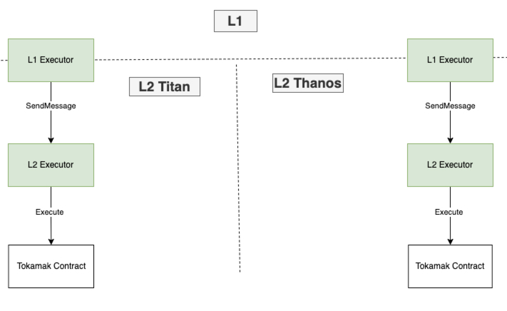

# Check Point

1. Given the recent changes in how the Tokamak Network operates, do you think it is appropriate for the Tokamak DAO to have an executor on L2? 
If not, what direction should the L2 DAO go?
  1. Answer : contract 배포는 할 수 도 있어요 (DAO가 아닌 컨트랙트), 그리고 기존에 있는 것들은 변경해줘야되요. 배포가 됐으니
1. Arbitrum currently operates in a way that DAO is in L2 and Executor is in L1. Is this correct?
  1. Answer : Yes
1. Where can I find the L2 DAO on Uniswap?
I looked around and couldn't find anything about the L2 implementation in the official documentation.
  1. Answer : Instead of running a separate L2 DAO on uniswap, we use L2 Executor on Arbitrum or Optimism.

# Decided Point

- In the call held on 24.11.18, L2 decided to proceed with the operation of the Executor. ([https://tokamak-network.slack.com/archives/C07JU6K4KDY/p1731914839830779?thread_ts=1731898123.191729&cid=C07JU6K4KDY](https://tokamak-network.slack.com/archives/C07JU6K4KDY/p1731914839830779?thread_ts=1731898123.191729&cid=C07JU6K4KDY))
- L2 DAO Structure

- As shown in the figure above, only an Executor exists in L2, and after all decisions are made in L1, the L1 Executor manages the L2 Contract through the L2 Executor.
- Uniswap Governance Contract : [governance/contracts at master · Uniswap/governance](https://github.com/Uniswap/governance/tree/master/contracts)
- Arbitrum DAO Executor Proxy (L1, L2 same) : [https://etherscan.io/address/0x3ffFbAdAF827559da092217e474760E2b2c3CeDd#code](https://etherscan.io/address/0x3ffFbAdAF827559da092217e474760E2b2c3CeDd#code)
- Arbitrum DAO Executor (L1, L2 same) : [https://etherscan.io/address/0x86f0cf42ad673b3d666d103e009ec142d1298a17#code](https://etherscan.io/address/0x86f0cf42ad673b3d666d103e009ec142d1298a17#code)