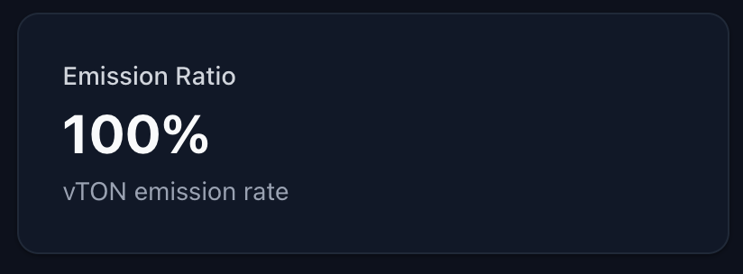

### <vTON Distribution>

1. vTON은 시뇨리지를 받는 L2 Operator와 Validator에게 분배된다. DAO Treasury는 vTON을 받지 않는다.
1. TON 대비 vTON 발행 비율은 DAO 투표로 조정할 수 있다. 발행 비율이 0이 되면 시뇨리지만 분배되고, vTON 분배는 중단된다.

**데모 — vTON faucet**

## Delegate

### Become a Delegate

3단계 구조(Pitch - Register - Verification)의 구조로 이루어진다.

**Step 1: Delegate 프로필 작성 (Pitch)**

가장 중요한 단계이다. 사람들에게 왜 나에게 투표권을 맡겨야 하는지 설득해야 한다. 보통 DAO 포럼(Forum)의 'Delegate 애플리케이션' 게시판에 글을 올린다.

- **자기소개:** 본인의 전문 분야나 관련 경력.
- **가치관:** 프로젝트의 어떤 방향성(예: 공격적 확장 vs 보수적 보안)을 지지하는지.
- **활동 약속:** 모든 투표에 빠짐없이 참여할 것인지 등에 대한 약속.

**Step 2: 거버넌스 플랫폼 등록 (Register)**

포럼에 글을 올렸다면, 실제 온체인/오프체인 투표 시스템에 자신을 '대리인 후보'로 등록한다.

- **Tally 또는 Boardroom:** 이와 같은 거버넌스 대시보드에서 본인의 지갑을 연결하고 **"Become a Delegate"** 버튼을 눌러 프로필(이름, 사진, 포럼 링크)을 등록한다.
- 이 과정에서 프로필 정보가 블록체인에 기록될 때 소정의 가스비가 발생할 수 있다.

**Step 3: 홍보 및 소통 (Verification)**

등록만 한다고 투표권이 들어오지는 않는다. 트위터(X), 디스코드 등에서 자신의 의견을 피력하며 토큰 홀더(Delegator)들이 나에게 권한을 위임하도록 유치 활동을 한다.

### Implementation

## Delegation

vTON 보유자는 등록된 Delegate에게 위임이 가능하다. 

**remove:**

- 위임 후 7일이 지나야 투표권으로 인정

위임 해제하기

재위임하기

## Proposal

현재는 스팸 방지를 위해 100 TON을 소각하는 방식을 사용한다. 이를 다음 방식으로 변경하고자 한다.

안건 제출 시 일정량의 토큰을 보증금으로 예치한다. 안건이 통과되거나 최소 득표율을 넘기면 보증금을 돌려받는다. 하지만 스팸성 안건으로 판명되어 거부되면 보증금을 몰수하여 금고로 귀속시킨다.

Snapshot 등의 서비스에서 이미 최소 득표율을 넘긴 안건은 정상 안건으로 간주하여 최소 득표율 요건을 충족한 것으로 본다.

DAO는 스팸 방지를 위해 안건 제출에 필요한 **최소 투표권 수량**을 설정한다. Delegate는 많은 투표권을 위임받기 때문에, 안건 제출 권한이 자연스럽게 Delegate에게 부여됩니다.