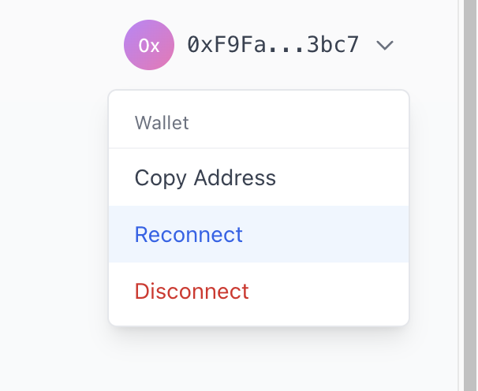
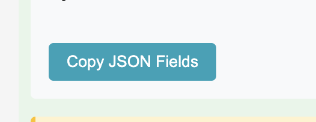
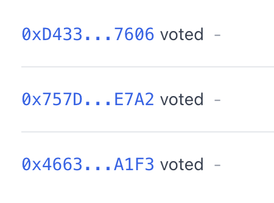
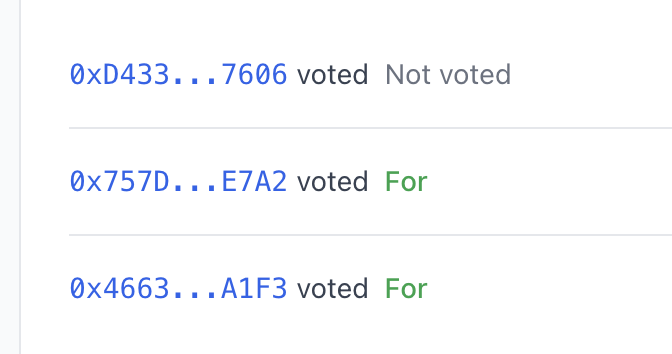
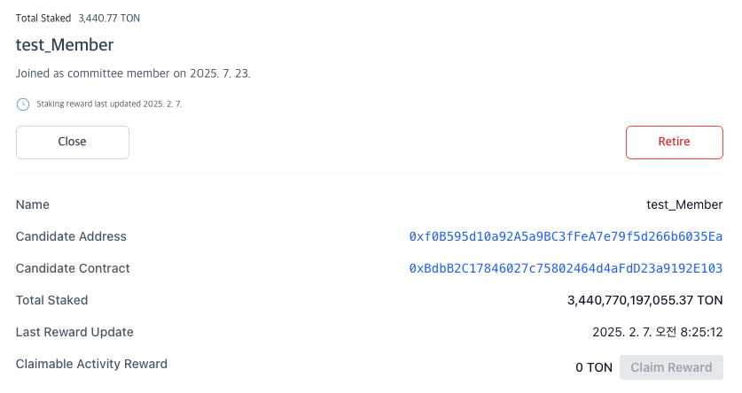
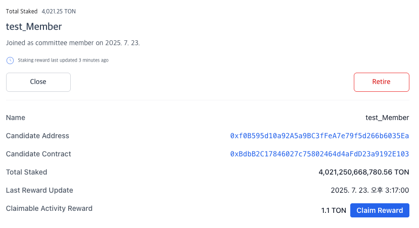
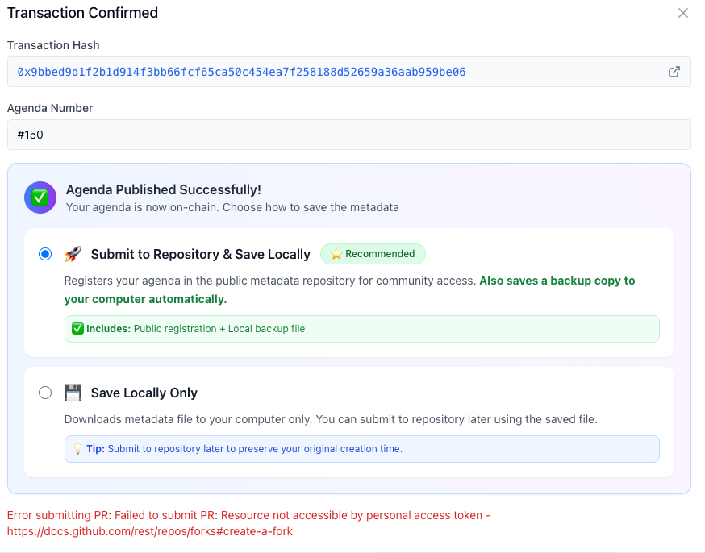
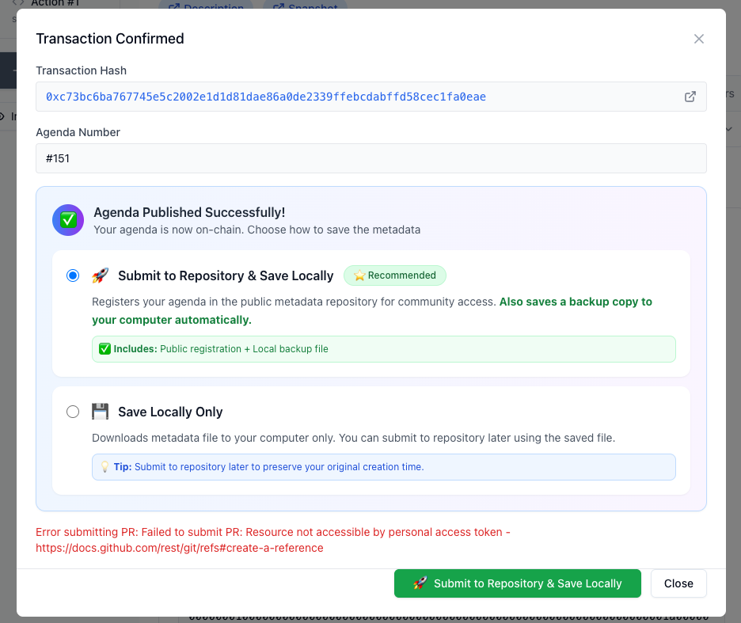
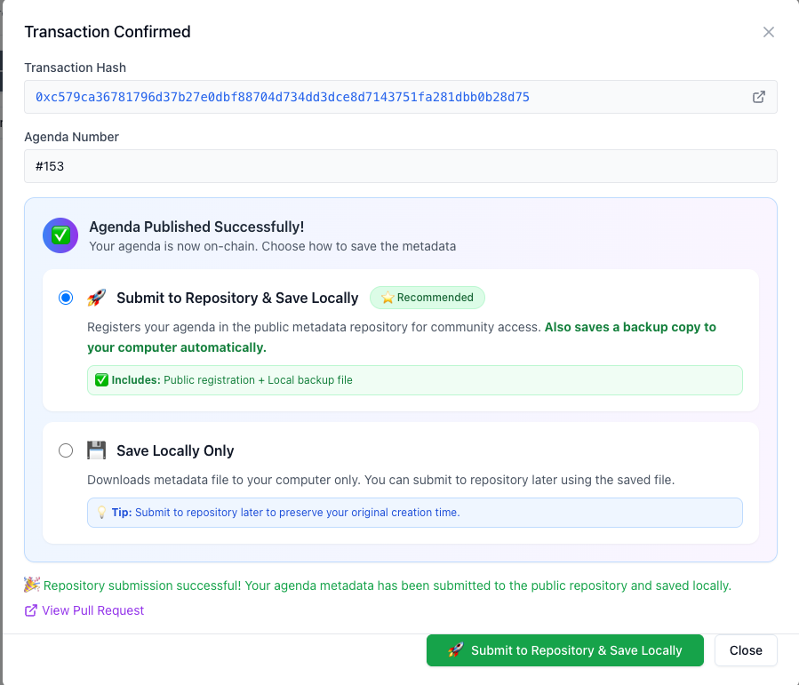
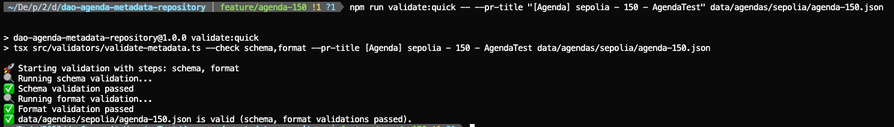

# Target System

- **Tokamak DAO Community Version Web Application **
  - Repo: [https://github.com/tokamak-network/dao-community-version/tree/main/sample-1](https://github.com/tokamak-network/dao-community-version/tree/main/sample-1)
  - Documents: [Readme(EN)](https://github.com/tokamak-network/dao-community-version/blob/main/sample-1/README.md#tokamak-dao-community-version-web-application), [Readme(KR)](https://github.com/tokamak-network/dao-community-version/blob/main/sample-1/README_KR.md#tokamak-dao-%EC%BB%A4%EB%AE%A4%EB%8B%88%ED%8B%B0-%EB%B2%84%EC%A0%84-%EC%9B%B9-%EC%95%A0%ED%94%8C%EB%A6%AC%EC%BC%80%EC%9D%B4%EC%85%98)
- **Tokamak DAO Metadata Repository**
  - Repo: [https://github.com/tokamak-network/dao-agenda-metadata-repository](https://github.com/tokamak-network/dao-agenda-metadata-repository)
  - Documents: [Readme](https://github.com/tokamak-network/dao-agenda-metadata-repository?tab=readme-ov-file#%EF%B8%8F-dao-agenda-metadata-repository)

# Internal Test ( on sepolia )

- **Test duration:** 17th July  ~ 29th July
- **Faucet:** [link](https://docs.tokamak.network/home/service-guide/faucet-testnet) (TON : 0xa30fe40285B8f5c0457DbC3B7C8A280373c40044)
- **Tokamak DAO Community Version Web Application **
  - Test Gude 
    - [Video Guide (00:00 ~ 37:35)](https://drive.google.com/file/d/1uJpHiO1i6rmCiuVjHHMPUM15n11PxTfU/view) , ([ppt](https://gamma.app/docs/Tokamak-DAO-Community-Web-Application-00nnwwwx4gmefsc))
    - [**Environment Configuration**](https://github.com/tokamak-network/dao-community-version/blob/main/sample-1/README.md#environment-configuration)**  **
    - [**Execution Guide**](https://github.com/tokamak-network/dao-community-version/blob/main/sample-1/README.md#execution-guide)**  **
    - Accounts that can control DAO Candidates: Operators of [Simple Staking](https://sepolia.staking.tokamak.network/staking) Candidates and Managers of OperatorManager Contracts.
  - **Issue link: **[github.com](https://github.com/tokamak-network/dao-community-version/issues/new?template=1-sample1_internal_test.yml)
- **Tokamak DAO Metadata Repository**
  - Test Gude 
    - [Video Guide](https://drive.google.com/file/d/1P_ZWNyg-v8bm8CBqZDBOMh5QxRochIq4/view) ([ppt](https://docs.google.com/presentation/d/1Q9RZDeXwoBsp33hxClVLpSgTVyUHU_RYYkYy-M6RlH4/edit?slide=id.p1#slide=id.p1))
    - [**Getting Started**](https://github.com/tokamak-network/dao-agenda-metadata-repository/blob/main/docs/getting-started.md)
  - **Issue link: **[github.com](https://github.com/tokamak-network/dao-agenda-metadata-repository/issues/new?template=1-internal-test.yml)

# Feedbacks

**We always appreciate your efforts in testing.**

[Sample] → ***Please copy this and write your name on it and leave your feedback.***
> Note: You may refer to your above testing feedback and include relevant links to support your responses in this questionnaire.

**Device Model & OS:** 

  1. **Setup and Installation**
    - **Was the installation process straightforward?**
- [ ] Yes
- [ ] Somewhat
- [ ] No
    - **Did you face any issues while setting up community version?**
- [ ] Yes → *Please specify:*
- [ ] No
  1. **Feature Usage**
Please mark if you used the feature and rate your experience from 1–5 (1 = poor, 5 = excellent). Please feel free to add any new row, if you want to provide additional experience

| Feature | Used? (Y/N) | Ease of Usage Rating (1–5) | Comments |
| --- | --- | --- | --- |
| DAO Candidates - **Committee Members List** |  |  |  |
| DAO Candidates - **View Details** |  |  |  |
| DAO Candidates - **Claimable Activity Reward** |  |  |  |
| DAO Candidates - **Check the challenge**  |  |  |  |
| DAO Candidates - **Challenge**  |  |  |  |
| DAO Candidates - **Retire**  |  |  |  |
| Agenda - **List** |  |  |  |
| Agenda - **View Details** |  |  |  |
| Agenda - **New Proposal** |  |  |  |
| Agenda - **PR an agenda metadata to repository** |  |  |  |
| Agenda - **Save an agenda metadata  locally ** |  |  |  |
| Agenda - **Voting** |  |  |  |
| Agenda - **Execution** |  |  |  |
|    |  |  |  |
  1. **Documentation & UX**
  - **Was the **[**Execution Guide**](https://github.com/tokamak-network/dao-community-version/blob/main/sample-1/README.md#execution-guide)**, **[**Environment Configuration**](https://github.com/tokamak-network/dao-community-version/blob/main/sample-1/README.md#environment-configuration)**, ppt helpful?**
- [ ] Very helpful
- [ ] Somewhat helpful
- [ ] Not helpful

Do you have any suggestions for improving the Setup guide?

`_____________________________________________________`

Ale
> Note: You may refer to your above testing feedback and include relevant links to support your responses in this questionnaire.

**Device Model & OS:** 

  1. **Setup and Installation**
    - **Was the installation process straightforward?**
- [x] Yes
- [ ] Somewhat
- [ ] No
    - **Did you face any issues while setting up community version?**
- [ ] Yes → *Please specify:*
- [x] No
  1. **Feature Usage**
Please mark if you used the feature and rate your experience from 1–5 (1 = poor, 5 = excellent). Please feel free to add any new row, if you want to provide additional experience

| Feature | Used? (Y/N) | Ease of Usage Rating (1–5) | Comments |
| --- | --- | --- | --- |
| DAO Candidates - **Committee Members List** | Y | 5 |  |
| DAO Candidates - **View Details** | Y | 5 |  |
| DAO Candidates - **Claimable Activity Reward** |  |  |  |
| DAO Candidates - **Check the challenge**  | Y | 5 |  |
| DAO Candidates - **Challenge**  | N |  |  |
| DAO Candidates - **Retire**  | N |  |  |
| Agenda - **List** | Y | 5 |  |
| Agenda - **View Details** | Y | 5 |  |
| Agenda - **New Proposal** | Y | 5 |  |
| Agenda - **PR an agenda metadata to repository** | Y | 5 |  |
| Agenda - **Save an agenda metadata  locally ** | Y | 5 |  |
| Agenda - **Voting** | N |  |  |
| Agenda - **Execution** | Y | 5 |  |
|    |  |  |  |
  1. **Documentation & UX**
  - **Was the **[**Execution Guide**](https://github.com/tokamak-network/dao-community-version/blob/main/sample-1/README.md#execution-guide)**, **[**Environment Configuration**](https://github.com/tokamak-network/dao-community-version/blob/main/sample-1/README.md#environment-configuration)**, ppt helpful?**
- [ ] Very helpful
- [x] Somewhat helpful
- [ ] Not helpful

Do you have any suggestions for improving the Setup guide?

  - Before running the system, it seems that a comprehensive understanding of the DAO system is required. Providing a flowchart or visual diagram of the overall process would greatly help readers—especially those lacking background knowledge—better understand the documentation.
  - If the configuration of environment variables like tokens were structured as a JSON file, similar to how it’s done in general MCP settings, it might feel more intuitive for non-developers or those with AI development experience.
  - If the resources used during development were organized and provided as an `.llm` file, it would significantly help users create additional templates.
  - Issues (also left these on GitHub issues on each repo)
    - What is this Reconnect button for? It doesn’t seem to work for something. 

    - This copy button doesn’t work for me 

    - The status bar isn't fixed — it keeps repeatedly switching between them

Harvey
> Note: You may refer to your above testing feedback and include relevant links to support your responses in this questionnaire.

**Device Model & OS:** Mac M4

  1. **Setup and Installation**
    - **Was the installation process straightforward?**
- [x] Yes
- [ ] Somewhat
- [ ] No
    - **Did you face any issues while setting up community version?**
- [ ] Yes → *Please specify:*
- [x] No
  1. **Feature Usage**
Please mark if you used the feature and rate your experience from 1–5 (1 = poor, 5 = excellent). Please feel free to add any new row, if you want to provide additional experience

| Feature | Used? (Y/N) | Ease of Usage Rating (1–5) | Comments |
| --- | --- | --- | --- |
| DAO Candidates - **Committee Members List** | Y | 5 | The list of current DAO Committees Members is quickly visible.

I'm curious what happens when the number of members increases to 4 or 5 and there are vacancies. |
| DAO Candidates - **View Details** | Y | 5 | Previously, there was inconvenience because many RPC calls were requested due to many candidates just by entering the Member List page because of the challenge button, but now it is much easier and only the necessary information is available, so loading is fast and good. |
| DAO Candidates - **Claimable Activity Reward** | Y | 5 | [https://sepolia.etherscan.io/tx/0x13467b028df120dec94d850251b502af8243db6bb9e2d828bd28aeb396ddb250](https://sepolia.etherscan.io/tx/0x13467b028df120dec94d850251b502af8243db6bb9e2d828bd28aeb396ddb250)

I verified that it works well. |
| DAO Candidates - **Check the challenge**  | Y | 5 | Loading took a long time, perhaps because there are currently 67 Layer2 candidates registered in Sepolia DAO. |
| DAO Candidates - **Challenge**  | Y | 4 | It works well and it organizes who I can challenge so I can easily and conveniently do the challenge.
([https://sepolia.etherscan.io/tx/0xb3ac6b9ea6728fcefb6ef976e6c9038782e4cf260315f31011973c1c125d944b](https://sepolia.etherscan.io/tx/0xb3ac6b9ea6728fcefb6ef976e6c9038782e4cf260315f31011973c1c125d944b))

**However, if one space is empty, I would like to be able to challenge right away without loading all the data.** |
| DAO Candidates - **Retire**  | Y | 5 | [https://sepolia.etherscan.io/tx/0xb8f61c87cf68bdca44aa2a6cf6039bf352130ede24f7bdbeafd59ce46a055beb](https://sepolia.etherscan.io/tx/0xb8f61c87cf68bdca44aa2a6cf6039bf352130ede24f7bdbeafd59ce46a055beb)

When I run retire, it disappears from the member's screen immediately and works well. |
| Agenda - **List** | Y | 5 | Currently, Sepolia has 150 agendas.
The problem with the previous version was that it took more RPC calls and time than expected to load all 150 and create the corresponding list.
However, in this version, the corresponding part gets the list 10 at a time and allows the user to get more if they want, so it is much faster and easier to use. |
| Agenda - **View Details** | Y | 5 | All agenda-related data, including agenda-related times, voting results, and related URLs, are displayed well. |
| Agenda - **New Proposal** | Y | 5 | https://www.notion.so/tokamak/DAO-community-version-Internal-test-Guide-Feedback-230d96a400a380e5ad82cf977a083982?source=copy_link#239d96a400a380f5bce1d50e3f6b9d6a

The proposal works well. |
| Agenda - **PR an agenda metadata to repository** | Y | 4 | I forked the github repo and added a personal token, but the final PR is not working.

There are several ways to create tokens on GitHub, but only tokens created with ghp_ work. When I tried using other tokens, it failed.

**It might also be a good idea to add some information about tokens to the readme.** |
| Agenda - **Save an agenda metadata  locally ** | Y | 5 | I created agenda150 and saved the value locally. After that, I verified it using Tokamak DAO Metadata Repository and confirmed that verification was successful. |
| Agenda - **Voting** | Y | 5 | Before the voting time has passed, the voting button is not activated. Once the voting time has passed, it becomes activated and the voting button works properly. |
| Agenda - **Execution** | Y | 5 | [https://sepolia.etherscan.io/tx/0x14b142ba81b795d65cc2ae48720bee5f40f8e5e2f1f439990ac16606a07e24d2](https://sepolia.etherscan.io/tx/0x14b142ba81b795d65cc2ae48720bee5f40f8e5e2f1f439990ac16606a07e24d2)

The agenda was executed well and the screen was updated well according to the execution time. |
|    |  |  |  |

    - View Details updateSeigniorage Test (it works well)
      - before updateSeigniorage 

      - after updateSeigniorage

    - Create Agenda
      - Submit to Repository (When you don't clone the Tokamak DAO Metadata Repository to your personal repo)

      - After cloning the Tokamak DAO Metadata Repository into my personal repo, and set Token

      - ghp_Token Test Pass

    - Agenda - **Save an agenda metadata  locally **
      - Verify Success

  1. **Documentation & UX**
  - **Was the **[**Execution Guide**](https://github.com/tokamak-network/dao-community-version/blob/main/sample-1/README.md#execution-guide)**, **[**Environment Configuration**](https://github.com/tokamak-network/dao-community-version/blob/main/sample-1/README.md#environment-configuration)**, ppt helpful?**
- [x] Very helpful
- [ ] Somewhat helpful
- [ ] Not helpful

Do you have any suggestions for improving the Setup guide?

`_____________________________________________________`

Justin
> Note: You may refer to your above testing feedback and include relevant links to support your responses in this questionnaire.

**Device Model & OS:** 

  1. **Setup and Installation**
    - **Was the installation process straightforward?**
- [x] Yes
- [ ] Somewhat
- [ ] No
    - **Did you face any issues while setting up community version?**
- [ ] Yes → *Please specify:*
- [x] No
  1. **Feature Usage**
Please mark if you used the feature and rate your experience from 1–5 (1 = poor, 5 = excellent). Please feel free to add any new row, if you want to provide additional experience

| Feature | Used? (Y/N) | Ease of Usage Rating (1–5) | Comments |
| --- | --- | --- | --- |
| DAO Candidates - **Committee Members List** | Y | 4 | Loads well, but initial ChunkLoadError occurred |
| DAO Candidates - **View Details** | Y | 3 | Decimal conversion bug (7,325.65 WTON → 7,325,649,764,066.14 TON), inconsistent unit display |
| DAO Candidates - **Claimable Activity Reward** | Y | 3 | Works but shows reward as TON while actually claiming WTON. Unit mismatch causes confusion |
| DAO Candidates - **Check the challenge**  | Y | 3 | Works but no explanation of button purpose, long loading time |
| DAO Candidates - **Challenge**  | Y | 4 | Functions well, but uses "linked account" instead of standard "connected account" terminology |
| DAO Candidates - **Retire**  | Y | 5 | Works smoothly with clear confirmation dialog |
| Agenda - **List** | Y | 2 | Shows 0x0000...0000 for missing metadata, generic titles |
| Agenda - **View Details** | Y | 2 | Same 0x0000...0000 issue, loses scroll position on back |
| Agenda - **New Proposal** | Y | 3 | Multiple issues: immediate validation errors, input lost on tab switch, simulation state pollution |
| Agenda - **PR an agenda metadata to repository** | Y | 4 | Works but allows duplicate submissions |
| Agenda - **Save an agenda metadata  locally ** | Y | 5 | Works perfectly |
| Agenda - **Voting** | Y | 3 | Voting works but: no loading feedback while checking eligibility, button remains active after voting |
| Agenda - **Execution** | Y | 5 | Works good |
|    |  |  |  |
  1. **Documentation & UX**
  - **Was the **[**Execution Guide**](https://github.com/tokamak-network/dao-community-version/blob/main/sample-1/README.md#execution-guide)**, **[**Environment Configuration**](https://github.com/tokamak-network/dao-community-version/blob/main/sample-1/README.md#environment-configuration)**, ppt helpful?**
- [x] Very helpful
- [ ] Somewhat helpful
- [ ] Not helpful

Do you have any suggestions for improving the Setup guide?

`___________.__________________________________________`

Nam
> Note: You may refer to your above testing feedback and include relevant links to support your responses in this questionnaire.

**Device Model & OS:** 

  1. **Setup and Installation**
    - **Was the installation process straightforward?**
- [x] Yes
- [ ] Somewhat
- [ ] No
    - **Did you face any issues while setting up community version?**
- [ ] Yes → *Please specify:*
- [x] No
  1. **Feature Usage**
Please mark if you used the feature and rate your experience from 1–5 (1 = poor, 5 = excellent). Please feel free to add any new row, if you want to provide additional experience

| Feature | Used? (Y/N) | Ease of Usage Rating (1–5) | Comments |
| --- | --- | --- | --- |
| DAO Candidates - **Committee Members List** | y | 5 |  |
| DAO Candidates - **View Details** | y | 5 |  |
| DAO Candidates - **Claimable Activity Reward** | y | 5 |  |
| DAO Candidates - **Check the challenge**  | y | 5 |  |
| DAO Candidates - **Challenge**  | y | 5 |  |
| DAO Candidates - **Retire**  | y | 5 |  |
| Agenda - **List** | y | 5 |  |
| Agenda - **View Details** | y | 5 |  |
| Agenda - **New Proposal** | y | 5 |  |
| Agenda - **PR an agenda metadata to repository** | y | 5 |  |
| Agenda - **Save an agenda metadata  locally ** | y | 5 |  |
| Agenda - **Voting** | y | 5 |  |
| Agenda - **Execution** | y | 5 |  |
|    |  |  |  |
  1. **Documentation & UX**
  - **Was the **[**Execution Guide**](https://github.com/tokamak-network/dao-community-version/blob/main/sample-1/README.md#execution-guide)**, **[**Environment Configuration**](https://github.com/tokamak-network/dao-community-version/blob/main/sample-1/README.md#environment-configuration)**, ppt helpful?**
- [x] Very helpful
- [ ] Somewhat helpful
- [ ] Not helpful

Do you have any suggestions for improving the Setup guide?

`_____________________________________________________`

> Note: You may refer to your above testing feedback and include relevant links to support your responses in this questionnaire.

**Device Model & OS:**  Macbook M2 Pro

  1. **Setup and Installation**
    - **Was the installation process straightforward?**
- [x] Yes
- [ ] Somewhat
- [ ] No
    - **Did you face any issues while setting up community version?**
- [ ] Yes → *Please specify:*
- [x] No
  1. **Feature Usage**
Please mark if you used the feature and rate your experience from 1–5 (1 = poor, 5 = excellent). Please feel free to add any new row, if you want to provide additional experience

| Feature | Used? (Y/N) | Ease of Usage Rating (1–5) | Comments |
| --- | --- | --- | --- |
| DAO Candidates - **Committee Members List** | y | 5 |  |
| DAO Candidates - **View Details** | y | 5 |  |
| DAO Candidates - **Claimable Activity Reward** | y | 5 |  |
| DAO Candidates - **Check the challenge**  | y | 5 |  |
| DAO Candidates - **Challenge**  | y | 5 |  |
| DAO Candidates - **Retire**  | y | 5 |  |
| Agenda - **List** | y | 5 |  |
| Agenda - **View Details** | y | 5 |  |
| Agenda - **New Proposal** |  | 5 |  |
| Agenda - **PR an agenda metadata to repository** | y | 5 |  |
| Agenda - **Save an agenda metadata  locally ** | y | 5 |  |
| Agenda - **Voting** | y | 5 |  |
| Agenda - **Execution** | y | 5 |  |
|    |  |  |  |
  1. **Documentation & UX**
  - **Was the **[**Execution Guide**](https://github.com/tokamak-network/dao-community-version/blob/main/sample-1/README.md#execution-guide)**, **[**Environment Configuration**](https://github.com/tokamak-network/dao-community-version/blob/main/sample-1/README.md#environment-configuration)**, ppt helpful?**
- [x] Very helpful
- [ ] Somewhat helpful
- [ ] Not helpful

Do you have any suggestions for improving the Setup guide?

`_____________________________________________________`

Suhyeon
> Note: You may refer to your above testing feedback and include relevant links to support your responses in this questionnaire.

**Device Model & OS:** 

  1. **Setup and Installation**
    - **Was the installation process straightforward?**
- [x] Yes
- [ ] Somewhat
- [ ] No
    - **Did you face any issues while setting up community version?**
- [x] Yes → *Please specify: *
- [ ] No
  1. **Feature Usage**
Please mark if you used the feature and rate your experience from 1–5 (1 = poor, 5 = excellent). Please feel free to add any new row, if you want to provide additional experience

| Feature | Used? (Y/N) | Ease of Usage Rating (1–5) | Comments |
| --- | --- | --- | --- |
| DAO Candidates - **Committee Members List** | Y | 5 |  |
| DAO Candidates - **View Details** | Y | 5 |  |
| DAO Candidates - **Claimable Activity Reward** | N |  |  |
| DAO Candidates - **Check the challenge**  | Y | 5 | Should we warn the estimated execution time as it takes minutes? |
| DAO Candidates - **Challenge**  | N |  |  |
| DAO Candidates - **Retire**  | N |  |  |
| Agenda - **List** | Y | 5 |  |
| Agenda - **View Details** | Y | 5 |  |
| Agenda - **New Proposal** | Y | 5 |  |
| Agenda - **PR an agenda metadata to repository** | Y | 5 |  |
| Agenda - **Save an agenda metadata  locally ** | Y | 5 |  |
| Agenda - **Voting** | N |  |  |
| Agenda - **Execution** | Y | 5 |  |
|    |  |  |  |
  1. **Documentation & UX**
  - **Was the **[**Execution Guide**](https://github.com/tokamak-network/dao-community-version/blob/main/sample-1/README.md#execution-guide)**, **[**Environment Configuration**](https://github.com/tokamak-network/dao-community-version/blob/main/sample-1/README.md#environment-configuration)**, ppt helpful?**
- [ ] Very helpful
- [ ] Somewhat helpful
- [ ] Not helpful

Do you have any suggestions for improving the Setup guide?

`_____________________________________________________`

Mehdi
> Note: You may refer to your above testing feedback and include relevant links to support your responses in this questionnaire.

**Device Model & OS:** 

  1. **Setup and Installation**
    - **Was the installation process straightforward?**
- [ ] Yes
- [ ] Somewhat
- [ ] No
    - **Did you face any issues while setting up community version?**
- [ ] Yes → *Please specify:*
- [ ] No
  1. **Feature Usage**
Please mark if you used the feature and rate your experience from 1–5 (1 = poor, 5 = excellent). Please feel free to add any new row, if you want to provide additional experience

| Feature | Used? (Y/N) | Ease of Usage Rating (1–5) | Comments |
| --- | --- | --- | --- |
| DAO Candidates - **Committee Members List** |  |  |  |
| DAO Candidates - **View Details** |  |  |  |
| DAO Candidates - **Claimable Activity Reward** |  |  |  |
| DAO Candidates - **Check the challenge**  |  |  |  |
| DAO Candidates - **Challenge**  |  |  |  |
| DAO Candidates - **Retire**  |  |  |  |
| Agenda - **List** |  |  |  |
| Agenda - **View Details** |  |  |  |
| Agenda - **New Proposal** |  |  |  |
| Agenda - **PR an agenda metadata to repository** |  |  |  |
| Agenda - **Save an agenda metadata  locally ** |  |  |  |
| Agenda - **Voting** |  |  |  |
| Agenda - **Execution** |  |  |  |
|    |  |  |  |
  1. **Documentation & UX**
  - **Was the **[**Execution Guide**](https://github.com/tokamak-network/dao-community-version/blob/main/sample-1/README.md#execution-guide)**, **[**Environment Configuration**](https://github.com/tokamak-network/dao-community-version/blob/main/sample-1/README.md#environment-configuration)**, ppt helpful?**
- [ ] Very helpful
- [ ] Somewhat helpful
- [ ] Not helpful

Do you have any suggestions for improving the Setup guide?

`_____________________________________________________`

Theo
> Note: You may refer to your above testing feedback and include relevant links to support your responses in this questionnaire.

**Device Model & OS:** Apple M1 Max, macOS, 15.5 (Sequoia), ARM64 (Apple Silicon)

  1. **Setup and Installation**
    - **Was the installation process straightforward?**
- [x] Yes
- [ ] Somewhat
- [ ] No
    - **Did you face any issues while setting up community version?**
- [x] Yes → *Please specify:*
- [ ] No
  1. **Feature Usage**
Please mark if you used the feature and rate your experience from 1–5 (1 = poor, 5 = excellent). Please feel free to add any new row, if you want to provide additional experience

| Feature | Used? (Y/N) | Ease of Usage Rating (1–5) | Comments |
| --- | --- | --- | --- |
| DAO Candidates - **Committee Members List** | Y | 5 |  |
| DAO Candidates - **View Details** | Y | 5 |  |
| DAO Candidates - **Claimable Activity Reward** | Y | 5 |  |
| DAO Candidates - **Check the challenge**  | Y | 5 |  |
| DAO Candidates - **Challenge**  | N |  | Q. How will users know when they have met the conditions to participate in the challenge? How can they participate in the challenge? |
| DAO Candidates - **Retire**  | N |  |  |
| Agenda - **List** | Y | 5 |  |
| Agenda - **View Details** | Y | 5 |  |
| Agenda - **New Proposal** | Y | 5 |  |
| Agenda - **PR an agenda metadata to repository** | Y | 5 |  |
| Agenda - **Save an agenda metadata  locally ** | Y | 5 |  |
| Agenda - **Voting** | Y | 5 |  |
| Agenda - **Execution** | N |  |  |
|    |  |  |  |
  1. **Documentation & UX**
  - **Was the **[**Execution Guide**](https://github.com/tokamak-network/dao-community-version/blob/main/sample-1/README.md#execution-guide)**, **[**Environment Configuration**](https://github.com/tokamak-network/dao-community-version/blob/main/sample-1/README.md#environment-configuration)**, ppt helpful?**
- [x] Very helpful
- [ ] Somewhat helpful
- [ ] Not helpful

Do you have any suggestions for improving the Setup guide?

`_____________________________________________________`

Shailu
> Note: You may refer to your above testing feedback and include relevant links to support your responses in this questionnaire.

**Device Model & OS:** 

  1. **Setup and Installation**
    - **Was the installation process straightforward?**
- [ ] Yes
- [ ] Somewhat
- [ ] No
    - **Did you face any issues while setting up community version?**
- [ ] Yes → *Please specify:*
- [ ] No
  1. **Feature Usage**
Please mark if you used the feature and rate your experience from 1–5 (1 = poor, 5 = excellent). Please feel free to add any new row, if you want to provide additional experience

| Feature | Used? (Y/N) | Ease of Usage Rating (1–5) | Comments |
| --- | --- | --- | --- |
| DAO Candidates - **Committee Members List** |  |  |  |
| DAO Candidates - **View Details** |  |  |  |
| DAO Candidates - **Claimable Activity Reward** |  |  |  |
| DAO Candidates - **Check the challenge**  |  |  |  |
| DAO Candidates - **Challenge**  |  |  |  |
| DAO Candidates - **Retire**  |  |  |  |
| Agenda - **List** |  |  |  |
| Agenda - **View Details** |  |  |  |
| Agenda - **New Proposal** |  |  |  |
| Agenda - **PR an agenda metadata to repository** |  |  |  |
| Agenda - **Save an agenda metadata  locally ** |  |  |  |
| Agenda - **Voting** |  |  |  |
| Agenda - **Execution** |  |  |  |
|    |  |  |  |
  1. **Documentation & UX**
  - **Was the **[**Execution Guide**](https://github.com/tokamak-network/dao-community-version/blob/main/sample-1/README.md#execution-guide)**, **[**Environment Configuration**](https://github.com/tokamak-network/dao-community-version/blob/main/sample-1/README.md#environment-configuration)**, ppt helpful?**
- [ ] Very helpful
- [ ] Somewhat helpful
- [ ] Not helpful

Do you have any suggestions for improving the Setup guide?

`_____________________________________________________`

James
> Note: You may refer to your above testing feedback and include relevant links to support your responses in this questionnaire.

**Device Model & OS:** 

  1. **Setup and Installation**
    - **Was the installation process straightforward?**
- [ ] Yes
- [ ] Somewhat
- [ ] No
    - **Did you face any issues while setting up community version?**
- [ ] Yes → *Please specify:*
- [ ] No
  1. **Feature Usage**
Please mark if you used the feature and rate your experience from 1–5 (1 = poor, 5 = excellent). Please feel free to add any new row, if you want to provide additional experience

| Feature | Used? (Y/N) | Ease of Usage Rating (1–5) | Comments |
| --- | --- | --- | --- |
| DAO Candidates - **Committee Members List** |  |  |  |
| DAO Candidates - **View Details** |  |  |  |
| DAO Candidates - **Claimable Activity Reward** |  |  |  |
| DAO Candidates - **Check the challenge**  |  |  |  |
| DAO Candidates - **Challenge**  |  |  |  |
| DAO Candidates - **Retire**  |  |  |  |
| Agenda - **List** |  |  |  |
| Agenda - **View Details** |  |  |  |
| Agenda - **New Proposal** |  |  |  |
| Agenda - **PR an agenda metadata to repository** |  |  |  |
| Agenda - **Save an agenda metadata  locally ** |  |  |  |
| Agenda - **Voting** |  |  |  |
| Agenda - **Execution** |  |  |  |
|    |  |  |  |
  1. **Documentation & UX**
  - **Was the **[**Execution Guide**](https://github.com/tokamak-network/dao-community-version/blob/main/sample-1/README.md#execution-guide)**, **[**Environment Configuration**](https://github.com/tokamak-network/dao-community-version/blob/main/sample-1/README.md#environment-configuration)**, ppt helpful?**
- [ ] Very helpful
- [ ] Somewhat helpful
- [ ] Not helpful

Do you have any suggestions for improving the Setup guide?

`_____________________________________________________`

Victor
> Note: You may refer to your above testing feedback and include relevant links to support your responses in this questionnaire.

**Device Model & OS:** 

  1. **Setup and Installation**
    - **Was the installation process straightforward?**
- [x] Yes
- [ ] Somewhat
- [ ] No
    - **Did you face any issues while setting up community version?**
- [ ] Yes → *Please specify:*
- [x] No
  1. **Feature Usage**
Please mark if you used the feature and rate your experience from 1–5 (1 = poor, 5 = excellent). Please feel free to add any new row, if you want to provide additional experience

| Feature | Used? (Y/N) | Ease of Usage Rating (1–5) | Comments |
| --- | --- | --- | --- |
| DAO Candidates - **Committee Members List** | Y | 5 |  |
| DAO Candidates - **View Details** | Y | 5 |  |
| DAO Candidates - **Claimable Activity Reward** | Y | 5 |  |
| DAO Candidates - **Check the challenge**  | Y | 5 |  |
| DAO Candidates - **Challenge**  | N |  | I registered L2 candidate via SDK and I don’t think I own the admin account of it. maybe safe wallet account?? |
| DAO Candidates - **Retire**  | N |  |  |
| Agenda - **List** | Y | 5 |  |
| Agenda - **View Details** | Y | 5 |  |
| Agenda - **New Proposal** | Y | 3 | The button is normally disabled and it is enabled after I click preview. |
| Agenda - **PR an agenda metadata to repository** | Y | 5 |  |
| Agenda - **Save an agenda metadata  locally ** | Y | 5 |  |
| Agenda - **Voting** | Y | 5 |  |
| Agenda - **Execution** | Y | 5 |  |
|    |  |  |  |

  1. **Documentation & UX**
  - **Was the **[**Execution Guide**](https://github.com/tokamak-network/dao-community-version/blob/main/sample-1/README.md#execution-guide)**, **[**Environment Configuration**](https://github.com/tokamak-network/dao-community-version/blob/main/sample-1/README.md#environment-configuration)**, ppt helpful?**
- [x] Very helpful
- [ ] Somewhat helpful
- [ ] Not helpful

Do you have any suggestions for improving the Setup guide?

`_____________________________________________________`

Aryan
> Note: You may refer to your above testing feedback and include relevant links to support your responses in this questionnaire.

**Device Model & OS:** 

  1. **Setup and Installation**
    - **Was the installation process straightforward?**
- [ ] Yes
- [ ] Somewhat
- [ ] No
    - **Did you face any issues while setting up community version?**
- [ ] Yes → *Please specify:*
- [ ] No
  1. **Feature Usage**
Please mark if you used the feature and rate your experience from 1–5 (1 = poor, 5 = excellent). Please feel free to add any new row, if you want to provide additional experience

| Feature | Used? (Y/N) | Ease of Usage Rating (1–5) | Comments |
| --- | --- | --- | --- |
| DAO Candidates - **Committee Members List** | N |  |  |
| DAO Candidates - **View Details** |  |  |  |
| DAO Candidates - **Claimable Activity Reward** |  |  |  |
| DAO Candidates - **Check the challenge**  |  |  |  |
| DAO Candidates - **Challenge**  |  |  |  |
| DAO Candidates - **Retire**  |  |  |  |
| Agenda - **List** |  |  |  |
| Agenda - **View Details** |  |  |  |
| Agenda - **New Proposal** |  |  |  |
| Agenda - **PR an agenda metadata to repository** |  |  |  |
| Agenda - **Save an agenda metadata  locally ** |  |  |  |
| Agenda - **Voting** |  |  |  |
| Agenda - **Execution** |  |  |  |
|    |  |  |  |
  1. **Documentation & UX**
  - **Was the **[**Execution Guide**](https://github.com/tokamak-network/dao-community-version/blob/main/sample-1/README.md#execution-guide)**, **[**Environment Configuration**](https://github.com/tokamak-network/dao-community-version/blob/main/sample-1/README.md#environment-configuration)**, ppt helpful?**
- [ ] Very helpful
- [ ] Somewhat helpful
- [ ] Not helpful

Do you have any suggestions for improving the Setup guide?

`_____________________________________________________`

Jason
> Note: You may refer to your above testing feedback and include relevant links to support your responses in this questionnaire.

**Device Model & OS:** 

  1. **Setup and Installation**
    - **Was the installation process straightforward?**
- [ ] Yes
- [ ] Somewhat
- [ ] No
    - **Did you face any issues while setting up community version?**
- [ ] Yes → *Please specify:*
- [ ] No
  1. **Feature Usage**
Please mark if you used the feature and rate your experience from 1–5 (1 = poor, 5 = excellent). Please feel free to add any new row, if you want to provide additional experience

| Feature | Used? (Y/N) | Ease of Usage Rating (1–5) | Comments |
| --- | --- | --- | --- |
| DAO Candidates - **Committee Members List** |  |  |  |
| DAO Candidates - **View Details** |  |  |  |
| DAO Candidates - **Claimable Activity Reward** |  |  |  |
| DAO Candidates - **Check the challenge**  |  |  |  |
| DAO Candidates - **Challenge**  |  |  |  |
| DAO Candidates - **Retire**  |  |  |  |
| Agenda - **List** |  |  |  |
| Agenda - **View Details** |  |  |  |
| Agenda - **New Proposal** |  |  |  |
| Agenda - **PR an agenda metadata to repository** |  |  |  |
| Agenda - **Save an agenda metadata  locally ** |  |  |  |
| Agenda - **Voting** |  |  |  |
| Agenda - **Execution** |  |  |  |
|    |  |  |  |
  1. **Documentation & UX**
  - **Was the **[**Execution Guide**](https://github.com/tokamak-network/dao-community-version/blob/main/sample-1/README.md#execution-guide)**, **[**Environment Configuration**](https://github.com/tokamak-network/dao-community-version/blob/main/sample-1/README.md#environment-configuration)**, ppt helpful?**
- [ ] Very helpful
- [ ] Somewhat helpful
- [ ] Not helpful

Do you have any suggestions for improving the Setup guide?

`_____________________________________________________`

George
> Note: You may refer to your above testing feedback and include relevant links to support your responses in this questionnaire.

**Device Model & OS:** 

  1. **Setup and Installation**
    - **Was the installation process straightforward?**
- [ ] Yes
- [ ] Somewhat
- [ ] No
    - **Did you face any issues while setting up community version?**
- [ ] Yes → *Please specify:*
- [ ] No
  1. **Feature Usage**
Please mark if you used the feature and rate your experience from 1–5 (1 = poor, 5 = excellent). Please feel free to add any new row, if you want to provide additional experience

| Feature | Used? (Y/N) | Ease of Usage Rating (1–5) | Comments |
| --- | --- | --- | --- |
| DAO Candidates - **Committee Members List** |  |  |  |
| DAO Candidates - **View Details** |  |  |  |
| DAO Candidates - **Claimable Activity Reward** |  |  |  |
| DAO Candidates - **Check the challenge**  |  |  |  |
| DAO Candidates - **Challenge**  |  |  |  |
| DAO Candidates - **Retire**  |  |  |  |
| Agenda - **List** |  |  |  |
| Agenda - **View Details** |  |  |  |
| Agenda - **New Proposal** |  |  |  |
| Agenda - **PR an agenda metadata to repository** |  |  |  |
| Agenda - **Save an agenda metadata  locally ** |  |  |  |
| Agenda - **Voting** |  |  |  |
| Agenda - **Execution** |  |  |  |
|    |  |  |  |
  1. **Documentation & UX**
  - **Was the **[**Execution Guide**](https://github.com/tokamak-network/dao-community-version/blob/main/sample-1/README.md#execution-guide)**, **[**Environment Configuration**](https://github.com/tokamak-network/dao-community-version/blob/main/sample-1/README.md#environment-configuration)**, ppt helpful?**
- [ ] Very helpful
- [ ] Somewhat helpful
- [ ] Not helpful

Do you have any suggestions for improving the Setup guide?

`_____________________________________________________`

Muhammed 
> Note: You may refer to your above testing feedback and include relevant links to support your responses in this questionnaire.

**Device Model & OS:** 

  1. **Setup and Installation**
    - **Was the installation process straightforward?**
- [ ] Yes
- [ ] Somewhat
- [ ] No
    - **Did you face any issues while setting up community version?**
- [ ] Yes → *Please specify:*
- [ ] No
  1. **Feature Usage**
Please mark if you used the feature and rate your experience from 1–5 (1 = poor, 5 = excellent). Please feel free to add any new row, if you want to provide additional experience

| Feature | Used? (Y/N) | Ease of Usage Rating (1–5) | Comments |
| --- | --- | --- | --- |
| DAO Candidates - **Committee Members List** |  |  |  |
| DAO Candidates - **View Details** |  |  |  |
| DAO Candidates - **Claimable Activity Reward** |  |  |  |
| DAO Candidates - **Check the challenge**  |  |  |  |
| DAO Candidates - **Challenge**  |  |  |  |
| DAO Candidates - **Retire**  |  |  |  |
| Agenda - **List** |  |  |  |
| Agenda - **View Details** |  |  |  |
| Agenda - **New Proposal** |  |  |  |
| Agenda - **PR an agenda metadata to repository** |  |  |  |
| Agenda - **Save an agenda metadata  locally ** |  |  |  |
| Agenda - **Voting** |  |  |  |
| Agenda - **Execution** |  |  |  |
|    |  |  |  |
  1. **Documentation & UX**
  - **Was the **[**Execution Guide**](https://github.com/tokamak-network/dao-community-version/blob/main/sample-1/README.md#execution-guide)**, **[**Environment Configuration**](https://github.com/tokamak-network/dao-community-version/blob/main/sample-1/README.md#environment-configuration)**, ppt helpful?**
- [ ] Very helpful
- [ ] Somewhat helpful
- [ ] Not helpful

Do you have any suggestions for improving the Setup guide?

`_____________________________________________________`

Kaiden

# Issues related to feedbacks 

### Feedback Implementation Status

Needs-review Issues: [https://github.com/tokamak-network/dao-community-version/issues](https://github.com/tokamak-network/dao-community-version/issues) 

Based on the issues from the feedback, here's an updated breakdown:

| **Category** | **Type** | **Issue Count** |
| --- | --- | --- |
| DAO Candidates | Challenge Analysis/Challenge | 5 |
| DAO Candidates | Committee Member List | 4 |
| DAO Candidates | Member Details | 1 |
| DAO Candidates | Activity Reward Claim | 1 |
| Technical Issues | Wallet Connection | 1 |
| Technical Issues | Network Connection | 1 |
| Agenda | View List | 2 |
| Agenda | View Details | 4 |
| Agenda | Creation | 9 |
| Others | Other Issues | 1 |
| **Total** |  | **31** |

- **Bug Type: **DAO Candidates - Challenge Analysis/Challenge
  - 3: [https://github.com/tokamak-network/dao-community-version/issues/3](https://github.com/tokamak-network/dao-community-version/issues/3)
  - 6: [https://github.com/tokamak-network/dao-community-version/issues/6](https://github.com/tokamak-network/dao-community-version/issues/6)
  - 10: [https://github.com/tokamak-network/dao-community-version/issues/10](https://github.com/tokamak-network/dao-community-version/issues/10)
  - 11: [https://github.com/tokamak-network/dao-community-version/issues/11](https://github.com/tokamak-network/dao-community-version/issues/11)
  - 27: [https://github.com/tokamak-network/dao-community-version/issues/27](https://github.com/tokamak-network/dao-community-version/issues/27)
- **Bug Type: **DAO Candidates - Committee Member List
  - 12: [https://github.com/tokamak-network/dao-community-version/issues/12](https://github.com/tokamak-network/dao-community-version/issues/12)
  - 16: [https://github.com/tokamak-network/dao-community-version/issues/16](https://github.com/tokamak-network/dao-community-version/issues/16)
  - 26: [https://github.com/tokamak-network/dao-community-version/issues/26](https://github.com/tokamak-network/dao-community-version/issues/26)
  - 30: [https://github.com/tokamak-network/dao-community-version/issues/30](https://github.com/tokamak-network/dao-community-version/issues/30)
- **Bug Type: ** DAO Candidates - Member Details
  - 13: [https://github.com/tokamak-network/dao-community-version/issues/13](https://github.com/tokamak-network/dao-community-version/issues/13)
- **Bug Type: ** DAO Candidates - Activity Reward Claim
  - 34: [https://github.com/tokamak-network/dao-community-version/issues/34](https://github.com/tokamak-network/dao-community-version/issues/34)
- **Bug Type: **Wallet (connection, transactions, signature generation, etc)
  - 8: [https://github.com/tokamak-network/dao-community-version/issues/8](https://github.com/tokamak-network/dao-community-version/issues/8)
- **Bug Type : Network (connection, etc)**
  - 9: [https://github.com/tokamak-network/dao-community-version/issues/9](https://github.com/tokamak-network/dao-community-version/issues/9)
- **Bug Type : Agenda - List**
  - 14: [https://github.com/tokamak-network/dao-community-version/issues/14](https://github.com/tokamak-network/dao-community-version/issues/14)
  - 33: [https://github.com/tokamak-network/dao-community-version/issues/33](https://github.com/tokamak-network/dao-community-version/issues/33)** **
- **Bug Type : Agenda - Details**
  - 5: [https://github.com/tokamak-network/dao-community-version/issues/5](https://github.com/tokamak-network/dao-community-version/issues/5)
  - ** 15: **[https://github.com/tokamak-network/dao-community-version/issues/15](https://github.com/tokamak-network/dao-community-version/issues/15)
  - 28: [https://github.com/tokamak-network/dao-community-version/issues/28](https://github.com/tokamak-network/dao-community-version/issues/28)
  - 29: [https://github.com/tokamak-network/dao-community-version/issues/29](https://github.com/tokamak-network/dao-community-version/issues/29)
  - 31: [https://github.com/tokamak-network/dao-community-version/issues/31](https://github.com/tokamak-network/dao-community-version/issues/31)
  - 32: [https://github.com/tokamak-network/dao-community-version/issues/32](https://github.com/tokamak-network/dao-community-version/issues/32)
- **Bug Type : Agenda - Creation**
  - 17: [https://github.com/tokamak-network/dao-community-version/issues/17](https://github.com/tokamak-network/dao-community-version/issues/17)
  - 18: [https://github.com/tokamak-network/dao-community-version/issues/18](https://github.com/tokamak-network/dao-community-version/issues/18)** **
  - 19: [https://github.com/tokamak-network/dao-community-version/issues/19](https://github.com/tokamak-network/dao-community-version/issues/19)
  - 20: [https://github.com/tokamak-network/dao-community-version/issues/20](https://github.com/tokamak-network/dao-community-version/issues/20)
  - 21: [https://github.com/tokamak-network/dao-community-version/issues/21](https://github.com/tokamak-network/dao-community-version/issues/21)
  - 22: [https://github.com/tokamak-network/dao-community-version/issues/22](https://github.com/tokamak-network/dao-community-version/issues/22)
  - 23: [https://github.com/tokamak-network/dao-community-version/issues/23](https://github.com/tokamak-network/dao-community-version/issues/23)
  - 24: [https://github.com/tokamak-network/dao-community-version/issues/24](https://github.com/tokamak-network/dao-community-version/issues/24)
  - 25: [https://github.com/tokamak-network/dao-community-version/issues/25](https://github.com/tokamak-network/dao-community-version/issues/25)
- **Bug Type : Other **
  - 4: [https://github.com/tokamak-network/dao-community-version/issues/4](https://github.com/tokamak-network/dao-community-version/issues/4)