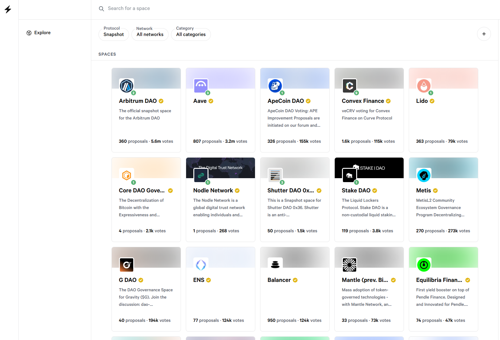
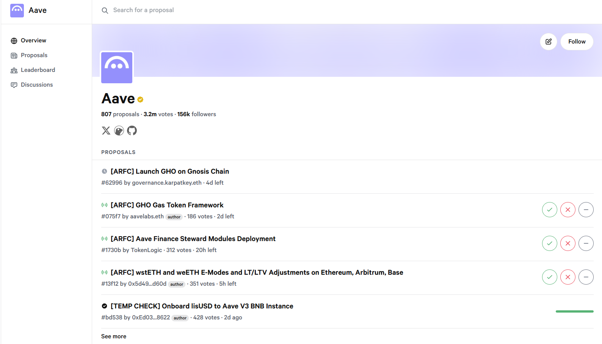
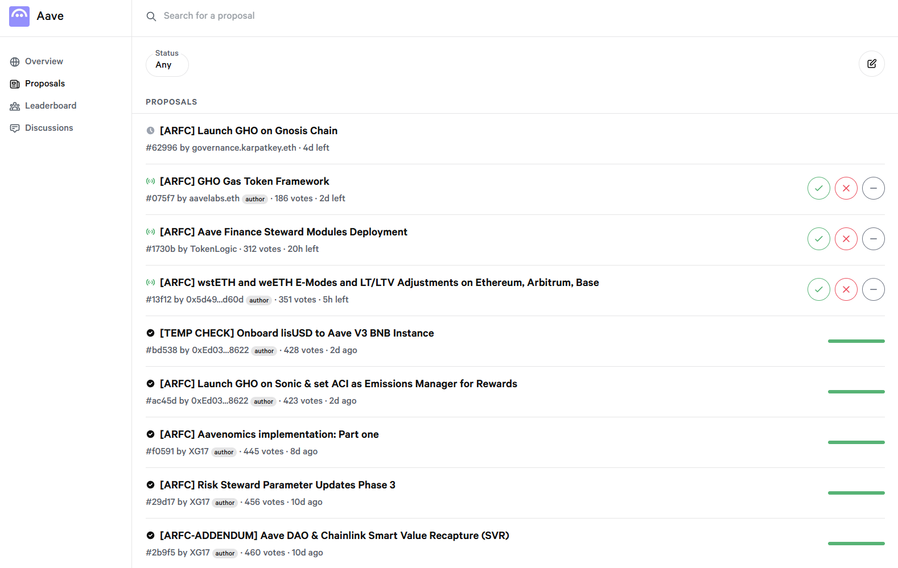
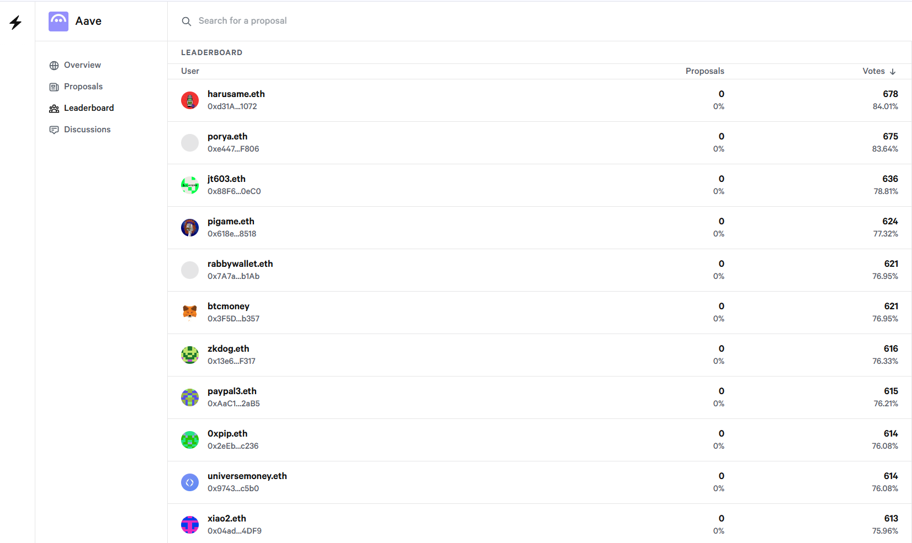
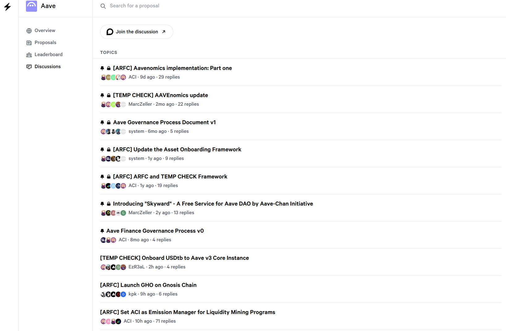

## Snapshot

[snapshot.box](https://snapshot.box/#/)

Snapshot is a blockchain-based decentralized voting system that helps various DAOs and cryptocurrency projects make decision-making transparent and efficient.

If we develop our own DAO system instead of leveraging an existing platform like Snapshot, there are several possible costs that we can expect to incur

1. **development costs** : we need to develop smart contracts and user interfaces ourselves, which may need to be audited in some cases.
1. **infrastructure costs** : We may need to utilize infrastructure such as AWS etc. ourselves. This is against the current strategy of the foundation.
1. **Operation and maintenance costs** **:** It is questionable whether the purpose of a community edition is to have costs for maintenance and operation.

### Voting System

- Basic voting
  - Voters can vote “For”, “Against”, “Abstain”
- Single choice voting
  - Voters can select only one choice from a predefined list.
- Approval voting
  - Voters can select multiple choices, each choice receiving full voting power
- Ranked choice voting
  - Each voter may select and rank any number of choices. Results are calculated by instant-runoff counting method
- Weighted voting
  - Each voter may spread voting power across any number of choices
- Quadratic voting
  - Each voter may spread voting power across any number of choices. Results are calculated quadratically.

### Proposal Framework

In order to provide users with accurate information about the offer, and to ensure consistent management, we believe it is necessary to use one established framework.
Below is an example of what works.

- Title
- Author
  - I guess it is possible to use a nickname, or anonymize via wallet address.
- Date
- Summary
  - Provides overview information about the proposal
- Motivation
  - Explains how the proposal came to be.
- Specification
  - Describe the technical specification of the proposal. 
- Conclusion
- Next Steps
- Discussion link
  - If there's been any discussion related to the proposal in a separate forum or otherwise, add a link. In our case, we can link to discussions on Discord, etc.

### UI

- Landing page (Explore)

- Details page
  - Overview

  - Proposals

  - Leaderboard

  - Discussions
