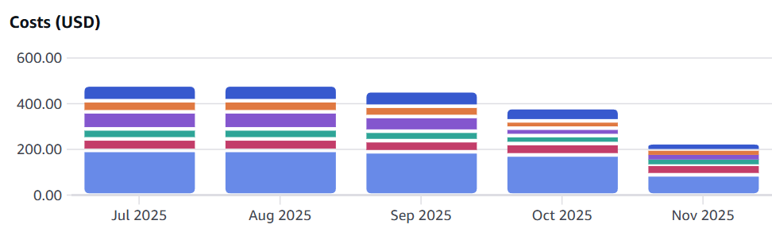

# 1. Final Goals (What is the ultimate goal of this project)

- The ultimate goal of this project is to establish a sustainable multi-rollup ecosystem where network expansion directly contributes to the stability and utility of the entire ecosystem, thereby solidifying TON as the universal asset for security, gas, and governance.

## 1-a. Milestone

### **A. Tokamak Staking**

| **Category** | Subcategory | Deliverable | Subtotal |
| --- | --- | --- | --- |
| **Integration of Slashing Protocol** | **Release TON staking SDK v2.0** with slashing support | 1 code release |  |
|  | Contracts audit | Final reports, 1 blog post |  |
|  | new DAO agenda for contract upgrade | 1 dao agenda |  |
|  | Launch **community version v2.0 + community guide** with slashing support | 1 service update with 1 guide | 1 code release, 1 service update with guide |
| **Integration of fast withdrawal protocol** | **Release TON staking SDK v3.0** with fast withdrawal support | 1 code release |  |

### B. Tokamak DAO V2 

| **Category** | Subcategory | Deliverable | Subtotal |
| --- | --- | --- | --- |
| **Testing DAO V2 on testnet** | Testing Snapshot with PoU  | 1 testnet |  |
| **Policy document for DAO V2** | Including Discord based RFC, Snapshot, PoU for sybil-attack | 1 documents |  |
| **Added use of Snapshot and forum** | **Open community version for DAO V2 **: Include new agenda creation via Discord and Snapshot with PoU | 1 service | 1 service, |
| **DAO upgrade** | Recover SafeWallet's signer in the DAO | 1 code release
1 dao Agenda |  |

### **C. Tokamak Economics R&D**

| **Category** | **Subcategory** | **Delivarable** |
| --- | --- | --- |
| **Economics Whitepaper Update** | - | 1 paper |
| **Validator Economics** | Randomized Attention Test | 1 paper, 1 codebase |
|  | Basic slashing Mechanism | 1 paper, 1 codebase |
|  | Advbanced slashing mechanism | 1 codebase |

## 1-b. Easy to understand explanation even outside of team and typical community participant (non-technical persons): **The importance of each milestone deliverable, considering the Tokamak Foundation's strategy and the current Tokamak ecosystem**

### Tokamak Economics

This quarter's economics achievements directly support Tokamak Foundation's core strategy of building a transparent, secure, and sustainable Layer 2 ecosystem.

**The Tokamak Tokenomics Dashboard Upgrade** establishes network transparency by providing real-time staking metrics and APY trends. This enables participants to make informed decisions, building trust and encouraging confident participation.

**The Layer 2 Challenger (RAT) System and Basic Slashing Mechanism** create a proactive security model that continuously verifies validators rather than responding after problems occur. As the network scales and more value flows through it, security failure costs increase dramatically, making this essential security foundation for future growth.

**The Updated Economics Whitepaper** presents a sustainable economic model integrating validator incentives, slashing, staking rewards, and multi-Layer 2 coordination. A clear economic vision is essential for attracting validators and investors.

### Tokamak Governance

**The RFC System Introduction** creates structured space for discussion and feedback before proposals become official votes. This improves proposal quality, gains broader community support, and increases implementation success. Templates and examples make the process accessible to everyone.

**SafeWallet Integration Work (RFC#13)** enables governance operations through multi-signature security with signature verification. This establishes the foundation for the DAO to safely manage important decisions and treasury operations.

### **Utility of TON**

Expanding the utility of TON is key to fostering a vibrant ecosystem. The Tokamak Utility Expansion: Contract Audit System aims to integrate a robust security layer, providing developers and users with tools to ensure the reliability and safety of smart contracts deployed on the network, thereby increasing trust and adoption.

## 1-c. Timeline

| Year-Quarter | Milestone |
| --- | --- |
| 2025-Q1 | - Landing page |
| 2025-Q2 | - Open Simple Staking V2 |
| 2025-Q3 | - DAO 1.0 community version
- Staking community version |
| 2025-Q4 | - Launch PoU on mainnet(SYB)
   - DAO V2: Snapshot test with PoU
- Price API V2.0
- DAO V2: Publish Policy document(without snapshot)
- DAO upgrade : Recover SafeWallet's signer in the DAO
- Basic slashing mechanism release & PoC
- Layer 2 Challenger (RAT) System
- White paper new version release
- Tokamak Utility Expansion: Contract Audit System |
| 2026-Q1 | - Advanced slashing mechanism release & PoC
- Staking V2: Slashing protocol
- Finalize integrate Challenge game type to Thanos Challenger
- DAO 2.0 Community version(SYB score + snapshot) - after SYB mainnet
- Research of fast withdrawal protocol |
| 2026-Q2 | - Add new game type to Challenger system(research) |

- DAO 2.0 Community version(SYB score + snapshot) can proceed after the launch of PoU on mainnet

# 2. This quarter’s outputs 

## 2-a. Easy to understand explanation even outside of the team and typical community participant (non-technical persons): How did your team contribute to achieving the milestone this quarter?

### Tokamak Economics

This quarter, the economics team focused on increasing network transparency and building basic security mechanisms.

We upgraded the Tokamak Tokenomics Dashboard to provide real-time visibility into key metrics such as staking ratios, APY, and withdrawal trends. This allows anyone in the community to monitor network health, which is essential for building trust and encouraging ecosystem participation.

We also complete draft of a new economics whitepaper that incorporates feedback from the community and team members. This document will clearly present how Tokamak's economy works, including validator incentive structures and collaboration plans for multiple Layer 2 networks.

### Tokamak Governance

The governance team focused on making community participation easier and strengthening decentralized decision-making processes.

We successfully introduced the RFC (Request for Comments) system. This provides a structured discussion phase before proposals become official votes. Community members can collaboratively refine ideas, which improves proposal quality and enhances the quality of governance decisions.

We invested considerable effort in documentation and communication, including updating official documentation in both English and Korean, publishing Medium articles, and creating templates that make it easy for anyone to participate. These improvements lower the barriers to governance participation, moving us toward genuine decentralization.

## 2-b. Actual outputs description 

### 2-b-i. Deliverable

**Tokamak Economics**

**Tokamak Governance**

### 2-b-ii. Work

**Tokamak Economics**

- **Basic slashing mechanism release & PoC**
  - Contract design for developing a basic slashing mechanism ([ppt](https://docs.google.com/presentation/d/168dRYgyJdSP45wOUGMbTC2e7qSGTNXQBy-myAxthApU/edit?slide=id.g39e0ef9ec83_0_0#slide=id.g39e0ef9ec83_0_0), [seminar](https://drive.google.com/file/d/1peN_2568Jn_kXuJSi8clRqHkeYSe4SzH/view))
  - discussion on slashing policy ([notion](/2a1d96a400a380f186dceabf24750bbb), [meeting](https://drive.google.com/file/d/1GMtSgBhVyn-mrDK8btlGwLa1bP0eTWlR/view))
  - cleanup the Slashing policy ([notion](/2a7d96a400a3805c940fcf5db44e6e17))
  - Change the development environment to foundry ([branch](https://github.com/tokamak-network/ton-staking-v2/tree/25-Q4-slashing-foundry))
  - Basic logic development ([commits](https://github.com/tokamak-network/ton-staking-v2/commits/25-Q4-slashing-foundry/))
- **Assess the current tokenomics situation**
  - Define Key Metrics** **: [notion](/2a9d96a400a380e9bce5e186a8bd9bc4) 
  - Develop the basic staking metrics aggregator: [readme](https://github.com/tokamak-network/tools/tree/aggregate_staking_metrics/aggregate_staking_metrics#tokamak-network-basic-staking-metrics-aggregator), [commits](https://github.com/tokamak-network/tools/commits/aggregate_staking_metrics/) 
  - Develop [Dune Queries](https://dune.com/workspace/t/project_eco_test/library/queries), [Test Dashboard ](https://dune.com/project_eco_test/test1). [notion](/2b5d96a400a3803ab96fda7ca8816eba#2b7d96a400a38022aba2eac9938fbfb6)
  - notice [X](https://tokamak-network.slack.com/archives/C07JU42NK9R/p1765356417343769?thread_ts=1765333228.226249&cid=C07JU42NK9R), [Telegram](https://t.me/tokamak_network/84147), [Discord](https://discord.com/channels/696270789472682034/697032888570609696/1448235106266517544)
  - Request [RFC #17](https://github.com/tokamak-network/tokamak-dao-contracts/discussions/17), [PR #330 ](https://github.com/tokamak-network/ton-staking-v2/pull/330/commits/21d21c96aef082c603d11dae1277e4db31229a37): : Add WithdrawalRequestCanceled Event to DepositManager 
- **Research Challenger System**   
  - Challenger System Architecture Analysis [EN](https://github.com/tokamak-network/tokamak-thanos/blob/feature/challenger-gametype3/op-challenger/docs/challenger-system-architecture.md) / [KR](https://github.com/tokamak-network/tokamak-thanos/blob/feature/challenger-gametype3/op-challenger/docs/challenger-system-architecture-ko.md)   
  - Integrated Challenger GameType 2 (Asterisc) and GameType 3 (Asterisc-Kona) into Tokamak-Thanos (PoC on Local).  Readme: [EN](https://github.com/tokamak-network/tokamak-thanos/blob/feature/challenger-gametype3/op-challenger/scripts/README.md) / [KR](https://github.com/tokamak-network/tokamak-thanos/blob/feature/challenger-gametype3/op-challenger/scripts/README-KR.md), [commits](https://github.com/tokamak-network/tokamak-thanos/commits/feature/challenger-gametype3/) 
  - develop the e2e tests in optimism [readme](https://github.com/tokamak-network/optimism/blob/feature/challenger-game-type-check/op-challenger/scripts/docs/test-cases/README.md),  [cannon](https://github.com/tokamak-network/optimism/blob/feature/challenger-game-type-check/op-challenger/scripts/docs/test-cases/faultproofs-cannon-test-report-en.md#fault-proofs-cannon-test-report) , [asterisc](https://github.com/tokamak-network/optimism/blob/feature/challenger-game-type-check/op-challenger/scripts/docs/test-cases/faultproofs-asterisc-test-report-en.md#asterisc-fault-proofs-test-report)
  - [bond cost analysis](https://github.com/tokamak-network/optimism/blob/feature/challenger-game-type-check/op-challenger/scripts/docs/test-cases/bond-cost-measurement-report-en.md#output-cannon-bond-cost-measurement---test-analysis-report) for Challenger System (Dispute Game)
  - feature/challenger-game-type-check: [commits](https://github.com/tokamak-network/optimism/commits/feature/challenger-game-type-check/)
  - BOLD challenge system code analysis: [draft](https://tokamak-network.slack.com/archives/C07JU6K4KDY/p1764669424097319), [notion](/2cfd96a400a380afabf5cb268295e8b0)
- **Writing a Tokamak Network Contract Specification**
  - [Tokamak Network Contracts](/2bed96a400a380058418f4d67661ba5c)
  - the [specification](https://docs.google.com/spreadsheets/d/14tDP6pKdwN-boIUCisFzA8ggCNxSBHYwK7AZadDwbRs/edit?gid=1527791472#gid=1527791472) on tokamak network contracts 
- **White paper development specification**
  - White paper development: [specification](https://github.com/tokamak-network/ton-staking-v2/blob/ton-staking-v3/dev/docs/specs-kr/readme.md#ton-staking-v3-system-specification)
  - Developing Staking V3: [readme](https://github.com/tokamak-network/ton-staking-v2/tree/ton-staking-v3/dev?tab=readme-ov-file#ton-staking-v3) [commits](https://github.com/tokamak-network/ton-staking-v2/commits/ton-staking-v3/dev/) 
- **Writing the new version of L2 tokenomics white paper**
  - Survey on the shared validators set concept: ppt, seminar
  - Designing the new structure of L2 tokenomics white papar: [notion](/2a2d96a400a38000a2d7fb16b2e7ab78)
  - Drafting Tokenomics design: [notion](/286d96a400a38012a496d43965b05e8f)
  - Collecting and organizing white paper [feedbacks](/2c3d96a400a38083b842e09fdb50b19f)
  - Writing the updated version of L2 tokenomics white paper: [overleaf](https://www.overleaf.com/project/68de1e8ef6e2f12217be4a9a)
- **Tokamak Network MCP**
  - Core functionality development completed (wrap / unwrap / staking / unstaking): [github](https://github.com/tokamak-network/tokamak-network-mcp)
  - WEB UI style changed to Windows style
- **Price API V2.0**
  - Optimize AWS resources

  - Optimize cost **$456**(in Sep) → **$229**(in Nov)

**Tokamak Governance**

**Utility of TON**

## 2-c. The reason why each under

### 2-c-i. List of challenges faced for each under-achieved deliverable

- **Basic slashing mechanism release & PoC: ** We faced several challenges in implementing the slashing mechanism as originally envisioned in the whitepaper. The primary challenge was that the whitepaper specifications were not yet finalized, which prevented us from developing the complete slashing system as initially planned. While we are completing the basic slashing logic development and testing by the end of this month, we had to adjust our scope to focus on fundamental functionality first.
- **DAO upgrade: Recover SafeWallet's signer in the DAO: **While implementing additional updates based on feedback, a critical bug was discovered on where the SafeWallet Contract generated via the TRH-SDK failed to properly integrate with the SafeWallet API. This created a technical bottleneck, delaying both the testing of key logic, including the `isValidSignature` function, and the submission of the final Agenda, as we were required to await technical resolution from the TRH team.
- **Launch PoU on mainnet (SYB) & DAO V2: Snapshot test with PoU: **We can proceed this milestone after PoU is launched on mainnet. 
- **Tokamak Utility Expansion:** **Contract Audit System: **The platform evolved from a simple bug bounty tool for internal audits to a more comprehensive system with GitHub integration and AI-powered audit capabilities. We are currently testing various AI models and prompts to find the optimal combination for code analysis. Additionally, to drive internal developer adoption, we decided to add AI audit features mid-development, which required extended testing and integration work.
- **Tokamak Network MCP: **Implementation is finished. Currently in testing phase.

### 2-c-ii. List of solved challenges

- **DAO upgrade: Recover SafeWallet's signer in the DAO:**
 The most significant issue, the SafeWallet API integration bug, was resolved through collaboration with the TRH team, and the system subsequently passed final testing, confirming that the `execute` function operates correctly. Furthermore, following a meeting with the Foundation, we reached a consensus to resolve the issue internally rather than proceeding with the complex DAO Agenda creation process, thereby minimizing unnecessary administrative overhead and efficiently concluding the task.
- **Basic slashing mechanism release & PoC**: We successfully addressed the whitepaper uncertainty challenge by establishing a phased development approach. In early December, we finalized the specifications for the basic slashing logic, allowing us to proceed with concrete development work despite the whitepaper not being fully confirmed. This pragmatic approach ensures we can deliver foundational slashing functionality while the more comprehensive economic model continues to be refined.
- **Tokamak Utility Expansion:** **Contract Audit System: **We completed the foundational architecture including GitHub link integration with automatic code block generation and project/issue registration system. We also established a systematic AI model testing framework and adopted a modular development approach: Phase 1 (Current) focuses on core platform and GitHub integration, Phase 2 (Q1 2026) on AI audit features, and Phase 3 (Future) on advanced analytics.

### 2-c-iii. Strategy for unsolved challenges

- **Launch PoU on mainnet (SYB) & DAO V2: Snapshot test with PoU**: Currently, PoU is not launched on mainnet yet. But, based on new whitepaper, we have to consider another way to check voting power. 

# 3. Change in next quarter's deliverables

- Basic slashing mechanism release & PoC:
- DAO upgrade: Recover SafeWallet's signer in the DAO
- Launch PoU on mainnet (SYB) & DAO V2: Snapshot test with PoU
- Tokamak Utility Expansion: Contract Audit System
- Staking SDK & Tokamak Network MCP

# 4. Change in the road map 

## 4-a. Revised milestone

It will be moved to Appendix

## 4-b. Easy to understand explanation even outside of team and typical community participant (non-technical persons): The importance of each newly added milestone deliverable, considering the Tokamak Foundation’s strategy and the current Tokamak ecosystem

It will be moved to Appendix

## 4-c. Revised timeline

It will be moved to Appendix

# Appendix

## a. Milestones of Q1, 2026

### Economics

| **Category** | Subcategory | Deliverable | Subtotal |
| --- | --- | --- | --- |
| **Implementing RAT Client** | Implement RAT client for Optimism Stack | 1 code base |  |
| **Staking V3** | Basic Slashing Mechanism release & PoC | 1 code release |  |
|  | Advanced Slashing Mechanism release & PoC | 1 code release |  |
|  | Contract implementation - Slashing + Validator | RAT system, Update Staking Contract(V2→V3), Sequencer slashing, validator slashing |  |

### Governance

| **Category** | Subcategory | Deliverable | Subtotal |
| --- | --- | --- | --- |
| **New DAO Governance** | DAO Governance research | 1 documents |  |
|  | DAO Governance modeling based on research | 1 Specification |  |
| **Off-chain voting** | after SYB mainnet | 1 documents |  |

## b. Easy to understand explanation even outside of team and typical community participant (non-technical persons): The importance of each newly added milestone deliverable, considering the Tokamak Foundation’s strategy and the current Tokamak ecosystem

### Implementing RAT Client for Optimism Stack

Since Optimism Stack is widely used across multiple Layer 2 networks, building a RAT client for it allows our security mechanisms to integrate into the broader ecosystem. Other networks can adopt the RAT methodology, potentially positioning Tokamak as a leader in Layer 2 security solutions and expanding the practical utility of our research.

### Staking V3 - Basic and Advanced Slashing Mechanisms

The phased approach from basic to advanced slashing is a strategy for gradually strengthening network security. Basic slashing establishes fundamental rules and penalties for validator misconduct, creating immediate accountability. Advanced slashing builds more sophisticated detection and penalty systems. This allows us to quickly deploy essential security measures while continuously improving, rather than waiting for a perfect system.

### Staking V3 - Contract Implementation (Slashing + Validator)

The comprehensive contract implementation combining RAT system integration, staking contract upgrades (V2→V3), and sequencer and validator slashing represents the culmination of security research. It translates theoretical designs into smart contracts that will actually govern the network. The upgrade from V2 to V3 signifies a major evolution in Tokamak's staking system, implementing more robust security mechanisms.

### New DAO Governance - Research and Modeling

As the network matures and the community grows, governance systems must scale accordingly. The research phase studies governance models from other successful DAOs and identifies best practices, while the modeling phase designs a governance structure tailored to Tokamak's unique needs. Without effective governance, decision-making bottlenecks can slow development and reduce community trust, making this essential for long-term decentralization.

## c. Timeline

| Year-Quarter | Milestone |
| --- | --- |
| 2025-Q4 | - Launch PoU on mainnet(SYB)   
   - DAO V2: Snapshot test with PoU
- Price API V2.0
- Layer 2 Challenger (RAT) System
- White paper new version release |
| 2026-Q1 | - DAO upgrade : Recover SafeWallet's signer in the DAO
- Tokamak Utility Expansion: Contract Audit System
- Basic slashing mechanism release & PoC
- Advanced slashing mechanism release & PoC	 
- Staking V3: Contract implementation - Slashing + Validator
- Implement RAT client for Optimism Stack
- New DAO Governance: research
- New DAO Governance: modeling based on research |

- Written as Red texts are delayed milestones from Q4, 2025 