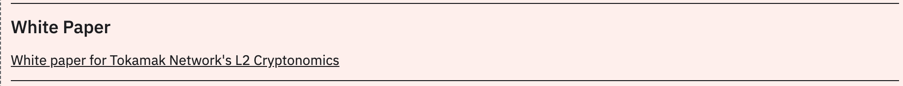
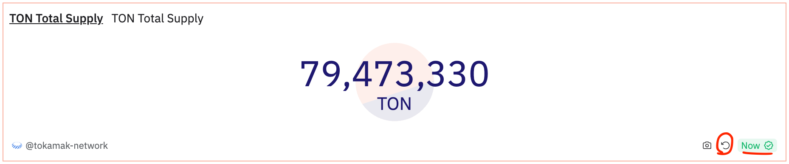
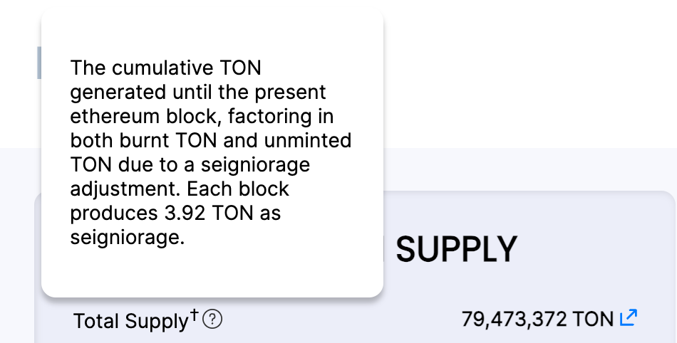

# Test site:

- Tokenomics dashboard: [https://dune.com/tokamak-network/tokamak-network-tokenomics-dashboard](https://dune.com/tokamak-network/tokamak-network-tokenomics-dashboard)
- Staking dashboard: [https://dune.com/tokamak-network/tokamak-network-staking-dashboard](https://dune.com/tokamak-network/tokamak-network-staking-dashboard)

## Test List:

- UI Check
- Data Check
- General Feedback/Suggestions for improvement

## Comments

Kevin
  - tokenomics dashboard
- [x] old whitepaper is depricated. New is economics paper. [https://github.com/tokamak-network/papers/blob/master/cryptoeconomics/tokamak-cryptoeconomics-en.md](https://github.com/tokamak-network/papers/blob/master/cryptoeconomics/tokamak-cryptoeconomics-en.md)

A: I remove the whitepaper link. leaving only the economics paper.


- [x] upbit ton supply : why data is differ from [https://price.tokamak.network/](https://price.tokamak.network/) ?

A: Dune query is not real-time result. because user can resend query. reference below screenshot.
and [https://price.tokamak.network/](https://price.tokamak.network/) using [SeigManager/TotalSupplyOfTON function](https://etherscan.io/address/0x0b55a0f463b6defb81c6063973763951712d0e5f#readProxyContract#F64). The function is calculating like [this](/d5be8b8e3e9a43cbb888fe74244e119f). Dune query calculating like [this](/d5be8b8e3e9a43cbb888fe74244e119f). So, Slight differences in seconds can occur.
```shell
#[SeigManager/TotalSupplyOfTO](https://etherscan.io/address/0x0b55a0f463b6defb81c6063973763951712d0e5f#readProxyContract#F64)N

50000000 + (_seigPerBlock * (block.number - 10837698))
- (ITON(_ton).balanceOf(address(1)) * (10 ** 9)) - 178111.66690985573
```

```shell
total_supply + seig - burned_supply - 178111.66690985573
#At this calculation seig is 3.92*((max(number)-2)-10837698)
```





- [x] top 10 holders : can we add text lable each of account? most of them is smart contract, so we need explanation
- [x] Token Vesting Graph : In graph, why DAO peaks and disappear suddenly from the middle? And more fundamentally, do we need a vesting graph(and other vesting sections too)? All TON’s vesting period is over, and I think we have to re-consider its value of display.
  - staking dashboard
- [ ] Can we provide TOP 10-20 stakers pie chart?
- [ ] Can we provide candle chart of inflow / outflow of staking daily bases?

Jaden
- [ ] 

Suah
- [ ] Rewrite introduction
- [ ] 

Praveen
- [ ] 

Jason
- [ ] 