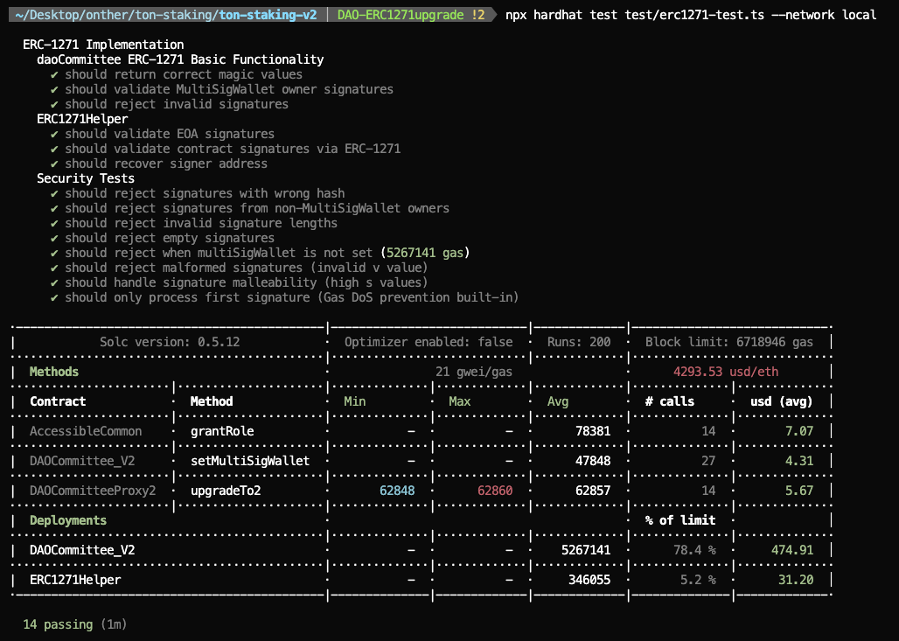

Repo : [https://github.com/tokamak-network/ton-staking-v2/tree/DAO-ERC1271upgrade](https://github.com/tokamak-network/ton-staking-v2/tree/DAO-ERC1271upgrade)

Branch : DAO-ERC1271upgrade

Official documentation for ERC1271: [https://eips.ethereum.org/EIPS/eip-1271](https://eips.ethereum.org/EIPS/eip-1271)

# DAO Contract EIP-1271 Implementation Development Plan

This is a development plan for implementing the EIP-1271 standard in the TON Staking V2 project's DAO Contract, adding MultiSigWallet-based signature verification functionality.

## 1. Project Overview

Currently, in the TON Staking V2 system, the DAO Committee owns the MultiSigWallet Contract. Utilizing this structure, we plan to implement signature verification functionality compliant with the EIP-1271 standard, supporting features such as off-chain ordering, metatransactions, and delegation of authority.

## 2. Current System Structure

- DAOCommittee_V1: Main DAO contract
- MultiSigWallet: Multi-Sig wallet set as the DAO owner
- Owner Structure: Structure where multiple owners submit and verify transactions

## 3. EIP-1271 Implementation Plan (MultiSigWallet-based Signature Verification )

This method verifies messages individually signed by MultiSigWallet owners by concatenating them together.

- Advantage: Leverages the existing MultiSigWallet structure
- Advantage: Owner authorization management is already handled by MultiSigWallet
- Advantage: Maintains consistency with the existing security model

## 4. Technical Implementation Details

### Signature Verification Logic

1. Extract the signature from the concatenated signature
1. Recover the signer address from the signature
1. Verify that the signer is the MultiSigWallet owner.

## 5. Additional developed functions

link : [https://github.com/tokamak-network/ton-staking-v2/blob/DAO-ERC1271upgrade/contracts/dao/DAOCommittee_V2.sol](https://github.com/tokamak-network/ton-staking-v2/blob/DAO-ERC1271upgrade/contracts/dao/DAOCommittee_V2.sol)

## functions

- isValidSignature(bytes32,bytes) returns (bytes4)
```solidity
/**
 * @notice Signature validation according to ERC-1271 standard
 * @param _hash Hash that was signed
 * @param _signature Signature data (signatures from MultiSigWallet owners)
 * @return magicValue ERC-1271 magic value
 */
function isValidSignature(
    bytes32 _hash,
    bytes memory _signature
) external view returns (bytes4 magicValue) {
    if (multiSigWallet == address(0)) {
        return INVALID_SIGNATURE;
    }
    require(hasRole(DEFAULT_ADMIN_ROLE, multiSigWallet), "DAOCommittee: multiSigWallet is not an admin");

    if (_validateSignatures(_hash, _signature)) {
        return MAGICVALUE;
    }
    return INVALID_SIGNATURE;
}
```
- _validateSignatures(bytes32,bytes) returns (bool)
```solidity
/**
 * @notice Verify the signature of one of the MultiSigWallet owners.
 * @param _hash Hash that was signed
 * @param _signature Signature data
 * @return true if valid
 */
function _validateSignatures(
    bytes32 _hash,
    bytes memory _signature
) internal view returns (bool) {
    if (_signature.length < 65) return false;


    bytes memory sigPart = _signature.slice(0, 65);
    address signer = _recoverSigner(_hash, sigPart);
    if (IMultiSigWallet(multiSigWallet).isOwner(signer)) {
        return true; 
    }

    return false;
}
```
- _recoverSigner(bytes32,bytes) returns (address)
```solidity
/**
 * @notice Recovers signer address from ECDSA signature
 * @param _hash Hash that was signed
 * @param _signature Signature data
 * @return signer Signer address
 */
function _recoverSigner(
    bytes32 _hash,
    bytes memory _signature
) internal pure returns (address signer) {
    require(_signature.length == 65, "Invalid signature length");

    uint8 v = uint8(_signature[64]);
    
    bytes32 r;
    bytes32 s;
    
    assembly {
        r := mload(add(_signature, 32))
        s := mload(add(_signature, 64))
    }

    if (uint256(s) > 0x7FFFFFFFFFFFFFFFFFFFFFFFFFFFFFFF5D576E7357A4501DDFE92F46681B20A0) {
        revert("Invalid signature 's' value");
    }

    if (v != 27 && v != 28) {
        revert("Invalid signature 'v' value");
    }

    bytes32 ethSignedMessageHash = keccak256(
        abi.encodePacked("\x19Ethereum Signed Message:\n32", _hash)
    );
    signer = ecrecover(ethSignedMessageHash, v, r, s);
    
    require(signer != address(0), "Invalid signer");

    return signer;
}
```
- setMultiSigWallet(address)
```solidity
/**
 * @notice Sets MultiSigWallet address (onlyOwner)
 * @param _multiSigWallet New MultiSigWallet address
 */
function setMultiSigWallet(address _multiSigWallet) external onlyOwner nonZero(_multiSigWallet) {
    address oldWallet = multiSigWallet;
    require(hasRole(DEFAULT_ADMIN_ROLE, _multiSigWallet), "DAOCommittee: new multiSigWallet is not an admin");
    multiSigWallet = _multiSigWallet;
    emit MultiSigWalletSet(oldWallet, _multiSigWallet);
}
```

## Storage

```solidity
// ERC-1271 Magic Value
bytes4 private constant MAGICVALUE = 0x1626ba7e;
bytes4 private constant INVALID_SIGNATURE = 0xffffffff;

address public multiSigWallet;
```

## 6. How to Test 

1. execute Sepolia Local Node 
```solidity
npx hardhat node --fork https://sepolia.infura.io/v3/{YOUR_INFURA_KEY}
```
1. run the Test
```solidity
npx hardhat test test/erc1271-test.ts --network local
```
1. Test Result


## 7. Changed signature verification logic

[[Changed signature verification]]

## 8. Current Problems with SafeWallet

[[Using SafeWallet Problem]]

## 9. SafeWallet-integrated version 

[[SafeWallet-integrated version ]]