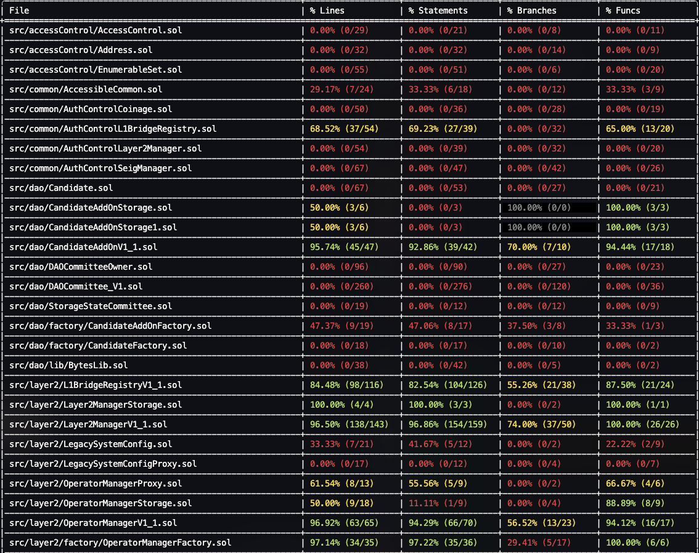
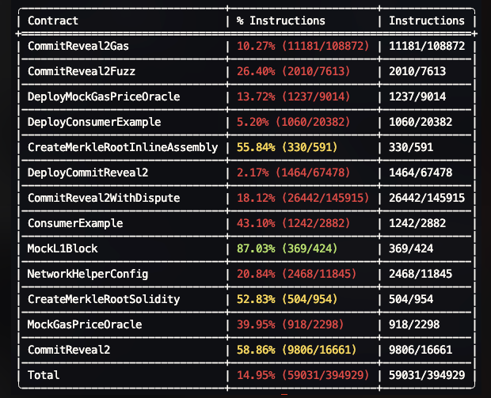

## Hammer’s work

- 7월 1주차 (25.07.02~25.07.08) 
  - DRB 컨트랙트(Commit-Reveal2) 리뷰 진행
    - 전체 코드를 Solidity로 포팅하고 리뷰 진행
    - 자동화 도구를 사용한 테스트 진행
  - TON-Staking-V2를 foundry기반으로 옮기는 작업 진행
- 7월 2주차 (25.07.09~25.07.15) 
  - TON-Staking-V2 테스트 작업 진행
    - **LLM 기반 유닛 테스트 케이스 자동 생성**
      - Claude code 기반 코드 분석을 통해 Solidity 함수 단위 테스트 시나리오 자동 생성
      - 테스트 커버리지 목표 : 각 컨트랙트 당 95% 이상의 커버리지 확보
      - 테스트 케이스 작성을 위한 프롬프트 개발 진행 중

  - DRB 컨트랙트(Commit-Reveal2) 리뷰 진행
    - **Foundry 도구 확장 (inline assembly 커버리지 측정)**
      - Foundry에서 inline assembly (Yul) 코드의 커버리지 미집계 문제 분석
      - Foundry 도구를 분석해서 전체 assembly 코드 중 실행된 코드 측정하는 코드 개발
      - `--ir-minimum` 옵션으로 인해 미실행되는 코드가 추가되고, 이로 인해 정확한 커버리지가 측정되지 않는 문제 확인
      - 정확한 커버리지 측정은 어렵지만 커버리지가 점진적으로 개선되는 것은 확인 가능
      - 저장소 : [https://github.com/hooki/foundry](https://github.com/hooki/foundry)
      - 커밋 : [https://github.com/hooki/foundry/commit/5d8039cc68ec76408c0d702c04c3c264598e5652](https://github.com/hooki/foundry/commit/5d8039cc68ec76408c0d702c04c3c264598e5652)

  - Verifier.sol 스마트 컨트랙트 보안 검토 (Project OOO)
    - 관련 내용 학습 및 코드 분석 진행 중
- 7월 3주차 (25.07.16~25.07.22) 
  - LLM으로 Simple Staking 앱 개발 시작 ([https://tokamak-network.slack.com/archives/C07JU4P56MR/p1753047060122109](https://tokamak-network.slack.com/archives/C07JU4P56MR/p1753047060122109))
- 7월 4주차 (25.07.23~25.07.29)
  - LLM으로 Simple Staking 앱 개발
    1. LLM을 이용해서 프롬프트로 Simple Staking 앱 개발 환경 구축
    1. [https://github.com/hooki/llm-simple-staking](https://github.com/hooki/llm-simple-staking)
    1. Result : [https://tokamak-network.slack.com/archives/C07JU4P56MR/p1753206810684769](https://tokamak-network.slack.com/archives/C07JU4P56MR/p1753206810684769)
  - 테스트 커버리지
    1. SeigManager 전체 흐름 테스트 코드 작성