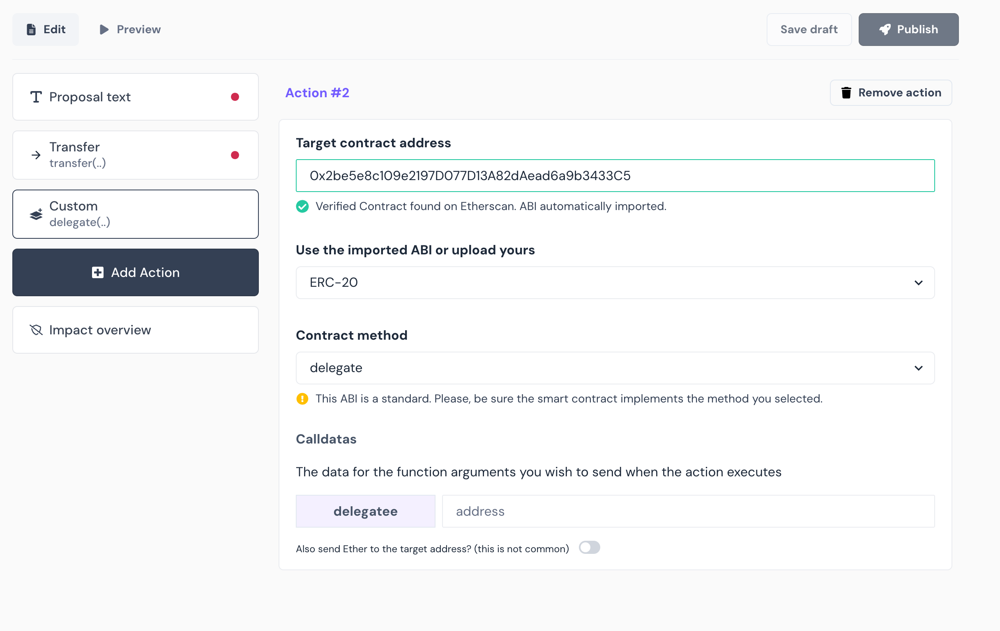
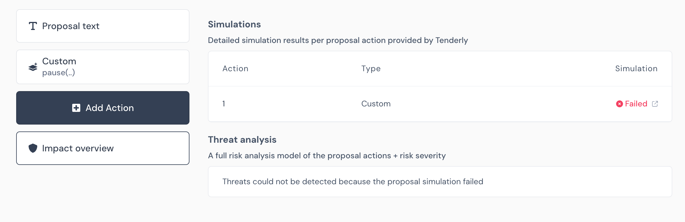

# DAO Candidates

- Members 만 보여줄 예정.
- Challenge는 Challenge 가능한지 확인하는 버튼을 생성

# Propose

- Tally like propose interface
Add action


Impact overview


# Agendas

AgendaManager.agendas()
```javascript
  
  "components": [
    {
      "internalType": "uint256",
      "name": "createdTimestamp",
      "type": "uint256"
    },
    {
      "internalType": "uint256",
      "name": "noticeEndTimestamp",
      "type": "uint256"
    },
    {
      "internalType": "uint256",
      "name": "votingPeriodInSeconds",
      "type": "uint256"
    },
    {
      "internalType": "uint256",
      "name": "votingStartedTimestamp",
      "type": "uint256"
    },
    {
      "internalType": "uint256",
      "name": "votingEndTimestamp",
      "type": "uint256"
    },
    {
      "internalType": "uint256",
      "name": "executableLimitTimestamp",
      "type": "uint256"
    },
    {
      "internalType": "uint256",
      "name": "executedTimestamp",
      "type": "uint256"
    },
    {
      "internalType": "uint256",
      "name": "countingYes",
      "type": "uint256"
    },
    {
      "internalType": "uint256",
      "name": "countingNo",
      "type": "uint256"
    },
    {
      "internalType": "uint256",
      "name": "countingAbstain",
      "type": "uint256"
    },
    {
      "internalType": "enum LibAgenda.AgendaStatus",
      "name": "status",
      "type": "uint8"
    },
    {
      "internalType": "enum LibAgenda.AgendaResult",
      "name": "result",
      "type": "uint8"
    },
    {
      "internalType": "address[]",
      "name": "voters",
      "type": "address[]"
    },
    {
      "internalType": "bool",
      "name": "executed",
      "type": "bool"
    }
  ],
```

- 아젠다 화면에서 한 화면에 5개의 아젠다만 보여준다
  - 추가로 아젠다를 로딩하는 기능을 추가할 수도 있음
- 전체 아젠다와 자세한 내용을 볼 수 있는 링크를 화면에서 보여줌(ex. Go to entire agendas)
- Agenda create하고 agendas() 로 조회하는부분에 Snapshot 등의 링크를 넣을 수 있는  memo 필드 추가 가능한지 확인
memo
```javascript
{
	"title" : titles of agenda
	"details": link to snapshot for details of agenda(TBD) or github issue
}
```
- 