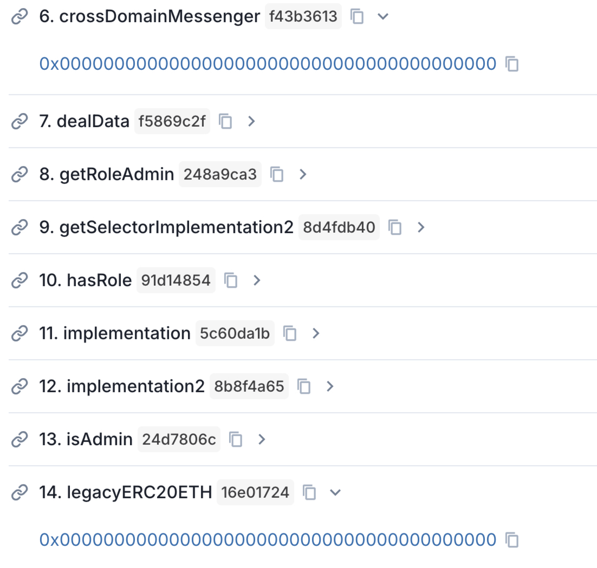
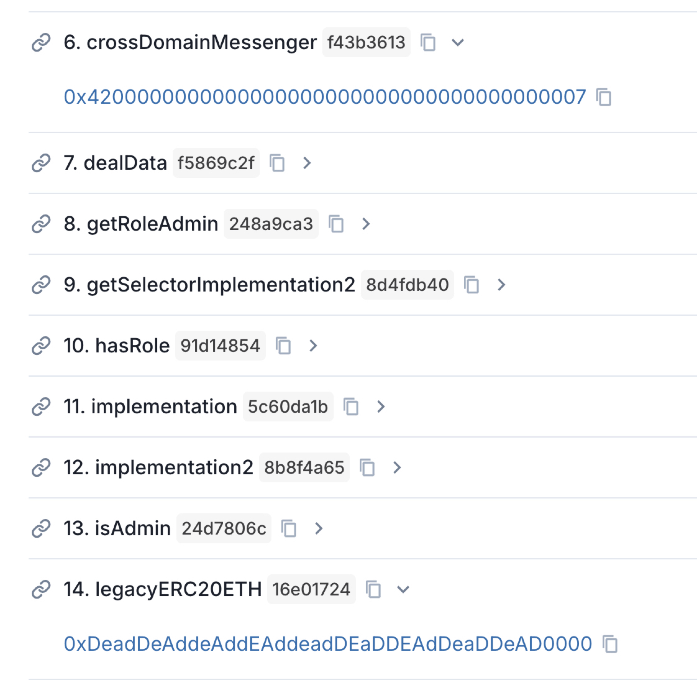
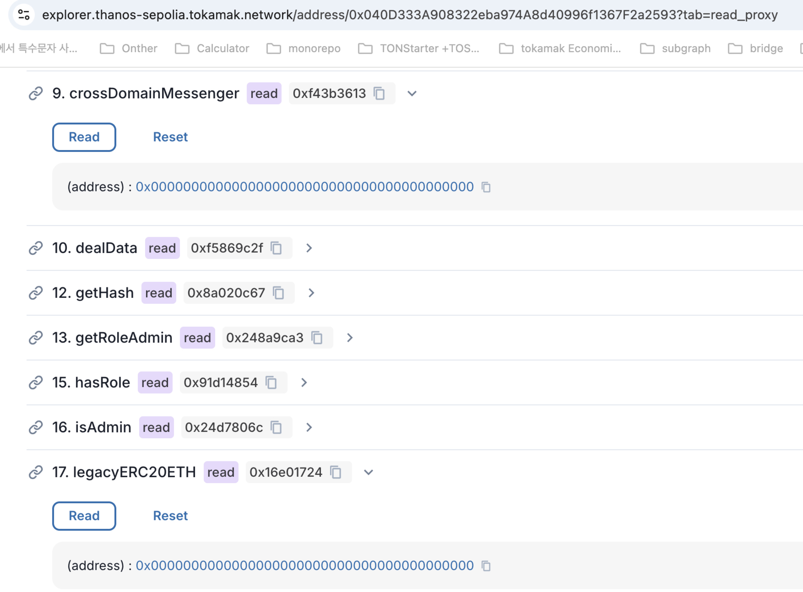
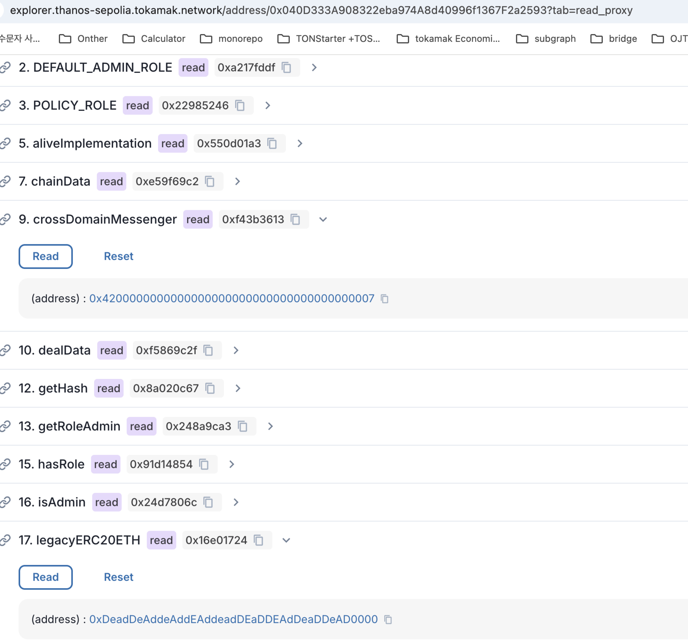

# Thanos standard (Optimism)

It may work on the Titan and Optimism series based on Thanos, but it may not work on the Arbitrum series.

Deposit Token : [https://sepolia.etherscan.io/address/0x757EC5b8F81eDdfC31F305F3325Ac6Abf4A63a5D#writeProxyContract](https://sepolia.etherscan.io/address/0x757EC5b8F81eDdfC31F305F3325Ac6Abf4A63a5D#writeProxyContract)

DAO Vote Test : [https://sepolia.dao.tokamak.network/#/agenda](https://sepolia.dao.tokamak.network/#/agenda)

# How to test (Sepolia - ThanosSepolia)

1. Deploy the L2 DAO Executor
  1. github : [GitHub - tokamak-network/ton-staking-v2 at L2-DAO-Test](https://github.com/tokamak-network/ton-staking-v2/tree/L2-DAO-Test) 
  1. need to Setting l2crossDomainMessenger Address & l1DAOContract Address
    1. l2crossDomainMessenger : `0x4200000000000000000000000000000000000007` (Thanos)
    1. l1DAOContract(L1DAOExecutor) : 0x109c37fdB56850A6dfd0e29290860B423c25f7e6 (Sepolia)
  1. Deploy & Setting 
    1. Deploy : npx hardhat run scripts/L2DAO/1.deploy_L2DAOExecutor.js --network thanossepolia
      1. DeployAddress : 0xDe6b80f4700C2148Ba2aF81640a23E153C007C7F
    1. Setting : npx hardhat run scripts/L2DAO/2.setting_L2DAOExecutor.js --network thanossepolia
1. Deploy the L1 DAO Executor (Sepolia)
  1. github : [GitHub - tokamak-network/ton-staking-v2 at L2-DAO-Test](https://github.com/tokamak-network/ton-staking-v2/tree/L2-DAO-Test) 
  1. need to Setting l1crossDomainMessenger & l1DAOContract & l2DAOContract Address
    1. l1crossDomainMessenger : `0xd054Bc768aAC07Dd0BaA2856a2fFb68F495E4CC2` (Thanos)
    1. l1DAOContract(L1DAO) : 0xA2101482b28E3D99ff6ced517bA41EFf4971a386 (Sepolia) (no need)
    1. l2DAOContract(L2DAOExecutor) : 0xDe6b80f4700C2148Ba2aF81640a23E153C007C7F
  1. Deploy & Setting 
    1. Deploy : npx hardhat run scripts/L2DAO/1.deploy_L2DAOExecutor.js --network sepolia 
      1. DeployAddress : 0x109c37fdB56850A6dfd0e29290860B423c25f7e6
    1. Setting : npx hardhat run scripts/L2DAO/3.setting_L1DAOExecutor.js --network sepolia
1. Deploy the New Cross Trade in L2
  1. github : [https://github.com/tokamak-network/crossTrade](https://github.com/tokamak-network/crossTrade)
    1. Deploy
      1. Proxy : 0x0c448437EDCb2a093266dF30619924AE8131b9E3 (onlyOwner)
      1. Logic : 0xD6e99ec486Afc8ae26d36a6Ab6240D1e0ecf0271
      1. Proxy : 0x0e498afce58dE8651B983F136256fA3b8d9703bc (onlyOwner2)
      1. Logic : 0x70956c3E8492a0FB6986e9ceAA84CE27A0999fd9
  1. AddAdmin to L2 DAO Executor
    1. tx : [Thanos Sepolia transaction 0xe70ef665f5979e0537d62f5a8be2a7558a25aaeea6a2b6654432b7a9e986c639 | Blockscout](https://explorer.thanos-sepolia.tokamak.network/tx/0xe70ef665f5979e0537d62f5a8be2a7558a25aaeea6a2b6654432b7a9e986c639)
1. Execute the DAO Agenda in L1
  1. make the script : npx hardhat run scripts/L2DAO/DAOAgenda_L2initialize_sepolia.js --network sepolia
  1. AgendaCreate tx : [https://sepolia.etherscan.io/tx/0xba9dc3c12891d3c7f9b76912f9652cb7f7979013f6f39f3ca299a077ac8a71ee](https://sepolia.etherscan.io/tx/0xba9dc3c12891d3c7f9b76912f9652cb7f7979013f6f39f3ca299a077ac8a71ee)
  1. Execute tx : [https://sepolia.etherscan.io/tx/0x807dc79b113b20650d397b8388e01ecb22d5f180bc994c9a64558e8bd971ccfa](https://sepolia.etherscan.io/tx/0x807dc79b113b20650d397b8388e01ecb22d5f180bc994c9a64558e8bd971ccfa)
  1. 실행 전 

  1. 실행 후

# How to test (Sepolia - ThanosSepolia)

delete the L1 DAO Executor

1. Deploy the L2 DAO Executor
  1. github : [GitHub - tokamak-network/ton-staking-v2 at L2-DAO-Test](https://github.com/tokamak-network/ton-staking-v2/tree/L2-DAO-Test) 
  1. need to Setting l2crossDomainMessenger Address & l1DAOContract Address
    1. l2crossDomainMessenger : `0x4200000000000000000000000000000000000007` (Thanos)
    1. l1DAOContract(L1DAOProxy) : 0xA2101482b28E3D99ff6ced517bA41EFf4971a386 (Sepolia)
  1. Deploy & Setting 
    1. Deploy : npx hardhat run scripts/L2DAO/1.deploy_L2DAOExecutor.js --network thanossepolia
      1. DeployAddress : 0x988A796F5ca1d4848d00daC1c17d0A2Bbca18a9b
    1. Setting : npx hardhat run scripts/L2DAO/2.setting_L2DAOExecutor.js --network thanossepolia
1. Deploy the New Cross Trade in L2
  1. github : [https://github.com/tokamak-network/crossTrade](https://github.com/tokamak-network/crossTrade)
    1. Deploy
      1. Proxy : 0x040D333A908322eba974A8d40996f1367F2a2593
      1. Logic : 0xA2C90A682DC0849e9Ed8B781E06a73441b5CA1e6
  1. AddAdmin to L2 DAO Executor
    1. tx : [Thanos Sepolia transaction 0x923731c05a144da591be87b7da98179a0291f72fdca6a8d769595da992261cd2 | Blockscout](https://explorer.thanos-sepolia.tokamak.network/tx/0x923731c05a144da591be87b7da98179a0291f72fdca6a8d769595da992261cd2)
1. Execute the DAO Agenda in L1
  1. make the script : npx hardhat run scripts/L2DAO/L1DAOAgenda_L2initialize_sepolia.js --network sepolia
  1. AgendaCreate tx : [https://sepolia.etherscan.io/tx/0x6077f5ac7071dc3e0a9739484a743987d59174b4de87ed39ab32db401ca3661f](https://sepolia.etherscan.io/tx/0x6077f5ac7071dc3e0a9739484a743987d59174b4de87ed39ab32db401ca3661f)
  1. Execute tx : [https://sepolia.etherscan.io/tx/0x8b00d423cbe53bcbf76c25e86acd5bf9f46bf1664617746778e574739f2793b6](https://sepolia.etherscan.io/tx/0x8b00d423cbe53bcbf76c25e86acd5bf9f46bf1664617746778e574739f2793b6)
  1. 아젠다 실행 전 

  1. 아젠다 실행 후 
