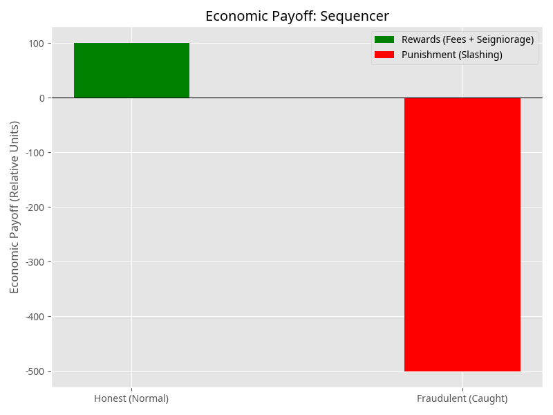

Proposed new structure reflecting the comments
## I. Introduction

  - Problem Statement: Fragmentation of economic security in the L2 ecosystem.
  - Solution: Tokamak Network's "Economics Whitepaper V2" and the Layered Verification Economics.
  - Core Focus: Solution to the Verifier's Dilemma.

## II. The Verifier's Dilemma in L2 Ecosystems

  - Definition: Verification as a public good, leading to rational actors abstaining from work.
  - Amplification in L2s: Large rollups can afford security; small/niche rollups create a security vacuum.

## III. Tokamak's Multi-tier Security Layer

  - Three Tiers of Security:
**Tier 1: Public Challenge (Fraud Proofs)**

This is the foundational layer common to optimistic rollups. It allows any participant to submit a fraud proof to the L1 if they detect an invalid state transition.

    - Mechanism: If a sequencer's state transition is proven fraudulent, the sequencer's bond is slashed.
    - Multi-Challenger Approach: Unlike single-winner systems, Tokamak rewards all valid fraud proofs submitted within the dispute period. This prevents "front-running" or exclusion by malicious L1 proposers.
    - Limitation: It does not guarantee that any specific party is actively monitoring the network at any given time.

**Tier 2: Dedicated Validators**

This tier introduces professional entities that have a formal obligation to monitor the network.

    - Mechanism: Validators must stake TON as collateral. They are eligible for protocol-level incentives and bounties from successful challenges.
    - Shared Validator Set: A single validator can monitor multiple L2s. This allows smaller L2s to inherit security from the global TON staking pool without bootstrapping their own validator sets.
    - Limitation: Validators still face the Verifier's Dilemma, as they may be tempted to "free-ride" on the efforts of others to save operational costs.

**Tier 3: Randomized Attention Test (RAT)**

The RAT is the primary mechanism for ensuring continuous validator engagement by addressing the incentive problem of Tier 2.

    - Mechanism: The protocol selects validators at random intervals to verify specific L2 transaction batches. Validators must submit an attestation within a defined timeframe.
    - Economic Alignment: Failure to provide a timely attestation results in a portion of the validator's stake (the Coff penalty) being slashed. The penalty is mathematically calibrated so that the expected cost of inattentiveness exceeds the cost of continuous monitoring (cm).
    - Outcome: Because selection is unpredictable, consistent monitoring becomes the only rational and profitable strategy for validators.
  - Model Scope: Proof-system agnostic (secures optimistic and ZK proofs).
  - Paradigm Shift: Eliminating the need for independent security bootstrapping.

## IV. Updated Seigniorage Distribution

  - Shift in Focus: From individual L2 growth to collective economic security.
  - Updated Seigniorage Model (TON Staking V3):
    - Metric: Rewards based on "Bridged TON" (actual economic activity) instead of raw TVL.
    - Distribution: Sigmoidal function to mitigate excessive concentration.

## V. Practical Application of the Economic Model

  - Example 1:  Sequencer’s POV: Sequencer Reward Calculation
The sequencer's economic model is built on a high-reward, high-risk structure.

    - **Rewards**: Earns L2 transaction fees and protocol-level seigniorage rewards for maintaining the chain's validity and liveness.
    - **Punishment**: If a fraud proof succeeds, the sequencer's entire bond (D_{sequencer}) is slashed, which is designed to be a significant economic deterrent.

<!-- Unsupported block type: unsupported -->
  - Example 2: Validator’s POV: 
Validators operate under the **Randomized Attention Test (RAT)** to solve the "verifier's dilemma."

    - **Rewards**: Honest validators receive a validator fee when selected for a test and are eligible for seigniorage.
    - **Punishment**: If a validator is selected by RAT but fails to respond or is proven dishonest, they face a slashing penalty (C_{off}).
    - **Strategic Balance**: The system is designed so that the expected cost of being offline (probability of selection * penalty) exceeds the cost of continuous monitoring.


<!-- Unsupported block type: unsupported -->

  - Example 3: User’s POV: Immediate Asset Exit & liquidity providing via fast withdrawal
For users, the payoff is a trade-off between time and cost.

    - **Standard Withdrawal**: No direct fee but incurs a high **opportunity cost** due to the 7-day challenge period latency.
    - **Fast Withdrawal**: Users pay a small fee to liquidity providers to receive their assets immediately. The "payoff" here is the avoidance of the time-value-of-money loss associated with the standard withdrawal delay.
  - A user initiates a withdrawal of 1,000 TON from an L2 to L1. Standard optimistic rollups impose a 7-day challenge period.
  - A Fast Withdrawal provider, acting as an economically motivated verifier, assesses the L2 state. The provider's confidence in the state's validity is high due to the three-tier security system (Public Challenge, Dedicated Validators, and RAT).
  - The provider immediately fronts the 1,000 TON to the user on L1, minus a small fee. If the L2 state went unchallenged, after 7 days, the provider received the "locked" 1,000 TON that was supposed to be withdrawn by the user.~~ If the L2 state were later proven fraudulent,~~ ~~the provider is compensated by the slashing of the Sequencer's bond or the Validator's stake~~

## VI. Conclusion

  - Summary: Robust framework addressing Verifier's Dilemma and economic fragmentation.

[[Revised Medium Draft in more direct style]]

New draft
# Solving the Unseen Crisis in Crypto: How Tokamak Network Tackles the Verifier’s Dilemma


## The Hidden Threat to a Decentralized Future


The proliferation of Layer 2 (L2) solutions on Ethereum, while promises scalability and lower transaction cost, comes with the fragmentation of economic security, as numerous independent rollups are established, and each must secure its own validator set. This requirement often results in robust security only for the largest rollups, while smaller ones remain vulnerable. This is the harsh reality of the **Verifier’s Dilemma**—a classic economic problem where rational actors, in this case, verifiers, may choose to do nothing, assuming others will bear the cost of securing the network.

Tokamak Network’s newly unveiled “Economics Whitepaper V2” confronts this issue head-on, introducing a sophisticated framework called **Layered Verification Economics**. This model is not just another incremental update; it’s a paradigm shift designed to create a robust, shared security layer for the entire L2 ecosystem. At its core, it provides a definitive solution to the Verifier’s Dilemma, ensuring that all chains, regardless of size, can achieve a high degree of security.

## The Verifier’s Dilemma: A Public Good Problem


At its heart, verification in a decentralized network is a public good. When a verifier confirms the validity of a transaction batch, everyone on the network benefits from the added security. However, the verifier alone shoulders the computational and operational costs. This creates a classic free-rider problem where rational actors are incentivized to abstain from verification, assuming others will do the work. This is the **Verifier’s Dilemma**.

In the L2 ecosystem, this dilemma is amplified. While major rollups with billions in Total Value Locked (TVL) can afford to attract a dedicated and vigilant community of verifiers, smaller or more specialized rollups cannot. They are left in a precarious position, creating a security vacuum that malicious actors can exploit. This fragmentation of security undermines the very promise of a decentralized and interconnected L2 landscape.

## Tokamak’s Multi-tier Security Layer: A Fortress of Economic Incentives


Tokamak Network’s solution is a multi-tiered security architecture that aligns economic incentives to make verification a rational and profitable activity for all participants. This layered approach ensures that the network is protected at every level, from public challenges to randomized checks.

### Tier 1: Public Challenge (Fraud Proofs)


This is the foundational layer of security, common to all optimistic rollups. It empowers any network participant to submit a fraud-proof to the L1 if they detect an invalid state transition. If the proof is successful, the malicious sequencer’s bond is slashed, and the challenger is rewarded.

However, Tokamak introduces a crucial innovation: the **Multi-Challenger Approach**. Unlike traditional systems where only the first challenger to submit a valid fraud proof is rewarded, Tokamak rewards all valid proofs submitted within the dispute period. This prevents malicious L1 proposers from front-running or excluding legitimate challenges, making the system more robust and fair.

### Tier 2: Dedicated Validators


To address the limitation that public challengers may not always be watching, Tokamak introduces a tier of professional, dedicated validators. These entities have a formal obligation to monitor the network and must stake TON - Tokamak’s native token - as collateral. In return, they are eligible for protocol-level incentives and bounties from successful challenges.

The key innovation here is the **Shared Validator Set**. A single validator can monitor multiple L2s, allowing smaller rollups to inherit security from the global TON staking pool without the need to bootstrap their own validator sets. This creates a powerful network effect, where the security of the entire ecosystem grows with each new participant.

### Tier 3: Randomized Attention Test (RAT)


The Randomized Attention Test (RAT) is Tokamak’s masterstroke, designed to solve the Verifier’s Dilemma for dedicated validators. The protocol randomly selects validators at unpredictable intervals to verify specific L2 transaction batches. Validators must then submit an attestation within a defined timeframe.

This is where the economic genius of the system shines. Failure to provide a timely attestation results in the validator’s stake being slashed. The penalty is mathematically calibrated so that the expected cost of inattentiveness exceeds the cost of continuous monitoring. Because the selection is unpredictable, the only rational and profitable strategy for validators is to remain consistently vigilant. The RAT is proof-system agnostic, meaning it can secure both optimistic and ZK-proof-based rollups, and it represents a paradigm shift away from the need for independent security bootstrapping.

## A New Economic Model: Rewarding Real Activities


To further align incentives with collective economic security, Tokamak Network has updated its seigniorage distribution model. The focus has shifted from rewarding individual L2 growth, measured by raw TVL, to incentivizing contributions to the overall security of the ecosystem.

The updated model, known as **TON Staking V3**, bases rewards on “Bridged TON,” a metric that reflects actual economic activity and value flowing through the network. To prevent excessive concentration of rewards, the distribution is governed by a hyperbolic function, ensuring a more equitable and decentralized allocation of resources.

## How It Works in Practice: A Look at the Economic Actors


Tokamak Network’s economic model is a finely tuned machine that balances risk and reward for all participants. Let’s explore how it works from the perspective of the key actors in the ecosystem.

### The Sequencer: High Risk, High Reward


Sequencers are the lifeblood of the L2, responsible for maintaining the chain’s validity and liveness. They are rewarded with L2 transaction fees and protocol-level seigniorage for their efforts, measured by Bridged TON. However, if a sequencer is proven to have submitted a fraudulent state transition, their entire bond is slashed. This high-stakes model ensures that sequencers have a powerful economic incentive to act honestly.

[Image: Sequencer Payoff]



### The Validator: The Rational Choice is Honesty


Validators operate under the Randomized Attention Test (RAT), which is designed to make honesty the most profitable strategy. Honest validators receive a fee if they are selected and successfully perform the test and are also eligible for seigniorage. However, if a validator fails to respond to a RAT or is proven dishonest, they face a slashing penalty.

The system is carefully designed so that the expected cost of being offline or dishonest is greater than the cost of continuous, honest monitoring. This strategic balance makes vigilance the only rational choice for validators.

[Image: Validator Payoff]


### The User: Time is Money


For users, the payoff of Tokamak’s security model is a direct trade-off between time and cost. When a user wants to withdraw assets from an L2 to L1, they have two options:

```
•	Standard Withdrawal: This option is free but incurs a high opportunity cost due to the 7-day challenge period, during which the user’s assets are locked.

•	Fast Withdrawal: For a small fee, users can opt for a fast withdrawal and receive their assets immediately. This service is provided by liquidity providers who are confident in the L2’s state validity, thanks to the robust three-tier security system. 


```

This system allows users to choose the option that best suits their needs, providing flexibility and efficiency.

## A More Secure Future for All


Tokamak Network’s Layered Verification Economics is more than just a whitepaper; it’s a comprehensive and robust framework for a more secure and interconnected L2 ecosystem. By directly addressing the Verifier’s Dilemma and the fragmentation of economic security, Tokamak has created a model where all participants are incentivized to contribute to the collective good. This is a critical step forward in realizing the full potential of a decentralized future, where innovation can flourish on a foundation of shared security.