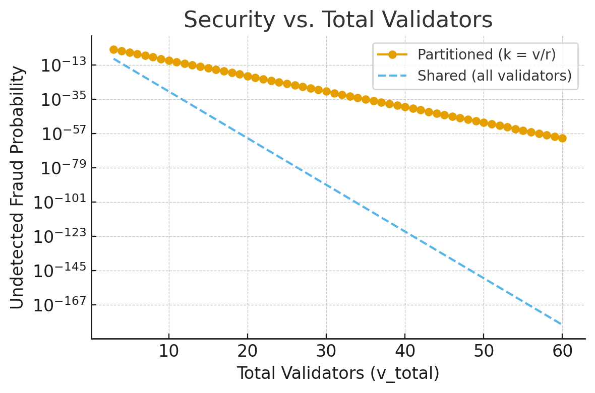
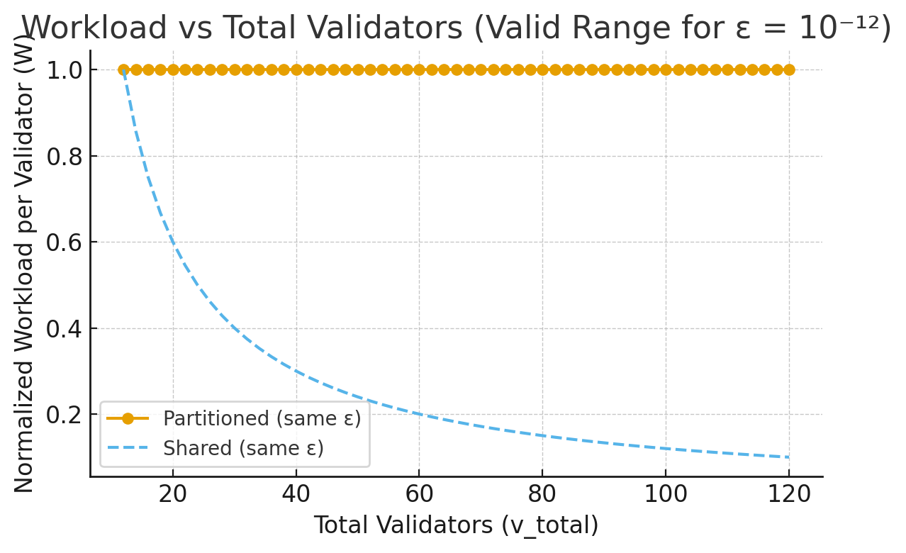

### **Problem Definition**

Assume there are $v$ validators and $r$ rollups in a modular L2 ecosystem.

Each validator can either:

1. **Be assigned** to a subset of rollups — on average, each rollup is validated by $v/r$ validators, or
1. **Be shared** across all rollups — a *shared validator set* that observes every rollup’s state transitions.

Each validator has an independent probability $ p_{\mathrm{fail}}$ of *failing to detect* a fraudulent state transition even when one occurs.

Under the **Optimistic Rollup assumption**, if *any* validator successfully detects and reports a fraud proof, the fraud is prevented from finalizing on L1.

---

### **Analytical Setup**

- For a given rollup, a fraud can go undetected **only if all assigned validators fail**.
- Thus, the fraud occurrence probability per rollup is:

$p_{\mathrm{fraud}}^{\mathrm{partition}} = (p_{\mathrm{fail}})^{v/r}$

$p_{\mathrm{fraud}}^{\mathrm{shared}} = (p_{\mathrm{fail}})^{v}$

- The **reduction factor** in fraud probability gained by using a shared validator set is:

$\frac{p_{\mathrm{fraud}}^{\mathrm{shared}}}{p_{\mathrm{fraud}}^{\mathrm{partition}}}
= (p_{\mathrm{fail}})^{v(1 - 1/r)}$

which is strictly less than 1 for any $0 < p_{\mathrm{fail}} < 1.$

---

### **System-Level Fraud Probability**

Considering all r rollups together, the probability that *at least one* rollup experiences undetected fraud is:

$P_{\mathrm{sys}}^{\mathrm{partition}} = 1 - \big(1 - (p_{\mathrm{fail}})^{v/r}\big)^r$

$P_{\mathrm{sys}}^{\mathrm{shared}} = 1 - \big(1 - (p_{\mathrm{fail}})^{v}\big)^r$

For small probabilities (rare frauds), this can be approximated by:

$\frac{P_{\mathrm{sys}}^{\mathrm{shared}}}{P_{\mathrm{sys}}^{\mathrm{partition}}}
\approx (p_{\mathrm{fail}})^{v(1 - 1/r)}$

---

### **Numerical Example**

Let’s take:

- Total validators: $v = 12$
- Number of rollups: $r = 3$
- Individual validator failure probability: $p_{\mathrm{fail}} = 0.001$

### **Per-Rollup Fraud Probability**

- **Partitioned validation** (≈ 4 validators per rollup):
$p_{\mathrm{fraud}}^{\mathrm{partition}} = (0.001)^{4} = 10^{-12}$
- **Shared validation** (all 12 validators observe every rollup):
$p_{\mathrm{fraud}}^{\mathrm{shared}} = (0.001)^{12} = 10^{-36}$
- **Reduction ratio:**
$\frac{p_{\mathrm{fraud}}^{\mathrm{shared}}}{p_{\mathrm{fraud}}^{\mathrm{partition}}}
= (10^{-3})^{v(1 - 1/r)} = (10^{-3})^{8} = 10^{-24}$
- **Graph for Comparison:**

### **System-Level Fraud Probability**

(at least one rollup fails detection)

$P_{\mathrm{sys}}^{\mathrm{partition}} = 1 - (1 - 10^{-12})^{3} \approx 3\times10^{-12}

$

$

P_{\mathrm{sys}}^{\mathrm{shared}} = 1 - (1 - 10^{-36})^{3} \approx 3\times10^{-36}

$

### **Interpretation**

- With the same total number of validators, **shared validation** lowers the per-rollup undetected-fraud probability from $10^{-12}$ to $10^{-36}$, a **24-order-of-magnitude improvement**.
- System-wide, the probability of any undetected fraud decreases from $3\times10^{-12} $ to $3\times10^{-36}$.
- Therefore, shared validator sets provide **exponentially stronger security** without increasing validator count — especially under the optimistic assumption that any honest validator can detect fraud.

## **Validator Workload under Partitioned vs. Shared Security**

**Assumptions**

- $b$: verification units per rollup (e.g., batches)
- $p_{\mathrm{fpf}}$: probability a validator fails to detect fraud
- Security target: $p_{fraud} \le \varepsilon$

Required number of validators per rollup:

$k^\star = \frac{\ln \varepsilon}{\ln p_{\mathrm{fail}}}$

### **(A) Partitioned Validation Model**

- Each rollup has k^\star dedicated validators → total $v = r\,k^\star$
- Each validator checks only its own rollup:
$W_{\text{part}} = b$

### **(B) Shared Validator Model**

- All validators collectively secure all rollups
- Each validator samples fraction $s = k^\star / v$
- Expected workload per validator:
$W_{\text{shared}} = s\,r\,b = \frac{r\,k^\star}{v}\,b$
- **Graph for Comparison:**

### **Interpretation**

- If $v = r\,k^\star, $ then $W_{\text{shared}} = W_{\text{part}}$.
- If $v > r\,k^\star$, shared security reduces workload per validator.
- Therefore, a **shared validator set** can maintain the *same fraud detection guarantee* with *lower per-validator cost*, assuming uniform sampling and OP-style independence.

## Other issues on the Partitioned Validators model

Collocation in partitioned validator systems creates **structural inflexibility** — each rollup must maintain its own fixed validator set, making coordination and scaling costly.

This isolation leads to **inefficient resource allocation** and difficulty adapting to load or security changes across rollups.