 

- White paper
  - Old version : [https://drive.google.com/file/d/1pQwEkrhLzUaFaRG6ngTHaAWIUEw44Y0B/view](https://drive.google.com/file/d/1pQwEkrhLzUaFaRG6ngTHaAWIUEw44Y0B/view)
  - Most recent version: [https://www.overleaf.com/read/gxmryxbvrtgq#999f21](https://www.overleaf.com/read/gxmryxbvrtgq#999f21)

# Whitepaper Update Summary

| **Section** | **Question** | **Resolved** | **Updated** | **Location** | **Remark** |
| --- | --- | --- | --- | --- | --- |
| 1.3 | Q17 | ✓ |  | - | Fast Withdrawal issue - to be confirmed later |
| 1.3.2 | Q3 | ✓ |  | - | Fast Withdrawal issue - to be confirmed later |
| 1.3.2 | Q4 | ✓ |  | - | Fast Withdrawal issue - to be confirmed later |
| 2.1 | Q6 | ✓ |  | - | Implementation decision - pending withdrawal to be included |
| 2.1.1 | Q9 | ✓ |  | - | Clarified: whitepaper doesn't specify form of reward for challengers |
| 2.1.1 | Q15 | ✓ |  | - | Further discussion needed in the future |
| 2.1.1 | Q16 | ✓ |  | - | Clarified: H_max = max challengers, not validators |
| 2.1.1 | Q1 | ✓ |  | - | Δ_validator margin to be considered; monitoring logic to be developed |
| 2.1.1 | Q11 | ✓ | ✓ | p.11 para.3 (Validator Slashing) | Validator deposit structure: sufficient Δ_validator to continue operating |
| 3.1 | Q5 | ✓ | ✓ | p.11-12 para.3 (L2 Gas) | L2 fee token dilemma: TON value offsets L1 expenses |
| 3.3 | Q2 | ✓ | ✓ | - | TWAP removed |
| 3.3 | Q8 | ✓ | ✓ | p.17 last para. | Gradual transition principle stated; detailed plan TBD |
| 3.3 | Q-3-3-3 | ✓ | - | - | TVL vs usage trade-off acknowledged |
| 3.3.1 | Q7 | ✓ | - | - | Implementation: verification not needed on every tx |
| 3.3.1 | Q13 | ✓ | ✓ | p.17 Eq.(13) para.3 | No validators → DAO treasury |
| 3.3.1 | Q14 | ✓ | ✓ | p.16-17 Eq.(13) | Seignorage share for validators revised |
| Ref | Q10 | ✓ | - | - | TRH/external L2 integration guide to be needed |
| Ref | Q12 | ✓ | ✓ | p.6 S.1.2 para.6 (Validators) | Shared validator set specified |

# Summary

# 1. Verification Economics

## 1.1. Blockchains Scalability and Verification Concerns

## 1.2. Tokamak Network (TON) Rollup Ecosystem

## 1.3. Risk Mitigation Mechanisms

[Resolved]  Q17. Fast withdrawals should be supported by staking tons of liquidity.  
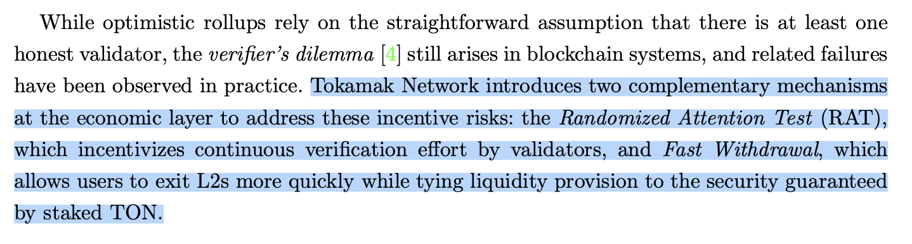

  - Suhyeon:   I didn't mean the liquidity is provided by the staked TON. What I mean is the security is tied to the security by Staked TON. Kevin emphasized the liquidity shouldn't be provided by Staked TON even though it was first approach we considered back in the day. So the risk of the fast withdrawal is the situation L2's state is reorganized. The security by staked TON (Tokamak's basic security model) prevents the reorg as possible.
  - Zena: Yes, I understand. Since staked TON is used for this security, you’re saying that staked TON shouldn’t be used as liquidity for fast withdrawals? It feels like the obstacle to developing fast withdrawals has been removed. In that case, it seems like it could be implemented using other projects, such as  hammer’s proposal(Messaging), the Hop Protocol,  or George’s Cross Trading(Messaging Layer).

**1.3.1. Randomized Attention Test (RAT).**

**1.3.2. Fast Withdrawal.**

[Resolved] Q3. Liquidity providers have an incentive to validate L2, but how can they react to any signs of misbehavior? @suhyeon Lee @Unknown


  - Bernard: If you are referring to fast withdrawal LPs, Tokamak L2's FW LPs are not fundamentally different from others. It is difficult to detect misbehavior in advance, and for incidents that have already occurred, they rely on the fraud proof system. Instead, FW LPs rationalize the fee structure to match long-term profitability based on incident rates. Hopefully, if Tokamak's validator system including RAT is well established, a very low incident rate can be achieved, enabling low-fee fast withdrawals.
  - Suhyeon: Please, refer my answer to Q4.
  - Zena: Thank you for letting us know.

[Resolved] Q4. In section 1.3.2 Fast Withdrawal, it seems like liquidity providers for fast withdrawals share the collateral when a sequencer is slashed. However, in section 2.1.1. Sequencer Deposits, the slashing formula seems to only apply to validators.
Does this mean that since liquidity providers are clearly a factor in becoming validators, they can share the collateral when a sequencer is slashed?
In other words, does this mean that even liquidity providers who don't become validators can't receive collateral from a sequencer's slashing? @suhyeon Lee @Unknown
  - Suhyeon: It doesn't have any specific plan. It'll be left like this and I expect Kevin will give guidance. 
  - Zena: Thank you for letting us know.

# 2. Utilities of TON

## 2.1. L2 Security

[Resolved] Q6. Bridged TON includes TON that has been requested for withdrawal from L2 to L1 and is pending withdrawal. This amount is included. Does this only represent the TON representing L2 TVL after subtracting this amount? Does this also include TON pending withdrawal?
  - Bernard: That part is too specific for the whitepaper, but there should clearly be a defined standard. For example, looking at L2BEAT's case ([Link](https://medium.com/l2beat/redefining-total-value-locked-for-l2s-756160602747)), they use the total amount locked through bridge smart contracts as their basis. Therefore, pending withdrawals would be included. However, since this is a matter of definition, if we feel this standard overestimates the amount locked in L2, we could choose to exclude it.
  - Zena: If this part becomes more specific in the future and the quantity awaiting withdrawal needs to be excluded, you will need to notify the TRH team. Currently, there is no interface for counting the amount of TON pending withdrawal, so this needs to be developed. Thank you.
  - Suhyeon: We should include the pending withdrawal cause of 2 reasons:
1. Including the pending withdrawal will make implementation simple
2. Logically, the pending withdrawal is in the state of deposit. 

### 2.1.1. Economic Security for Sequencers

- **Multi-Challenger Fraud Proof**
- **Sequencer Deposits**
- **Sequencer Slashing**
[Resolved] Q9: Sequencer Slashing (9 page):


    - Zena: When slashing a sequencer's collateral and transferring it to another party, it is recommended to transfer it as a staked amount.
The reason is  that there is a two-week withdrawal period for staked amounts.
However, withdrawing the staked amount to another party without this withdrawal period raises concerns about malicious use.
Therefore, I recommend that challengers keep the sequencer's collateral in a staked form, and we also require that the DAO be transferred as a staked amount.
    - Suhyeon: Suhyeon, that’s a valid point. @Zena , I don’t think the whitepaper itself specifies the form of the reward given to a challenger. This description also covers the case where the reward is staked.
    - Zena: Thank you for checking.

[Resolved] Q15.  I'd like to confirm whether sequencer slashing can cause L2 DoS needs further development.
Full question: Slashed sequencers will have their staked collateral forfeited.
This means they no longer qualify for seigniorage, as they no longer meet the minimum eligibility requirements. **This does not affect L2 sequencing. **You can re-collateralize later to meet the minimum eligibility requirements and receive seigniorage again.

**However, the whitepaper states that L2 sequencing will be suspended. It also states that collateral must be restored within the re-bonding period or they will be permanently removed from the active sequencer set.
I'd like to confirm whether this needs further development.**

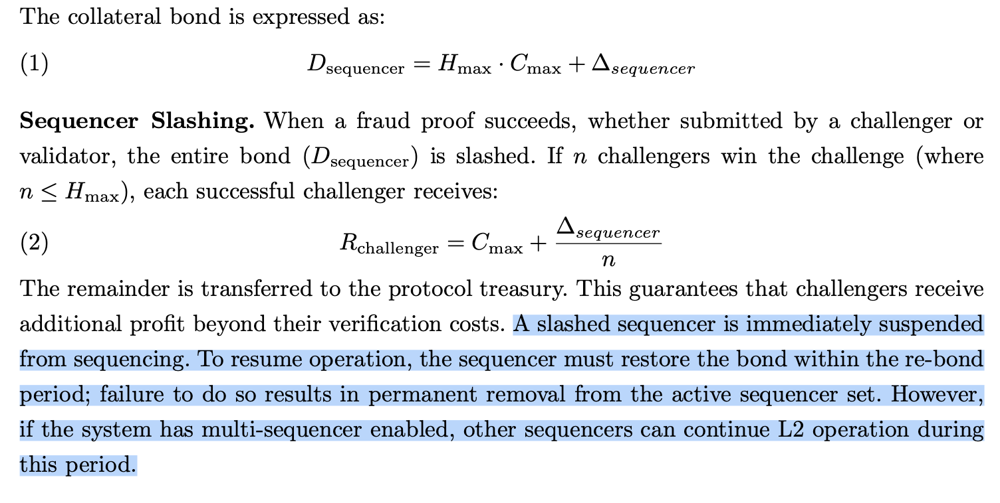

    - Bernard: Good point. As you pointed out, my original intent was that if collateral is forfeited, the sequencer loses the right to perform sequencing. I hadn't considered seigniorage eligibility separately. I assumed these would naturally be linked, but we need to confirm whether revoking all qualifications is correct and what the precise timing should be.
    - Zena: If so, the slashing structure of Layer 2 also needs a more detailed explanation in this whitepaper. The Tokamak Thanos Layer 2, currently developed based on Optimism, is likely to be upgraded based on Optimism.
Optimism was designed to allow withdrawals only when the Layer 2 rollup is fully confirmed through the Dispute game.
As far as I know, there is currently no slashing mechanism that can halt Layer 2 rollups in optimism.
So, according to the whitepaper above, does the TRH team need to develop a module that suspends rollups from Optimism?
    - Bernard: Thank you for letting me know. I need to discuss with @suhyeon Lee  what additional elements to include in the slashing mechanism, including seigniorage eligibility. Detailed implementation discussions will be followed after the whitepaper is finalized, but we will consider the details you've shared.
    - Jason: @Unknown @suhyeon Lee Following up on **Q15** regarding Sequencer Slashing: The whitepaper states that a slashed sequencer is immediately suspended and removed.
In a single-sequencer setup (which is likely for early-stage L2s), suspending the sole sequencer effectively means **halting the entire L2 network**. If the sequencer is removed, who processes the transactions during the re-bonding or replacement period?

Does the protocol define a **'Fallback Mechanism'** (e.g., an emergency sequencer committee or L1-forced inclusion) to ensure L2 liveness and user withdrawals while the main sequencer is suspended? Without this, a slashing event becomes a single point of failure for the entire chain.
    - Bernard: Thank you for your comment. I’ve been checking this in response to Q11, that was the similar issue but would happen to validators. I understand that the current version of the whitepaper is too simple to cover every corner case, therefore it should be discussed to prevent somewhat intended, malicious behaviors by users.

[Resolved] Q16. How Are Rewards Distributed When the Number of Validators Exceeds Hₘₐₓ?
    - Thomas: The $H_{max}$ value is set as a fixed constant by the DAO protocol. The $C_{max}$ value can be determined by calculating the gas cost of the actual function call. First, I'm curious if this is correct. 
If so, the following question arises: If the $H_{max}$ value is 10 and there are actually 5 validators, the reward would be $R_{total} = 5 \cdot C_{max} + \Delta_{sequencer}$ and the remainder would be transferred to the treasury. However, I'm curious what happens if there are 50 validators. They should also receive rewards, but in that case, the $D_{sequencer}$ value would be $(10 \cdot C_{max}) + \Delta_{sequencer}$ while the reward value could grow to $R_{total} = 50 \cdot C_{max} + \Delta_{sequencer}$.
    - Bernard: Oh, $H_{max}$ is not the number of validators, that is the maximum number of challengers who can win in a challenge by submitting fault proof. We are allowing multiple winners in the whitepaper.
    - Thomas: Thank you. So, in the case where $H_{max}$ is 10, only 10 validators can receive rewards as challengers, even if there are 100 validators? @Unknown 
    - Bernard: Good question, as far as I know we don’t have a plan to reward validators that have found faulty state roots. This is because they are permissioned validators and will be already compensated by TON seignorage. On the other hand, challengers are who voluntarily submits faulty state proofs to us, they are permissionless and not compensated by the seignorage. Sequencer’s deposit is set under a theoretical assumption that there can be a many winners who deserves the rewards and reimburses the gas fees, but in reality, I hardly expect there can be many winners like 10s or something. At maximum, I expect two or three winners in the same epoch. Therefore, there should be no issue even if we set it as not too high numbers.
    - Thomas: Thanks, @Unknown! So, Permissioned Validators are responsible for challenging invalid state transitions, but they receive no specific rewards for this act because they already receive seigniorage for acting as validators. To account for potential failures in their operation, a permissionless challenge layer is introduced to enhance external monitoring. Essentially, this system addresses the verifier's dilemma by creating a strong reward incentive for anyone to intervene, thereby ensuring two-tiered security for L2. Is this understanding correct?
    - Bernard: Yes basically right, but there is one more thing, in Tokamak Network, it is three-layered, not two. There is an RAT to monitor validators and guarantee their attentiveness. It slashs validator’s collateral if a validator was proven to be not duly participating in a validation process. Therefore, we can say that the validators are under penalty-based deterrence, not incentive-based deterrence. This is the difference between permissionless challengers and permissioned validators.

Q18. If a sequencer is suspended in a single sequencer environment by slashing, how can the impact on users (such as dapp users)? A multi-sequencer was proposed as a way to ensure liveness through failover. So who runs for it, and is there an incentive to cover the cost of waiting during idle time?
Bernard: Good question. Actually we don’t have a specific plan for the failover. It’s still open-problem for now. You can refer to the answer to Q15: I’ve been checking this in response to Q11, that was the similar issue but would happen to validators. I understand that the current version of the whitepaper is too simple to cover every corner case, therefore it should be discussed to prevent somewhat intended, malicious behaviors by users.

Theo: Thanks, Bernard. Even if the sequencing subject changes due to slashing, it is necessary to discuss and add a method that minimizes the impact on users or networks. In this case, the quality of the white paper can be greatly improved. Please share if you need any help during the discussion.

Bernard: Thank you for the advice. We'll make a decision on this issue soon, keeping that perspective in mind.

Theo: Okay. Thanks a lot. Please it marked “Resolved”.

Q19. What exactly does it mean when sequencer is suspended in sequencing at the on-chain level? (Actually, we cannot physically stop op-node, op-geth to prevent block creation here.)
Bernard: Great question. There is no way to physically stop the sequencer's node from running. Instead, we control state root submission at the L1 contract level. In the Tokamak model, like Optimism did, L2 proposers are permissioned, so we can block submissions from slashed sequencers through proposer authorization checks and bond requirements.

Theo: Now Thanos stack supports functions that change sequencer and batcher address at the L1 contract level. ([SystemConfig.setUnsafeBlockSigner](https://github.com/tokamak-network/tokamak-thanos/blob/main/packages/tokamak/contracts-bedrock/src/L1/SystemConfig.sol#L325), [SystemConfig.setBatcherHash](https://github.com/tokamak-network/tokamak-thanos/blob/main/packages/tokamak/contracts-bedrock/src/L1/SystemConfig.sol#L340)) For executing these functions, it requires signature/execution between the owners of `SystemOwnerSafe`. Here, `SystemOwnerSafe` is a multisig that has ownership rights of L1 contracts. (I don't know if we can automate Safe transaction flow to the system.) 
One concern is that `SystemOwnerSafe` is implemented as 3 of 3 multi-sig by current design (One of owner is sequencer). Actually It was set up to maximize security and protect other participants in the TokamakDAO ecosystem. **But when the slashing logic goes in, we need to change it to 2 of 3 multi-sig structure to prepare for deadlock.** The multi-sig ownership structure will be discussed internally by TRH team. 

Bernard: The discussion on whether to or not to immediately halt the sequencer's operation is still ongoing. Regardless of how this is decided, it doesn't seem right to require the sequencer's signature in situations where the sequencer could potentially be replaced. Therefore, changing to a 2/3 multisig seems to be the correct short-term solution. Thank you for your valuable input!

Theo: Thank you for the discussion. I will let you know the update of multi-signature structure. We can leave any comments on that [thread](https://tokamak-network.slack.com/archives/C06UKCF86TE/p1766205209644709). Please it marked “Resolved”.
- **Validator Deposits**
[Resolved] Q1. **Discussion on Validator Minimum Deposit Logic**
[https://tokamak-network.slack.com/archives/C07JU6K4KDY/p1765175047104509?thread_ts=1764803071.215619&cid=C07JU6K4KDY](https://tokamak-network.slack.com/archives/C07JU6K4KDY/p1765175047104509?thread_ts=1764803071.215619&cid=C07JU6K4KDY)

    1. **Topic**
    - Discussion on the operational implications of the validator minimum deposit formula (D_validator = (c_m × N) / π_a + Δ_validator) presented in the whitepaper, specifically regarding **additional deposit requirements** for existing validators when the number of validators increases.

**2. Key Discussion Points**

    - **Zena's Concern:**
      - According to the formula, as the number of validators (N) increases, the minimum deposit (D_validator) also rises.
      - Raised concerns about whether existing validators must constantly top up their stake in real-time to maintain eligibility and avoid disqualification.
    - **Bernard's Clarification:**
      - The formula represents the **theoretical rationale**, not a rule for dynamic real-time updates.
      - By setting a sufficient margin for **Δ_validator**, we can use a fixed value, avoiding the need for frequent adjustments based on validator count.
    - **Zena's Follow-up (Safeguards & Economics):**
      - Even with a margin, theoretical under-collateralization risks exist. Proposed implementing **monitoring view functions** and **mandatory self-check guidelines** for validators.
      - **Economic Trade-off:** Pointed out that setting Δ_validator too high increases the minimum entry barrier and significantly raises the **slashing risk** (potential penalty) for validators.
    - **Operational Efficiency Discussion:**
      - **Bernard:** Suggested applying deposit updates at **regular intervals** (aligned with performance measurement) for efficiency, rather than real-time dynamic changes.
      - **Zena:** Countered that seigniorage updates (updateSeigniorage) can be irregular since they are permissionless. Concluded that **event-based monitoring ("Validator Added" event)** is the most practical approach for validators to check their eligibility.

**3. Conclusion & Next Steps**

    - Agreed to consider the Δ_validator margin during contract development.
    - Zena will proceed with implementing **monitoring logic** and establishing **operational guidelines** to handle potential deposit shortfalls effectively.
- **Validator Slashing.**
[Resolved][Updated] Q11. Validator collateral 


    - When conducting an attention test in RAT, the development process first deducts the collateral of the verifier who completed the attention test, and then restores the deducted collateral when the verifier submits evidence.
    - I'd like to double-check whether it's appropriate to deduct the entire collateral of a verifier for each attention test.
    - If so, a verifier who has received an attention test cannot function as a verifier until he submits an proof evidence, as they lack sufficient collateral.
    - Suhyeon: This is an obvious mistake. @Zena Thanks. @Unknown Can you revise this desciption?
    - Bernard: Yes, I revised the whitepaper to reflect the above. Now validators maintain sufficient deposits to cover potential slashing. I didn’t include the development process cause I thought it’s too specific, and I specified that this is to allow validators to continue functioning. Then I realized that someone can point out that this is not consistent with the sequencer case (Yes, I know this is actually different from the sequencer case). Should I include the specific reason in the whitepaper?
    - Zena: I have confirmed white paper V2. Thank you for letting us know.

## 2.2. L2 Gas

## 2.3. DAO Governance as a Utility of TON

# 3. Seigniorage

## 3.1. Sustainable Growth of Layer 2

[Resolved][Updated] Q5. Is there a way to cover the L1 Ether amount without selling TON? What is the flexible fee policies ? 
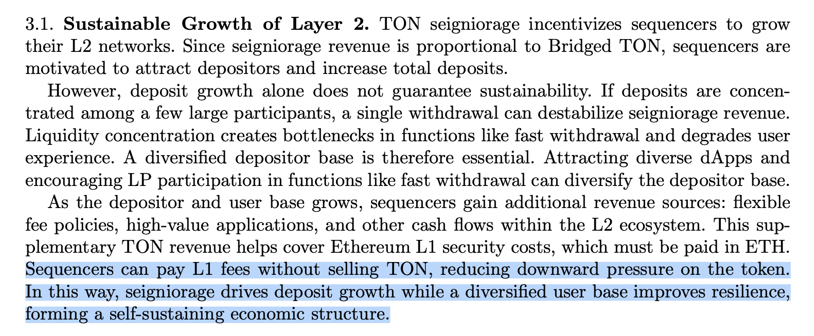

  - Bernard: That content comes from the "L2 fee token dilemma" in the previous whitepaper. The original intent of that part was: if sufficient TON fees are generated through TON utility fees, net buying pressure on TON will be maintained even if L2 sequencers sell TON to pay L1 fees. It seems that section should be clarified to avoid confusion.
  - Zena: Now I understand the exact context. thank you

## 3.2. Seigniorage Generation

## 3.3. Seigniorage Distribution: TON Staking V3

[Resolved] Q2. How do I calculate the time-weight average of the staking amount and bridged TON on-chain? @Unknown @suhyeon Lee
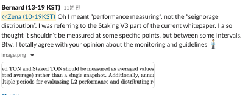

  - Bernard: TWAP itself is not an issue (like Uniswap V2 TWAP), but performing TWAP in on-chain contracts for multiple L2s would be impractical considering computational complexity and gas costs. Implementing an off-chain oracle integrated with a data aggregator would likely be more efficient.
  - Zena: I'm against implementing an off-chain oracle, I think it would be great if everything were implemented on-chain. Specifically, how would I achieve this? Implementation would likely be possible only if the formula for calculating the time-weighted average of bridged and staked TON, as shown below, was clarified.
    - If the Bridged TON measurement method is Time-Weighted Average, then a function is needed to determine the current time-weighted average of bridged TON in the TRH core. 
    -  If the Staked TON measurement method is Time-Weighted Average, then a function is needed to determine the current time-weighted average of Staked TON in the ECO Simple staking.
  - Bernard: I haven't implemented it myself so I am very cautious about this, but as I mentioned in the answer to Q7, wouldn't it be possible to use an approach that only updates the cumulative value on each staking/bridging event?
  - Suhyeon: @Zena @Unknown We will remove time-weighted average here because we seigniorage will be updated manually like the current TON staking. Then, participants will update it time by time then autonomously the result will approach to the time-weighted average. This appoach was discussed with Kevin.
  - Zena: Okay. Thank you for checking.

[Resolved] Q8. Can you provide a mechanism for gradual changes to seigniorage to prevent mass unstaking by stakers?
Full question. Currently, seigniorage is provided based on staking volume, and more than 25% of the total TON supply is staked for seigniorage. If the system were to be changed based on this whitepaper, a large amount of staked TON would be released into the market, potentially having a devastating impact on the TON price. To prevent this, the company stated that the seigniorage method should be gradually changed. Can you provide a mechanism for gradual changes to seigniorage to prevent mass unstaking by stakers?

  - Bernard : This is a difficult problem. If there are changes to seigniorage distribution, existing stakers may exit. Personally, I think LST (Liquid Staking Token) is needed as a response to this. If something like reTON were introduced, stakers could liquidate their assets without unstaking. If the TON ecosystem looks attractive enough, they could also bridge reTON or the remaining assets from selling reTON back into L2. I'm not pretty sure, but I guess Kevin mentioned Lido (stETH) in the Staking V3 meeting. However, while this may be a necessary task in the long term, there are likely many implementation difficulties and considerations to address.
  - Zena: It seems likely that the above-mentioned plans should be included in the appendix to the white paper. If stakers see the white paper, they may be very sensitive to the above-mentioned issues.

Suhyeon: This is an important issue. I'm not sure how we gradually change V2 to V3 but this promise should be mentioned in the whitepaper. 

  - Zena:  If we add the seigniorage issuance part that was previously given to existing stakers to the white paper formula, as shown below, if we issue seigniorage as before (staker's share + additional distribution) and distribute the remaining amount according to the white paper formula, it will be easier to gradually transition from V2 to V3. If we prepare strategic guidelines in advance on how α and r below will change based on certain market conditions and how to gradually reduce the APY of existing stakers, I believe that we will be able to realize the contents of the white paper in line with the growth rate of Tokamak L2 without causing a shock to the market according to that guide.
```shell
### 1.3 V3 Seigniorage Distribution Flow (including transition mechanism)

```
updateSeigniorage() When calling - the integrated distribution formula:

═══════════════════════════════════════════════════════════════
Sequential distribution in the entire seigniorage A
═══════════════════════════════════════════════════════════════

A (entire seigniorage)
│
├─► Step 1: Stakeholder stake seigniorage (α applied)
│   S_staked = α · A · (S / T)
│   - S: Total staking amount 
│   - T: TON total supply
│   - S/T: Staking ratio
│   - α: Equity seigniorage ratio (later reduced from 1 to 0)
│
│   A₁ = A - S_staked (1st residual)
│
├─► Step 2: Additional staker signoria (r applied)
│   S_relative = A₁ · r
│   - r: relativeSeigRate (Existing V2 parameters, first reduced from 1 t│        o 0)
│
│   A₂ = A₁ - S_relative (2nd residual = V3 distribution resources)
│
└─► Step 3: V3 Distribution (White Paper Formula Applied)
    │
    ├─► DAO Fixed Distribution (White Paper Formula 7):
    │   S_DAO = d · A₂
    │
    ├─► L2 Distributable Amount:
    │   L = (1 - d) · A₂
    │
    ├─► Check the eligibility requirements (White Paper Formula 8):
    │   Each L2_i: S_i ≥ θ · B_i ?
    │
    ├─► Valid Bridged TON (White Paper Formulas 9, 10):
    │   B̃_i = 1_i · B_i
    │   x = Σ B̃_i
    │
    ├─► Hyperbolic saturation function (White Paper Equation 11):
    │   y(x) = L · (x / (k + x))
    │
    ├─► L2 Seigniorage (White Paper Formula 12):
    │   Seig_i = y(x) · (B̃_i / x)
    │
    ├─► Sequencer/Validator Distribution (White Paper Formula 13):
    │   o_i = (1 - α_v) · Seig_i    // Sequencer
    │   v_total = α_v · y(x)        // Validator Pool
    │
    └─► Undistributed DAO Attribution:
        Undistributed = L - y(x)
        totalDAO = S_DAO + Undistributed

═══════════════════════════════════════════════════════════════
Variable Description
═══════════════════════════════════════════════════════════════

A  : Total period seigniorage (total amount to be issued)
A₁ : The remaining amount after distributing staker stake seigniorage (S_staked)
A₂ : The remaining amount after distributing the staker's additional seigniorage (S_relative)
     → V3 distributed resources (DAO + L2 sequencer + validator)

═══════════════════════════════════════════════════════════════
mathematical expression
═══════════════════════════════════════════════════════════════

S_staked   = α · A · (S / T)
A₁         = A - S_staked
           = A · (1 - α · S/T)

S_relative = A₁ · r
A₂         = A₁ - S_relative
           = A₁ · (1 - r)
           = A · (1 - α · S/T) · (1 - r)

═══════════════════════════════════════════════════════════════
When V3 is fully converted(α = 0, r = 0)
═══════════════════════════════════════════════════════════════

α = 0 → S_staked = 0 (No equity seigniorage for stakers)
r = 0 → S_relative = 0 (No additional seigniorage for stakers)

∴ Distribute nothing to stakers

A₂ = A · (1 - 0) · (1 - 0) = A
→ All seigniorage is distributed according to the White Paper V3 formula.

═══════════════════════════════════════════════════════════════
Example of distribution by transition stage
═══════════════════════════════════════════════════════════════

Conversion principle: r (additional seigniorage) decreases first → α (equity seigniorage) decreases later

assumption : W/T = 0.5

| phase | α | r | S_staked | S_relative | A₂ (V3) |
|------|---|---|----------|------------|---------|
| V2   | 1.0 | 0.4 | 0.5A   | 0.2A       | 0.3A    |
| phase 1 | 1.0 | 0.2 | 0.5A   | 0.1A       | 0.4A    |
| phase 2 | 1.0 | 0.0 | 0.5A   | 0          | 0.5A    |
| phase 3 | 0.5 | 0.0 | 0.25A  | 0          | 0.75A   |
| V3   | 0.0 | 0.0 | 0      | 0          | A (100%)|
```
  - Bernard : I agree with @Zena 's suggestion to have shock-absorbing parameters for phased transition. However, I'm asking out of curiosity - is it correct that in the final stage, α = 0 and r = 0, meaning seigniorage to L1 stakers becomes completely zero? It is only an example, isn't it? If that's the case, I think informing people about the final stage from the beginning could cause some shock.
  - Zena: According to the whitepaper (pdf) , there is no seigniorage for stakers. This is the state where α = 0 and r = 0. If the whitepaper above is implemented, there will ultimately be no seigniorage for stakers.

Q-3-3-3. Jason: According to equation (12), L2 seigniorage is proportional to Bridged TON:
`Si = y(x) · (B̃i / x)`

However, L1 security costs (data availability and settlement fees paid in ETH) are proportional to transaction volume and data size, not TVL. This creates a fundamental misalignment:

**Scenario A**: L2 with 10M Bridged TON, 10 tx/sec

  - High seigniorage revenue
  - Low L1 costs
  - **Net positive**

**Scenario B**: L2 with 1M Bridged TON, 1000 tx/sec

  - Low seigniorage revenue
  - High L1 costs
  - **Net negative (unsustainable)**

This incentive structure encourages sequencers to maximize idle capital (TVL) rather than actual usage, which contradicts the stated goal of "Sustainable Growth of Layer 2" (Section 3.1).

**Questions**:

  1. How does the whitepaper reconcile this misalignment between seigniorage (TVL-based) and operational costs (usage-based)?
  1. Shouldn't seigniorage incorporate transaction volume or L1 cost metrics to properly incentivize active L2s?
  1. What prevents sequencers from optimizing for TVL inflation over genuine ecosystem utility?

@Unknown @suhyeon Lee 

  - Bernard: Good point. Although it is not explicitly stated in the whitepaper, tokens in reserve contribute significantly to token price through reduced circulating supply. The current staking system operates on the same principle. While there could be L2s that only deposit funds without activity, these are extreme cases. Furthermore, active L2s attract users and naturally increase Bridged TON, so we expect TVL and activity to correlate over the long term.
  - Suhyeon: @Unknown explained this very well. This can be considered as acknowledged trade-off. This is an idea based on this discussion ([Gemini note](https://docs.google.com/document/d/14plP7QsL5Q2l3uKHK9RzD7o2TqXu_KvkyGw_pfNbKKA/edit?tab=t.hfdd4be5jcso)) @Jason How do you think?

### 3.3.1. TON staking V3

- **Core Tokenomics Rules. **
Q7.  In order to aggregate the total valid Bridged TON of eligible L2s, a transaction verifying this must be called every time a deposit/withdrawal is made to an L2.
    - Bernard: I think a separate verification transaction is not required. If we really need to calculate Bridged TON on-chain, we could update the cumulative value together with each bridge event.
    - Zena: According to the whitepaper, a sequencer must stake a minimum stake amount to be considered a valid L2.`1_i = { 1 if S_i ≥ θ · B_i
         { 0 otherwise`How can we simultaneously(on-chain) verify the eligibility of all L2 sequencers (assuming there are 1,000 L2s) at the time of seigniorage issuance?
    - Bernard: I'm still careful about this issue, but maybe we can check eligibility acquisition on staking events and eligibility loss on unstaking events? However, synchronizing bridging events with eligibility parameters seems overly complex. Some parameters may need to be evaluated only as snapshots at the evaluation period. @suhyeon Lee, I need your opinion on this issue.
    - Suhyeon: We can calculate it upon seigniorage is generated like the TON staking V2 seigniorage mechanism. If operators call seigniorage generation function often, the seigniorage will be generate approximately proportional to bridged TON.
- **Seigniorage Allocation and Distribution.**
[Resolved][Updated] Q13.  If v_i = (α/n) · y(x), then if n is 0, then v_i becomes 0. Then, an amount equal to the verifier distribution ratio will remain undivided.
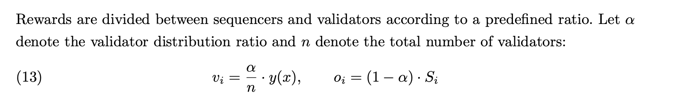

    - Zena: How should a Layer 2 without validators handle the unpaid seigniorage?
    - Bernard: Likewise in the answer to Q14, I believe that we need to confirm which system model we will use first: shared validators set or roll-up specific validators. If we choose to use a roll-up specific model or a hybrid one, we need to consider the question. We will basically have two options: 1) hand it over to the sequencer’s portion, or 2) forfeit it as some incentive/penalty to facilitate a validators option.
    - Suhyeon: In my opinion, we’d be better off sending it to the DAO treasury as locked-up supply. Otherwise, I can’t think of any other use that really deserves this seigniorage. How do you think @Zena?
    - Zena: The white paper is missing that part, so it would be a good idea to add the information you explained.
    - Bernard: Okay, I will reflect it to the whitepaper. Thanks, falks.

[Resolved][Updated] Q14:  White Paper V2, Page 16, Equations (12) and (13):
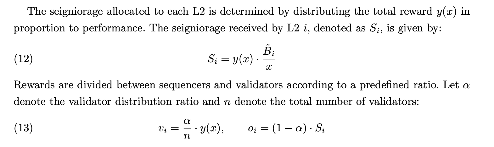

    - Zena : **Question**: In Equation (13), v_i uses y(x), but it's unclear whether this represents the global y(x) or the L2-specific S_i.
`(12) S_i = y(x) · (B̃_i / x)  => Seigniorage of L2`

`(13) v_i = (α/n) · y(x), o_i = (1 - α) · S_i`

Two interpretations:

      1. Current interpretation: v_i = (α/n) · y(x) → Equal distribution across all y(x)
        - All validators receive the same reward
      1. Alternative interpretation: v_i = (α/n) · S_i → Distribution across L2-specific S_i
        - Validator rewards vary depending on L2 performance

Looking at Figure 3 (page 16) of the white paper:

L2 Sequencers and L2 Validators are shown to receive rewards from the same TVL_i interval.

This figure shows that validators also receive rewards based on L2-specific performance.

Then, it seems more accurate to express equation (13) as follows:

`v_i = (α/n) · S_i, o_i = (1 - α) · S_i`
    - Bernard: I think I need @suhyeon Lee  confirmation on this. My understanding was that at least for validators, assuming a shared validator set, rewards are distributed equally based on L2 performance. For sequencers, I believe unequal distribution is correct, but this also needs to be confirmed.
    - Suhyeon: Thanks for pointing it out. @Zena  It should be porportional to the stake of validators. Even if we set it as equal distribution, validators will register multiple accounts for seigniorage efficiency. Then, finally, it’ll be same with the proportional distribution. Then, we should correct the expression to reflect the propotional distribution or we can mention the proportional distribution in the implementation but it’s written with the equal distribution for simplicity in understanding. @Unknown How do you think?
    - Zena:  If this is evenly distributed, even if I verify 10 layers, I will receive the same seigniorage as a validator verifying a single layer. This seems like a somewhat unfair incentive structure. Since validators could initially choose to verify specific layers, I believe even distribution could lead to unfair incentives. Was I mistaken in interpreting this as allowing validators to choose specific layers?
    - Bernard: Proportional seigniorage distribution based on stake is also a good idea to prevent Sybil incentives. However, the whitepaper currently only mentions collateral deposits for slashing, without separate mention of validator staking. Should we add this?
    - Zena: It's not a staking-based seigniorage distribution. As mentioned in the whitepaper, I mentioned distribution based on Layer 2 TON TVL (Layer 2 performance). Since the seigniorage for each layer is already determined based on Layer 2 performance, shouldn't this received seigniorage of Layer2 be distributed equally among the validators validating that layer ( not even distributed seigniorage totally y(x), just even distributed  the layer2 seigniorage) ?
    - Bernard: Okay, falks. I was a bit confused because of the terms like “staked” and “layers.” Anyways, actually we were considering to include mapping between validators/validator sets and L2s/L2 sets even if we choose to allow shared validator sets. In this sense, I basically agree with that validators should received their reward based on their workload since a validator/validator set designated to a larger L2s will have more workload. 
Formula should be refined, and in addition, we need to consider normalization rules for simplify mapping between validators and L2s. For example, we can enforce them to make groups and map theirselves mutually exclusive when group matching is required. Then we will need formula some like this, for seignorage $S_i$ given to L2 set $i$ and validator set $V_i$ allocated to L2 set $i$, the seignorage portion rewarded to validator $v_j $ is: $v_j = \sum_{i:\, j \in V_i} \frac{\alpha \cdot S_i}{|V_i|}$.
Sybil incentive still exits even under a proportional model, however our model is not a consensus model basically and we have RAT to prevent their intended inattentiveness. Great discussion, as always.
    - Suhyeon: Thanks for great discussion. I agree with the correction proposed by @Unknown 
    - Zena: Thank you for explaining it in detail and explaining your plans for the future.

## **References**

[Resolved] Q10. At what point in the RAT system does the attention test event occur?   Can a sequencer(proposer) run an attention test when generating a dispute game? We'll create an interface that allows the Optimism L2 proposer to add a trigger to run an attention test when generating a Dispute game. We can also request that TRH follow these guidelines.
  - Suhyeon: I don’t get the question. Can you explain more easily? The RAT’s timing is random. 
  - Zena: When developing the RAT, the RAT's attention test trigger was triggered when the proposer started the dispute game. Should this remain the same? I asked for confirmation because it wasn't mentioned in the whitepaper. If this is correct, I will create a guide for TRH to implement this feature when developing Challenger.
  - Suhyeon: I think the description “RAT is triggered when a proposer starts a dispute game” can bring some misunderstanding. Your RAT mechanism relied on OP Stack’s specific implementation. You know it’s not really a dispute game started in a general meaning. In my opinion, we better not to mention OP’s specific context. But for implmentation level, to give a guide for TRH will be considerate.
  - Zena: Yes, I understand. I'll make a guide for integration with TRH and external Layer 2 during implementation.

[Resolved] Q12. The 2026 ECO Roadmap identifies a separate Shared Validator sector.
Looking at the whitepaper development, if validators are designed to be registered by Layer 2 for Staking V3 development, is a separate Shared Validator sector needed in the roadmap? What additional developments are needed in this sector? @suhyeon Lee @Unknown 
  - [roadmap](/2c0d96a400a3809ea354ebc84a6f8a93) : 
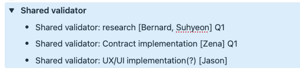
  - LLM specification: [link](https://github.com/tokamak-network/ton-staking-v2/blob/ton-staking-v3/draft-llm/docs/for-llm-kr/04_validator.md#11-systemconfig%EB%B3%84-%EA%B2%80%EC%A6%9D%EC%9E%90-%EB%93%B1%EB%A1%9D)  In TON V3, since multiple L2s exist, validators **register individually for specific L2s (SystemConfigs)**.
  - Bernard: The updated whitepaper clearly specifies that Tokamak L2 will support a shared validator set, that was updated recently, though. Even so, I don’t think that we need a separate section for “Shared validators”. We can make it just “validators”, or merge it with a larger category like Stating V3.


  - Zena: @Jason I don't think a separate "Shared Validators" section is needed in the roadmap. It seems like it should be a part of the Staking V3 architecture.

# OLD —  I've reorganized the questions below according to the table of contents above. Please refer to the article above. [Q1~Q15]

Q1. **Discussion on Validator Minimum Deposit Logic**
[https://tokamak-network.slack.com/archives/C07JU6K4KDY/p1765175047104509?thread_ts=1764803071.215619&cid=C07JU6K4KDY](https://tokamak-network.slack.com/archives/C07JU6K4KDY/p1765175047104509?thread_ts=1764803071.215619&cid=C07JU6K4KDY)

  1. **Topic**
  - Discussion on the operational implications of the validator minimum deposit formula (D_validator = (c_m × N) / π_a + Δ_validator) presented in the whitepaper, specifically regarding **additional deposit requirements** for existing validators when the number of validators increases.

**2. Key Discussion Points**

  - **Zena's Concern:**
    - According to the formula, as the number of validators (N) increases, the minimum deposit (D_validator) also rises.
    - Raised concerns about whether existing validators must constantly top up their stake in real-time to maintain eligibility and avoid disqualification.
  - **Bernard's Clarification:**
    - The formula represents the **theoretical rationale**, not a rule for dynamic real-time updates.
    - By setting a sufficient margin for **Δ_validator**, we can use a fixed value, avoiding the need for frequent adjustments based on validator count.
  - **Zena's Follow-up (Safeguards & Economics):**
    - Even with a margin, theoretical under-collateralization risks exist. Proposed implementing **monitoring view functions** and **mandatory self-check guidelines** for validators.
    - **Economic Trade-off:** Pointed out that setting Δ_validator too high increases the minimum entry barrier and significantly raises the **slashing risk** (potential penalty) for validators.
  - **Operational Efficiency Discussion:**
    - **Bernard:** Suggested applying deposit updates at **regular intervals** (aligned with performance measurement) for efficiency, rather than real-time dynamic changes.
    - **Zena:** Countered that seigniorage updates (updateSeigniorage) can be irregular since they are permissionless. Concluded that **event-based monitoring ("Validator Added" event)** is the most practical approach for validators to check their eligibility.

**3. Conclusion & Next Steps**

  - Agreed to consider the Δ_validator margin during contract development.
  - Zena will proceed with implementing **monitoring logic** and establishing **operational guidelines** to handle potential deposit shortfalls effectively.

Q2. How do I calculate the time-weight average of the staking amount and bridged TON on-chain? @Unknown @suhyeon Lee 


  - Bernard: TWAP itself is not an issue (like Uniswap V2 TWAP), but performing TWAP in on-chain contracts for multiple L2s would be impractical considering computational complexity and gas costs. Implementing an off-chain oracle integrated with a data aggregator would likely be more efficient.
  - Zena: I'm against implementing an off-chain oracle, I think it would be great if everything were implemented on-chain. Specifically, how would I achieve this? Implementation would likely be possible only if the formula for calculating the time-weighted average of bridged and staked TON, as shown below, was clarified.
    - If the Bridged TON measurement method is Time-Weighted Average, then a function is needed to determine the current time-weighted average of bridged TON in the TRH core. 
    -  If the Staked TON measurement method is Time-Weighted Average, then a function is needed to determine the current time-weighted average of Staked TON in the ECO Simple staking.
  - Bernard: I haven't implemented it myself so I am very cautious about this, but as I mentioned in the answer to Q7, wouldn't it be possible to use an approach that only updates the cumulative value on each staking/bridging event?
  - Suhyeon: @Zena @Unknown We will remove time-weighted average here because we seigniorage will be updated manually like the current TON staking. Then, participants will update it time by time then autonomously the result will approach to the time-weighted average. This appoach was discussed with Kevin.
  - Zena: Okay. Thank you for checking.

Q3. Liquidity providers have an incentive to validate L2, but how can they react to any signs of misbehavior? @suhyeon Lee @Unknown 
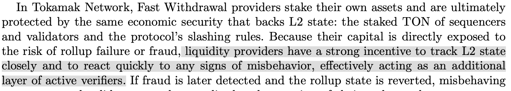

  - Bernard: If you are referring to fast withdrawal LPs, Tokamak L2's FW LPs are not fundamentally different from others. It is difficult to detect misbehavior in advance, and for incidents that have already occurred, they rely on the fraud proof system. Instead, FW LPs rationalize the fee structure to match long-term profitability based on incident rates. Hopefully, if Tokamak's validator system including RAT is well established, a very low incident rate can be achieved, enabling low-fee fast withdrawals.
  - Suhyeon: Please, refer my answer to Q4.
  - Zena: Thank you for letting us know.

Q4. In section 1.3.2 Fast Withdrawal, it seems like liquidity providers for fast withdrawals share the collateral when a sequencer is slashed. However, in section 2.1.1. Sequencer Deposits, the slashing formula seems to only apply to validators.
Does this mean that since liquidity providers are clearly a factor in becoming validators, they can share the collateral when a sequencer is slashed?
In other words, does this mean that even liquidity providers who don't become validators can't receive collateral from a sequencer's slashing? @suhyeon Lee @Unknown 
  - Suhyeon: It doesn’t have any specific plan. It’ll be left like this and I expect Kevin will give guidance. 
  - Zena: Thank you for letting us know.

Q5. Is there a way to cover the L1 Ether amount without selling TON? What is the flexible fee policies ? 


  - Bernard: That content comes from the “L2 fee token dilemma" in the previous whitepaper. The original intent of that part was: if sufficient TON fees are generated through TON utility fees, net buying pressure on TON will be maintained even if L2 sequencers sell TON to pay L1 fees. It seems that section should be clarified to avoid confusion.
  - Zena: Now I understand the exact context. thank you

Q6. Bridged TON includes TON that has been requested for withdrawal from L2 to L1 and is pending withdrawal. This amount is included. Does this only represent the TON representing L2 TVL after subtracting this amount? Does this also include TON pending withdrawal?
  - Bernard: That part is too specific for the whitepaper, but there should clearly be a defined standard. For example, looking at L2BEAT's case ([Link](https://medium.com/l2beat/redefining-total-value-locked-for-l2s-756160602747)), they use the total amount locked through bridge smart contracts as their basis. Therefore, pending withdrawals would be included. However, since this is a matter of definition, if we feel this standard overestimates the amount locked in L2, we could choose to exclude it.
  - Zena: If this part becomes more specific in the future and the quantity awaiting withdrawal needs to be excluded, you will need to notify the TRH team. Currently, there is no interface for counting the amount of TON pending withdrawal, so this needs to be developed. Thank you.
  - Suhyeon: We should include the pending withdrawal cause of 2 reasons:
1. Including the pending withdrawal will make implementation simple
2. Logically, the pending withdrawal is in the state of deposit. 

Q7.  In order to aggregate the total valid Bridged TON of eligible L2s, a transaction verifying this must be called every time a deposit/withdrawal is made to an L2.
  - Bernard: I think a separate verification transaction is not required. If we really need to calculate Bridged TON on-chain, we could update the cumulative value together with each bridge event.
  - Zena: According to the whitepaper, a sequencer must stake a minimum stake amount to be considered a valid L2.
`1_i = { 1 if S_i ≥ θ · B_i
         { 0 otherwise`

How can we simultaneously(on-chain) verify the eligibility of all L2 sequencers (assuming there are 1,000 L2s) at the time of seigniorage issuance?
  - Bernard: I’m still careful about this issue, but maybe we can check eligibility acquisition on staking events and eligibility loss on unstaking events? However, synchronizing bridging events with eligibility parameters seems overly complex. Some parameters may need to be evaluated only as snapshots at the evaluation period.

Q8. Currently, seigniorage is provided based on staking volume, and more than 25% of the total TON supply is staked for seigniorage. If the system were to be changed based on this whitepaper, a large amount of staked TON would be released into the market, potentially having a devastating impact on the TON price. To prevent this, the company stated that the seigniorage method should be gradually changed. Can you provide a mechanism for gradual changes to seigniorage to prevent mass unstaking by stakers?
  - Bernard : This is a difficult problem. If there are changes to seigniorage distribution, existing stakers may exit. Personally, I think LST (Liquid Staking Token) is needed as a response to this. If something like reTON were introduced, stakers could liquidate their assets without unstaking. If the TON ecosystem looks attractive enough, they could also bridge reTON or the remaining assets from selling reTON back into L2. I'm not pretty sure, but I guess Kevin mentioned Lido (stETH) in the Staking V3 meeting. However, while this may be a necessary task in the long term, there are likely many implementation difficulties and considerations to address.
  - Zena: It seems likely that the above-mentioned plans should be included in the appendix to the white paper. If stakers see the white paper, they may be very sensitive to the above-mentioned issues.

Suhyeon: This is an important issue. I’m not sure how we gradually change V2 to V3 but this promise should be mentioned in the whitepaper. 


  - Zena:  If we add the seigniorage issuance part that was previously given to existing stakers to the white paper formula, as shown below, if we issue seigniorage as before (staker's share + additional distribution) and distribute the remaining amount according to the white paper formula, it will be easier to gradually transition from V2 to V3. If we prepare strategic guidelines in advance on how α and r below will change based on certain market conditions and how to gradually reduce the APY of existing stakers, I believe that we will be able to realize the contents of the white paper in line with the growth rate of Tokamak L2 without causing a shock to the market according to that guide.
```shell

### 1.3 V3 Seigniorage Distribution Flow (including transition mechanism)

```
updateSeigniorage() When calling - the integrated distribution formula:

═══════════════════════════════════════════════════════════════
Sequential distribution in the entire seigniorage A
═══════════════════════════════════════════════════════════════

A (entire seigniorage)
│
├─► Step 1: Stakeholder stake seigniorage (α applied)
│   S_staked = α · A · (S / T)
│   - S: Total staking amount 
│   - T: TON total supply
│   - S/T: Staking ratio
│   - α: Equity seigniorage ratio (later reduced from 1 to 0)
│
│   A₁ = A - S_staked (1st residual)
│
├─► Step 2: Additional staker signoria (r applied)
│   S_relative = A₁ · r
│   - r: relativeSeigRate (Existing V2 parameters, first reduced from 1 t│        o 0)
│
│   A₂ = A₁ - S_relative (2nd residual = V3 distribution resources)
│
└─► Step 3: V3 Distribution (White Paper Formula Applied)
    │
    ├─► DAO Fixed Distribution (White Paper Formula 7):
    │   S_DAO = d · A₂
    │
    ├─► L2 Distributable Amount:
    │   L = (1 - d) · A₂
    │
    ├─► Check the eligibility requirements (White Paper Formula 8):
    │   Each L2_i: S_i ≥ θ · B_i ?
    │
    ├─► Valid Bridged TON (White Paper Formulas 9, 10):
    │   B̃_i = 1_i · B_i
    │   x = Σ B̃_i
    │
    ├─► Hyperbolic saturation function (White Paper Equation 11):
    │   y(x) = L · (x / (k + x))
    │
    ├─► L2 Seigniorage (White Paper Formula 12):
    │   Seig_i = y(x) · (B̃_i / x)
    │
    ├─► Sequencer/Validator Distribution (White Paper Formula 13):
    │   o_i = (1 - α_v) · Seig_i    // Sequencer
    │   v_total = α_v · y(x)        // Validator Pool
    │
    └─► Undistributed DAO Attribution:
        Undistributed = L - y(x)
        totalDAO = S_DAO + Undistributed

═══════════════════════════════════════════════════════════════
Variable Description
═══════════════════════════════════════════════════════════════

A  : Total period seigniorage (total amount to be issued)
A₁ : The remaining amount after distributing staker stake seigniorage (S_staked)
A₂ : The remaining amount after distributing the staker's additional seigniorage (S_relative)
     → V3 distributed resources (DAO + L2 sequencer + validator)

═══════════════════════════════════════════════════════════════
mathematical expression
═══════════════════════════════════════════════════════════════

S_staked   = α · A · (S / T)
A₁         = A - S_staked
           = A · (1 - α · S/T)

S_relative = A₁ · r
A₂         = A₁ - S_relative
           = A₁ · (1 - r)
           = A · (1 - α · S/T) · (1 - r)

═══════════════════════════════════════════════════════════════
When V3 is fully converted(α = 0, r = 0)
═══════════════════════════════════════════════════════════════

α = 0 → S_staked = 0 (No equity seigniorage for stakers)
r = 0 → S_relative = 0 (No additional seigniorage for stakers)

∴ Distribute nothing to stakers

A₂ = A · (1 - 0) · (1 - 0) = A
→ All seigniorage is distributed according to the White Paper V3 formula.

═══════════════════════════════════════════════════════════════
Example of distribution by transition stage
═══════════════════════════════════════════════════════════════

Conversion principle: r (additional seigniorage) decreases first → α (equity seigniorage) decreases later

assumption : W/T = 0.5

| phase | α | r | S_staked | S_relative | A₂ (V3) |
|------|---|---|----------|------------|---------|
| V2   | 1.0 | 0.4 | 0.5A   | 0.2A       | 0.3A    |
| phase 1 | 1.0 | 0.2 | 0.5A   | 0.1A       | 0.4A    |
| phase 2 | 1.0 | 0.0 | 0.5A   | 0          | 0.5A    |
| phase 3 | 0.5 | 0.0 | 0.25A  | 0          | 0.75A   |
| V3   | 0.0 | 0.0 | 0      | 0          | A (100%)|
```
  - Bernard : I agree with @Zena 's suggestion to have shock-absorbing parameters for phased transition. However, I'm asking out of curiosity - is it correct that in the final stage, α = 0 and r = 0, meaning seigniorage to L1 stakers becomes completely zero? It is only an example, isn’t it? If that's the case, I think informing people about the final stage from the beginning could cause some shock.
  - Zena: According to the whitepaper (pdf) , there is no seigniorage for stakers. This is the state where α = 0 and r = 0. If the whitepaper above is implemented, there will ultimately be no seigniorage for stakers.

Q9: Sequencer Slashing (9 page):
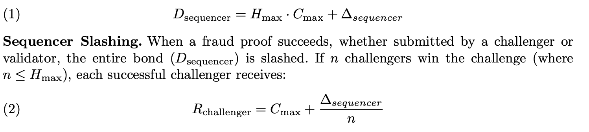

  - Zena: When slashing a sequencer's collateral and transferring it to another party, it is recommended to transfer it as a staked amount.
The reason is  that there is a two-week withdrawal period for staked amounts.
However, withdrawing the staked amount to another party without this withdrawal period raises concerns about malicious use.
Therefore, I recommend that challengers keep the sequencer's collateral in a staked form, and we also require that the DAO be transferred as a staked amount.
  - Suhyeon: Suhyeon, that’s a valid point. @Zena , I don’t think the whitepaper itself specifies the form of the reward given to a challenger. This description also covers the case where the reward is staked.
  - Zena: Thank you for checking.

---

  - **Thomas:** The $H_{max}$ value is set as a fixed constant by the DAO protocol. The $C_{max}$ value can be determined by calculating the gas cost of the actual function call. First, I'm curious if this is correct. 

If so, the following question arises: If the $H_{max}$ value is 10 and there are actually 5 validators, the reward would be $R_{total} = 5 \cdot C_{max} + \Delta_{sequencer}$ and the remainder would be transferred to the treasury. However, I'm curious what happens if there are 50 validators. They should also receive rewards, but in that case, the $D_{sequencer}$ value would be $(10 \cdot C_{max}) + \Delta_{sequencer}$ while the reward value could grow to $R_{total} = 50 \cdot C_{max} + \Delta_{sequencer}$.

Q10. At what point in the RAT system does the attention test event occur?   Can a sequencer(proposer) run an attention test when generating a dispute game? We'll create an interface that allows the Optimism L2 proposer to add a trigger to run an attention test when generating a Dispute game. We can also request that TRH follow these guidelines.
  - Suhyeon: I don’t get the question. Can you explain more easily? The RAT’s timing is random. 
  - Zena: When developing the RAT, the RAT's attention test trigger was triggered when the proposer started the dispute game. Should this remain the same? I asked for confirmation because it wasn't mentioned in the whitepaper. If this is correct, I will create a guide for TRH to implement this feature when developing Challenger.

Q11. Validator collateral 
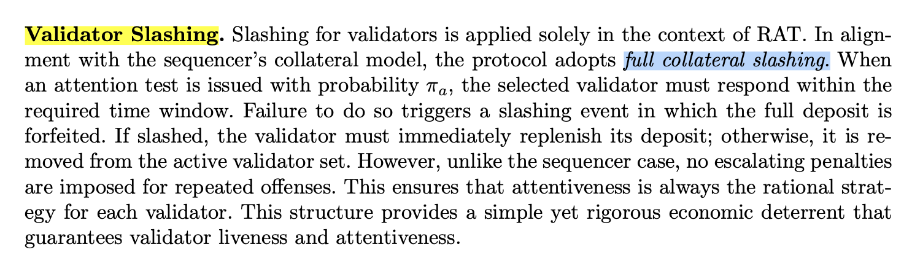

  - When conducting an attention test in RAT, the development process first deducts the collateral of the verifier who completed the attention test, and then restores the deducted collateral when the verifier submits evidence.
  - I'd like to double-check whether it's appropriate to deduct the entire collateral of a verifier for each attention test.
  - If so, a verifier who has received an attention test cannot function as a verifier until he submits an proof evidence, as they lack sufficient collateral.
  - Suhyeon: This is an obvious mistake. @Zena Thanks. @Unknown Can you revise this desciption?
  - Bernard: Yes, I revised the whitepaper to reflect the above. Now validators maintain sufficient deposits to cover potential slashing. I didn’t include the development process cause I thought it’s too specific, and I specified that this is to allow validators to continue functioning. Then I realized that someone can point out that this is not consistent with the sequencer case (Yes, I know this is actually different from the sequencer case). Should I include the specific reason in the whitepaper?
  - Zena: I have confirmed white paper V2. Thank you for letting us know.
  - 

Q12. The 2026 ECO Roadmap identifies a separate Shared Validator sector.
Looking at the whitepaper development, if validators are designed to be registered by Layer 2 for Staking V3 development, is a separate Shared Validator sector needed in the roadmap? What additional developments are needed in this sector? @suhyeon Lee @Unknown
  - [roadmap](/2c0d96a400a3809ea354ebc84a6f8a93) : 

  - LLM specification: [link](https://github.com/tokamak-network/ton-staking-v2/blob/ton-staking-v3/draft-llm/docs/for-llm-kr/04_validator.md#11-systemconfig%EB%B3%84-%EA%B2%80%EC%A6%9D%EC%9E%90-%EB%93%B1%EB%A1%9D)  In TON V3, since multiple L2s exist, validators **register individually for specific L2s (SystemConfigs)**.
  - Bernard: The updated whitepaper clearly specifies that Tokamak L2 will support a shared validator set, that was updated recently, though. Even so, I don’t think that we need a separate section for “Shared validators”. We can make it just “validators”, or merge it with a larger category like Stating V3.

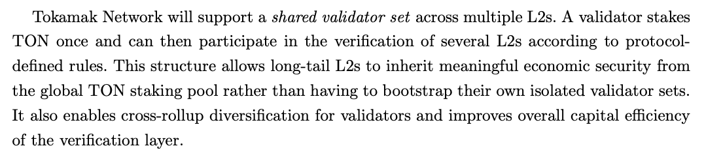

  - Zena: @Jason I don't think a separate "Shared Validators" section is needed in the roadmap. It seems like it should be a part of the Staking V3 architecture.

Q13.  If v_i = (α/n) · y(x), then if n is 0, then v_i becomes 0. Then, an amount equal to the verifier distribution ratio will remain undivided.


  - Zena: How should a Layer 2 without validators handle the unpaid seigniorage?
  - Bernard: Likewise in the answer to Q14, I believe that we need to confirm which system model we will use first: shared validators set or roll-up specific validators. If we choose to use a roll-up specific model or a hybrid one, we need to consider the question. We will basically have two options: 1) hand it over to the sequencer’s portion, or 2) forfeit it as some incentive/penalty to facilitate a validators option.

Q14:  White Paper V2, Page 16, Equations (12) and (13):


  - Zena : **Question**: In Equation (13), v_i uses y(x), but it's unclear whether this represents the global y(x) or the L2-specific S_i.
`(12) S_i = y(x) · (B̃_i / x)  => Seigniorage of L2`

`(13) v_i = (α/n) · y(x), o_i = (1 - α) · S_i`

Two interpretations:

    1. Current interpretation: v_i = (α/n) · y(x) → Equal distribution across all y(x)
      - All validators receive the same reward
    1. Alternative interpretation: v_i = (α/n) · S_i → Distribution across L2-specific S_i
      - Validator rewards vary depending on L2 performance

Looking at Figure 3 (page 16) of the white paper:

L2 Sequencers and L2 Validators are shown to receive rewards from the same TVL_i interval.

This figure shows that validators also receive rewards based on L2-specific performance.

Then, it seems more accurate to express equation (13) as follows:

`v_i = (α/n) · S_i, o_i = (1 - α) · S_i`
  - Bernard: I think I need @suhyeon Lee  confirmation on this. My understanding was that at least for validators, assuming a shared validator set, rewards are distributed equally based on L2 performance. For sequencers, I believe unequal distribution is correct, but this also needs to be confirmed.
  - Suhyeon: Thanks for pointing it out. @Zena  It should be porportional to the stake of validators. Even if we set it as equal distribution, validators will register multiple accounts for seigniorage efficiency. Then, finally, it’ll be same with the proportional distribution. Then, we should correct the expression to reflect the propotional distribution or we can mention the proportional distribution in the implementation but it’s written with the equal distribution for simplicity in understanding. @Unknown How do you think?
  - Zena:  If this is evenly distributed, even if I verify 10 layers, I will receive the same seigniorage as a validator verifying a single layer. This seems like a somewhat unfair incentive structure. Since validators could initially choose to verify specific layers, I believe even distribution could lead to unfair incentives. Was I mistaken in interpreting this as allowing validators to choose specific layers?
  - Bernard: Proportional seigniorage distribution based on stake is also a good idea to prevent Sybil incentives. However, the whitepaper currently only mentions collateral deposits for slashing, without separate mention of validator staking. Should we add this?
  - Zena: It's not a staking-based seigniorage distribution. As mentioned in the whitepaper, I mentioned distribution based on Layer 2 TON TVL (Layer 2 performance). Since the seigniorage for each layer is already determined based on Layer 2 performance, shouldn't this received seigniorage of Layer2 be distributed equally among the validators validating that layer ( not even distributed seigniorage totally y(x), just even distributed  the layer2 seigniorage) ?
  - Bernard: Okay, falks. I was a bit confused because of the terms like “staked” and “layers.” Anyways, actually we were considering to include mapping between validators/validator sets and L2s/L2 sets even if we choose to allow shared validator sets. In this sense, I basically agree with that validators should received their reward based on their workload since a validator/validator set designated to a larger L2s will have more workload. 
Formula should be refined, and in addition, we need to consider normalization rules for simplify mapping between validators and L2s. For example, we can enforce them to make groups and map theirselves mutually exclusive when group matching is required. Then we will need formula some like this, for seignorage $S_i$ given to L2 set $i$ and validator set $V_i$ allocated to L2 set $i$, the seignorage portion rewarded to validator $v_j $ is: $v_j = \sum_{i:\, j \in V_i} \frac{\alpha \cdot S_i}{|V_i|}$.
Sybil incentive still exits even under a proportional model, however our model is not a consensus model basically and we have RAT to prevent their intended inattentiveness. Great discussion, as always.

Q15.  Slashed sequencers will have their staked collateral forfeited.
This means they no longer qualify for seigniorage, as they no longer meet the minimum eligibility requirements. **This does not affect L2 sequencing. **You can re-collateralize later to meet the minimum eligibility requirements and receive seigniorage again.
**However, the whitepaper states that L2 sequencing will be suspended. It also states that collateral must be restored within the re-bonding period or they will be permanently removed from the active sequencer set.
I'd like to confirm whether this needs further development.**


  - Bernard: Good point. As you pointed out, my original intent was that if collateral is forfeited, the sequencer loses the right to perform sequencing. I hadn't considered seigniorage eligibility separately. I assumed these would naturally be linked, but we need to confirm whether revoking all qualifications is correct and what the precise timing should be.
  - Zena: If so, the slashing structure of Layer 2 also needs a more detailed explanation in this whitepaper. The Tokamak Thanos Layer 2, currently developed based on Optimism, is likely to be upgraded based on Optimism.
Optimism was designed to allow withdrawals only when the Layer 2 rollup is fully confirmed through the Dispute game.
As far as I know, there is currently no slashing mechanism that can halt Layer 2 rollups in optimism.
So, according to the whitepaper above, does the TRH team need to develop a module that suspends rollups from Optimism?
  - Bernard: Thank you for letting me know. I need to discuss with @suhyeon Lee  what additional elements to include in the slashing mechanism, including seigniorage eligibility. Detailed implementation discussions will be followed after the whitepaper is finalized, but we will consider the details you've shared.