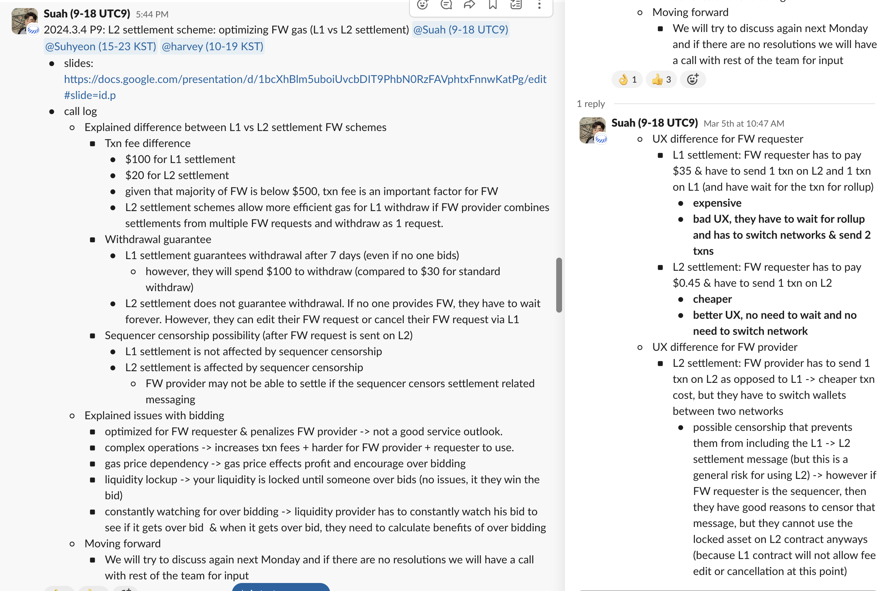
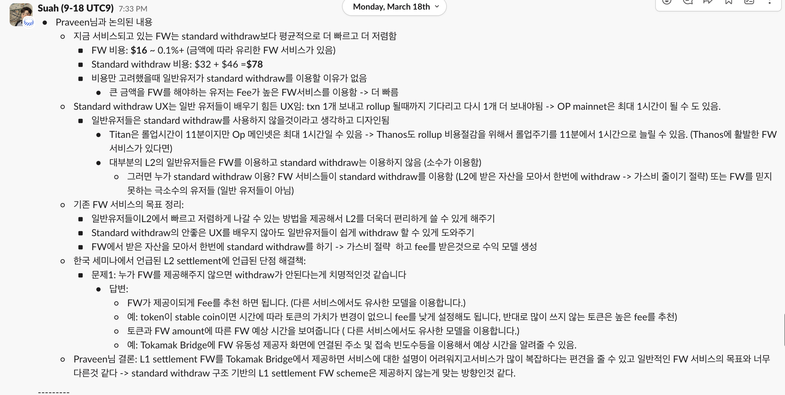
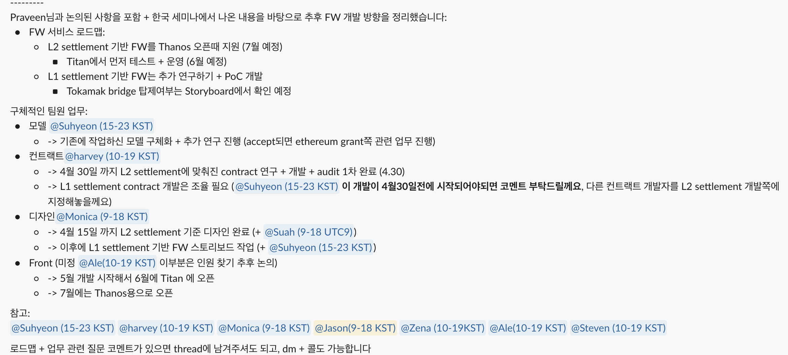
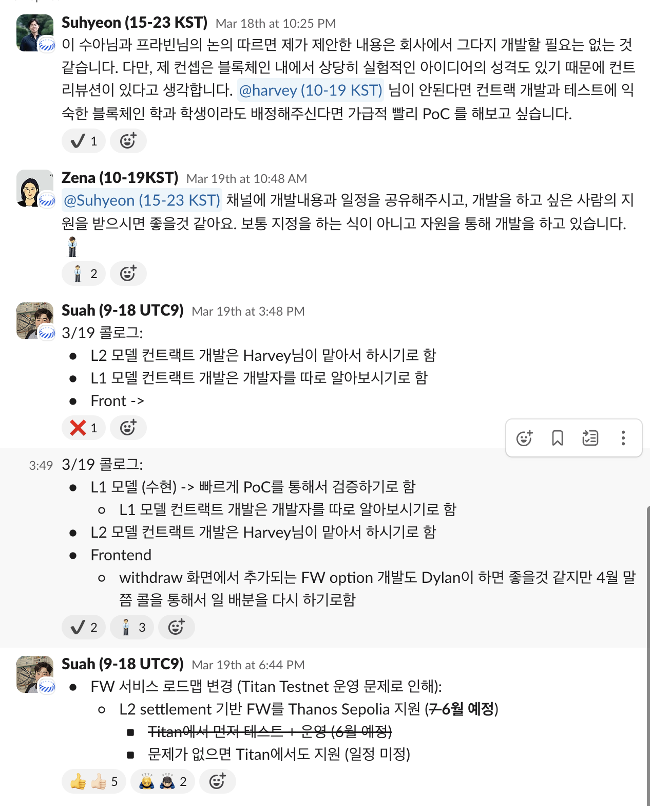
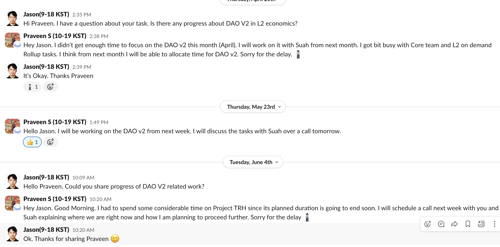
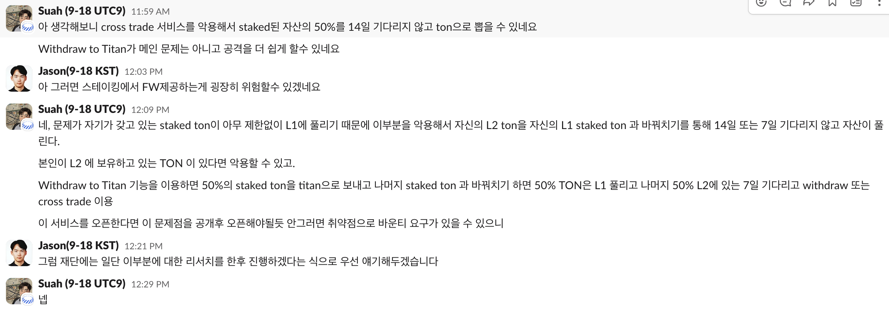
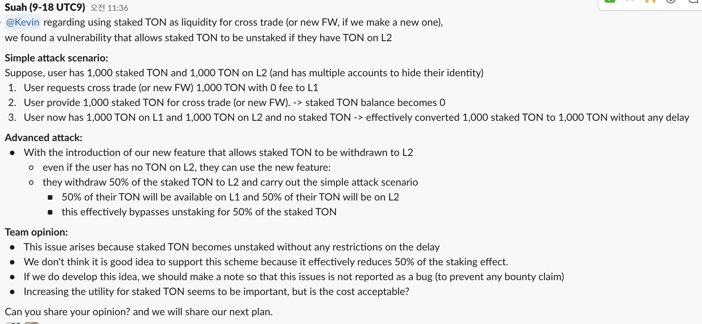

# 1. **Project Overview**

- **Annual Goals: **Launch Staking V2 & DAO V2

---

# 2. **Summary of Delayed Decisions**

| **Quarter** | **Task** | **Decision** | **Delay Duration** | **Cause** | **Decision Maker** |
| --- | --- | --- | --- | --- | --- |
| In Q1 | Staking V2 | Change FW Modeling | 2 Months | High gas cost,  | **Suah, Suhyeon, 
**Harvey, Parveen  |
| In Q2 | DAO V2 | Less progress | 3 Months | Lack of human resource | **Praveen**, Jason |
| In Q3 | Staking V2 | Suspend provide FW liquidity from staking | not decided(It can be stopped) | It has security issue | **Suah, Jason, **Zena |

---

# 3. **Analysis of Decision Causes**

### **Cause 1:** Change FW Modeling

- The L1 settlement model, which was researched in Q1 had a critical issue. If someone does not provide liquidity, FW will not happen. 
- And gas costs are too high(about $100 for L1 settlement vs about $30 for L2 settlement)
- L1 settlement modeling was finished but we changed the FW model to L2 settlement. And it causes a delay.
- L2 settlement FW is implemented in project BEE.
- **Decision-making evidence:** [video link](https://drive.google.com/file/d/1ZAX9ZXEeychmHGiTYWvRoTbW2KNCrQD6/view), [slide](https://docs.google.com/presentation/d/1bcXhBlm5uboiUvcbDIT9PhbN0RzFAVphtxFnnwKatPg/edit#slide=id.p)

### **Cause 2:**  Lack of Human Resource

- In Q2, One of the team members, who was in charge of modeling DAO took part in too many projects (Core Team, TRH). So, there is less progress in Q2.
- We expect we can open DAO V2 this year. Currently, our goal is to open DAO V2 in Q1, 2025
- **Decision-making evidence**

### Cause 3: Suspend Implementation Staking-Based FW

- We have plan to implement the Staking-based FW model. However, we found a vulnerability in the model.
- **Simple attack scenario: **Suppose, user has 1,000 staked TON and 1,000 TON on L2 (and has multiple accounts to hide their identity)
  1. User requests cross trade (or new FW) 1,000 TON with 0 fee to L1
  1. User provide 1,000 staked TON for cross trade (or new FW). -> staked TON balance becomes 0
  1. User now has 1,000 TON on L1 and 1,000 TON on L2 and no staked TON -> effectively converted 1,000 staked TON to 1,000 TON without any delay
- **Advanced attack:**
  - With the introduction of our new feature that allows staked TON to be withdrawn to L2
    - even if the user has no TON on L2, they can use the new feature:
    - they withdraw 50% of the staked TON to L2 and carry out the simple attack scenario
      - 50% of their TON will be available on L1 and 50% of their TON will be on L2
      - this effectively bypasses unstaking for 50% of the staked TON
- If we don’t consider it. It could be a attack point.
- So we postponed about it.
- **Decision-making evidence:** 

