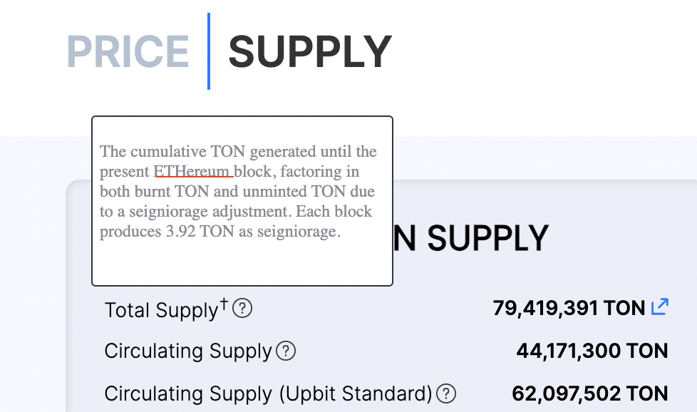
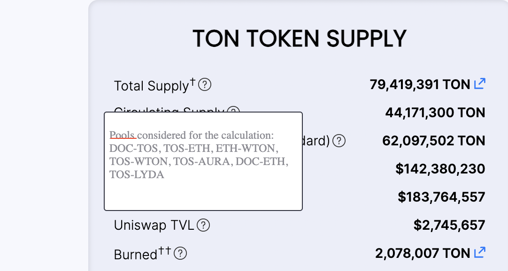

## Test site:

- [https://pricedashboard-v2.vercel.app/](https://pricedashboard-v2.vercel.app/)

## Design file: 

- [https://www.figma.com/file/mWxAX7DaXChDTCVKpRZWT6/Price-Dashboard?type=design&node-id=261-430&mode=design&t=xKXT1GfCBxsR4I0F-4](https://www.figma.com/file/mWxAX7DaXChDTCVKpRZWT6/Price-Dashboard?type=design&node-id=261-430&mode=design&t=xKXT1GfCBxsR4I0F-4)

## Test List:

- UI Check
- Data Check
- General Feedback/Suggestions for improvement

## Comments

Kevin
- [ ] 

Jaden

Suah
- [ ] Mobile version check
- [x] Decimal checks → I don’t think we need to show decimal places (don’t round up, just cut) 
- [x] Circulating supply is incorrect → should be around 43,130,753 TON, same as C1
- [x] Market Cap tooltip? how is this calculated?
- [x] Circulating supply (upbit standard) tooltip require more information on how it is calculated
- [x] FDV tooltip? how is this calculated? 
- [x] the equations used in tooltips → please match the names as the listed on page so that the users can easily calculate them themselves. 
- [ ] tooltip ⇒ can we make it so that it is more like a popup ? rather than hover and show, make it click based? 
- [x] Uniswap tvl tooltip → token names should be capitalized 
- [x] tooltip on Vested → at the end there is a mention of block number, replace that part with time 2023.12.26 5:00:00 [GMT+09:00](https://www.epochconverter.com/timezones?q=1703534400) 

Praveen
- [x] Update the tool tip message of FDV : Fully Diluted Valuation =  Total Supply * Price per TON

- [x] Update the formula for C1 like this : C1 = Total Supply - DAO Vault - Staked - Vested

- [x] For the tool tip message of Circulating Supply(Upbit Standard), add the formula, Circulating Supply (Upbit Standard) = Total Supply - DAO Vault - Vested

- [x] Spelling mistake : Replace ETHereum to Ethereum

- [x] Update the formula on the tooltip for Circulating supply like  : Circulating Supply = Total Supply - DAO Vault - Staked - Vested

- [x] Replace “Pools” with “Uniswap V3 Pools”

- [x] Remove †† from Burned Parameter 

- [x] Remove space between C1 and ? (Tooltip)

 

- [x] Replace  “Dune Dashboard”  with “Buy TOS” and give link : [https://tokamaknetwork.gitbook.io/home/03-information/buy-tos](https://tokamaknetwork.gitbook.io/home/03-information/buy-tos)

- [x] Update the Buy TON link : [https://tokamaknetwork.gitbook.io/home/03-information/buy-ton](https://tokamaknetwork.gitbook.io/home/03-information/buy-ton)

Ethan

Ryan
- [ ] Update fonts with the correct weight, Tool Tip hover Box: White container, no border, 20px padding on all sides, size 14pt font, bold heading, add drop shadow to hover box. 
- [ ] Bold Title, Apply hover effect to title, Change TOS logo to have white circle, Add padding to values, bold KRW values.