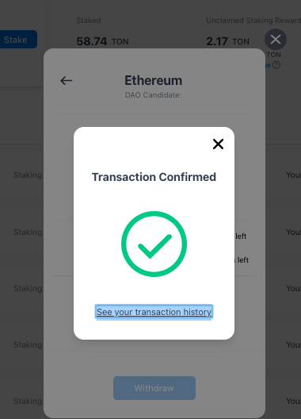
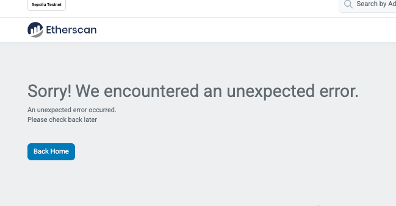

- Sepolia simple staking web   
  - old version: [https://sepolia.staking.tokamak.network](https://sepolia.staking.tokamak.network/)
  - upgraded version (v2.5): [Simple Staking - Tokamak](https://simple-staking-v2-git-feat-v25-tokamak-network.vercel.app/staking)

[Simple Staking - Tokamak](https://simple-staking-v2-one.vercel.app/staking)

Repo :  [https://github.com/tokamak-network/ton-staking-v2/tree/deploy-4th-sepolia](https://github.com/tokamak-network/ton-staking-v2/tree/deploy-4th-sepolia)

- Sepolia ERC20 
c4f0547b-d7c5-406f-8763-2978e8de89a1 
- Sepolia Simple Staking Contracts 
  - 0ef21581-cb54-4875-b2c9-19593dbc8325 
  - b4f734dd-4f19-4e75-b2ca-f815934ee317 
- Thanos-Sepolia Network 
  - 3e04fb22-aad4-4e89-91ae-4c4df0ced626 

# Web 

 [https://sepolia.staking.tokamak.network/home](https://sepolia.staking.tokamak.network/home)

# Repo : 

[GitHub - tokamak-network/ton-staking-v2 at deploy-5th-sepolia](https://github.com/tokamak-network/ton-staking-v2/tree/deploy-5th-sepolia)

# (1) [Zena] Initialize the storage 

sepolia 리허설때만 하는 작업임. 메인넷에서는 할 필요가 없다. 

- L2 타이탄 sepolia 조회하기 
  - Layer2Manager.rollupConfigInfo ( 0x6eF61974A3CDa7BbD0a4DD0A613f56d211c8AfDC)
    - **status ***uint8 ***: **1
    - **operatorManager ***address ***: **[0x8d5400c38f4F8145F88783efd28776cac3e3FCd8](https://sepolia.etherscan.io/address/0x8d5400c38f4F8145F88783efd28776cac3e3FCd8)
- 아젠다 등록하기 

`npx hardhat run scripts/layer2-sepolia/5.agenda_initialize_storage.js --network sepolia`

- dao 멤버들이 투표하기 : 컨트랙에서 직접 실행 
- 아젠다 실행하기 : 컨트랙에서 직접 실행 
- 초기화 상태 확인하기 
  - `5.agenda_initialize_storage.js` 파일에서 
await proposeAgenda_rejectCandidateAddOn() 라인을 주석으로 막고 실행 

`npx hardhat run scripts/layer2-sepolia/5.agenda_initialize_storage.js --network sepolia`

```javascript

const main = async () => {
    // await proposeAgenda_rejectCandidateAddOn()
    // await executeAgenda("36")
    await view()
}

==== view ===== 
deployer  0xc1eba383D94c6021160042491A5dfaF1d82694E6
layer2Manager 0x0000000000000000000000000000000000000000
l1BridgeRegistry 0x0000000000000000000000000000000000000000
layer2StartBlock BigNumber { value: "0" }
l2RewardPerUint BigNumber { value: "0" }
totalLayer2TVL BigNumber { value: "0" }
```
- 설정 초기화 하고, L2 타이탄 sepolia 조회하기 
  - Layer2Manager.rollupConfigInfo ( 0x6eF61974A3CDa7BbD0a4DD0A613f56d211c8AfDC)
    - **status ***uint8 ***: 2 ⇒ 변경된것 확인됨. **
    - **operatorManager ***address ***: **[0x8d5400c38f4F8145F88783efd28776cac3e3FCd8](https://sepolia.etherscan.io/address/0x8d5400c38f4F8145F88783efd28776cac3e3FCd8)

# (2) [Jason] Check TON Staking web page 

 [https://sepolia.staking.tokamak.network/home](https://sepolia.staking.tokamak.network/home)

- Stake 동작확인 : [https://sepolia.etherscan.io/tx/0xf2df2784ac9ceec82ae1d2bca8150b6a4b68e0db1b793e1e28307da974d6ff28](https://sepolia.etherscan.io/tx/0xf2df2784ac9ceec82ae1d2bca8150b6a4b68e0db1b793e1e28307da974d6ff28)
- Unstake 동작확인 :  [https://sepolia.etherscan.io/tx/0x82063fd73a1892f0de810dd452f6a8d1d0cefdbede35aee71b3586f11e32fe5b](https://sepolia.etherscan.io/tx/0x82063fd73a1892f0de810dd452f6a8d1d0cefdbede35aee71b3586f11e32fe5b)
- Update Seigniorage : [https://sepolia.etherscan.io/tx/0x12351cb93cad5d0fe4b7d8be2725103b7a34371a027f3a8f921c09699208a764](https://sepolia.etherscan.io/tx/0x12351cb93cad5d0fe4b7d8be2725103b7a34371a027f3a8f921c09699208a764)

# (3) [Zena] deploy contracts 

아젠다 생성전에 생성한 컨트랙의 오너를 모두 DAO로 바꿨다. 

`npx hardhat deploy --network sepolia `

```javascript
 deploying "L1BridgeRegistryV1_1" (tx: 0x9b5c72ec9e722d7bbd53b7bff8fdc566ecfa4e30f801cc6da10d517d05517f04)...: deployed at 0x16979Ee40B68Bb0e03a6Fa8cc6fb7f1FCC89ecc4 with 2405573 gas
deploying "L1BridgeRegistryProxy" (tx: 0x78a04b209fde2faa145ad9853e5c67ad5d81914fe8cd584aa578757ba25d7d57)...: deployed at 0x2D47fa57101203855b336e9E61BC9da0A6dd0Dbc with 1979058 gas
deploying "OperatorManagerV1_1" (tx: 0x1c4b5fa8c8f5e7205667e57569ff89dd578b08c175b878e667ffb2421cb4a4f2)...: deployed at 0x48f60aAf60D5E162b2DebFD4F70c88fE01b7c331 with 1247734 gas
deploying "OperatorManagerFactory" (tx: 0xf09df6a85352887e8754b39d50385a58af3e2bfddec69532c79c7848b783e4d7)...: deployed at 0xEEbFD108e124bFeC9545bDbB32aB7840DBC1872e with 1086529 gas
deploying "CandidateAddOnV1_1" (tx: 0x8375b68170a1b1a535c653d2e9dea6657afdc0a156345baf75ea25551010d276)...: deployed at 0xCB75860cFBe1c4668A1D90d8d6c80c1f2c9C93A4 with 1801036 gas
deploying "CandidateAddOnFactory" (tx: 0xef2ca9f931b7003f04b8662d45140dc01566b6134bca5a24528b2e91ec5b7623)...: deployed at 0xF08360bdF665eCB2B91217E9843bB241b440239a with 2681314 gas
deploying "CandidateAddOnFactoryProxy" (tx: 0xaa5c76b4eb94a4cae709d94d4b4de5e2c2fed020fd16dcc47f465ef9c5a02120)...: deployed at 0xf37493caC8BF8df0bD96146211D93D548d506fb9 with 1489240 gas
deploying "Layer2ManagerV1_1" (tx: 0x3c14525085f6aec0c0bf9c94052bfc0a355b7903c0bcf628b8891db8ba294119)...: deployed at 0xF9d75D5814e1C3D734342bD5Ed0637b9c49c3f69 with 2677767 gas
deploying "Layer2ManagerProxy" (tx: 0xb529fc3b46ff53289d55b818467280bdfde25f21d45b2c24eb9b5f9d8f6664db)...: deployed at 0x58B4C2FEf19f5CDdd944AadD8DC99cCC71bfeFDc with 1577795 gas
deploying "SeigManagerV1_2" (tx: 0xba4687a4fb7cfafa63fc72267f63ed497b56b4f8e688b5e39bc12d1196208723)...: deployed at 0x1039C6b7C4A5920DCf2aD8BBaaB0fb3F02926898 with 5322969 gas
deploying "SeigManagerV1_3" (tx: 0x815d598108011baea3c550f970656e713caa9e9a6f307024fcb622a975b6dfcb)...: deployed at 0x8C29A0C04a6A3dfee84b602fA13CD4A5a764B3dA with 3482067 gas
deploying "DepositManagerV1_1" (tx: 0x7e6898c13bb5839e41daac21c14e87c456d90c708a45ae4129329a45ea982f7a)...: deployed at 0xfd0c0AA6505125eFab34A2195F1b9C99AFE8fB06 with 1853596 gas
deploying "DAOCommitteeProxy2" (tx: 0x8c6bf6a9e942c674cc194b241bcf758946d1323e3f22385ed9826330fca26eec)...: deployed at 0xC74b529Ad06E70fA51CDDAD11857D53E6354523d with 1381834 gas
deploying "DAOCommitteeOwner" (tx: 0x49c8f40d68ea6a0040b8d162549822387a921917ac29d0ad580ae673432923fe)...: deployed at 0xf26D736db6a259AfD93ffDa027b0d7DD9748e3FB with 1983810 gas
deploying "DAOCommittee_V1" (tx: 0xe92a8fec1c4910ba1c7246894e31f3e5a1eb34a79c1f5116b2c9f3711f2e0d46)...: deployed at 0x9Cb6e22A9a551c13159d818D540aE8bE299967fb with 4744974 gas
candidateAddOnFactoryProxy.isAdmin(deployer):  false
candidateAddOnFactoryProxy.isAdmin(DAOCommitteeProxy):  true
operatorManagerFactory.owner():  0xA2101482b28E3D99ff6ced517bA41EFf4971a386
l1BridgeRegistryProxy.isAdmin(deployer):  false
l1BridgeRegistryProxy.isAdmin(DAOCommitteeProxy):  true
l1BridgeRegistryProxy.seigniorageCommittee():  0xA2101482b28E3D99ff6ced517bA41EFf4971a386
layer2ManagerProxy.isAdmin(deployer):  false
layer2ManagerProxy.isAdmin(DAOCommitteeProxy):  true
  
```

# Deployed Addresses 

```javascript
   
 "L1BridgeRegistryV1_1" at 0x16979Ee40B68Bb0e03a6Fa8cc6fb7f1FCC89ecc4
 "L1BridgeRegistryProxy" at  0x2D47fa57101203855b336e9E61BC9da0A6dd0Dbc
 "OperatorManagerV1_1" at 0x48f60aAf60D5E162b2DebFD4F70c88fE01b7c331
 "OperatorManagerFactory" at 0xEEbFD108e124bFeC9545bDbB32aB7840DBC1872e
 "CandidateAddOnV1_1" at 0xCB75860cFBe1c4668A1D90d8d6c80c1f2c9C93A4
 "CandidateAddOnFactory" at ~~0xF08360bdF665eCB2B91217E9843bB241b440239a~~
 0x88F7Fe8eD56300Ec8a3D53d7b806B0223f8e276A
 **"CandidateAddOnFactoryProxy" at 0xf37493caC8BF8df0bD96146211D93D548d506fb9**
 "Layer2ManagerV1_1" at 0xF9d75D5814e1C3D734342bD5Ed0637b9c49c3f69
 "Layer2ManagerProxy" at 0x58B4C2FEf19f5CDdd944AadD8DC99cCC71bfeFDc
 "SeigManagerV1_2" at 0x1039C6b7C4A5920DCf2aD8BBaaB0fb3F02926898
 "SeigManagerV1_3" at  0x8C29A0C04a6A3dfee84b602fA13CD4A5a764B3dA
 "DepositManagerV1_1" at 0xfd0c0AA6505125eFab34A2195F1b9C99AFE8fB06
 "DAOCommitteeProxy2" at 0xC74b529Ad06E70fA51CDDAD11857D53E6354523d
 "DAOCommitteeOwner" at 0xf26D736db6a259AfD93ffDa027b0d7DD9748e3FB
 "DAOCommittee_V1" at 0x9Cb6e22A9a551c13159d818D540aE8bE299967fb
```

```json
"SeigManagerProxy" : 0x2320542ae933FbAdf8f5B97cA348c7CeDA90fAd7
"DepositManagerProxy" : 0x90ffcc7F168DceDBEF1Cb6c6eB00cA73F922956F
DAOCommitteeProxy : 0xA2101482b28E3D99ff6ced517bA41EFf4971a386
DAOAgendaManager : 0x1444f7a8bC26a3c9001a13271D56d6fF36B44f08


TON : 0xa30fe40285b8f5c0457dbc3b7c8a280373c40044
WTON : 0x79e0d92670106c85e9067b56b8f674340dca0bbd
```

```json

Owner1 : "0xf0B595d10a92A5a9BC3fFeA7e79f5d266b6035Ea"
Owner2 : "0x757DE9c340c556b56f62eFaE859Da5e08BAAE7A2"
Owner3 : "0xc1eba383D94c6021160042491A5dfaF1d82694E6"

MulstiSigWallet : "0x413aD34ed87fF3778Fc4B2472C447E25F6ed9b3F"
```

# (4) [Harvey] Propose an agenda for upgrading staking V2 & DAO 

- 아젠다 제출 전 스토리지 확인 
  - DAO
    - `npx hardhat test test/agenda/25.AgendaExecuteStorageCheck-sepolia.js --network sepolia `
    - 실행 전 해당 파일의 execute 변수 false로 세팅
  - TON Staking V2  
[viewAfterPassingAgenda](https://github.com/tokamak-network/ton-staking-v2/blob/b4b9e071e691da7a4380586eb086d854b468089d/scripts/layer2-sepolia/5.agenda_initialize_storage.js#L204-L277) 실행 `npx hardhat run scripts/layer2-sepolia/5.agenda_initialize_storage.js --network sepolia` 
```json

==== viewAfterPassingAgenda ===== 
deployer  0x757DE9c340c556b56f62eFaE859Da5e08BAAE7A2

====== seigManager Storage ================
implementation 0x32Fa7147C4d82c821518B54196de680CA03BfA30
getSelectorImplementation2 (selector_totalSupplyOfTon)  0x32Fa7147C4d82c821518B54196de680CA03BfA30
getSelectorImplementation2 (selector1)  0x1ae2b8a23384e4D76290eF9AE30Edf574D82d991
getSelectorImplementation2 (selector2)  0x1ae2b8a23384e4D76290eF9AE30Edf574D82d991
getSelectorImplementation2 (selector3)  0x32Fa7147C4d82c821518B54196de680CA03BfA30
getSelectorImplementation2 (selector4)  0x32Fa7147C4d82c821518B54196de680CA03BfA30
getSelectorImplementation2 (selector5)  0x32Fa7147C4d82c821518B54196de680CA03BfA30
getSelectorImplementation2 (selector6)  0x32Fa7147C4d82c821518B54196de680CA03BfA30
getSelectorImplementation2 (selector7)  0x32Fa7147C4d82c821518B54196de680CA03BfA30
getSelectorImplementation2 (selector8)  0x32Fa7147C4d82c821518B54196de680CA03BfA30

layer2Manager 0x0000000000000000000000000000000000000000
l1BridgeRegistry 0x0000000000000000000000000000000000000000
layer2StartBlock BigNumber { value: "0" }
l2RewardPerUint BigNumber { value: "0" }
totalLayer2TVL BigNumber { value: "0" }

====== DepositManager Storage ================
getSelectorImplementation2 (selector_setWithdrawalDelay)  0x7E459BC07736f735E3E758fbB740c385FB4d466B
getSelectorImplementation2 (selector_deposit)  0x2d361b25395907a897f62e87A57b362264F36d7a
getSelectorImplementation2 (selector_1)  0xa9d1AaE84f4fF55d72B5f2D71fFAFe99a3F9BdE2
getSelectorImplementation2 (selector_2)  0xa9d1AaE84f4fF55d72B5f2D71fFAFe99a3F9BdE2
getSelectorImplementation2 (selector_3)  0xa9d1AaE84f4fF55d72B5f2D71fFAFe99a3F9BdE2
getSelectorImplementation2 (selector_4)  0xa9d1AaE84f4fF55d72B5f2D71fFAFe99a3F9BdE2
getSelectorImplementation2 (selector_5)  0xa9d1AaE84f4fF55d72B5f2D71fFAFe99a3F9BdE2
getSelectorImplementation2 (selector_6)  0xa9d1AaE84f4fF55d72B5f2D71fFAFe99a3F9BdE2
getSelectorImplementation2 (selector_7)  0xa9d1AaE84f4fF55d72B5f2D71fFAFe99a3F9BdE2
getSelectorImplementation2 (selector_8)  0x2d361b25395907a897f62e87A57b362264F36d7a

layer2Manager 0x0000000000000000000000000000000000000000
l1BridgeRegistry 0x0000000000000000000000000000000000000000
```
- 아젠다 제출  
npx hardhat run scripts/11.createAgenda_on_Sepolia.js --network sepolia

  - tx : [https://sepolia.etherscan.io/tx/0xff454e78031bd41c15a4afe711a5657762fab742e2ef2d2863bbaa2f7f30aba9](https://sepolia.etherscan.io/tx/0xff454e78031bd41c15a4afe711a5657762fab742e2ef2d2863bbaa2f7f30aba9)
    - AgendaCreated id: 43
- 투표 
  - tx : [https://sepolia.etherscan.io/tx/0x2559b8364aa94fc0e0b32175397af7624b4280890f66e8531c28a8afa9acb493](https://sepolia.etherscan.io/tx/0x2559b8364aa94fc0e0b32175397af7624b4280890f66e8531c28a8afa9acb493)
  - tx: [https://sepolia.etherscan.io/tx/0x614a67599589729e1e8c351c4b07c881b03b2611aa030a48b8b3dfca5be8756a](https://sepolia.etherscan.io/tx/0x614a67599589729e1e8c351c4b07c881b03b2611aa030a48b8b3dfca5be8756a)
- 아젠다 실행 
  - tx : [https://sepolia.etherscan.io/tx/0x8b59c53b81ae38d7df277c495ef81b9e516ec86baf772c8fdb146b288513ec4c](https://sepolia.etherscan.io/tx/0x8b59c53b81ae38d7df277c495ef81b9e516ec86baf772c8fdb146b288513ec4c)
- 아젠다 실행후 view : 수정사항 확인 
  - DAO 확인 
    - npx hardhat test test/agenda/25.AgendaExecuteStorageCheck-sepolia.js --network sepolia 
    - 실행 전 해당 파일의 execute 변수 true로 세팅
  - TON Staking V2 확인 
viewAfterPassingAgenda 실행 : `5.agenda_initialize_storage.js` 파일에서  viewAfterPassingAgenda() 만 남기고 모두 주석처리  `npx hardhat run scripts/layer2-sepolia/5.agenda_initialize_storage.js --network sepolia`
```javascript

==== viewAfterPassingAgenda ===== 
deployer  0xc1eba383D94c6021160042491A5dfaF1d82694E6

====== seigManager Storage ================
implementation 0x1039C6b7C4A5920DCf2aD8BBaaB0fb3F02926898
getSelectorImplementation2 (selector_totalSupplyOfTon)  0x1039C6b7C4A5920DCf2aD8BBaaB0fb3F02926898
getSelectorImplementation2 (selector1)  0x8C29A0C04a6A3dfee84b602fA13CD4A5a764B3dA
getSelectorImplementation2 (selector2)  0x8C29A0C04a6A3dfee84b602fA13CD4A5a764B3dA
getSelectorImplementation2 (selector3)  0x8C29A0C04a6A3dfee84b602fA13CD4A5a764B3dA
getSelectorImplementation2 (selector4)  0x8C29A0C04a6A3dfee84b602fA13CD4A5a764B3dA
getSelectorImplementation2 (selector5)  0x8C29A0C04a6A3dfee84b602fA13CD4A5a764B3dA
getSelectorImplementation2 (selector6)  0x8C29A0C04a6A3dfee84b602fA13CD4A5a764B3dA
getSelectorImplementation2 (selector7)  0x8C29A0C04a6A3dfee84b602fA13CD4A5a764B3dA
getSelectorImplementation2 (selector8)  0x8C29A0C04a6A3dfee84b602fA13CD4A5a764B3dA

layer2Manager 0x58B4C2FEf19f5CDdd944AadD8DC99cCC71bfeFDc
l1BridgeRegistry 0x2D47fa57101203855b336e9E61BC9da0A6dd0Dbc
layer2StartBlock BigNumber { value: "8040663" }
l2RewardPerUint BigNumber { value: "0" }
totalLayer2TVL BigNumber { value: "0" }

====== DepositManager Storage ================
getSelectorImplementation2 (selector_setWithdrawalDelay)  0x7E459BC07736f735E3E758fbB740c385FB4d466B
getSelectorImplementation2 (selector_deposit)  0x2d361b25395907a897f62e87A57b362264F36d7a
getSelectorImplementation2 (selector_1)  0xfd0c0AA6505125eFab34A2195F1b9C99AFE8fB06
getSelectorImplementation2 (selector_2)  0xfd0c0AA6505125eFab34A2195F1b9C99AFE8fB06
getSelectorImplementation2 (selector_3)  0xfd0c0AA6505125eFab34A2195F1b9C99AFE8fB06
getSelectorImplementation2 (selector_4)  0xfd0c0AA6505125eFab34A2195F1b9C99AFE8fB06
getSelectorImplementation2 (selector_5)  0xfd0c0AA6505125eFab34A2195F1b9C99AFE8fB06
getSelectorImplementation2 (selector_6)  0xfd0c0AA6505125eFab34A2195F1b9C99AFE8fB06
getSelectorImplementation2 (selector_7)  0xfd0c0AA6505125eFab34A2195F1b9C99AFE8fB06
getSelectorImplementation2 (selector_8)  0xfd0c0AA6505125eFab34A2195F1b9C99AFE8fB06

layer2Manager 0x58B4C2FEf19f5CDdd944AadD8DC99cCC71bfeFDc
l1BridgeRegistry 0x2D47fa57101203855b336e9E61BC9da0A6dd0Dbc
```

# (5)  [Jason] Update TON Staking web page 

- Sepolia DAO Agenda Page [https://sepolia.dao.tokamak.network/#/agenda](https://sepolia.dao.tokamak.network/#/agenda)
  - Agenda Id 43 번이 화면에 표시됨 
- Staking Page 기능이 잘 되어야 한다 . [https://sepolia.staking.tokamak.network/staking](https://sepolia.staking.tokamak.network/staking)
  - Stake 동작확인 : 
    - TON : [https://sepolia.etherscan.io/tx/0x32ab69b14ff822601c152d26059071c60a7a6645f63a1740f10848e3939f45e6](https://sepolia.etherscan.io/tx/0x32ab69b14ff822601c152d26059071c60a7a6645f63a1740f10848e3939f45e6)
    - WTON: [https://sepolia.etherscan.io/tx/0x4228d4194aa59eae3c381e23894f6cd82f58110b9cd4cb1f3ecb72db8c261222](https://sepolia.etherscan.io/tx/0x4228d4194aa59eae3c381e23894f6cd82f58110b9cd4cb1f3ecb72db8c261222)
  - Unstake 동작확인 : [https://sepolia.etherscan.io/tx/0x876012456634febce6dadcf79b1ac8befef130f819cbb077fb985c69388c7dc0](https://sepolia.etherscan.io/tx/0x876012456634febce6dadcf79b1ac8befef130f819cbb077fb985c69388c7dc0)
  - Withdraw 동작확인 : 
  - Update Seigniorage : [https://sepolia.etherscan.io/tx/0x578f3dc13051025b97610777bf05f7ec1e8c87ff73217a0dd873a496fd5bd1a5](https://sepolia.etherscan.io/tx/0x578f3dc13051025b97610777bf05f7ec1e8c87ff73217a0dd873a496fd5bd1a5)

# (6) [Zena] Register Thanos-sepolia on sepolia

## Propose an agenda for  register RollupConfig (Thanos-sepolia) 

By DAO 

# (8) [Zena] Register registerCandidateAddOn (Thanos-sepolia) 

- [approve](https://sepolia.etherscan.io/address/0xa30fe40285b8f5c0457dbc3b7c8a280373c40044#writeContract#F2) 1000.1 TON (1000100000000000000000) to 0x58B4C2FEf19f5CDdd944AadD8DC99cCC71bfeFDc
  - tx :  [https://sepolia.etherscan.io/tx/0x707feef8816670f8a264a1730ff0efc8877eece3b033163546965e183cc116b3](https://sepolia.etherscan.io/tx/0x707feef8816670f8a264a1730ff0efc8877eece3b033163546965e183cc116b3)

"[Layer2ManagerProxy](https://sepolia.etherscan.io/address/0x58B4C2FEf19f5CDdd944AadD8DC99cCC71bfeFDc#readProxyContract)" at **0x58B4C2FEf19f5CDdd944AadD8DC99cCC71bfeFDc**

[registerCandidateAddOn](https://sepolia.etherscan.io/address/0x58B4C2FEf19f5CDdd944AadD8DC99cCC71bfeFDc#writeProxyContract#F5) 

```solidity
 function registerCandidateAddOn(
        address rollupConfig,
        uint256 amount,
        bool flagTon,
        string calldata memo
    )
    
- rollupConfig : 0x6eF61974A3CDa7BbD0a4DD0A613f56d211c8AfDC
- amount : 1000100000000000000000
- flagTon : true   
- memo: 'Thanos Sepolia V2'


```

tx:  [https://sepolia.etherscan.io/tx/0xc78514b13a8b76887608390d5dcc66bdc7cc4f3fd1b224d8340b4b1742dda327](https://sepolia.etherscan.io/tx/0xc78514b13a8b76887608390d5dcc66bdc7cc4f3fd1b224d8340b4b1742dda327)

  - [OperatorManagerProxy](https://sepolia.etherscan.io/address/0xF1281fC7aC1464Fffcd5c1eD0d4D747536A14a26#code)  0xF1281fC7aC1464Fffcd5c1eD0d4D747536A14a26
    - [manager](https://sepolia.etherscan.io/address/0xF1281fC7aC1464Fffcd5c1eD0d4D747536A14a26#readProxyContract#F5) :  [0x0Fd5632f3b52458C31A2C3eE1F4b447001872Be9](https://sepolia.etherscan.io/address/0x0Fd5632f3b52458C31A2C3eE1F4b447001872Be9) 
      - RollupConfig.unsafeBlockSigner() 가 자동으로 매니저로 지정됩니다. 현재 thanos sepolia 에서 가져온 값이므로, 아마 theo님께 위 매니저를 제이슨님으로 [수정해달라고 ](https://sepolia.etherscan.io/address/0x8d5400c38f4f8145f88783efd28776cac3e3fcd8#writeProxyContract#F12)하셔서 매니저권한 받으셔야 할것 같습니다. 
  - [CandidateAddOnProxy](https://sepolia.etherscan.io/address/0x0990385f7bb5b97e2250635c0391f0ffb1fd781b#code)  :    0x0990385f7bB5b97e2250635C0391f0FfB1fd781b
    - 이 컨트랙이 생성된 Candidate 입니다. 
  - [ConinageProxy](https://sepolia.etherscan.io/address/0xFF60f9927c5fdd5Fabe0fb4ab432200E520AA3E9#code)  :  0xFF60f9927c5fdd5Fabe0fb4ab432200E520AA3E9
    - 생성된 코인에이지(시뇨리지 관리) 컨트랙입니다.

 

  - rollupConfig :[0x6eF61974A3CDa7BbD0a4DD0A613f56d211c8AfDC](https://sepolia.etherscan.io/address/0x6eF61974A3CDa7BbD0a4DD0A613f56d211c8AfDC)
  - owner :[0xA2101482b28E3D99ff6ced517bA41EFf4971a386](https://sepolia.etherscan.io/address/0xA2101482b28E3D99ff6ced517bA41EFf4971a386)
  - manager :[0x0Fd5632f3b52458C31A2C3eE1F4b447001872Be9](https://sepolia.etherscan.io/address/0x0Fd5632f3b52458C31A2C3eE1F4b447001872Be9)
  - operatorManager :[0xF1281fC7aC1464Fffcd5c1eD0d4D747536A14a26](https://sepolia.etherscan.io/address/0xF1281fC7aC1464Fffcd5c1eD0d4D747536A14a26)

```json
coinage : 0xFF60f9927c5fdd5Fabe0fb4ab432200E520AA3E9


rollupConfig : 0x6eF61974A3CDa7BbD0a4DD0A613f56d211c8AfDC
wtonAmount : 1000100000000000000000000000000
memo : Thanos Sepolia V2
operator : 0xF1281fC7aC1464Fffcd5c1eD0d4D747536A14a26
candidateAddOn : 0x0990385f7bB5b97e2250635C0391f0FfB1fd781b

```

# (9) [Jason] Check TON Staking V2 web page

위의 (8)에서 등록한 Thanos Sepolia 의 Canddiate가 생기고 L2 표시가 되는것이 확인이 되어야 합니다. 

- @Jason 다오 페이지에서 투표한 결과 및 아젠다 실행결과 반영 확인 
- Staking Page 기능이 잘 되어야 한다 . [https://sepolia.staking.tokamak.network/staking](https://sepolia.staking.tokamak.network/staking)
  - Thanos Sepolia V2 
    - L2 태그 표시확인 함
    - Stake 동작확인 : 
      - TON : [https://sepolia.etherscan.io/tx/0x6b74ac7bb1a3e724459e6511aa81c873efc2b13a6d040f3217a700053f8d619e](https://sepolia.etherscan.io/tx/0x6b74ac7bb1a3e724459e6511aa81c873efc2b13a6d040f3217a700053f8d619e)
[https://sepolia.etherscan.io/tx/0x96e03ec7a1e1db74b25e39a4347ab7aa9dac60f4c1e54df3444a5e18c5e47da2](https://sepolia.etherscan.io/tx/0x96e03ec7a1e1db74b25e39a4347ab7aa9dac60f4c1e54df3444a5e18c5e47da2)
      - WTON: [https://sepolia.etherscan.io/tx/0x952a6f29bb8fd21ba8e6c1f7afb1a643634bf54209fd029f190d25ade35314a5](https://sepolia.etherscan.io/tx/0x952a6f29bb8fd21ba8e6c1f7afb1a643634bf54209fd029f190d25ade35314a5)
[https://sepolia.etherscan.io/tx/0xffab3004538677e2a2977f43fff597fb488aba3e3183357c3c227bb436179f86](https://sepolia.etherscan.io/tx/0xffab3004538677e2a2977f43fff597fb488aba3e3183357c3c227bb436179f86)
    - Unstake 동작확인 : 
      - [https://sepolia.etherscan.io/tx/0x0bd8176eb2cc23cffd31eb1a69d8d33b48612299da4594eed50e6302e4c66b19](https://sepolia.etherscan.io/tx/0x0bd8176eb2cc23cffd31eb1a69d8d33b48612299da4594eed50e6302e4c66b19)
      - [https://sepolia.etherscan.io/tx/0xe20b67a570b10dec128e177ee70f9d689f800fe6a64bb9b10a6b74eab598a03a](https://sepolia.etherscan.io/tx/0xe20b67a570b10dec128e177ee70f9d689f800fe6a64bb9b10a6b74eab598a03a)
    - Withdraw 동작확인 : 
    - Update Seigniorage :
      - [https://sepolia.etherscan.io/tx/0x15281a1fe5d857026b5a7efcd304bf2765d5b22238649596b015ec41727542ac](https://sepolia.etherscan.io/tx/0x15281a1fe5d857026b5a7efcd304bf2765d5b22238649596b015ec41727542ac) 
  - 일반 Candidate : Candidate_jason
    - Stake 동작확인 : [https://sepolia.etherscan.io/tx/0x542bedcdde7aecad6b682059fb760ce11ac306d583622f2991f9a4a0006d4e9b](https://sepolia.etherscan.io/tx/0x542bedcdde7aecad6b682059fb760ce11ac306d583622f2991f9a4a0006d4e9b)
    - Unstake 동작확인 : [https://sepolia.etherscan.io/tx/0x98de0ca07ce2414f7dfaa4b2a0a5ea42ff820a455bba60cf18444580ef83ef66](https://sepolia.etherscan.io/tx/0x98de0ca07ce2414f7dfaa4b2a0a5ea42ff820a455bba60cf18444580ef83ef66)
    - Withdraw 동작확인 : 
      - [https://sepolia.etherscan.io/tx/0x134d4f84946ab6802fc5149900f296e23bb59a28daee5e95f62638f512e201a3](https://sepolia.etherscan.io/tx/0x134d4f84946ab6802fc5149900f296e23bb59a28daee5e95f62638f512e201a3)
        - 동작은 정상인데, 프론트에서 나온 etherscan 링크가 에러가나옵니다. 



    - Update Seigniorage : [https://sepolia.etherscan.io/tx/0x917d67ee547dca6a80d4491706a5cf6ef53533ce72bf6f1c3381ed7c298a66bd](https://sepolia.etherscan.io/tx/0x917d67ee547dca6a80d4491706a5cf6ef53533ce72bf6f1c3381ed7c298a66bd)

#  (10) [Zena] rejectCandidateAddOn “Thanos Sepolia V2” 

Thanos Sepolia V2 CandidateAddOn 컨트랙트는 candidate() 함수가 address(0)으로 설정되어 있어서, DAO 멤버가 될 수 없다. 

- npx hardhat run scripts/layer2-sepolia/11.agenda-reject-canddiate-add-on.js --network sepolia  
  - agendaId BigNumber { value: "46" }
  - [https://sepolia.dao.tokamak.network/#/agenda/46](https://sepolia.dao.tokamak.network/#/agenda/46)
  - 투표는 모두 했음. 아젠다의 info 내용은 변경되지 않았으나, 컨트랙 내용은 수정되었음. 
  - bug no abi 오류가 개발자 모드에 찍힘. 
  - **시뇨리지를 받을 수 없는 상태 status: 2 가 되었음. **

```javascript
let ThanosSepoliaV2_CandidateAddOn = "0x0990385f7bB5b97e2250635C0391f0FfB1fd781b"
let ThanosSepoliaV2_RollupConfig = "0x6eF61974A3CDa7BbD0a4DD0A613f56d211c8AfDC"
```

```shell
zena@MacBook-Pro-2 ton-staking-v2 % npx hardhat run scripts/layer2-sepolia/11.agenda-reject-canddiate-add-on.js --network sepolia 

==== view ===== 
deployer  0xc1eba383D94c6021160042491A5dfaF1d82694E6

======= SeigManager ============
layer2Manager 0x58B4C2FEf19f5CDdd944AadD8DC99cCC71bfeFDc
l1BridgeRegistry 0x2D47fa57101203855b336e9E61BC9da0A6dd0Dbc
layer2StartBlock BigNumber { value: "8040663" }
l2RewardPerUint BigNumber { value: "569211439937162" }
totalLayer2TVL BigNumber { value: "0" }

======= Layer2Manager.rollupConfigInfo (ThanosSepoliaV2_RollupConfig) ============
info [
  2,
  '0xF1281fC7aC1464Fffcd5c1eD0d4D747536A14a26',
  status: 2,
  operatorManager: '0xF1281fC7aC1464Fffcd5c1eD0d4D747536A14a26'
]
```
- Layer2Manager.[rollupConfigInfo](https://sepolia.etherscan.io/address/0x58b4c2fef19f5cddd944aadd8dc99ccc71bfefdc#readProxyContract#F23) (0x6eF61974A3CDa7BbD0a4DD0A613f56d211c8AfDC) 
- Layer2Manager.layerInfo (0x0990385f7bB5b97e2250635C0391f0FfB1fd781b) 
  - **rollupConfig ***address ***: **[0x6eF61974A3CDa7BbD0a4DD0A613f56d211c8AfDC](https://sepolia.etherscan.io/address/0x6eF61974A3CDa7BbD0a4DD0A613f56d211c8AfDC) 
  - **operator ***address ***: **[0xF1281fC7aC1464Fffcd5c1eD0d4D747536A14a26](https://sepolia.etherscan.io/address/0xF1281fC7aC1464Fffcd5c1eD0d4D747536A14a26)
- Thanos Sepolia V2  는 웹에서 시뇨리지지를 받을 수 없는 상태이기 때문에 L2 태그가 없는지 확인한다. 

#  (11) [Zena] depoly CandidateAddOnFactory  

 `npx hardhat run scripts/layer2-sepolia/9.deploy-candidate-add-on-proxy-factory.js --network sepolia`

 CandidateAddOnFactory **0x88F7Fe8eD56300Ec8a3D53d7b806B0223f8e276A**

npx hardhat verify 0x88F7Fe8eD56300Ec8a3D53d7b806B0223f8e276A --network sepolia

# (12) [Zena] upgrade  CandidateAddOnFactoryProxy

- CandidateAddOnFactoryProxy.upgradeTo ( 위 11에서 배포한 CandidateAddOnFactory)

**아젠다** 실행전 : implementation 0xF08360bdF665eCB2B91217E9843bB241b440239a
```shell
zena@MacBook-Pro-2 ton-staking-v2 % npx hardhat run scripts/layer2-sepolia/10.agenda-upgrade-candidate-add-on-factory-proxy.js --network sepolia

==== view ===== 
deployer  0xc1eba383D94c6021160042491A5dfaF1d82694E6

======= CandidateAddOnFactoryProxy ============
implementation 0xF08360bdF665eCB2B91217E9843bB241b440239a
```

- 아젠다 실행 : agendaId BigNumber { value: "48" }

아젠다 실행후: implementation **0x88F7Fe8eD56300Ec8a3D53d7b806B0223f8e276A**
```shell
zena@MacBook-Pro-2 ton-staking-v2 % npx hardhat run scripts/layer2-sepolia/10.agenda-upgrade-candidate-add-on-factory-proxy.js --network sepolia

==== view ===== 
deployer  0xc1eba383D94c6021160042491A5dfaF1d82694E6

======= CandidateAddOnFactoryProxy ============
implementation 0x88F7Fe8eD56300Ec8a3D53d7b806B0223f8e276A
```

# (13) [Zena] depoly “**poseidon”** wth trh-sdk 

- 설치가이드 : https://www.notion.so/tokamak/SDK-Revised-guide-1c8d96a400a380ebbb13e02d276dde35
trh-sdk version

Version: v0.0.0-20250424155532-ced83292c404
- Genesis file path: /Users/zena/tokamak-rollup/ton-staking-trh-testnet/tokamak-thanos/build/genesis.jsonls -al
Rollup file path: /Users/zena/tokamak-rollup/ton-staking-trh-testnet/tokamak-thanos/build/rollup.json
```shell
{
  "genesis": {
    "l1": {
      "hash": "0xee2c42817acb1dcb0cb7c157c2de217a727c6c1aa76b36eb58a5f3152af637c5",
      "number": 8189658
    },
    "l2": {
      "hash": "0x7d09de17c0c8a09fb4895914304feec5d05a59914f1c875b682f3f1d432a17a7",
      "number": 0
    },
    "l2_time": 1745545164,
    "system_config": {
      "batcherAddr": "0x78321c7f77ab8420fc770764b55742f9bf6a7fcf",
      "overhead": "0x00000000000000000000000000000000000000000000000000000000000000bc",
      "scalar": "0x00000000000000000000000000000000000000000000000000000000000a6fe0",
      "gasLimit": 30000000
    }
  },
  "block_time": 2,
  "max_sequencer_drift": 600,
  "seq_window_size": 3600,
  "channel_timeout": 300,
  "l1_chain_id": 11155111,
  **"l2_chain_id": 111551153248,**
  "regolith_time": 0,
  "canyon_time": 0,
  "delta_time": 0,
  "ecotone_time": 0,
  "batch_inbox_address": "0xff00000000000000000000000000111551153248",
  "deposit_contract_address": "0xde4f232a1867cf6e9394227ff41a0446442ac6b0",
  "l1_system_config_address": "0xbca49844a2982c5e87cb3f813a4f4e94e46d44f9",
  "protocol_versions_address": "0x0000000000000000000000000000000000000000",
  "da_challenge_contract_address": "0x0000000000000000000000000000000000000000",
  "IsForkPublicNetwork": false
}

```

✅ Configuration successfully saved to: /Users/zena/tokamak-rollup/ton-staking-trh-testnet/settings.json

cat deploy-config.json
```shell
{
  "nativeTokenName": "Tokamak Network Token",
  "nativeTokenSymbol": "TON",
  "nativeTokenAddress": "0xa30fe40285b8f5c0457dbc3b7c8a280373c40044",
  "finalSystemOwner": "0xa27ca679049930463a4A09040731B2CF3cE3a223",
  "superchainConfigGuardian": "0xa27ca679049930463a4A09040731B2CF3cE3a223",
  "l1StartingBlockTag": "0xee2c42817acb1dcb0cb7c157c2de217a727c6c1aa76b36eb58a5f3152af637c5",
  "l1ChainID": 11155111,
**  "l2ChainID": 111551153248,**
  "l2BlockTime": 2,
  "l1BlockTime": 12,
  "maxSequencerDrift": 600,
  "sequencerWindowSize": 3600,
  "channelTimeout": 300,
  "p2pSequencerAddress": "0xa65E838e5665f03aa082bed8fA0C0221c35BB61b",
  "batchInboxAddress": "0xff00000000000000000000000000111551153248",
  "batchSenderAddress": "0x78321C7F77ab8420FC770764b55742F9bf6A7FCf",
  "l2OutputOracleSubmissionInterval": 120,
  "l2OutputOracleStartingTimestamp": 1745545164,
  "l2OutputOracleStartingBlockNumber": 0,
  "l2OutputOracleProposer": "0x4C0A69794e99814c10fc951637Bc1b2d6b8Dd581",
  "l2OutputOracleChallenger": "0x0000000000000000000000000000000000000001",
  "finalizationPeriodSeconds": 12,
  "proxyAdminOwner": "0xa27ca679049930463a4A09040731B2CF3cE3a223",
  "baseFeeVaultRecipient": "0xa27ca679049930463a4A09040731B2CF3cE3a223",
  "l1FeeVaultRecipient": "0xa27ca679049930463a4A09040731B2CF3cE3a223",
  "sequencerFeeVaultRecipient": "0xa27ca679049930463a4A09040731B2CF3cE3a223",
  "baseFeeVaultMinimumWithdrawalAmount": "0x8ac7230489e80000",
  "l1FeeVaultMinimumWithdrawalAmount": "0x8ac7230489e80000",
  "sequencerFeeVaultMinimumWithdrawalAmount": "0x8ac7230489e80000",
  "baseFeeVaultWithdrawalNetwork": 0,
  "l1FeeVaultWithdrawalNetwork": 0,
  "sequencerFeeVaultWithdrawalNetwork": 0,
  "enableGovernance": false,
  "governanceTokenName": "Optimism",
  "governanceTokenSymbol": "OP",
  "governanceTokenOwner": "0x0000000000000000000000000000000000000333",
  "l2GenesisBlockGasLimit": "0x1c9c380",
  "l2GenesisBlockBaseFeePerGas": "0x3b9aca00",
  "gasPriceOracleOverhead": 188,
  "gasPriceOracleScalar": 684000,
  "eip1559Denominator": 50,
  "eip1559Elasticity": 6,
  "eip1559DenominatorCanyon": 250,
  "l2GenesisRegolithTimeOffset": "0x0",
  "l2GenesisCanyonTimeOffset": "0x0",
  "l2GenesisDeltaTimeOffset": "0x0",
  "l2GenesisEcotoneTimeOffset": "0x0",
  "systemConfigStartBlock": 0,
  "requiredProtocolVersion": "0x0000000000000000000000000000000000000003000000010000000000000000",
  "recommendedProtocolVersion": "0x0000000000000000000000000000000000000003000000010000000000000000",
  "faultGameAbsolutePrestate": "0x03ab262ce124af0d5d328e09bf886a2b272fe960138115ad8b94fdc3034e3155",
  "faultGameMaxDepth": 73,
  "faultGameClockExtension": 10800,
  "faultGameMaxClockDuration": 302400,
  "faultGameGenesisBlock": 0,
  "faultGameGenesisOutputRoot": "0xDEADBEEFDEADBEEFDEADBEEFDEADBEEFDEADBEEFDEADBEEFDEADBEEFDEADBEEF",
  "faultGameSplitDepth": 30,
  "faultGameWithdrawalDelay": 604800,
  "preimageOracleMinProposalSize": 126000,
  "preimageOracleChallengePeriod": 86400,
  "proofMaturityDelaySeconds": 604800,
  "disputeGameFinalityDelaySeconds": 302400,
  "respectedGameType": 0,
  "useFaultProofs": false,
  "l1UsdcAddr": "0x1c7d4b196cb0c7b01d743fbc6116a902379c7238",
  "usdcTokenName": "Bridged USDC (Tokamak Network)",
  "newPauser": "0xa27ca679049930463a4A09040731B2CF3cE3a223",
  "newBlacklister": "0xa27ca679049930463a4A09040731B2CF3cE3a223",
  "masterMinterOwner": "0xa27ca679049930463a4A09040731B2CF3cE3a223",
  "fiatTokenOwner": "0xa27ca679049930463a4A09040731B2CF3cE3a223",
  "factoryV2addr": "0x0000000000000000000000000000000000000000",
  "nativeCurrencyLabelBytes": [
    84,
    87,
    79,
    78,
    0,
    0,
    0,
    0,
    0,
    0,
    0,
    0,
    0,
    0,
    0,
    0,
    0,
    0,
    0,
    0,
    0,
    0,
    0,
    0,
    0,
    0,
    0,
    0,
    0,
    0,
    0,
    0
  ],
  "uniswapV3FactoryOwner": "0xa27ca679049930463a4A09040731B2CF3cE3a223",
  "uniswapV3FactoryFee500": 500,
  "uniswapV3FactoryTickSpacing10": 10,
  "uniswapV3FactoryFee3000": 3000,
  "uniswapV3FactoryTickSpacing60": 60,
  "uniswapV3FactoryFee10000": 10000,
  "uniswapV3FactoryTickSpacing200": 200,
  "uniswapV3FactoryFee100": 100,
  "uniswapV3FactoryTickSpacing1": 1,
  "pairInitCodeHash": "0x96e8ac4277198ff8b6f785478aa9a39f403cb768dd02cbee326c3e7da348845f",
  "poolInitCodeHash": "0xe34f199b19b2b4f47f68442619d555527d244f78a3297ea89325f843f87b8b54",
  "universalRouterRewardsDistributor": "0xa27ca679049930463a4A09040731B2CF3cE3a223"
}
```

L1 Contracts 
```shell
zena@MacBook-Pro-2 deployments % cat 11155111-deploy.json
{
  "AddressManager": "0xAfDeE1dAd5e545f4780292c95b81B38f4F34BB66",
  "AnchorStateRegistry": "0xF14dFB10ac87bf2453FBEB94A2f7b77e776e9C5e",
  "AnchorStateRegistryProxy": "0xCe5e428f4ee3fd432b48abDc9cC2ee036B380c39",
  "DelayedWETH": "0x28432F9782845212fdb3e703658adb0EE49a8451",
  "DelayedWETHProxy": "0x2488971bCE1c78D6E785B04e46d9e5043d105078",
  "DisputeGameFactory": "0xB6DbA6e3820A302Fce04Ce956F09d8916755744C",
  "DisputeGameFactoryProxy": "0x9874B0d2539134F91eDCF481F07E79871552C692",
  "L1CrossDomainMessenger": "0x3af7fC41E39F768b6c708B70f36cc27EB3314d6E",
  "L1CrossDomainMessengerProxy": "0x2D7465e9a9f8b05dfF6622828aC572eB76D473DF",
  "L1ERC721Bridge": "0x2875560Dc3bA7e8b6389e443DD3ce18a99e0EEE4",
  "L1ERC721BridgeProxy": "0xD1d233bE1d7943689D7D40738A5C0A8C3902d519",
  "L1StandardBridge": "0xE4b59A0Cd06b3aFeA3072e43616D259Df78D1103",
  "L1StandardBridgeProxy": "0xd5A145ad7c07192DF22f8096460AA8bB00e7479b",
  "L1UsdcBridge": "0xF1094bA1280eBE313f77ed46523147368f828634",
  "L1UsdcBridgeProxy": "0xBC657011e04d196Bb8aEaf3a3C2a09cdC828b0CC",
  "L2OutputOracle": "0x58504BE89538Aa7fBb45CB74c2f2B5134AeAd2DF",
  "L2OutputOracleProxy": "0xAB1b9164A3Da4A8002Dd9eEc146F05F1849eD598",
  "Mips": "0x63cE13eb3A80C4b6690C90886a5259F9E22C773d",
  "OptimismMintableERC20Factory": "0x708dd5e3301969763dB11CCCA51B0C14aE979f47",
  "OptimismMintableERC20FactoryProxy": "0x71da674791b9C12a3B62d3227724702354f014c8",
  "OptimismPortal": "0x0E85A90ebc9837E9e5833dFe4A63b80E4BC82e52",
  "OptimismPortal2": "0xD354a474Ad9C912556166979d48f57722329FE49",
  "OptimismPortalProxy": "0xDe4F232a1867cF6e9394227ff41a0446442Ac6b0",
  "PermissionedDelayedWETHProxy": "0xD562F25094cD889cc320F6B43353D57b1752D062",
  "PreimageOracle": "0xFd17f0CE07b9b6D28FeF19b7c1D9a5BAc6a8809e",
  "ProtocolVersions": "0x04acC3a9e4c12C091bFC305b2fF71a4bC63E60b9",
  "ProtocolVersionsProxy": "0x411eA416bdEB34593BA00372651E93ada5B1D382",
  "ProxyAdmin": "0xffc0c5F25fbdeB3eFca964d7e11265a2d48D62Be",
  "SafeProxyFactory": "0xa6B71E26C5e0845f74c812102Ca7114b6a896AB2",
  "SafeSingleton": "0xd9Db270c1B5E3Bd161E8c8503c55cEABeE709552",
  "SuperchainConfig": "0xDCaAA40e3Eba9cc5CB6eDC883C82E29FBD97AB8B",
  "SuperchainConfigProxy": "0x2250193814622BE1CEb8f46bd4E0210907031275",
  "SystemConfig": "0x07202d51f722263fC274e27c1785bd24F4503582",
 ** "SystemConfigProxy": "0xbCa49844a2982C5E87CB3F813A4F4E94e46D44F9",**
  "SystemOwnerSafe": "0xcdebd998869853320f490895b222585CE0bB74c0"
}%
zena@MacBook-Pro-2 deployments % pwd
/Users/zena/tokamak-rollup/ton-staking-trh-testnet/tokamak-thanos/packages/tokamak/contracts-bedrock/deployments
```

- L2 Info
  - "l1ChainID": 11155111, **  "l2ChainID": 111551153248,**
  - **chain name: Poseidon **
  - MAX_CHANNEL_DURATION : 60 → (60*12)/(60) = 12 분  
  - **"SystemConfigProxy": "0xbCa49844a2982C5E87CB3F813A4F4E94e46D44F9",**

** ****trh-sdk deploy, trh-sdk update, 배포성공, **
zena@MacBook-Pro-2 ton-staking-trh-testnet % trh-sdk version

Version: v0.0.0-20250428111631-d0c23286dae3

```shell
zena@MacBook-Pro-2 ton-staking-trh-testnet % cat settings.json
{
  "admin_private_key": "",
  "sequencer_private_key": "",
  "batcher_private_key": "",
  "proposer_private_key": "",
  "deployment_path": "/Users/zena/tokamak-rollup/ton-staking-trh-testnet/tokamak-thanos/packages/tokamak/contracts-bedrock/deployments/11155111-deploy.json",
  "l1_rpc_url": "https://sepolia.infura.io/v3/f95fcbaa5a2f42b580019e13527c4566",
  "l1_beacon_url": "https://fittest-attentive-bird.ethereum-sepolia.quiknode.pro/8063311cc2c64cd78e1ec4197c04a72a28e5bc7c",
  "l1_rpc_provider": "infura",
  "l1_chain_id": 11155111,
  "l2_chain_id": 111551153248,
  "stack": "thanos",
  "network": "testnet",
  "enable_fraud_proof": false,
  "l2_rpc_url": "http://k8s-opgeth-bddabebaa4-1593672983.ap-northeast-2.elb.amazonaws.com",
  "aws": {
    "secret_key": "",
    "access_key": "",
    "region": "ap-northeast-2",
    "default_format": "json",
    "vpc_id": "vpc-09514bb6804278e53"
  },
  "k8s": {
    "namespace": "poseidon"
  },
  "chain_name": "poseidon"
}
```

- Explorer : 
  - url: [http://k8s-blockscout-17523318b3-800786680.ap-northeast-2.elb.amazonaws.com](http://k8s-blockscout-17523318b3-800786680.ap-northeast-2.elb.amazonaws.com/)
  - prove되기까지 시간 MAX_CHANNEL_DURATION : 60 blocks in L1 → (60*12)/(60) = 12 분  
  - final withdrawal DTD : 12초
- Bridge :
  - url:  http://[k8s-bridge-1abbe77a89-100985143.ap-northeast-2.elb.amazonaws.com](http://k8s-bridge-1abbe77a89-100985143.ap-northeast-2.elb.amazonaws.com/)
  - 
- 

# (14) [Zena] Register registerRollupConfigByManager (Poseidon) 

```solidity
function registerRollupConfigByManager(
        address rollupConfig,
        uint8 _type,
        address _l2TON,
        string calldata _name
    ) external onlyManager 
```

L1BridgeRegistry에 포세이돈 등록 전 
```shell
 zena@MacBook-Pro-2 ton-staking-v2 % npx hardhat run scripts/layer2-sepolia/12.agenda-register-rollup-config-manager.js --network sepolia

==== view ===== 
poseidon_rollup_config  0xbCa49844a2982C5E87CB3F813A4F4E94e46D44F9

======= L1BridgeRegistryProxy.rollupInfo (poseidon_rollup_config) ============
rollupInfo [
  0,
  '0x0000000000000000000000000000000000000000',
  false,
  false,
  '',
  rollupType: 0,
  l2TON: '0x0000000000000000000000000000000000000000',
  rejectedSeigs: false,
  rejectedL2Deposit: false,
  name: ''
]
```

아젠다로 포세이돈 등록 : agenda 47 
 agendaId BigNumber { value: "47" }

L1BridgeRegistry에  포세이돈 등록 후 
```shell
zena@MacBook-Pro-2 ton-staking-v2 % npx hardhat run scripts/layer2-sepolia/12.agenda-register-rollup-config-manager.js --network sepolia

==== view ===== 
poseidon_rollup_config  0xbCa49844a2982C5E87CB3F813A4F4E94e46D44F9

======= L1BridgeRegistryProxy.rollupInfo (poseidon_rollup_config) ============
rollupInfo [
  2,
  '0xDeadDeAddeAddEAddeadDEaDDEAdDeaDDeAD0000',
  false,
  false,
  'Poseidon',
  rollupType: 2,
  l2TON: '0xDeadDeAddeAddEAddeadDEaDDEAdDeaDDeAD0000',
  rejectedSeigs: false,
  rejectedL2Deposit: false,
  name: 'Poseidon'
]
```

# (15) [Zena] Register registerCandidateAddOn (Poseidon) 

- [approve](https://sepolia.etherscan.io/address/0xa30fe40285b8f5c0457dbc3b7c8a280373c40044#writeContract#F2) 1000.1 TON (1000100000000000000000) to 0x58B4C2FEf19f5CDdd944AadD8DC99cCC71bfeFDc
  - tx :   [https://sepolia.etherscan.io/tx/0x74eac65e07456f1df420655cbbc3859954da4b60b14ca70c7caab6a31190e907](https://sepolia.etherscan.io/tx/0x74eac65e07456f1df420655cbbc3859954da4b60b14ca70c7caab6a31190e907)

"[Layer2ManagerProxy](https://sepolia.etherscan.io/address/0x58B4C2FEf19f5CDdd944AadD8DC99cCC71bfeFDc#readProxyContract)" at **0x58B4C2FEf19f5CDdd944AadD8DC99cCC71bfeFDc**

[registerCandidateAddOn](https://sepolia.etherscan.io/address/0x58B4C2FEf19f5CDdd944AadD8DC99cCC71bfeFDc#writeProxyContract#F5) 

```solidity
 function registerCandidateAddOn(
        address rollupConfig,
        uint256 amount,
        bool flagTon,
        string calldata memo
    )
    
- rollupConfig : **0xbCa49844a2982C5E87CB3F813A4F4E94e46D44F9**
- amount : 1000100000000000000000
- flagTon : true   
- memo: 'Poseidon'
```

tx:   [https://sepolia.etherscan.io/tx/0xad0db516f7c8a9b312438fe3fcf3e730115a5f3d56128cfdbaac8d5046f81bc1](https://sepolia.etherscan.io/tx/0xad0db516f7c8a9b312438fe3fcf3e730115a5f3d56128cfdbaac8d5046f81bc1)

  - OperatorManagerProxy :  [0x466321E2c5Ef10aEF592Fea65cd8e4025532A1F3](https://sepolia.etherscan.io/address/0x466321E2c5Ef10aEF592Fea65cd8e4025532A1F3)
    - manager :  [0xa65E838e5665f03aa082bed8fA0C0221c35BB61b](https://sepolia.etherscan.io/address/0xa65E838e5665f03aa082bed8fA0C0221c35BB61b) 
      - RollupConfig.unsafeBlockSigner() 가 자동으로 매니저로 지정됩니다. 현재 thanos sepolia 에서 가져온 값이므로, 아마 theo님께 위 매니저를 제이슨님으로 [수정해달라고 ](https://sepolia.etherscan.io/address/0x8d5400c38f4f8145f88783efd28776cac3e3fcd8#writeProxyContract#F12)하셔서 매니저권한 받으셔야 할것 같습니다. 
  - CandidateAddOnProxy  :   0xF078AE62eA4740E19ddf6c0c5e17Ecdb820BbEe1  
    - 이 컨트랙이 생성된 Candidate 입니다. 
    - candidate() 확인 : [0x466321E2c5Ef10aEF592Fea65cd8e4025532A1F3](https://sepolia.etherscan.io/address/0x466321E2c5Ef10aEF592Fea65cd8e4025532A1F3)
  - ConinageProxy  :   [0xD48F16c23A7BBb5366bd7EaadF388cc215dFAb18](https://sepolia.etherscan.io/address/0xD48F16c23A7BBb5366bd7EaadF388cc215dFAb18)
    - 생성된 코인에이지(시뇨리지 관리) 컨트랙입니다.

 

 

  - rollupConfig : **0xbCa49844a2982C5E87CB3F813A4F4E94e46D44F9**
  - owner : [0xa27ca679049930463a4A09040731B2CF3cE3a223](https://sepolia.etherscan.io/address/0xa27ca679049930463a4A09040731B2CF3cE3a223) 
  - manager : [0xa65E838e5665f03aa082bed8fA0C0221c35BB61b](https://sepolia.etherscan.io/address/0xa65E838e5665f03aa082bed8fA0C0221c35BB61b) 
  - operatorManager : [0x466321E2c5Ef10aEF592Fea65cd8e4025532A1F3](https://sepolia.etherscan.io/address/0x466321E2c5Ef10aEF592Fea65cd8e4025532A1F3)

```json
coinage :  [0xD48F16c23A7BBb5366bd7EaadF388cc215dFAb18](https://sepolia.etherscan.io/address/0xD48F16c23A7BBb5366bd7EaadF388cc215dFAb18)

rollupConfig :  **0xbCa49844a2982C5E87CB3F813A4F4E94e46D44F9**
wtonAmount : 1000100000000000000000000000000
memo : Poseidon
operator :  0x466321E2c5Ef10aEF592Fea65cd8e4025532A1F3
candidateAddOn :  0xF078AE62eA4740E19ddf6c0c5e17Ecdb820BbEe1


```

# (16) [Zena] Register registerRollupConfigByManager (Register two chains of George) 

g2-chain
```shell
Chain name: g2chain
Chain id: 111551183837
SystemConig:  0xEe64aae7eCA36B2663cD43FAA6d05CDFDFf35ffE
Explorer:http://k8s-blockscout-69fe17a604-1819753228.ap-northeast-2.elb.amazonaws.com
Bridge: http://k8s-bridge-0fdc92eace-554381644.ap-northeast-2.elb.amazonaws.com/bridge

DAO Candidate Name: G2-chain ( on https://sepolia.staking.tokamak.network/staking) 
```

g4-chain 
```shell
Chain name: g4chain
Chain id: 111551135907
SystemConig:  0x577c961Dca45785F6c753CD92E564ecf67B77920
Explorer: http://k8s-blockscout-e399dbf614-2008683151.eu-central-1.elb.amazonaws.com 
Bridge:: http://k8s-bridge-dace1c067f-2011460134.eu-central-1.elb.amazonaws.com

DAO Candidate Name: G4-chain (on https://sepolia.staking.tokamak.network/staking) 
```

아젠다로 g2chain, g4chain   등록 : agenda  49
 agendaId BigNumber { value: "49" }

L1BridgeRegistry에  g2chain, g4chain  등록 후 
```shell
zena@MacBook-Pro-2 ton-staking-v2 % npx hardhat run scripts/layer2-sepolia/12.agenda-register-rollup-config-manager.js --network sepolia

==== view ===== 
poseidon_rollup_config  0xbCa49844a2982C5E87CB3F813A4F4E94e46D44F9

======= L1BridgeRegistryProxy.rollupInfo (g4chain_rollup_config) ============
rollupInfo_g2chain_rollup_config [
  2,
  '0xDeadDeAddeAddEAddeadDEaDDEAdDeaDDeAD0000',
  false,
  false,
  'G2-chain',
  rollupType: 2,
  l2TON: '0xDeadDeAddeAddEAddeadDEaDDEAdDeaDDeAD0000',
  rejectedSeigs: false,
  rejectedL2Deposit: false,
  name: 'G2-chain'
]
rollupInfo_g4chain_rollup_config [
  2,
  '0xDeadDeAddeAddEAddeadDEaDDEAdDeaDDeAD0000',
  false,
  false,
  'G4-chain',
  rollupType: 2,
  l2TON: '0xDeadDeAddeAddEAddeadDEaDDEAdDeaDDeAD0000',
  rejectedSeigs: false,
  rejectedL2Deposit: false,
  name: 'G4-chain'
]
```

# (17) [Zena] Register registerCandidateAddOn (G2-chain) 

```shell
Chain name: g2chain
Chain id: 111551183837
SystemConig:  0xEe64aae7eCA36B2663cD43FAA6d05CDFDFf35ffE
Explorer:http://k8s-blockscout-69fe17a604-1819753228.ap-northeast-2.elb.amazonaws.com
Bridge: http://k8s-bridge-0fdc92eace-554381644.ap-northeast-2.elb.amazonaws.com/bridge

DAO Candidate Name: G2-chain ( on https://sepolia.staking.tokamak.network/staking) 
```

- [approve](https://sepolia.etherscan.io/address/0xa30fe40285b8f5c0457dbc3b7c8a280373c40044#writeContract#F2) 2000.2 TON (2000200000000000000000) to 0x58B4C2FEf19f5CDdd944AadD8DC99cCC71bfeFDc
  - tx :    [https://sepolia.etherscan.io/tx/0xe0d31a625c8fe00ebc1a208723226478ba1fbac66a31297be95f402f9d2243b3](https://sepolia.etherscan.io/tx/0xe0d31a625c8fe00ebc1a208723226478ba1fbac66a31297be95f402f9d2243b3)

"[Layer2ManagerProxy](https://sepolia.etherscan.io/address/0x58B4C2FEf19f5CDdd944AadD8DC99cCC71bfeFDc#readProxyContract)" at **0x58B4C2FEf19f5CDdd944AadD8DC99cCC71bfeFDc**

[registerCandidateAddOn](https://sepolia.etherscan.io/address/0x58B4C2FEf19f5CDdd944AadD8DC99cCC71bfeFDc#writeProxyContract#F5) 

```solidity
 function registerCandidateAddOn(
        address rollupConfig,
        uint256 amount,
        bool flagTon,
        string calldata memo
    )
    
- rollupConfig : 0xEe64aae7eCA36B2663cD43FAA6d05CDFDFf35ffE 
- amount : 1000100000000000000000
- flagTon : true   
- memo: G2-chain
```

tx:    [https://sepolia.etherscan.io/tx/0x377770454fe11ce6eaa4b481e81b1b5abec05227e491fac0015a493b922814f1](https://sepolia.etherscan.io/tx/0x377770454fe11ce6eaa4b481e81b1b5abec05227e491fac0015a493b922814f1)

  - OperatorManagerProxy :   0x41CB102827673D07938D2aaa2d3D1EfAb7a45Bcc
    - manager :   0x21a82A114d65DB20d5db33f5c9DBb54f1a8AcF4e
  - CandidateAddOnProxy  :  [0x05B6eDE0eC2A06dFf933BAb38695018726db0ED8](https://sepolia.etherscan.io/address/0x05B6eDE0eC2A06dFf933BAb38695018726db0ED8)
    - 이 컨트랙이 생성된 Candidate 입니다. 
    - candidate() 확인 :  0x41CB102827673D07938D2aaa2d3D1EfAb7a45Bcc
  - ConinageProxy  :    0x87210d874A6dc5A87CC347e9EA609E047CFe54e3
    - 생성된 코인에이지(시뇨리지 관리) 컨트랙입니다.

 

 

  - rollupConfig :  0xEe64aae7eCA36B2663cD43FAA6d05CDFDFf35ffE
  - owner :  0xA2101482b28E3D99ff6ced517bA41EFf4971a386
  - manager :  0x21a82A114d65DB20d5db33f5c9DBb54f1a8AcF4e
  - operatorManager :  0x41CB102827673D07938D2aaa2d3D1EfAb7a45Bcc

# (18) [Zena] Register registerCandidateAddOn (G4-chain) 

```shell
Chain name: g4chain
Chain id: 111551135907
SystemConig:  0x577c961Dca45785F6c753CD92E564ecf67B77920
Explorer: http://k8s-blockscout-e399dbf614-2008683151.eu-central-1.elb.amazonaws.com 
Bridge:: http://k8s-bridge-dace1c067f-2011460134.eu-central-1.elb.amazonaws.com

DAO Candidate Name: G4-chain (on https://sepolia.staking.tokamak.network/staking) 
```

-  
"[Layer2ManagerProxy](https://sepolia.etherscan.io/address/0x58B4C2FEf19f5CDdd944AadD8DC99cCC71bfeFDc#readProxyContract)" at **0x58B4C2FEf19f5CDdd944AadD8DC99cCC71bfeFDc**

[registerCandidateAddOn](https://sepolia.etherscan.io/address/0x58B4C2FEf19f5CDdd944AadD8DC99cCC71bfeFDc#writeProxyContract#F5) 

```solidity
 function registerCandidateAddOn(
        address rollupConfig,
        uint256 amount,
        bool flagTon,
        string calldata memo
    )
    
- rollupConfig : 0x577c961Dca45785F6c753CD92E564ecf67B77920 
- amount : 1000100000000000000000
- flagTon : true   
- memo: G4-chain
```

tx:  [https://sepolia.etherscan.io/tx/0x6a171c6e86311b0768f992359705cef1da00717be3d431ddd29b923816b114f4](https://sepolia.etherscan.io/tx/0x6a171c6e86311b0768f992359705cef1da00717be3d431ddd29b923816b114f4)

  - OperatorManagerProxy :   0xc42170676BC23856FE1e0FC09517D9D57BdA8963
manager :   0x21a82A114d65DB20d5db33f5c9DBb54f1a8AcF4e
  - CandidateAddOnProxy  :  0x7479Df15EF23FDEC54757c16c88322fa8D069A6A
    - 이 컨트랙이 생성된 Candidate 입니다. 
    - candidate() 확인 :  0xc42170676BC23856FE1e0FC09517D9D57BdA8963
  - ConinageProxy  :    
    - 생성된 코인에이지(시뇨리지 관리) 컨트랙입니다.

 

 

  - rollupConfig :  0x577c961Dca45785F6c753CD92E564ecf67B77920
  - owner :  0xA2101482b28E3D99ff6ced517bA41EFf4971a386
  - manager :  0x21a82A114d65DB20d5db33f5c9DBb54f1a8AcF4e
  - operatorManager :  0xc42170676BC23856FE1e0FC09517D9D57BdA8963

# (19)[Zena]

**Thanos Sepolia V2 **타노스 복원 :agendaId BigNumber { value: "50" } → 통과 

# (20) [Zena] rejectCandidateAddOn “Thanos Sepolia V2” 

**Thanos Sepolia V2 **타노스 시뇨리지 중지 :**agendaId BigNumber { value: "52" }  **

# (21) [Harvey] Applying the upgraded DAO Contract and changing members

- change Member
  - Member1 Changed
    - Candidate
      - [0xc1eba383D94c6021160042491A5dfaF1d82694E6](https://sepolia.etherscan.io/address/0xc1eba383D94c6021160042491A5dfaF1d82694E6) → [0xf0B595d10a92A5a9BC3fFeA7e79f5d266b6035Ea](https://sepolia.etherscan.io/address/0xf0B595d10a92A5a9BC3fFeA7e79f5d266b6035Ea)
    - CandidateContract
      - [0x277201BF0B20C672b023408Bf7778cFf3779b476](https://sepolia.etherscan.io/address/0x277201bf0b20c672b023408bf7778cff3779b476#code) → [0xbdbb2c17846027c75802464d4afdd23a9192e103](https://sepolia.etherscan.io/address/0xbdbb2c17846027c75802464d4afdd23a9192e103#code)
  - tx : [https://sepolia.etherscan.io/tx/0x00c8a9f2af195b7007e2e1c948fd895143414f26de8bdfb407dd2a346416eae5](https://sepolia.etherscan.io/tx/0x00c8a9f2af195b7007e2e1c948fd895143414f26de8bdfb407dd2a346416eae5)
  - Since etherscan's metamask connection was not working properly, I created a separate script to run the Candidate function and ran it.
    - Repo : [https://github.com/tokamak-network/ton-staking-v2/tree/deploy-candidateAndDAO](https://github.com/tokamak-network/ton-staking-v2/tree/deploy-candidateAndDAO)
    - command : npx hardhat run scripts/related-dao/1.changeMember.js --network sepolia
- after Members
  - Member0
    - Candidate : [0xD4335A175c36c0922F6A368b83f9F6671bf07606](https://sepolia.etherscan.io/address/0xD4335A175c36c0922F6A368b83f9F6671bf07606)
    - CandidateContract : [0xaeB0463a2Fd96C68369C1347ce72997406Ed6409](https://sepolia.etherscan.io/address/0xaeB0463a2Fd96C68369C1347ce72997406Ed6409)
  - Member1
    - Candidate : [0xf0B595d10a92A5a9BC3fFeA7e79f5d266b6035Ea](https://sepolia.etherscan.io/address/0xf0B595d10a92A5a9BC3fFeA7e79f5d266b6035Ea)
    - CandidateContract : [0xbdbb2c17846027c75802464d4afdd23a9192e103](https://sepolia.etherscan.io/address/0xbdbb2c17846027c75802464d4afdd23a9192e103#code)
  - Member2
    - Candidate : [0x757DE9c340c556b56f62eFaE859Da5e08BAAE7A2](https://sepolia.etherscan.io/address/0x757DE9c340c556b56f62eFaE859Da5e08BAAE7A2)
    - CandidateContract : [0xAbD15C021942Ca54aBd944C91705Fe70FEA13f0d](https://sepolia.etherscan.io/address/0xabd15c021942ca54abd944c91705fe70fea13f0d)
- Deploy DAOCommittee_V2
  - tx : [https://sepolia.etherscan.io/tx/0xc4c4588fd9f31f8d93ebf9d7adcf8915cc8fe242e9204d1449076a18e52f07d8](https://sepolia.etherscan.io/tx/0xc4c4588fd9f31f8d93ebf9d7adcf8915cc8fe242e9204d1449076a18e52f07d8)
- DAOCommitteeProxy upgradeTo2 DAOCommittee_V2
  - Create Agenda
    - tx : [https://sepolia.etherscan.io/tx/0x3cb607ecedf05fe7c38450754faa9e0d55314dc0d41b1b471843b98a3ee8f282](https://sepolia.etherscan.io/tx/0x3cb607ecedf05fe7c38450754faa9e0d55314dc0d41b1b471843b98a3ee8f282)
  - cast Vote
    - Member1
      - tx : [https://sepolia.etherscan.io/tx/0xf6657973ff25bb70524d126b174ef69df61edcf6c90e2e4d7b739ed274ab678a](https://sepolia.etherscan.io/tx/0xf6657973ff25bb70524d126b174ef69df61edcf6c90e2e4d7b739ed274ab678a)
    - Member2
      - tx : [https://sepolia.etherscan.io/tx/0x5a1513d152604caba39160b01e83f313243ae4b710ff8e17812f3b707bc9203c](https://sepolia.etherscan.io/tx/0x5a1513d152604caba39160b01e83f313243ae4b710ff8e17812f3b707bc9203c)
  - execute
    - tx : [https://sepolia.etherscan.io/tx/0x1bc078050ef0d99e969b2abff20f23673a68c845f833b60e873008c3acfacdbc](https://sepolia.etherscan.io/tx/0x1bc078050ef0d99e969b2abff20f23673a68c845f833b60e873008c3acfacdbc)