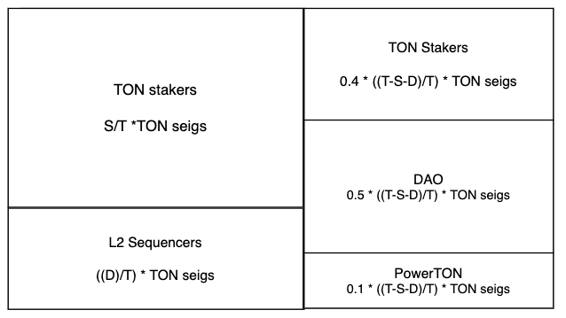

# 목표 

- Kevin: 기존에 있는 staking ↔ seiginorage 계념은 계속 유지한다 (그래야지 커뮤니티에서 반발이 없다), 실제 레이어2를 운영하지 않아도 똑같은 해택을 줘야됨, 다만 시스템에 따라서 추가 해택은 줄 수 있음 (FW 지원, deposit에 대한 seig 등) 
- on-demand 레이어2 생성 -> 심플 스테이킹 화면에 생성된  레이어2 가 자동으로 나타나게 또는  등록에 따라 수동으로 표시되게 할지 논의할 것이고,
- 레이어2 안의  TON TVL 에 따라 오퍼레이터에게 별도의 시뇨리지 발급 -> 심플스테이킹 화면에서 해당 레이어2의 오퍼레이터가 시뇨리지를 받을 수 있게 지원하려고 합니다. 
- 레이어2가 제 역할을 하지 못할때, 챌린지되는 로직을 점검하여, 온체인에서 확인할 수 있는 방법을 명시합니다- > 시뇨리지 발급중지 조건 확인하려고 합니다. 

# 논의 

레이어2에 시뇨리지를 주기 위해 사전에 고려해야 하는 사항을 논의한다.  

- **on-demand L2 생성시. 레이어2 등록 : Registry 에 등록해야 하는가?   **
  - Suah :
    - L2  배포는 아무나 할수있다. 
    - L2 등록을 별도로 한다. OP 수퍼체인에 등록하기가 쉬워진다. 다른 방법으로 하면 필요한 스펙을 알려준다. 최소요구사항: 코드 요구사항이 있음. → 현재 마켓 방향
    - 저희는 현재 마켓을 생각하고, 저희가 해야 하는 일은 좀 줄이는 방법을 하면 좋겠다.  

⇒ **L2 배포는 아무나 할 수 있고, 시뇨리지 받기 위해서는 등록을 별도로 한다. (등록할때, on-demand L2에 등록된 layer2가 맞는지 검증할 수 있어야 한다. 그렇지 아니면 검증할 수 있는 다른 방법이 필요하다. )   **

  - 코어팀 의견 : 
    - 대상 : 저희가 제공한 온디맨드 L2만 해당이 되는지? 다른 레이어도 대상이 되는지? 
      - suah : 기존 레이어는 유지. 옵티미즘 레이어도 등록 가능은 한데, 정책이 필요하다 , 다른 체인에서 톤을 많이 사용하고 있다면 담보금이 있다면 시뇨리지 주는것도 제안을 해보아도 될것 같음.  
      - zena : 온디맨드 L2 로 생각함. 
    - 검증 가이드 제안 제시 .
      - 저희 온디맨드로 만든 것이 맞다고 검증할 수 있는 방법을 제시.
      - **L1 컨트랙만들때, L1이 메인넷이면, 기존의 레지스트리에 등록. **
        - **→ 등록권한이 사용자인데, 이것이 맞는지? **
        - **→ 백앤드로 운영되기 때문에, 등록권한을 특정 주소로 제한할 수 있다. **
        - **더 논의하자.**
          - mapping(시스템 config 오너 → 시스템 config) 
            - 오너가 바뀔수있음. 
          - 시스템 config 오너 가 있고 
          - [https://github.com/tokamak-network/tokamak-titan-canyon/blob/9bd44fd6f1769da55c211d29d7053be771a463c5/packages/contracts-bedrock/src/L1/SystemConfig.sol](https://github.com/tokamak-network/tokamak-titan-canyon/blob/9bd44fd6f1769da55c211d29d7053be771a463c5/packages/contracts-bedrock/src/L1/SystemConfig.sol)
            - L1 브릿지 주소, L2 브릿지주소, L1 메신저, L1 포탈을 조회
- 시뇨리지 및 다오에 등록되기 위한 레이어2 생성은 멀티체인 레지스트리 등록과 별개로 등록을 해야 한다. 이를 **Layer2Candidate** 라고 명시하겠다. 
  - Suah : Layer2Candidate 등록할때 staking에 필요한 Layer2Candidate 생성을 같이 하면 안되는가요?  (1,000.1 stake까지 포함) 
  - 사용자가 Layer2Candidate 등록, 담보금 톤 1000.1 톤 넣는다. 주소. 
- 기존의 DAO Candidate 생성은 막아도 되는지. 기존 플래즈마 레이어 생성도 막아도 되는지. 
- ***Layer2Candidate*** 등록시 필요한 값 
  - 메모 : 심플스테이킹 레이어 이름으로 사용됨
  - 시뇨리지를 받게 되는 오퍼레이터 주소. 
    - 오퍼레이터 주소명의로 스테이킹 금액이 1000.1톤 이상되어야 하고, 이 금액은 인출불가함. 
    - 담보금 입력 : 기존의 최소 스테이킹 금액과 같은 맥락임. 
      - [https://app.diagrams.net/#G1wKnYpwnyX4zuUlNhUlYcU2MGK4vdfZ1k](https://app.diagrams.net/#G1wKnYpwnyX4zuUlNhUlYcU2MGK4vdfZ1k)
**- C : 담보금, S 스테이킹 금액 → 오퍼레이터가 최소 스테이킹 하는 금액으로 인지함. **
  - 생성된 주소 입력(시스템 config 컨트랙 주소) :  아무나 실행 가능 
    - 시스템 config 컨트랙 주소를 입력.  레지스트리에서 컨트랙 조회해서 확인 후 등록
- Layer2Candidate 의 시뇨리지를 받을 오퍼레이터는 어떻게 정해지는가? 
  - 대표 1명의 오퍼레이터가 있을 것이다. ⇒ 시스템 config 오너가 오퍼레이터이다. → 바뀔 수 있다. → **클래임할때 실시간 조회**
  - **추가고려사항 : 오퍼레이터는 다오의 멤버로 활동할 수 있게 되고, 활동비를 받는 주체가 된다. **
- Layer2Candidate 등록할때, 오퍼레이터 담보금은 스테이킹된 금액이므로, 다오에서 집계가 되는데, L2 TVL 은 다오에 집계가 안된다. ? 
  - Suah : **L2 TVL은 다오에서 집계가 되지 않아도 된다. **
- Layer2Candidate 의 오퍼레이터 담보금과 시뇨리지 발행을 위한 오퍼페이터 최저예치금이 같은 것인가? 다른 것인가?  
  -  Suah :  같은 것임. 
- Layer2Candidate의 TVL의 변화가 있을때에 L2 Manager에 변경사항을 반영해야 한다. 온체인에서 컨트랙트 콜 해야 한다. 
  - **톤을 deposit , 톤을  finalize withdraw 할때, 인덱스(팩터)를 변경주어야 한다. **
- 레이어2 챌린지 정책이 있는가?
- 어드민이 시뇨리지 제공에서 빼려고 할 수 있는가? 
  - 고민필요. 시뇨리지도 고려해서 방법에 대해 더 고민
- 업데이트 시뇨리지 구성 
  - Suah : 현재 업데이트 시뇨리지 구성과 비슷하게 가야한다. 
    - 이럴때는 **담보금에 따라서 시뇨리지를 주거나 말거나 할 수 있기가 힘들다. **
    - **시뇨리지 발행은 되고, 클래임을 못하는 방향 또는 클래임 조건에 TVL에 대한 담보금 제한을 없애면 어떨까? **
  - 업데이트 시뇨리지 로직 수정 ( D 포함해서 수정) 
  - 클래임할때  (다중 오퍼레이터) 의 경우 는 D에 대한 시뇨리지도 포함해서 가져간다. 
  - 번 되는 것이 있으면 추적할 수 있는 스토리지가 필요하다 

# Summary 

  - L2Registry   
    - 토카막 네트웤에서 운영되는 레이어2의 SystemConfig 컨트랙 주소가 등록된  컨트랙입니다. 
    -  타이탄, 타노스는 어드민에 의해 수동으로 SystemConfig를 입력합니다. 
    - on-demand L2에서 생성된 컨트랙은 컨트랙 생성시 자동으로 등록됩니다.  
    - 기존에 심플스테이킹에 Layer2Registry가 존재하여 구별을 주고자 L2Registry 로 이름을 정했다. 
    - 추후 다른 레이어(ex, zk-EVM) 지원을 고려하여 프록시로 구성하여 업그레이드 가능해야 한다.  
  - SystemConfig 컨트랙  
    - bedrock 에서 레이어2 의 시스템 정보를 담고 있는 컨트랙으로, L1 StandardBridge,  , L1 CrossDomanMessenger, L1OptimismPortal 등의 주소를 조회할 수 있습니다.   
  -  컨트랙 이름 : 오퍼레이터를 대변할 수 있는 컨트랙 
  - Layer2Candidate 컨트랙  
    - 시뇨리지 발급 및 다오 등록을 하기 위해서는 별도로 Layer2Candidate 등록 절차를 거쳐야 합니다. Layer2Candidate 등록 절차를 통해 Layer2Candidate 컨트랙을 생성할 수 있습니다. 
    - 컨트랙 생성시 담보금(최소 예치금) : Layer2Candidate 등록시 1000.1 TON을 지불하여 심플스테이킹 오퍼레이터의 최소 예치금을 예치해야 합니다.  
      - 담보금과 최소 예치금은 같은 의미로 사용되어야 합니다. 별개의 것으로 분리되기 어렵습니다. 기존 스테이킹과 동일한 서비스 형태를 유지한다면 담보금(최소예치금)이 TVL에 따라  실시간 변경이 어려울 수 있는데,  이 부분 어떻게 구현될지 정확한 확인이 필요합니다. 
    - Layer2Candidate 컨트랙을 생성시 입력 파라미터 
      - 메모 : 레이어2 이름 (심플스테이킹 웹페이지 화면에 레이어 이름으로 노출됩니다. )
      - 등록하려는 레이어의 SyatemConfig 컨트랙 주소 : L2Registry에 등록된 SyatemConfig 컨트랙만 가능합니다. 
      - 위 메모와 등록하려는 레이어 SyatemConfig 컨트랙 주소만 입력하고, 1000.1 톤을 지불한다면 아무나 등록이 가능합니다. 
    - SyatemConfig 컨트랙에 매칭되는 컨트랙으로, 레이어2 에서 지원하는 기능을 구현하고 있는 컨트랙입니다.  
    - 심플 스테이킹의 시뇨리지를 받습니다. 
    - 다오 committee 에 자동으로 등록됩니다. 
    - Layer2Candidate 컨트랙  주소가 DAO 멤버로 사용됩니다. 다오 멤버로서 사용하는 함수는 onlySystemConfigOwner 에 의해서만 실행가능합니다. (활동비 발급은 특정 주소로 받을 수 있도록 해야 합니다.)  
    - 추후 FW 기능을 지원할 예정이므로, 기능 업그레이드를 위해 프록시로 개발되어야 한다. 
  - Layer2Candidate의 DAO 적용
    -  Layer2Candidate이 DAO의 committee 로 활동할때, 총 보유량에는 스테이킹 금액이 포함됩니다. ** ****( 질문 : 레이어2의 TON TVL이 포함되는가요? ) **
  - Layer2Candidate 의 Operator 
    - Layer2Candidate 와 매칭된 SystemConfig 컨트랙의 Owner를 Operator로 정합니다. 
  - Layer2Manager 컨트랙
    - 모든 Layer2Candidate 를 관리합니다. 
    - Layer2Candidate 레이어2의 TON TVL을 조회할 수 있고
    - 업데이트 시뇨리지에서 레이어2의 TON TVL을 반영하기 위해 필요한 모든 함수를 지원해야 합니다. 
    - Layer2Candidate 의 Operator (SystemConfig 오너)가 시뇨리지를 받을 수 있게 합니다. 
      - ~~레이어2의 Deposit 금액과 오퍼레이터가 받은 시뇨리지가 인덱스로 관리되어서 업데이트 시뇨리지 실행시 한번에 반영을 할 수 있어야 합니다. ~~
      - ~~레이어2의 TON Deposit, Withdraw시에  시뇨리지 업데이트 관련 인덱스가 같이 반영되어야 합니다. ~~
      - 현재의 업데이트 시뇨리지 로직 실행시, 같이 반영되어야 합니다. 
      - ~~레이어2의 오퍼레이터는 TON TVL에 따라 받는 시뇨리지 클래임과 스테이킹된 금액 언스테이킹을 함께 할 수 있습니다. ~~

    -  번되는 톤이 있다면 스토리지를 추가해서 번되는 물량을 확인할 수 있어야 합니다. 
    - Bridge에 Deposit으로 발생되는 시노리지에 대한 staking 이자는 없다: DAO 나 powerton (stos holder) 들이 받는 TON 시노리지와 비슷하게 staking이자는 없다 -> L2 operator가 직접 claim하기 전까지는 컨트랙트가 보관하고 있음, 즉 L2 operator가 TON을 빼서 직접 staking 해야하지 이자를 받을 수 있다
위에 언급된 내용은 당연한것 같지만 일단 명시만 해놓겠습니다.
(deposit으로 발생된 시노리지도 sWTON형식으로 받아야된다면, L2 operator 가 update시노리지 call할때 민트된 WTON을 staking하는 기능이 추가되어야한다) 그만큼 가스비가 증가함
  - 현재 DAOCandidate와 PlasmaLayerCandidate는 더이상 추가되지 않도록 정책을 정했으면 합니다.
  - 