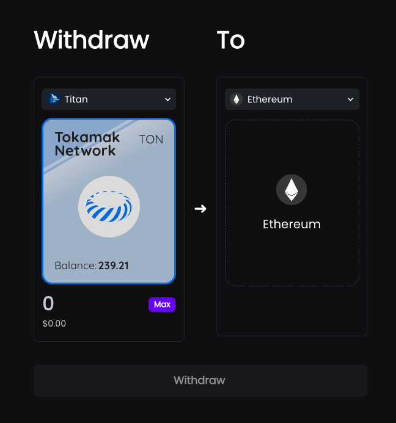
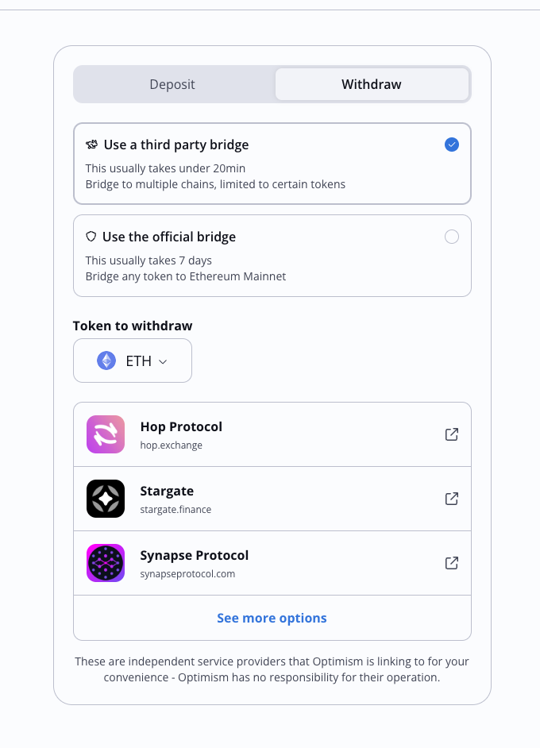

1. Where to place FW requester’s UI ? 
  1. Monica: 
    1. ~~Used car auction app example: ~~
      1. ~~**intro screen divides by **~~
        1. ~~person who wants to sell~~
        1. ~~person who wants to buy~~
  1. Suhyeon:
    1. FW liquidity providing function is closely related to withdrawal action, it would be good if they are placed together 
      1. example: Metamask txn speed increase function 
      1. how about adding FW button on Tokamak Bridge? as an option 

1. general FW (non staked TON)
  1. 