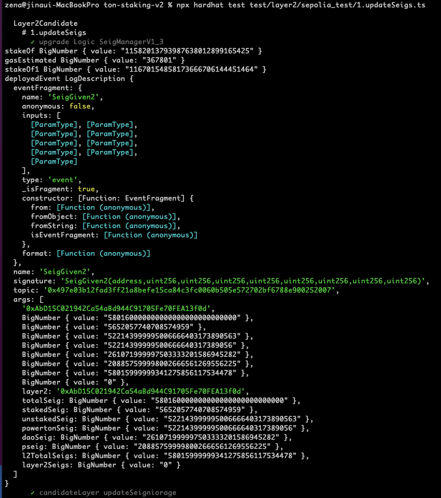
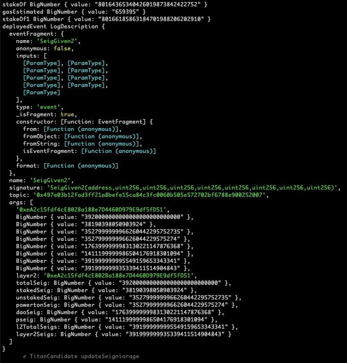
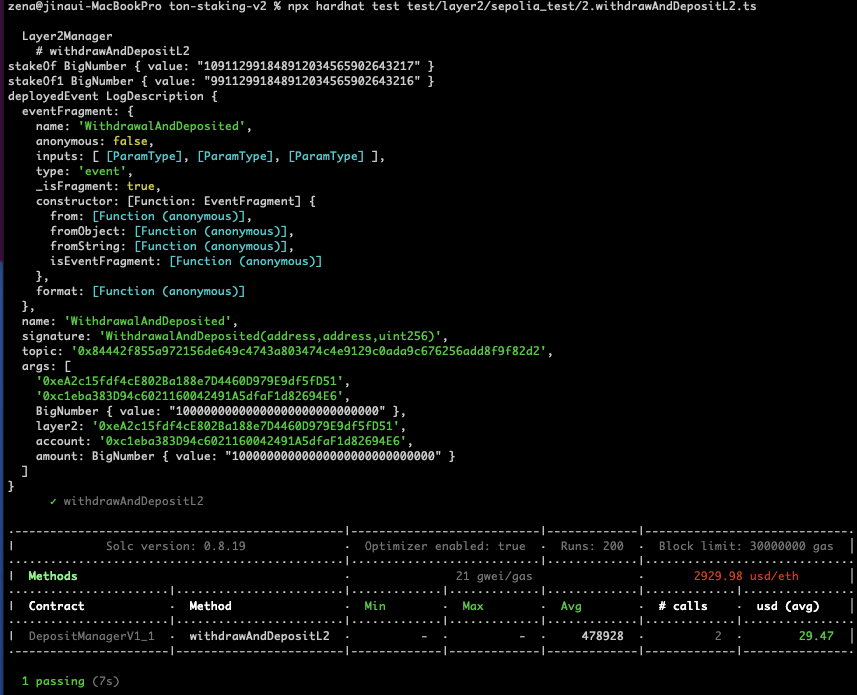
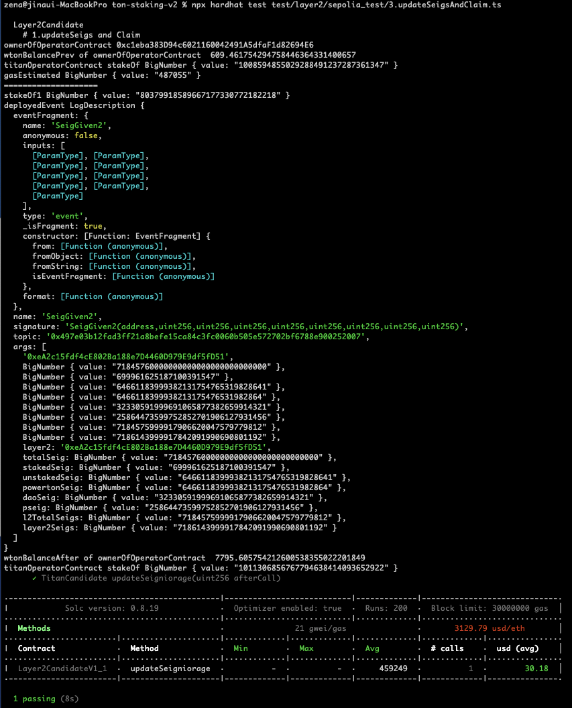
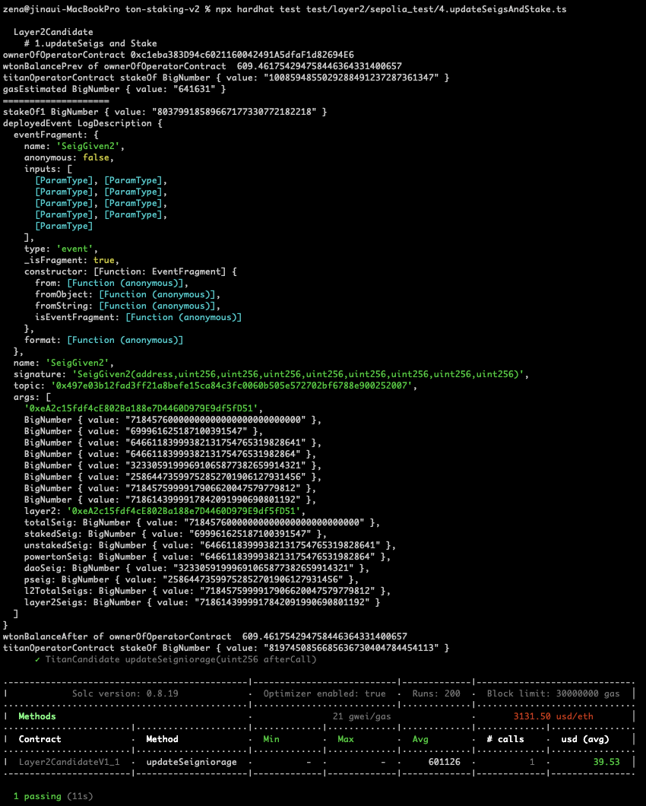

- Sepolia simple staking web 

 [https://sepolia.staking.tokamak.network](https://sepolia.staking.tokamak.network/)

Repo : [https://github.com/tokamak-network/ton-staking-v2/tree/deploy_sepolia_v2](https://github.com/tokamak-network/ton-staking-v2/tree/deploy_sepolia_v2)

- Sepolia ERC20 
c4f0547b-d7c5-406f-8763-2978e8de89a1 
- Sepolia Simple Staking Contracts 
  - 0ef21581-cb54-4875-b2c9-19593dbc8325 
  - b4f734dd-4f19-4e75-b2ca-f815934ee317 
- Titan-Sepolia Network 
  - ec715fc8-07cc-4b69-90ce-98192930fa55 
- Thanos-Sepolia Network 
  - 5982e093-2d09-4691-85e3-2e5d4de96e15 
- sepolia tokamak bridge 
[https://tokamak-bridge-pool.vercel.app/](https://tokamak-bridge-pool.vercel.app/)

# deploy process 

for sepolia 

```javascript
SeigManagerProxy : 0x2320542ae933FbAdf8f5B97cA348c7CeDA90fAd7
- SeigManager : 0xe05d62c21f4bba610F411A6F9BddF63cffb43B63
- SeigManagerV1_1 : 
- SeigManagerV1_2 : 0x32Fa7147C4d82c821518B54196de680CA03BfA30 
```

- DAO 

```javascript
DAOCommitteeProxy 0xA2101482b28E3D99ff6ced517bA41EFf4971a386

old implementation: 0xDC7e4c6cAe2123758f17D17572c6f6e820D2b431

DAOCommitteeAddV1_1 : 0x5AA500FA01b230EF2121c51e60c1bb1DFb1967eB

upgrade To : 0x5AA500FA01b230EF2121c51e60c1bb1DFb1967eB
```

### 1. Deploy  Contracts On Sepolia (L1) 

 `npx hardhat deploy --network sepolia `

```javascript
reusing "L2RegistryV1_1" at ~~0xb0d875216026e403b3Ab030215D8DcC945409Be1~~
0x00B77fc0CFca942cFe0Da53DDDe68cBF94573439

reusing "L2RegistryProxy" at 0x817442BB8aa891AaE2a1EA009086f61c7FB14372
reusing "OperatorV1_1" at ~~0x0BfB395e4148B15cD1a54Bb94c82b8D765673144~~
0x405ba7C63E9EFd72b522a786EdB40cC001e54D7a

reusing "OperatorFactory" at 0xBB8e650d9BB5c44E54539851636DEFEF37585E67
reusing "Layer2CandidateV1_1" at 0x47C50EbFbcbb28493ACB7FeC3B5A8B962fD880bC
reusing "Layer2CandidateFactory" at 0x009dd4679494F8EE1950EB33Bc99F6E22510F79a
reusing "Layer2CandidateFactoryProxy" at 0x770739A468D9262960ee0669f9Eaf0db6E21F81A
reusing "Layer2ManagerV1_1" at ~~0xb5c67BEA9D0c30eD2edD56D6Ff4690b5ebf99B7E~~
0x96380d80Ed20B2f4B397e550575D2D2E5a728eB6
reusing "Layer2ManagerProxy" at 0x0237839A14194085B5145D1d1e1E77dc92aCAF06
 
 
 // Titan_Test1 SystemConfig 
reusing "LegacySystemConfig" at 0x1cA73f6E80674E571dc7a8128ba370b8470D4D87
```

1. SeigManager update 
  1. deploy SeigManagerV1_3 :  ~~0xe4d138760478002B3991efdA7FDe723ba1C147Da~~
0x7997F222986B71913Ea8f53AB9C5fd2Be00dbBf5
  1. add functions 
```javascript
[
  '0xac28e2ed', '0xbaa12536',
  '0x44feabf8', '0x764a7856',
  '0x1fbeab54', '0xf7b99a62',
  '0xdf0cd738', '0x6e71186b',
  '0x5f6fb8b9', '0xc2e5dcc9',
  '0x16b5d5bd', '0xd0d2ff70',
  '0xf9bae41a', '0x9b370dea',
  '0xca608089', '0x9473cafe'
]

'0xac28e2ed','0xbaa12536','0x44feabf8','0x764a7856','0x1fbeab54','0xf7b99a62','0xdf0cd738','0x6e71186b','0x5f6fb8b9', '0xc2e5dcc9','0x16b5d5bd','0xd0d2ff70','0xf9bae41a', '0x9b370dea','0xca608089', '0x9473cafe'

0xac28e2ed,0xbaa12536,0x44feabf8,0x764a7856,0x1fbeab54,0xf7b99a62,0xdf0cd738,0x6e71186b,0x5f6fb8b9,0xc2e5dcc9,0x16b5d5bd,0xd0d2ff70,0xf9bae41a,0x9b370dea,0xca608089,0x9473cafe
```

    - Contract : SeigManagerProxy  0x2320542ae933FbAdf8f5B97cA348c7CeDA90fAd7
    - Function : setImplementation2 
      - logic : seigManagerV1_3 ⇒   0xe4d138760478002B3991efdA7FDe723ba1C147Da
0x7997F222986B71913Ea8f53AB9C5fd2Be00dbBf5
      - index : 1 
      - flag : true 
      - tx:  [https://sepolia.etherscan.io/tx/0x74dbe8252d74622e9b824a6cef5301ba42afb2067a25c91401fdd386608734e1](https://sepolia.etherscan.io/tx/0x74dbe8252d74622e9b824a6cef5301ba42afb2067a25c91401fdd386608734e1)
      - [https://sepolia.etherscan.io/tx/0x339e5fecc79ea59f77469b04a423423e74650649525875c43c720f8d542e298b](https://sepolia.etherscan.io/tx/0x339e5fecc79ea59f77469b04a423423e74650649525875c43c720f8d542e298b)
    - Function : setSelectorImplementations2
      - functionBytecodes : [0xac28e2ed,0xbaa12536,0x44feabf8,0x764a7856,0x1fbeab54,0xf7b99a62,0xdf0cd738,0x6e71186b,0x5f6fb8b9,0xc2e5dcc9,0x16b5d5bd,0xd0d2ff70,0xf9bae41a,0x9b370dea,0xca608089,0x9473cafe]
      - logic :  0xe4d138760478002B3991efdA7FDe723ba1C147Da
      - tx: [https://sepolia.etherscan.io/tx/0x2ad78dffa5b1c175b9093879f13fffa7ab631727dd6be6a2e7cab7992297dae9](https://sepolia.etherscan.io/tx/0x2ad78dffa5b1c175b9093879f13fffa7ab631727dd6be6a2e7cab7992297dae9)
      - [https://sepolia.etherscan.io/tx/0xb51f7aef676f9b3e0ad2334b6f65cb7196ec9500316981f159529c786a6132ad](https://sepolia.etherscan.io/tx/0xb51f7aef676f9b3e0ad2334b6f65cb7196ec9500316981f159529c786a6132ad)
  1. in sepolia 
    1. execute setLayer2Manager  : 0x0237839A14194085B5145D1d1e1E77dc92aCAF06
      1. 
    1. execute setL2Registry  : 0x817442BB8aa891AaE2a1EA009086f61c7FB14372
      1. 
    1. ~~execute setLayer2StartBlock~~
1. DepositManager  update 
  1. deploy DepositManagerV1_1 : 0x82039558f14C900fC42c155281f7A4E765962b18
  1. add functions 
    - Contract : DepositManagerProxy → 0x90ffcc7F168DceDBEF1Cb6c6eB00cA73F922956F
    - Function : setImplementation2
      - logic :   0x82039558f14C900fC42c155281f7A4E765962b18
      - index : 1 
      - flag : true 
      - tx: [https://sepolia.etherscan.io/tx/0x5a56156b47f38209f90ab6e3c1fc1ba26b4c0421f5d7b3b7981c5679a1e14e4e](https://sepolia.etherscan.io/tx/0x5a56156b47f38209f90ab6e3c1fc1ba26b4c0421f5d7b3b7981c5679a1e14e4e)
    - Function : setSelectorImplementations2
      - functionBytecodes : [0xcc48b947,0xdd283f97,0x96dd1d97,0x9f382d11]
      - logic :  0x82039558f14C900fC42c155281f7A4E765962b18
      - tx : [https://sepolia.etherscan.io/tx/0x9d9e607049872ff51b86bcb50a69adbc7d86dd75f92aaa7ae4b5d5efe9367fcf](https://sepolia.etherscan.io/tx/0x9d9e607049872ff51b86bcb50a69adbc7d86dd75f92aaa7ae4b5d5efe9367fcf)

1-2. **re-upgrade DepositManagerV1_1**
1. DAO update Logic 
  1. add function 
  1. execute setLayer2CandidateFactory
  1. execute setLayer2Manager
  1. execute SeigManager setTargetSetLayer2Manager 
  1. execute SeigManager setTargetSetL2Registry
  1. execute SeigManager setTargetLayer2StartBlock 

### 2. register SystemConfig of Titan_Test1  by manager

- Contract : L2Registry 0x817442BB8aa891AaE2a1EA009086f61c7FB14372
- Function : registerSystemConfigByManager 
  - _systemConfig :  0x1cA73f6E80674E571dc7a8128ba370b8470D4D87  (Titan_Test1)
  - _type : 1 (legacy)
- tx: [https://sepolia.etherscan.io/tx/0x407764eed823d13f688391276def7b42796c2328e381ce4556911c1e82286dda](https://sepolia.etherscan.io/tx/0x407764eed823d13f688391276def7b42796c2328e381ce4556911c1e82286dda)

### 3. Register Titan-sepolia Layer2Candidate.

- Contract : Layer2Manager. 0x0237839A14194085B5145D1d1e1E77dc92aCAF06
- Function : registerLayer2Candidate
  - systemConfig : 0x1cA73f6E80674E571dc7a8128ba370b8470D4D87
  - amount : 1000000000000000000000
  - flag Ton : true 
  - memo : **Titan_Test1**
- tx : [https://sepolia.etherscan.io/tx/0x7c293c806f4a2a26f5a767a20a6756924e1962026dfaa5e7b9174e3c8ea0ecb1](https://sepolia.etherscan.io/tx/0x7c293c806f4a2a26f5a767a20a6756924e1962026dfaa5e7b9174e3c8ea0ecb1)
  - DeployedCandidate (address sender, address layer2, address operator, bool isLayer2Candidate, string name, address committee, address seigManager)View Source
    - sender :[0x1A8e48401697DcF297A02c90d3480c35885f8959](https://sepolia.etherscan.io/address/0x1A8e48401697DcF297A02c90d3480c35885f8959)
    - layer2 :[0xeA2c15fdf4cE802Ba188e7D4460D979E9df5fD51](https://sepolia.etherscan.io/address/0xeA2c15fdf4cE802Ba188e7D4460D979E9df5fD51)
    - operator :[0x1A8e48401697DcF297A02c90d3480c35885f8959](https://sepolia.etherscan.io/address/0x1A8e48401697DcF297A02c90d3480c35885f8959)
    - isLayer2Candidate :True
    - name :Titan_Test1
    - committee :[0xA2101482b28E3D99ff6ced517bA41EFf4971a386](https://sepolia.etherscan.io/address/0xA2101482b28E3D99ff6ced517bA41EFf4971a386)
    - seigManager :[0x2320542ae933FbAdf8f5B97cA348c7CeDA90fAd7](https://sepolia.etherscan.io/address/0x2320542ae933FbAdf8f5B97cA348c7CeDA90fAd7)
  - CoinageCreated (index_topic_1 address layer2, address coinage)View Source
**Topics**
• **0** 0x124cac1e701d08d642237ad795ddd275670e12f2cd956a26709721c68084c2b2
• **1: layer2**Dec[0xeA2c15fdf4cE802Ba188e7D4460D979E9df5fD51](https://sepolia.etherscan.io/address/0xeA2c15fdf4cE802Ba188e7D4460D979E9df5fD51)
  - CandidateContractCreated (index_topic_1 address candidate, index_topic_2 address candidateContract, string memo)View Source
• **0** 0x7cf8db18d9a5c7f44156bfabdbb59ac982a8a004e461ca1b87ee71a5cdfbc5ef
• **1: candidate**Dec[0x1A8e48401697DcF297A02c90d3480c35885f8959](https://sepolia.etherscan.io/address/0x1A8e48401697DcF297A02c90d3480c35885f8959)
• **2: candidateContract**Dec[0xeA2c15fdf4cE802Ba188e7D4460D979E9df5fD51](https://sepolia.etherscan.io/address/0xeA2c15fdf4cE802Ba188e7D4460D979E9df5fD51)

**Data**memo :Titan_Test1
  - RegisteredLayer2Candidate (address systemConfig, uint256 wtonAmount, string memo, address operator, address layer2Candidate)View Source
    - systemConfig :[0x1cA73f6E80674E571dc7a8128ba370b8470D4D87](https://sepolia.etherscan.io/address/0x1cA73f6E80674E571dc7a8128ba370b8470D4D87)
    - wtonAmount :1000000000000000000000000000000
    - memo :Titan_Test1
    - operator :[0x1A8e48401697DcF297A02c90d3480c35885f8959](https://sepolia.etherscan.io/address/0x1A8e48401697DcF297A02c90d3480c35885f8959)
    - layer2Candidate : [0xeA2c15fdf4cE802Ba188e7D4460D979E9df5fD51](https://sepolia.etherscan.io/address/0xeA2c15fdf4cE802Ba188e7D4460D979E9df5fD51)

### 4. register SystemConfig of Thanos  by manager

- Contract : L2Registry 0x817442BB8aa891AaE2a1EA009086f61c7FB14372
- Function : registerSystemConfigByManager 
  - _systemConfig :  `0xf8FCFDbdb7C4E734D035A5681Fd1fe08ec85e387`   (**Thanos**)
  - _type : 2 
- tx:  [https://sepolia.etherscan.io/tx/0xe2917292caa0370886e468ab1827465c211066eab183360edbda6f9128454f48](https://sepolia.etherscan.io/tx/0xe2917292caa0370886e468ab1827465c211066eab183360edbda6f9128454f48)

### 4. Register Thanos-sepolia Layer2Candidate.

- Contract : Layer2Manager. 0x0237839A14194085B5145D1d1e1E77dc92aCAF06
- Function : registerLayer2Candidate
  - systemConfig :  `0xf8FCFDbdb7C4E734D035A5681Fd1fe08ec85e387`
  - amount : 1000100000000000000000
  - flag Ton : true 
  - memo : **Thanos**
- tx : [https://sepolia.etherscan.io/tx/0x943532f385d02e88f62f7f9ab6441705f1c1d00db08c877c649c79ac8df72da0](https://sepolia.etherscan.io/tx/0x943532f385d02e88f62f7f9ab6441705f1c1d00db08c877c649c79ac8df72da0)

  - RegisteredLayer2Candidate (address systemConfig, uint256 wtonAmount, string memo, address operator, address layer2Candidate)View Source
**Topics**
• **0** 0x1526ff0a0299f7312457e24a4af3d354afc4d51a22017cc0bb86b8c9fed66240

**Data**

systemConfig :[0xf8FCFDbdb7C4E734D035A5681Fd1fe08ec85e387](https://sepolia.etherscan.io/address/0xf8FCFDbdb7C4E734D035A5681Fd1fe08ec85e387)

wtonAmount :1000100000000000000000000000000

memo :Thanos

operator :[0x97f70424857fa4c79B76ef90E057e1FD4b8287Db](https://sepolia.etherscan.io/address/0x97f70424857fa4c79B76ef90E057e1FD4b8287Db)

layer2Candidate :[0xF78d3E1f7ca9EFc672969cfc771c6207e3AfEB7E](https://sepolia.etherscan.io/address/0xF78d3E1f7ca9EFc672969cfc771c6207e3AfEB7E)

### Simple Staking Web 

 [https://sepolia.staking.tokamak.network](https://sepolia.staking.tokamak.network/) 에 자동으로 등록된 것 확인함. 

### Test 

Repo : [https://github.com/tokamak-network/ton-staking-v2/tree/deploy_sepolia_v2](https://github.com/tokamak-network/ton-staking-v2/tree/deploy_sepolia_v2)

1. test update seigniorage of Layer2Candidate  and DAOCandidate   [code](https://github.com/tokamak-network/ton-staking-v2/blob/deploy_sepolia_v2/test/layer2/sepolia_test/1.updateSeigs.ts)
```typescript
npx hardhat test test/layer2/sepolia_test/1.updateSeigs.ts
// blockNumber: 5874556, 
```

  - CandidateLayer의 경우, l2TotalSeigs (L2시퀀서에게 할당되는 시뇨리지) 할당 금액을 이벤트에서 확인할 수 있다. 다오 Candidate이기 때문에 layer2Seigs (해당 Layer2 시퀀서에서 정산된 금액)은 없는 것을 이벤트에서 확인할 수 있다. 



  - Layer2Candidate (TitanCandidate) 의 경우, l2TotalSeigs (L2시퀀서에게 할당되는 시뇨리지) 할당 금액을 이벤트에서 확인할 수 있다.   layer2Seigs (해당 Layer2 시퀀서에서 정산된 금액) 가 할당된것을 이벤트에서 확인할 수 있다. 


1. test withdrawAndDepositL2 function of Layer2Candidate [code](https://github.com/tokamak-network/ton-staking-v2/blob/deploy_sepolia_v2/test/layer2/sepolia_test/2.withdrawAndDepositL2.ts) 
```typescript
npx hardhat test test/layer2/sepolia_test/2.withdrawAndDepositL2.ts
// blockNumber: 5870490,
```

  - withdrawAndDepositL2 한 금액만큼 스테이킹 금액이 줄어들고, 이벤트에 해당 금액이 withdrawAndDepositL2 된것을 확인할 수 있다. 


1. test to execute updateSeignorage and Claim concurrently of Operator(sequencer)     [code](https://github.com/tokamak-network/ton-staking-v2/blob/deploy_sepolia_v2/test/layer2/sepolia_test/3.updateSeigsAndClaim.ts)
```javascript
npx hardhat test test/layer2/sepolia_test/3.updateSeigsAndClaim.ts
// blockNumber: 5892966
```


1. test to execute updateSeignorage and Staking concurrently of Operator(sequencer)  [code](https://github.com/tokamak-network/ton-staking-v2/blob/deploy_sepolia_v2/test/layer2/sepolia_test/4.updateSeigsAndStake.ts) 
```javascript
npx hardhat test test/layer2/sepolia_test/4.updateSeigsAndStake.ts
// blockNumber: 5892966
```



# Upgrade Operator Implementation

[https://github.com/tokamak-network/ton-staking-v2/issues/24](https://github.com/tokamak-network/ton-staking-v2/issues/24)

 

# Addresses on sepolia 

```javascript
"SeigManagerProxy" : 0x2320542ae933FbAdf8f5B97cA348c7CeDA90fAd7
"DepositManagerProxy" : 0x90ffcc7F168DceDBEF1Cb6c6eB00cA73F922956F
```

```javascript
reusing "L2RegistryV1_1" at ~~0xb0d875216026e403b3Ab030215D8DcC945409Be1~~
0x00B77fc0CFca942cFe0Da53DDDe68cBF94573439

reusing "L2RegistryProxy" at 0x817442BB8aa891AaE2a1EA009086f61c7FB14372
reusing "OperatorV1_1" at ~~0x0BfB395e4148B15cD1a54Bb94c82b8D765673144~~
0x405ba7C63E9EFd72b522a786EdB40cC001e54D7a

reusing "OperatorFactory" at 0xBB8e650d9BB5c44E54539851636DEFEF37585E67
reusing "Layer2CandidateV1_1" at 0x47C50EbFbcbb28493ACB7FeC3B5A8B962fD880bC
reusing "Layer2CandidateFactory" at 0x009dd4679494F8EE1950EB33Bc99F6E22510F79a
reusing "Layer2CandidateFactoryProxy" at 0x770739A468D9262960ee0669f9Eaf0db6E21F81A
reusing "Layer2ManagerV1_1" at ~~0xb5c67BEA9D0c30eD2edD56D6Ff4690b5ebf99B7E~~
0x96380d80Ed20B2f4B397e550575D2D2E5a728eB6
reusing "Layer2ManagerProxy" at 0x0237839A14194085B5145D1d1e1E77dc92aCAF06
 
 
 // Titan_Test1 SystemConfig 
reusing "LegacySystemConfig" at 0x1cA73f6E80674E571dc7a8128ba370b8470D4D87
```

- Titan-Test1 
```javascript
layer2Candidate: 0xeA2c15fdf4cE802Ba188e7D4460D979E9df5fD51
operator: 0x1A8e48401697DcF297A02c90d3480c35885f8959 
systemConfig: 0x1cA73f6E80674E571dc7a8128ba370b8470D4D87
systemConfig's owner: 0xc1eba383D94c6021160042491A5dfaF1d82694E6
```
- Thanos  (rejectLayer2Candidate) 
```javascript
layer2Candidate: 0xF78d3E1f7ca9EFc672969cfc771c6207e3AfEB7E
operator: 0x97f70424857fa4c79B76ef90E057e1FD4b8287Db
systemConfig: 0xf8FCFDbdb7C4E734D035A5681Fd1fe08ec85e387
systemConfig's owner: 0x9E628CaAd7A6dD3ce48E78812241B41BdbeF6244 
```
- 

#  