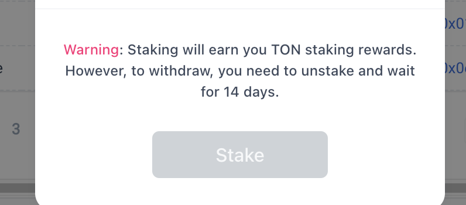
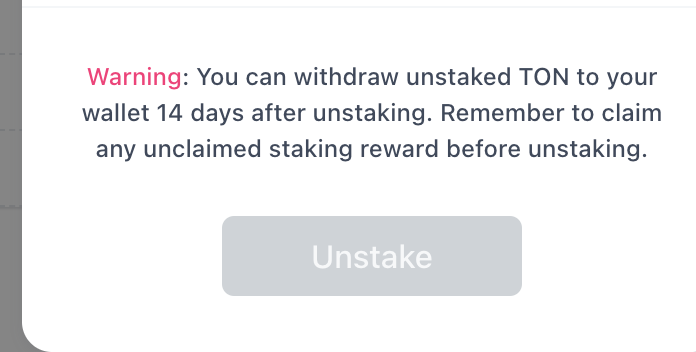
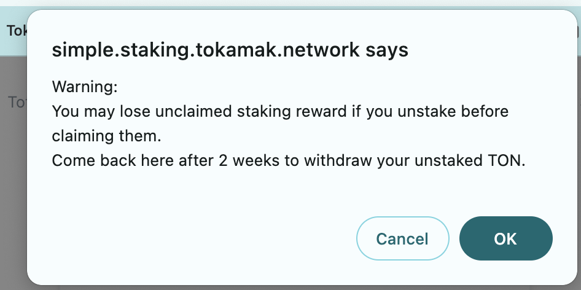

- stake UI 

  - Staking TON will earn you TON staking rewards. However, you have to unstake and wait for 93,046 blocks (~14 days) to withdraw.
- unstake UI

  - Warning: You can withdraw (W)TON to your wallet after 93,046 blocks (~14 days) from unstaking. Remember to claim any unclaimed staking reward before unstaking.
- unstake alert message

  - Warning: You may lose unclaimed staking reward if you unstake before claiming them. Come back after 93,046 blocks (~14 days) from unstaking to withdraw (W)TON to your account. 
- Account menu → 

  - change text under “Time” for unstake: 
    - text change: Withdrawable at block <u>xxxxxx</u> (DD days hh hours left)
      - calculate xxxxxx = unstake txn block # + 93046
      - add hyper link to <u>xxxxxx</u> [https://etherscan.io/block/countdown/](https://etherscan.io/block/countdown/19801786)xxxxxx