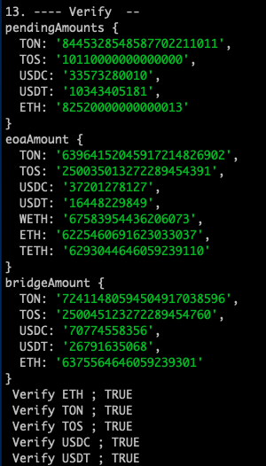

163d96a4-00a3-80ef-ad0f-f656373b7efe 

- L1StandardBridge_Proxy 
  - Contract:   [L1StandardBridge_Proxy](https://etherscan.io/address/0x59aa194798ba87d26ba6bef80b85ec465f4bbcfd) **0x59aa194798Ba87D26Ba6bEF80B85ec465F4bbcfD**  
  - Owner ([CA](https://etherscan.io/address/0x014E38eAA7C9B33FeF08661F8F0bFC6FE43f1496)):  **MultiProposerableTransactionExecutor 0x014E38eAA7C9B33FeF08661F8F0bFC6FE43f1496**  → owner [**0xc2fa14904E9f610006958A2bd2614fE52B8D6BC1**](https://etherscan.io/address/0xc2fa14904E9f610006958A2bd2614fE52B8D6BC1)**   **
- Lib_AddressManager
  - Contract: "[AddressManager](https://etherscan.io/address/0xedf6c92fa72fa6015b15c9821ada145a16c85571#code)": "0xeDf6C92fA72Fa6015B15C9821ada145a16c85571"
  - Owner : [**MultiProposerableTransactionExecutor**](https://etherscan.io/address/0x014E38eAA7C9B33FeF08661F8F0bFC6FE43f1496#readContract)** 0x014E38eAA7C9B33FeF08661F8F0bFC6FE43f1496**  → owner [**0xc2fa14904E9f610006958A2bd2614fE52B8D6BC1**](https://etherscan.io/address/0xc2fa14904E9f610006958A2bd2614fE52B8D6BC1)**   **
- L1CrossDomainMessenger_Proxy
  - Contract : [L1CrossDomainMessenger_Proxy](https://etherscan.io/address/0xfd76ef26315ea36136dc40aeafb5d276d37944ae#readProxyContract) 0xfd76ef26315Ea36136dC40Aeafb5D276d37944AE
  - Owner: [**MultiProposerableTransactionExecutor**](https://etherscan.io/address/0x014E38eAA7C9B33FeF08661F8F0bFC6FE43f1496#readContract)** 0x014E38eAA7C9B33FeF08661F8F0bFC6FE43f1496**  → owner [**0xc2fa14904E9f610006958A2bd2614fE52B8D6BC1**](https://etherscan.io/address/0xc2fa14904E9f610006958A2bd2614fE52B8D6BC1)**   **


# Aggregating asset allocation data (Titan)

- **The base data folder: *****/data/sunset_titan_6391/ ***[link](https://github.com/tokamak-network/L2-Assets-Migration/tree/get_owners_of_assets/titanLagacy/data/sunset_titan_6391)
Aggregated from Titan block 6391.
1. titan account aggregation
  - Aggregate accounts using Transfer events for all assets
    - transactions:[ link](https://github.com/tokamak-network/L2-Assets-Migration/tree/get_owners_of_assets/titanLagacy/data/sunset_titan_6391/transactions)  ` /transactions`
  - Aggregate the accounts of Titan <u>*using the API*</u><u> </u>and merge them with the above aggregates.
    - [https://explorer.titan.tokamak.network/api?module=account&action=listaccounts&page=1&offset=10000](https://explorer.titan.tokamak.network/api?module=account&action=listaccounts&action=listaccounts&page=1&page=1&offset=10000https%3A%2F%2Fexplorer.titan.tokamak.network%2Fapi%3Fmodule%3Daccount&offset=10000)
  - ***result: accounts : link  ( only EOA, only Contracts ) ***
    - accounts: `/accounts/titan_accounts.json`
    - EOA: `/accounts/titan_accounts_eoa.json`
In L1, the contract address  link `/``accounts/titan_accounts_eoa_not_l1`
```javascript
contractsL1.length 23
[
  '0x7377f3d0f64d7a54cf367193eb74a052ff8578fd',
  '0x59aa194798ba87d26ba6bef80b85ec465f4bbcfd', -> L1StandardBridge -> MultiSigWallet's owner 0xc2fa14904E9f610006958A2bd2614fE52B8D6BC1
  '0x7fc66500c84a76ad7e9c93437bfc5ac33e2ddae9', -> InitializableAdminUpgradeabilityProxy AaveTokenV3 
  '0x5ff137d4b0fdcd49dca30c7cf57e578a026d2789', -> EntryPoint
  '0x42ccf0769e87cb2952634f607df1c7d62e0bbc52', -> Candidate Logic
  '0x4a1941f18874df01e5caa1cd3da4b1803cbd32c2', -> CanonicalTransactionChain
  '0xfd76ef26315ea36136dc40aeafb5d276d37944ae',-> L1CrossDomainMessenger 
  '0x91ae842a5ffd8d12023116943e72a606179294f3', -> NonfungibleTokenPositionDescriptor
  '0x3fc91a3afd70395cd496c647d5a6cc9d4b2b7fad', -> UniversalRouter
  '0x000000000022d473030f116ddee9f6b43ac78ba3',-> Permit2
  '0xbc602c1d9f3ae99db4e9fd3662ce3d02e593ec5d',-> CandidateProxy
  '0x0f42d1c40b95df7a1478639918fc358b4af5298d',-> CandidateProxy
  '0x39a13a796a3cd9f480c28259230d2ef0a7026033',-> Layer2
  '0xf3b17fdb808c7d0df9acd24da34700ce069007df', -> CandidateProxy
  '0x41fb4bad6fba9e9b6e45f3f96ba3ad7ec2ff5b3c', -> Layer2
  '0x44e3605d0ed58fd125e9c47d1bf25a4406c13b57', -> CandidateProxy
  '0x06d34f65869ec94b3ba8c0e08bceb532f65005e2', -> CandidateProxy
  '0xc02aaa39b223fe8d0a0e5c4f27ead9083c756cc2', -> WETH9
  '0xedf6c92fa72fa6015b15c9821ada145a16c85571', -> Lib_AddressManager
  '0x914d7fec6aac8cd542e72bca78b30650d45643d7', -> DeployFactory 같음
  '0x72655449e82211624d5f4d2abb235bb6fe2fe989', -> DAOCommitteeExtend
  '0x2be5e8c109e2197d077d13a82daead6a9b3433c5', -> TON
  '**0x014e38eaa7c9b33fef08661f8f0bfc6fe43f1496**' -> MultiProposerableTransactionExecutor : owner : 0xc2fa14904E9f610006958A2bd2614fE52B8D6BC1
]
```

        - at 6403 block

```json
[
  '0x7377f3d0f64d7a54cf367193eb74a052ff8578fd',
  '0x59aa194798ba87d26ba6bef80b85ec465f4bbcfd',
  '0x7fc66500c84a76ad7e9c93437bfc5ac33e2ddae9',
  '0x5ff137d4b0fdcd49dca30c7cf57e578a026d2789',
  '0x42ccf0769e87cb2952634f607df1c7d62e0bbc52',
  '0x4a1941f18874df01e5caa1cd3da4b1803cbd32c2',
  '0xfd76ef26315ea36136dc40aeafb5d276d37944ae',
  '0x91ae842a5ffd8d12023116943e72a606179294f3',
  '0x3fc91a3afd70395cd496c647d5a6cc9d4b2b7fad',
  '0x000000000022d473030f116ddee9f6b43ac78ba3',
  '0xbc602c1d9f3ae99db4e9fd3662ce3d02e593ec5d',
  '0x0f42d1c40b95df7a1478639918fc358b4af5298d',
  '0x39a13a796a3cd9f480c28259230d2ef0a7026033',
  '0xf3b17fdb808c7d0df9acd24da34700ce069007df',
  '0x41fb4bad6fba9e9b6e45f3f96ba3ad7ec2ff5b3c',
  '0x44e3605d0ed58fd125e9c47d1bf25a4406c13b57',
  '0x06d34f65869ec94b3ba8c0e08bceb532f65005e2',
  '0xc02aaa39b223fe8d0a0e5c4f27ead9083c756cc2',
  '0xedf6c92fa72fa6015b15c9821ada145a16c85571',
  '0x914d7fec6aac8cd542e72bca78b30650d45643d7',
  '0x72655449e82211624d5f4d2abb235bb6fe2fe989',
  '0x2be5e8c109e2197d077d13a82daead6a9b3433c5',
  '0x014e38eaa7c9b33fef08661f8f0bfc6fe43f1496'
]
```

Check if there is a contract that holds the asset. link
```json
[]
```
    - contracts: `/accounts/titan_accounts_contract.json`
1. Balance aggregation by asset
  - ***   ***[***link***](https://github.com/tokamak-network/L2-Assets-Migration/tree/get_owners_of_assets/titanLagacy/data/sunset_titan_6403/balances)
1. Confirm there is no difference between the total supply amount and the balance sum by asset.
```javascript

--- getBalances :  ETH
accounts.length 658
sum 6.293044646059239288
totalSupply 6.293044646059239288
totalSupply.sub(sum) 0.0

--- getBalances :  TON
accounts.length 658
sum 63964.152045917214827585
totalSupply 63964.152045917214827585
totalSupply.sub(sum) 0.0

--- getBalances :  TOS
accounts.length 658
sum 250.03501327228945476
totalSupply 250.03501327228945476
totalSupply.sub(sum) 0.0

--- getBalances :  USDC
accounts.length 658
sum 37201.278346
totalSupply 37201.278346
totalSupply.sub(sum) 0.0

--- getBalances :  USDT
accounts.length 658
sum 16448.229887
totalSupply 16448.229887
totalSupply.sub(sum) 0.0

--- getBalances :  WETH
accounts.length 658
sum 0.067583954436206251
totalSupply 0.067583954436206251
totalSupply.sub(sum) 0.0

```
1.  Contracts’s Assets 
  1. UniswapV3 Assets 
    1. ***Assets by Lp Token: link ***`/accounts/1.titan_contract_lp_tokens.json`
    1. ***Pools Assets: link  ***`/accounts/2.titan_contract_pools.json`

The sum of LPs by Pool: link `/balances/1.titan_sum_of_lps_by_pool.txt `
```javascript
==============================
==== Sum of LPs by Pool ======

pools length12

Check!! The number of pools counted by LP and the number of pool contracts are different


0 Pool  == 0xccd11ebe55c84f0b793a291b209f80aa15a1cffc ==============

TON (Pool       ) :259696380589579735
TON (LPS of Pool) :259696380589579707
 Diff             : 28
TOS (Pool       ) :109830009268402027956
TOS (LPS of Pool) :109830009268402027919
 Diff             : 37
USDC (Pool       ) :0
USDC (LPS of Pool) :0
 Diff             : 0
USDT (Pool       ) :0
USDT (LPS of Pool) :0
 Diff             : 0
WETH (Pool       ) :0
WETH (LPS of Pool) :0
 Diff             : 0
ETH (Pool       ) :0
ETH (LPS of Pool) :0
 Diff             : 0


1 Pool  == 0xd77bb78091c34aa82cde06b07ed90804cc6db75d ==============

TON (Pool       ) :80809329865372182348
TON (LPS of Pool) :80809329865372182273
 Diff             : 75
TOS (Pool       ) :0
TOS (LPS of Pool) :0
 Diff             : 0
USDC (Pool       ) :0
USDC (LPS of Pool) :0
 Diff             : 0
USDT (Pool       ) :0
USDT (LPS of Pool) :0
 Diff             : 0
WETH (Pool       ) :1220368905462354
WETH (LPS of Pool) :1220368905462271
 Diff             : 83
ETH (Pool       ) :0
ETH (LPS of Pool) :0
 Diff             : 0


2 Pool  == 0x707cea1b9f775908429175707dafd9f51696e4ca ==============

TON (Pool       ) :0
TON (LPS of Pool) :0
 Diff             : 0
TOS (Pool       ) :81344582768908622143
TOS (LPS of Pool) :81344582768908622128
 Diff             : 15
USDC (Pool       ) :0
USDC (LPS of Pool) :0
 Diff             : 0
USDT (Pool       ) :0
USDT (LPS of Pool) :0
 Diff             : 0
WETH (Pool       ) :174137891441821
WETH (LPS of Pool) :174137891441805
 Diff             : 16
ETH (Pool       ) :0
ETH (LPS of Pool) :0
 Diff             : 0


3 Pool  == 0xac15355e0fc21bc9718d0d1fb6f0f65f45462811 ==============

TON (Pool       ) :0
TON (LPS of Pool) :0
 Diff             : 0
TOS (Pool       ) :0
TOS (LPS of Pool) :0
 Diff             : 0
USDC (Pool       ) :81080889
USDC (LPS of Pool) :81080877
 Diff             : 12
USDT (Pool       ) :0
USDT (LPS of Pool) :0
 Diff             : 0
WETH (Pool       ) :13011781099920025
WETH (LPS of Pool) :13011781099920010
 Diff             : 15
ETH (Pool       ) :0
ETH (LPS of Pool) :0
 Diff             : 0


4 Pool  == 0xf2da60eb3b9b25448874f96d0f337d1148403105 ==============

TON (Pool       ) :0
TON (LPS of Pool) :0
 Diff             : 0
TOS (Pool       ) :0
TOS (LPS of Pool) :0
 Diff             : 0
USDC (Pool       ) :0
USDC (LPS of Pool) :0
 Diff             : 0
USDT (Pool       ) :89121360
USDT (LPS of Pool) :89121347
 Diff             : 13
WETH (Pool       ) :9727042773715380
WETH (LPS of Pool) :9727042773715371
 Diff             : 9
ETH (Pool       ) :0
ETH (LPS of Pool) :0
 Diff             : 0


5 Pool  == 0x887cbdec785589c432a198cfb9f96e7600a41c3f ==============

TON (Pool       ) :4692455535592709
TON (LPS of Pool) :4692455535592427
 Diff             : 282
TOS (Pool       ) :12724034074389221990
TOS (LPS of Pool) :12724034074389221704
 Diff             : 286
USDC (Pool       ) :0
USDC (LPS of Pool) :0
 Diff             : 0
USDT (Pool       ) :0
USDT (LPS of Pool) :0
 Diff             : 0
WETH (Pool       ) :0
WETH (LPS of Pool) :0
 Diff             : 0
ETH (Pool       ) :0
ETH (LPS of Pool) :0
 Diff             : 0


6 Pool  == 0xae7e78b10c06b975625f8f619ee49641353ca2b5 ==============

TON (Pool       ) :308426676765721446
TON (LPS of Pool) :308426676765721236
 Diff             : 210
TOS (Pool       ) :0
TOS (LPS of Pool) :0
 Diff             : 0
USDC (Pool       ) :392442
USDC (LPS of Pool) :392255
 Diff             : 187
USDT (Pool       ) :0
USDT (LPS of Pool) :0
 Diff             : 0
WETH (Pool       ) :0
WETH (LPS of Pool) :0
 Diff             : 0
ETH (Pool       ) :0
ETH (LPS of Pool) :0
 Diff             : 0


7 Pool  == 0xcf9619dde0cf67f96a6abcc6d8c0c0ac84a397a5 ==============

TON (Pool       ) :2
TON (LPS of Pool) :0
 Diff             : 2
TOS (Pool       ) :0
TOS (LPS of Pool) :0
 Diff             : 0
USDC (Pool       ) :0
USDC (LPS of Pool) :0
 Diff             : 0
USDT (Pool       ) :0
USDT (LPS of Pool) :0
 Diff             : 0
WETH (Pool       ) :1
WETH (LPS of Pool) :0
 Diff             : 1
ETH (Pool       ) :0
ETH (LPS of Pool) :0
 Diff             : 0


8 Pool  == 0xd846bc27daa77fa3f9d38cfaec50b696e3f84080 ==============

TON (Pool       ) :2
TON (LPS of Pool) :0
 Diff             : 2
TOS (Pool       ) :0
TOS (LPS of Pool) :0
 Diff             : 0
USDC (Pool       ) :0
USDC (LPS of Pool) :0
 Diff             : 0
USDT (Pool       ) :0
USDT (LPS of Pool) :0
 Diff             : 0
WETH (Pool       ) :1
WETH (LPS of Pool) :0
 Diff             : 1
ETH (Pool       ) :0
ETH (LPS of Pool) :0
 Diff             : 0


9 Pool  == 0xcc96598cb3c60ae170f95eb54ab6dff469046c0c ==============

TON (Pool       ) :1
TON (LPS of Pool) :0
 Diff             : 1
TOS (Pool       ) :0
TOS (LPS of Pool) :0
 Diff             : 0
USDC (Pool       ) :0
USDC (LPS of Pool) :0
 Diff             : 0
USDT (Pool       ) :0
USDT (LPS of Pool) :0
 Diff             : 0
WETH (Pool       ) :1
WETH (LPS of Pool) :0
 Diff             : 1
ETH (Pool       ) :0
ETH (LPS of Pool) :0
 Diff             : 0


10 Pool  == 0xb3e02d342dca42ff46f9d8d2adf21442f58637d0 ==============

TON (Pool       ) :16
TON (LPS of Pool) :0
 Diff             : 16
TOS (Pool       ) :0
TOS (LPS of Pool) :0
 Diff             : 0
USDC (Pool       ) :0
USDC (LPS of Pool) :0
 Diff             : 0
USDT (Pool       ) :17
USDT (LPS of Pool) :0
 Diff             : 17
WETH (Pool       ) :0
WETH (LPS of Pool) :0
 Diff             : 0
ETH (Pool       ) :0
ETH (LPS of Pool) :0
 Diff             : 0


11 Pool  == 0x430ee968f74cf0bd2b7529592f6969ec7199d461 ==============

TON (Pool       ) :0
TON (LPS of Pool) :0
 Diff             : 0
TOS (Pool       ) :0
TOS (LPS of Pool) :0
 Diff             : 0
USDC (Pool       ) :8
USDC (LPS of Pool) :0
 Diff             : 8
USDT (Pool       ) :7
USDT (LPS of Pool) :0
 Diff             : 7
WETH (Pool       ) :0
WETH (LPS of Pool) :0
 Diff             : 0
ETH (Pool       ) :0
ETH (LPS of Pool) :0
 Diff             : 0

```

Compare Pool Balance and Lp Total Assets: link  `/balances/2.titan_compare_pool_lps.txt`
```javascript
=================================================
===  Compare Pool Balance and Lp Total Assets ===
=================================================

TON (Pool Balance):81382145378263076326
TON (Sum of LPS  ):81382145378263075643
 Diff             : 683


TOS (Pool Balance):203898626111699872120
TOS (Sum of LPS  ):203898626111699871751
 Diff             : 369


USDC (Pool Balance):81473351
USDC (Sum of LPS  ):81473132
 Diff             : 219


USDT (Pool Balance):89121385
USDT (Sum of LPS  ):89121347
 Diff             : 38


WETH (Pool Balance):24133330670539635
WETH (Sum of LPS  ):24133330670539457
 Diff             : 178

ETH (Pool Balance):0
ETH (Sum of LPS  ):0
 Diff             : 0

```

iii . Assets that EOA takes from Uniswap liquidity: 
1.  ***Common Contracts: link ***`/``accounts/3.titan_contract_commons.json`
  1. SwapRouter02, L2CrossTradeV1, TreasuryProxy, WstonSwapPool, RandomPack, … 
  1. Question 
    1. To which address is the Ether in **OVM_SequencerFeeVault ("0x4200000000000000000000000000000000000011") **sent?  
      1. Titan 0x6e1a64b7496DF60bF747085E89e1231A717fDd38 (Kevin 소유 주소)
    1. Since MultiSigWallet has multiple owners, we will send the funds to the first owner, the master. [example](https://explorer.titan.tokamak.network/address/0x6C541EC59b29e715DB5b432e9E6bB973a79965ef/read-contract#address-tabs) 
  1. As shown in the link, send the asset to an account with an address among owner, admin, and deployer. When there are multiple owners, it is sent to the first owner, master.
  1. ref : 144d96a4-00a3-80b8-b7c8-c84044928ac3 
  1. Assets that EOA takes from Contracts: 
link `/balances/4.titan_asset_contracts_owner.json`
```javascript

```

<u>This data is used to aggregate EOA assets.</u>
1. Details of assets received by EOA
  1. Read below data
    1. EOA: `/accounts/titan_accounts_eoa.json`
    1. UniswapV3 Assets of EOA: `/balances/3.titan_asset_lps_owner.json`
    1. Common Contract: `/balances/4.titan_asset_contracts_owner.json`
  1. **Asset Aggregation by EOA: **
    1. link `/balances/5.titan_asset_eoa.json`
**Users can make claims based on the above data.**

link `/balances/7.titan_total_eoa_asset.json`

```javascript
---- assetsAggregationByEOA: SUM ----

TON 63964.152045917214826902
TOS 250.035013272289454391
USDC 37201.278127
USDT 16448.229849
WETH 0.067583954436206073
ETH 6.225460691623033037
TETH 6.29304464605923911
```
1. Assets not withdrawn from L1
  1. L2 CrossDomainMessanger’s SentMessage 
    1. Transactions  [link](https://github.com/tokamak-network/L2-Assets-Migration/blob/get_owners_of_assets/titanLagacy/data/sunset_titan_6391/transactions/titan_l2_send_message_6391.json)  `/transactions/titan_l2_send_message_6391.json`
    1. Event  [link](https://github.com/tokamak-network/L2-Assets-Migration/blob/get_owners_of_assets/titanLagacy/data/sunset_titan_6391/transactions/titan_l2_send_message_data_6391.json) `/transactions/titan_l2_send_message_data_6391.json`
  1. Check **successfulMessages** storage in L1CrossDomainMessage 
    1. Check if L1 relayMessage is executed for L2 sent message [link](https://github.com/tokamak-network/L2-Assets-Migration/blob/get_owners_of_assets/titanLagacy/data/sunset_titan_6391/withdrawals/1.titan_l1_cross_check_relayMessage_all.json)   `/withdrawals/1.titan_l1_cross_check_relayMessage_all.json`
    1. L2 request for which L1 relayMessage is not executed [link](https://github.com/tokamak-network/L2-Assets-Migration/blob/get_owners_of_assets/titanLagacy/data/sunset_titan_6391/withdrawals/2.titan_l1_cross_pending_relayMessage.json)   `/withdrawals/2.titan_l1_cross_pending_relayMessage.json`
<u>**This request is considered pending. Calculate pending assets based on the assets of this request.**</u>
  1.  Total Pending Asset
    1. totalPendingAsset [link](https://github.com/tokamak-network/L2-Assets-Migration/blob/get_owners_of_assets/titanLagacy/data/sunset_titan_6391/balances/6.titan_total_pending_asset.json)   `/balances/6.titan_total_pending_asset.json`
```json
   

 ---- totalPendingAsset  ----

TON 8445.328548587702211011
TOS 0.01011
USDC 33573.28001
USDT 10343.405181
ETH 0.082520000000000013

```
1. Assets on L1 Bridge
  1. Assets L1 Bridge 

```json

==================================
=== Balance Of L1 Bridge ==========

TON 72411.480594504917038596
TOS 250.04512327228945476
USDC 70774.558356
USDT 26791.635068
ETH 6.375564646059239301


==================================
=== deposits Of L1 Bridge ==========

TON 72409.480594504917038596
TOS 250.04512327228945476
USDC 70774.558356
USDT 26791.635068
```
1. Verify  
  1. (8) ≥ (6)+(5) 



## Summary 

Data was collected from block Titan 6394
The base output folder:** **[link](https://github.com/tokamak-network/L2-Assets-Migration/tree/get_owners_of_assets/titanLagacy/data/sunset_titan_6391) /data/sunset_titan_6393/

- (1) Details of assets held by account:
  - [link](https://github.com/tokamak-network/L2-Assets-Migration/blob/get_owners_of_assets/titanLagacy/data/sunset_titan_6391/balances/5.titan_asset_eoa.json) 
  - /balances/5.titan_asset_eoa.jsnn 
- (2) Information on withdrawal requests from L2 to L1 but not yet finalizeWithdraw:
  - [link](https://github.com/tokamak-network/L2-Assets-Migration/blob/get_owners_of_assets/titanLagacy/data/sunset_titan_6391/withdrawals/2.titan_l1_cross_pending_relayMessage.json)
  - /withdrawals/2.titan_l1_cross_pending_relayMessage.json
- (3) Detailed asset information on Uniswap LP:
  - [link](https://github.com/tokamak-network/L2-Assets-Migration/blob/get_owners_of_assets/titanLagacy/data/sunset_titan_6391/accounts/1.titan_contract_lp_tokens.json)
  - /accounts/1.titan_contract_lp_tokens.json
- (4) Detailed asset information on the contract:
  - [link](https://github.com/tokamak-network/L2-Assets-Migration/blob/get_owners_of_assets/titanLagacy/data/sunset_titan_6391/accounts/3.titan_contract_commons.json)
  - /accounts/3.titan_contract_commons.json
- (5) Detailed information on L2 withdrawal request:
  - [link](https://github.com/tokamak-network/L2-Assets-Migration/blob/get_owners_of_assets/titanLagacy/data/sunset_titan_6391/withdrawals/1.titan_l1_cross_check_relayMessage_all.json)
  - /withdrawals/1.titan_l1_cross_check_relayMessage_all.json