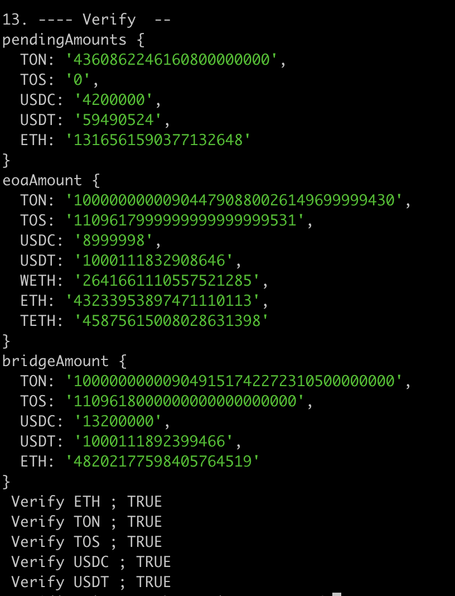

TON 자산 집계 
  1. 검토1  
톤 컨트랙에서 발생한 트랜잭션 로그에서 Transfer 이벤트에서 발생한 from, to 주소를 모두 집계하여,집계된 주소들의 톤잔액과 총발행량을 비교한다
 *집계된 계정은 총 101 계정이고, 집계된 잔액 총합은 톤의 총발행량보다 131.998 TON 개가 작다. *

await getBalanceAndTotalUsingTransferEvent()
```javascript
accounts.length 101
{
  '0x0000000000000000000000000000000000000000': '0',
  '0x24884b9a47049b7663aedac7c7c91afd406ea09e': '2020243580261652170364',
  '0xb68aa9e398c054da7ebaaa446292f611ca0cd52b': '9675760035812616948362201',
  '0x5d17f27e058f3178f87289897e35cf224021e24b': '270736142017425170816666',
  '0x0b4695d5eb7c4e207d1b86cffa9eb39db56413f2': '0',
  '0xb8e4ccf9ba7cb88ac4d0efd18c3d218545a12e64': '1246386019698841883808',
  '0x709c67488edc9fd8bdaf267bfa276b49cd62c217': '12686047746963327',
  '0x00002d4dcdc5741ee390ddfa08c0e70251fb07cb': '102199008631882568494',
  '0x942d6ac7a6702bb1852676f3f22aee38bd442e4c': '1583567575095311687683',
  '0xb045a7ee4e4ebac5431ea13ca27a54dd750e9253': '0',
  '0x29dafef687e0a9102435e7ae23f7e77653a10bae': '38986196536980455353',
  '0x205f0b56ff36fd68536135cdc04c6dce2affce4e': '26691252331754346150',
  '0xe3136da8af4a3ee7dc92dedd9bd4daa2a7e447e7': '388085672296065995335',
  '0x36ef528de0b8ab551553e5b5a615f9aaac158964': '179599490062582091839',
  '0x8e84d8e6ee404377d797051cb297540dd559abd1': '52584979456004555270',
  '0x0c5aa0d617f7d88e6b594bf449920aac6ab241ca': '0',
  '0x8091c2fd8a79a9ef812d487052496243f6825b02': '11170100592502407345',
  '0x01341c55130b6d5512d51a24fc02ca9b36054ea4': '202025218393219854',
  '0xc1eba383d94c6021160042491a5dfaf1d82694e6': '859325732326164688329',
  '0x9e628caad7a6dd3ce48e78812241b41bdbef6244': '99999999999000025000000000000000000',
  '0x119acd8f49f5b629d29f2828c52dfa0c2274e0e8': '5636739445563100283',
  '0x08a74a0075a2c3a786a84439812a141c6c8b73f3': '2110594000000000000000',
  '0x98e2ee7dcbdebfe5e3d51f9136f938c88a7d63f3': '1000000000000000000',
  '0x233434c600e789d9d0595f7012c5964921ba4749': '1498912376837145311604',
  '0x961b6fb7d210298b88d7e4491e907cf09c9cd61d': '79900000000000000000',
  '0x1a681d0e32f8a1d0a5ba94113ecbc1a5df92e50f': '500000000000000000000',
  '0x6d3563ff722de6ff0809818ee1b808f8a05f92c4': '2400000000000000000000',
  '0xe59d88eb24df45e7ef72b2af0e40714fa3277733': '1000000000000000000',
  '0xd4335a175c36c0922f6a368b83f9f6671bf07606': '1523000000000000000000',
  '0x97c765583e28a5c1d453e8b3f5e6ab0737e75ad3': '4994382667362951680',
  '0x708e963030ba43b3118bd65f11c00db5400f77ed': '1',
  '0x11b08df706a425d7a1b280d953e1576557402149': '1200000000000000000000',
  '0xe8bb5c3149c8b70de1a973d546e359164de19de7': '0',
  '0x757de9c340c556b56f62efae859da5e08baae7a2': '996000000000000000',
  '0x8a9fb22afa73083ee183ca8e751faeab7efd7f23': '112000000000000000000',
  '0x48a38c840df7761d8b42ba233a3548b0dac3926e': '7001000000000000000',
  '0xf81f0a9af9f7c682b4be0345c340171ce3f0ffa3': '711393811230588069235',
  '0xbd20cd677066ced4099a479febd2a416686917bb': '2526000000000000000000',
  '0x43700f09b582ee2bfcce4b5db40ee41b4649d977': '120000000000000000000',
  '0xfb2a94f731ade55f8b8bef7836ecb423bea576b1': '308500350000000000000',
  '0xf0b595d10a92a5a9bc3ffea7e79f5d266b6035ea': '0',
  '0xa8e3d5fc664ed9c16c5f4750d7d91146a0135af8': '1527992000000000000000',
  '0x8be59251502bd3a6c27649e8603c228b0a0a0889': '321459549263585497',
  '0x0af43d8c1e0a3db0bb6e8c1ed34cb7a702368b6e': '500000000000000000000',
  '0xece74cec10e292e47f6d2fa08401039947cb843f': '500000000000000000000',
  '0x16c0e69c33b8560336e19fb9592d37c37845dc34': '500000000000000000000',
  '0xd5d95128666aae88b2e21d56af7bdbde03f13704': '10000000000000000000',
  '0x2270bf371160810dfe48777987de96e641952144': '10348332340000000100000',
  '0xaa5a562b2c3ca302afa35db0b94738a7384d6aa3': '2738000029292000000000',
  '0x3821432c5ac45fd3626b78d73845bb91eaa95e21': '80000000000000000000',
  '0x6af308a9de1c5dcbe4b2586284e7fcf52a104125': '25000000000000000000',
  '0x061fa95a703fa63df8d2de34d9618c384725cc47': '25000000000000000000',
  '0x59d5e2071a5f9b5bf52908fc83a4aa33206ebb28': '100000000000000000000',
  '0x11b4d2274581f62535e0effe2169161a25ede4e7': '100000000000000000000',
  '0xa662bec667fe4670db4db33120b2d6b89885fe45': '50000000000000000000',
  '0xbd5c6a99b97ef79f4bee97bc1a6597683b397579': '910000000000000000000',
  '0x08311244c6ffd5eb90fd924f7b5c90524f007b2c': '50040000000000000000000',
  '0xcfc2f094612e91458551677e00b8b4045610b3df': '25000000000000000000',
  '0x1958f59fdb4a5956ef7bded3d1fa929fd42524d6': '23394748389898492005',
  '0x9dbfda1de782a918e8d8e9c355da830a5ee70d6e': '832751856634229491148',
  '0xbbc242c1d7d5605952201d976e71b05b1e025af3': '33200000000000000000',
  '0x9f2429c483802e5a8dcf8cd6af4e30c0479cd841': '1187275564021685719188',
  '0xc78f3bc6a1f43e6dd892631a632ca650f7393b71': '403780543210999999820',
  '0xceb2196addf345f68d1f536ddaa49fe54bcbddad': '250000000000000000000',
  '0x7cf8ad47c1b5e18cd827633f9e25538a08db5448': '51000000000000000000',
  '0xb4032ff3335f0e54fb0291793b35955e5da30b0c': '182334203210876443211',
  '0xb72d4693de57de4d9c013bc19141f4ff1a580f89': '100000000000000000000',
  '0xb0582ec48ec81714142bfe9e47b8c54d4428cd7a': '91951000000000000000',
  '0xfc8071d3ba8f18c8661fd068745389a9cf2d027f': '10289000000000000000',
  '0xda9b006a2d6c39f69e447924994018c08e268f7a': '59700000000000000000',
  '0x608150e8c85afa69bedff9bfb15d4ec87ba0a278': '20000000000000000000',
  '0xf7f036f3e66c41ff9b62816003c2fc5efd451718': '10000000000000000000',
  '0x386069be13e3365508b3c6046f50d39c3b87abe8': '10000000000000000000',
  '0x21a82a114d65db20d5db33f5c9dbb54f1a8acf4e': '70003456789123456789',
  '0x5eae11b54bdebd5d268ae787b841f6dd5af932bc': '990000000000000000000',
  '0x6099cee6cb4573ed8d2b383c0b1d1f06a9a168b1': '280000000000000000000',
  '0xc23aa557ba616b89897ae3ba810ca42b0acf56e8': '5510000000000000000',
  '0x503c48d03b6d819b7c7d94c54fe5492f3a20a0ac': '7960000000000000000',
  '0xbbf8606a4879ac01a5b73a3787edd1d40ed2b6ac': '1999000000000000000',
  '0x3357c9c11e850a7b7e28d6844f131083279edc88': '7300000000000000000',
  '0x5bc1a2916f991735ae193579c6fea27dcbb8d5d0': '80000000000000000000',
  '0x352dbe29947a0d6943f0c30b96f8f9e150a0d931': '2996764846835762820230',
  '0x4c7d10017cedda5336e742172cdb918b0cce26c2': '0',
  '0x668bce2498c252f9eb0ef631d16630e9f30ab833': '1410000000000000000',
  '0x99802e96072f889d6d09e528df118f67b08698e0': '382900009109600000000',
  '0xdba98def07fa507cf640bf6447374e3250c22f2d': '100000000000000000000',
  '0x5c5c36bb1e3b266637f6830fcae2ee2715339eb1': '12789723538598247111',
  '0x1c0d3579e3126df307af1d2e7e269113cc23927e': '123456789000000000',
  '0x0fd29d8089c80665086760261cdcce24ce546270': '9837900000000000000',
  '0xc9fb4b4547137409d46e0c26cbf7c03978b8c787': '628293100000000000195',
  '0x2394a6281d3a5978ce63a548412e75aa9fcba415': '278000000000000000000',
  '0xc74b7b9ab111001a6ecf4477fe9849e0e965deaa': '7007000000000000000',
  '0x15759359e60a3b9e59ea7a96d10fa48829f83beb': '9999999999999999985',
  '0x9e0d7f7f5ddb5f8d3e3b2d8070876c251f29962f': '240000000000000000000',
  '0xd3f8e0f099a172f4139a34cf8d4058c61f6a5dc4': '20000000000000000000',
  '0xd520b0d021c779df9296fed737ee8d4ff87d512b': '0',
  '0x65f65bfaaaec2d31dd24420205ec7e4d34c6f2aa': '105000000000000000000',
  '0xc127c8db7fbca0b3e1aba9e12b9978ddba8b4f7e': '585000000000000000000',
  '0x9d4c4e8bee049df7bbfe8e4b81cf94b27c036328': '1500000000000000000',
  '0x9c6e8a4a62a139c4abdafe23cb432f758a5b8525': '0',
  '0x6526728cfdcb07c63ca66fe36b5aa202067ee75b': '950999980000000000000'
}
sum 100000000009044658.8820261497
totalSupply 100000000009044790.8800261497
totalSupply.sub(sum) 131.998
```
  1. 검토 2
CORE 팀의 state-titan-sepolia-latest.json 자료 (디비 덤프 받은 자료)를 이용 

이 자료에는 모든 계정의 stateRoot와 이더잔액등을 가지고 있다. 

모든 계정을 집계하여, 해당 모든 계정에 대해 톤 잔액을 조회한다. 

    - 디비에서 집계된 총 계정은 941개이며, 
    - 위의 검토1에서 집계되었은나, 디비 덤프받은것에서 누락된 계정은 아래와 같이 11 계정이며, 각 계정의 톤 잔액은 우측에 표시해두었다. 
11 개의 계정
```javascript

unKnownUsers [
  '0x0000000000000000000000000000000000000000', 0
  '0x9e628caad7a6dd3ce48e78812241b41bdbef6244', 99999999999000025000000000000000000
  '0x48a38c840df7761d8b42ba233a3548b0dac3926e', 7001000000000000000
  '0xd5d95128666aae88b2e21d56af7bdbde03f13704', 10000000000000000000
  '0xaa5a562b2c3ca302afa35db0b94738a7384d6aa3', 2738000029292000000000
  '0xceb2196addf345f68d1f536ddaa49fe54bcbddad', 250000000000000000000
  '0x7cf8ad47c1b5e18cd827633f9e25538a08db5448', 51000000000000000000
  '0xb72d4693de57de4d9c013bc19141f4ff1a580f89', 100000000000000000000
  '0xfc8071d3ba8f18c8661fd068745389a9cf2d027f', 10289000000000000000
  '0xda9b006a2d6c39f69e447924994018c08e268f7a', 59700000000000000000
  '0xdba98def07fa507cf640bf6447374e3250c22f2d' 100000000000000000000
]
```
    - 디비 덤프받은것에서는 존재했으나, 위의 검토1에서 집계되지 않은 계정은 총 87 개의 계정이고, 이 계정들은 톤 잔액합은 0 이었다.  
87 개의 계정 
```javascript

    const missings = [
      '0x0017184099790fc5f760cc4abd2fd2a1dc0c9536',
      '0x01093fd8c257c6fae9df4309fdaa6c2eef276900',
      '0x01297d4ac852cae1cff2bb7626400e48a66f63c3',
      '0x01472fe78e3179e1d11d912d22db6951b507a68a',
      '0x01f3239898df4fd2b54a5030f515b4280f78ec8d',
      '0x020edd1b25e64c6df3f30e2891b989a91d1ffbd1',
      '0x0252d3e50738ab3237eb6d586fb5c006062b1dea',
      '0x026510c75290c6ef53027494f1b784d8982f5441',
      '0x02810688dd4679d6730c9f953978970cee6b5d4f',
      '0x03495afed63d688c3f6ce65703854d8fdd2b5b35',
      '0x0376e73c020584b98688d15d87d5528068546ac9',
      '0x03e9d51654a5e3071e26ccadd379d81c7cd2e50d',
      '0x03f0e138bfe49c206ce8368be94ba87c8e103bde',
      '0x03f55c5cf1a719902f0c8facce477e8227428f76',
      '0x041038d9693aae531d1ce27b75d3478359875cee',
      '0x047bb35c40231b557719864e24f248a13aefb179',
      '0x049bf8c1291938ae5a8cbb109062a91af3a153e5',
      '0x0515cbc459a2795b3d74933ebf34cc0f0f74856b',
      '0x0686e1e390246d2dd257ba02a47e5ce7e2c159e4',
      '0x06ad364247b4f8e491ce401b6dd7552b8ed289de',
      '0x0701c8c03b1aa9229a4dff0af021bab7d002a10d',
      '0x07562f63b1862fe30c01556b8eeab97cf260a8cf',
      '0x0776e62235955c3d87568fb91fc3b5fef026d4f4',
      '0x077f923efb774f8dbcb2cb1f93dd1d4b893c1177',
      '0x07877fa4e98d4e38585c5f0955f1c1785276228a',
      '0x07c5e5694596000038b82203a2b1436a3e026e0a',
      '0x08821e390c3a8a4f36e8c1fdf32d1c28795141a3',
      '0x08f5d651f68b81bda695c175ea5040e377b999e6',
      '0x09046cad6e5acc033dfd522cd8136f4ff246bacf',
      '0x0997a0d4b7d6927c9abb8b53ec2803ffe16577b1',
      '0x09dc690b70711e1fe5e1045fd00f3dcbf18f16e8',
      '0x0a1faa1489215449b4e647b5cc40f644c4acdacf',
      '0x0a7fe8dfb76e41e88730e8e5f6812d3a7242adbc',
      '0x0b5274c60abfc550c7c137e27a92f853da7921a9',
      '0x0b5ef4f57364482960f8d0c661f0a41919adb39c',
      '0x0b61827b9cf870fc729653e1adb55e5b1e2d839b',
      '0x0c15c9271cb6e44515244322e9e1e1181ff68a3e',
      '0x0c448437edcb2a093266df30619924ae8131b9e3',
      '0x0c68da076ccb17d578ebaf5765dbd849e4725b3f',
      '0x0c7169d54c5f718a4af9b91764d7616fca6dcc50',
      '0x0c847f8be1db9206bfa1479bcecdfb81a5e11776',
      '0x0d8ee722295a7bf53cb0e2d66f397f1a1e328f3a',
      '0x0e24022d12afd94559eb82878ba2edaa32a630b7',
      '0x0e3a82db56c11b75b09310633bd045dafa27423c',
      '0x0e71723c42f3c305638d746723a8cd68abdb253a',
      '0x0e891b7e8ac412a99bf99313b155cec2ec607b54',
      '0x0ebd097cbd911e5a5dc401d7c91f71b47f0ee178',
      '0x0ec0e4850c4d97a0237a82431574b6bfa405237e',
      '0x0ee4e6546e0687b5133fb07a2a25952bcfaa4a8f',
      '0x0f24ffa71ccffa363fd50f0951b409ee43cafd5b',
      '0x0f4f8485d10d720a84bce17dc6c07da06e7b2973',
      '0x0f69941aef5e33d504359f8452ae7f41acd72745',
      '0x0f93d2937a0e75bd2d841c97d167cd4f67d28744',
      '0x0fc9adf4143dd0e3e024576820f32e39ce0703bf',
      '0x0ff0ec204eeeab2a0ecacfa6b1c1506fe9da886d',
      '0x1044e28bd30bb231bfe6658aa724b37e71189ee8',
      '0x11075399ea88f44d73fd5f4f0b3c3ce3ea563859',
      '0x117b65cd97f11745abd50f362f7d227a106d6c33',
      '0x12566983fa972e68db36e008412058c7aff874b3',
      '0x129286c288228a462b107a526182bc91da7e3357',
      '0x1308940bb45ce6136bcc4a4a0c3cb9586094afd7',
      '0x13175e52e9791c155c78bf59e690bd106f5c1328',
      '0x136827ace28b05263b3fdd550039bdfd21e4ad5f',
      '0x139d8fc702f01986a501e0e15fb5dd506beb5367',
      '0x13bcb866d580ffe070f6fa8fb7e23e1a05a96a85',
      '0x14806e22206ba2e90a4569349131124bfc7065b3',
      '0x14ce092429737da612754358fb6da10ac46f2e22',
      '0x14db65efa498b0609a4a8bb29a7c826367876c32',
      '0x152c3a5236094258e98a23d5b66978759de9908c',
      '0x15883e811648598eab1dfbd94376f150b0f72e5a',
      '0x15a809498dc6e4d64525d654cb38550a65ddc112',
      '0x15b46be5dfd669ddd016ca8a6aecaf0ae7273ca9',
      '0x164637e4fa98f6049833544111700f804031c50c',
      '0x164655403242fffee368d5bf3e7564d1fcc7893b',
      '0x16744c078e0a8bc4455ae5205023b312f6dc6365',
      '0x169507b0a64587f8699f7d1d9304a833ad884ef9',
      '0x16a272cc71dc2f46156562dccadc0e6710264016',
      '0x16ed250f40ee25b79a76215124dbf6d00ca1a375',
      '0x16f39d0d91bb6234a2e2660fbddcbf5b8ddafc18',
      '0x1723c153e86d589ce1c7478295bba783a2df9dd7',
      '0x176e8c25934c264bfd4533bccf758f333a8fb91e',
      '0x17b3e73833880ab6e8a632220968f9371cb533bf',
      '0x17dd980926d433fb6c6824d7b6cd3553d185dab4',
      '0x180a1b275b3e98f80313e6d0d7ddc61a8b492527',
      '0x18299eec35afb6f18284c6d927fddf57ca6cffcf',
      '0x18a8c120fd2630d0b99a8c94a5a1274e9a3d4c1d',
      '0x18b02000d2ba5e45f27419830576009addd0bb82'
    ]
```
  1. 검토3
    - 위의 검토 1에서 매 트랜잭션 마다  총 발행량을 조회하여, 블록마다 발행량의 증가량을 통해 어느 블록에서 차이가 발생하는지 확인하려고 하였으나,  제공되는 노드가 아카이브를 지원하지 않아. 특정블록에서의 상태 조회가 안되는 듯 합니다. 조회시 블록번호를 지정하여, 특정 블록 상태(스냅샷)에서의 잔액을 조회하려고 하였으나,  현재 데이타만 조회되어 검토를 할 수 없었습니다. 
  1. 검토4 (Suah)
    1. deposit 금액이 [큰것 기준](https://explorer.titan-sepolia.tokamak.network/tx/0x23dcfad6bed14151e740c52ad47dae1664ff29a35293d70a9965bff127458f0b)으로 문제가 있는지 확인 → 문제 없음, Overflow check
    1. L2 TON이 만들어지기전에 deposit된것 때문에 문제 있는건지 확인 → 기존에 있는 토큰이 없어지면 안됨 / 문제 없음
    1. bridge > L2 확인 → 문제 없을듯, pending withdrawal 확인 필요
    1. 버닝이 된후 totalSupply에서 빼줘야되는데 안되는경우 확인 ⇒ [코드상](https://github.com/OpenZeppelin/openzeppelin-contracts/blob/master/contracts/token/ERC20/ERC20.sol) 불가능
    1. 로그 집게 문제? ⇒ 가능, 누락가능성 있음
    1. 

1. 원인파악은 필요 → 나중에 지원 → 원인 파악 됨 
1. 시나리오 진행 
- L1StandardBridge’s Owner
  - Executor (EOA) : [0x37212a8F2abbb40000e974DA82D410DdbecFa956](https://sepolia.etherscan.io/address/0x37212a8F2abbb40000e974DA82D410DdbecFa956) 
  - Contract:  [L1StandardBridge_Proxy](https://sepolia.etherscan.io/address/0x1F032B938125f9bE411801fb127785430E7b3971#readProxyContract) 0x1F032B938125f9bE411801fb127785430E7b3971  

# Aggregating asset allocation data (titan-sepolia)

- Base Data Folder : `/data/sunset_titansepolia/`
1. titan-sepolia account aggregation
  - Aggregate accounts using Transfer events for all assets
    - transactions : [link](https://github.com/tokamak-network/L2-Assets-Migration/tree/get_owners_of_assets/titanLagacy/data/transactions)  ` /transactions`
  - Aggregate the accounts of titan-sepolia <u>*using the API*</u><u> </u>and merge them with the above aggregates.
  - ***result: accounts :***[*** link***](https://github.com/tokamak-network/L2-Assets-Migration/blob/get_owners_of_assets/titanLagacy/data/accounts/titansepolia_accounts.json)***  ( only ***[***eoas***](https://github.com/tokamak-network/L2-Assets-Migration/blob/get_owners_of_assets/titanLagacy/data/accounts/titansepolia_accounts_eoa.json)***, only ***[***contracts***](https://github.com/tokamak-network/L2-Assets-Migration/blob/get_owners_of_assets/titanLagacy/data/accounts/titansepolia_accounts_contract.json)*** ) ***
    - acounts : `/accounts/titansepolia_accounts.json`
    - EOA: `/accounts/titansepolia_accounts_eoa.json`
      - In L1, the contract address  [link](https://github.com/tokamak-network/L2-Assets-Migration/blob/get_owners_of_assets/titanLagacy/data/accounts/titansepolia_accounts_eoa_not_l1.json) `/accounts/titansepolia_accounts_eoa_not_l1`
```javascript
contractsL1.length 18
[
  '0x1d288952363b14b6beefa6a5fb2990203963f399',
  '0x1f032b938125f9be411801fb127785430e7b3971', ==> 0.11011 ETH (L1StandardBridge)  => owner 에게 보내기 [0x37212a8F2abbb40000e974DA82D410DdbecFa956](https://sepolia.etherscan.io/address/0x37212a8F2abbb40000e974DA82D410DdbecFa956) 
  '0xbaf4acb7c92bc487bed650976424c785727b4dd1',
  '0x7aa2d4512942c6c25d461119af13354b16c2f501',
  '0x8942235c15b38379e7e6cc0ab674650b1e0ac25a',
  '0x693a591a27750eed2a0e14bc73bb1f313116a1cb',
  '0x48bd3707805cfdd51252383550c6879dd3ac23b9',
  '0x42d3b260c761cd5da022db56fe2f89c4a909b04a',
  '0xc123047238e8f4bfb7ad849ca4364b721b5abd8a',
  '0x4e59b44847b379578588920ca78fbf26c0b4956c',
  '0x914d7fec6aac8cd542e72bca78b30650d45643d7',
  ***'0x0cf56abde564c87bdc55a150c972c8430128eac2',==> 0.5 ETH ( Not Verified )  => deployer 에게 보내기 0xD4335A175c36c0922F6A368b83f9F6671bf07606 => 문제가 있어보임. (L2 eoa가 의의제기 할 수 있다. ) ***
  '0x79a53e72e9ccfae63b0fb9a4edb66c7563d74dc3',
  '0x1238536071e1c677a632429e3655c799b22cda52',
  '0x0227628f3f023bb0b980b67d528571c95c6dac1c',
  '0x17ddb5ceae35a40a520c4dcf1f70409be9a25406',
  '0x490a4a749e5c6decc20e29f00279a720a84b4d11',
  '0xa30fe40285b8f5c0457dbc3b7c8a280373c40044'
]
```

        - 2024.12.24 

```json
contractsL1.length 19
[
  '0x1d288952363b14b6beefa6a5fb2990203963f399',
  '0x1f032b938125f9be411801fb127785430e7b3971',
  '0xbaf4acb7c92bc487bed650976424c785727b4dd1',
  '0x7aa2d4512942c6c25d461119af13354b16c2f501',
  '0x8942235c15b38379e7e6cc0ab674650b1e0ac25a',
  '0x693a591a27750eed2a0e14bc73bb1f313116a1cb',
  '0x48bd3707805cfdd51252383550c6879dd3ac23b9',
  '0x42d3b260c761cd5da022db56fe2f89c4a909b04a',
  '0xc123047238e8f4bfb7ad849ca4364b721b5abd8a',
  '0x4e59b44847b379578588920ca78fbf26c0b4956c',
  '0x914d7fec6aac8cd542e72bca78b30650d45643d7',
  '0x0cf56abde564c87bdc55a150c972c8430128eac2',
  '0x79a53e72e9ccfae63b0fb9a4edb66c7563d74dc3',
  '0x1238536071e1c677a632429e3655c799b22cda52',
  '0x0227628f3f023bb0b980b67d528571c95c6dac1c',
  '0x17ddb5ceae35a40a520c4dcf1f70409be9a25406',
  '0x490a4a749e5c6decc20e29f00279a720a84b4d11',
  '0xa30fe40285b8f5c0457dbc3b7c8a280373c40044',
  '0x9308c1637530ccac79961fc152887e148e0f1159' -> 새로 집계됨 자산은 없음  
]
```
    - contracts: `/accounts/titansepolia_accounts_contract.json`
1. Balance aggregation by asset
  - *** ***[***link***](https://github.com/tokamak-network/L2-Assets-Migration/tree/get_owners_of_assets/titanLagacy/data/balances)***  ***
1. Confirm there is no difference between the total supply amount and the balance sum by asset.
```javascript

--- getBalances :  ETH
accounts.length 1036
sum 45.875615008028631871
totalSupply 45.875615008028631871
totalSupply.sub(sum) 0.0

--- getBalances :  TON
accounts.length 1036
sum 100000000009044790.8800261497
totalSupply 100000000009044790.8800261497
totalSupply.sub(sum) 0.0

--- getBalances :  TOS
accounts.length 1036
sum 1109618.0
totalSupply 1109618.0
totalSupply.sub(sum) 0.0

--- getBalances :  USDC
accounts.length 1036
sum 9.0
totalSupply 9.0
totalSupply.sub(sum) 0.0

--- getBalances :  USDT
accounts.length 1036
sum 1000111832.908942
totalSupply 1000111832.908942
totalSupply.sub(sum) 0.0

--- getBalances :  WETH
accounts.length 1036
sum 2.641661110557521758
totalSupply 2.641661110557521758
totalSupply.sub(sum) 0.0

--- getBalances :  DOC
accounts.length 1036
sum 0.0
totalSupply 0.0
totalSupply.sub(sum) 0.0

--- getBalances :  AURA
accounts.length 1036
sum 0.0
totalSupply 0.0
totalSupply.sub(sum) 0.0
```
1.  Contracts’s Assets 
  1. UniswapV3 Assets 
    1. ***Assets by Lp Token: ***[***links***](https://github.com/tokamak-network/L2-Assets-Migration/blob/get_owners_of_assets/titanLagacy/data/accounts/1.titansepolia_contract_lp_tokens.json)*** ***`/accounts/1.titansepolia_contract_lp_tokens.json`
    1. ***Pools Assets: ***[***link***](https://github.com/tokamak-network/L2-Assets-Migration/blob/get_owners_of_assets/titanLagacy/data/accounts/2.titansepolia_contract_pools.json)*** ***`/accounts/2.titansepolia_contract_pools.json`

Sum of LPs by Pool: [link](https://github.com/tokamak-network/L2-Assets-Migration/blob/get_owners_of_assets/titanLagacy/data/balances/1.titansepolia_sum_of_lps_by_pool.txt)  `/balances/1.titansepolia_sum_of_lps_by_pool.txt `
```javascript
==============================
==== Sum of LPs by Pool ======

pools length19


0 Pool  == 0x5d17f27e058f3178f87289897e35cf224021e24b ==============

TON (Pool       ) :270736142017425170816666
TON (LPS of Pool) :270736142017425170816619
 Diff             : 47
TOS (Pool       ) :175474080086578375533723
TOS (LPS of Pool) :175474080086578375533665
 Diff             : 58
USDC (Pool       ) :0
USDC (LPS of Pool) :0
 Diff             : 0
USDT (Pool       ) :0
USDT (LPS of Pool) :0
 Diff             : 0
WETH (Pool       ) :0
WETH (LPS of Pool) :0
 Diff             : 0


1 Pool  == 0x0c5aa0d617f7d88e6b594bf449920aac6ab241ca ==============

TON (Pool       ) :0
TON (LPS of Pool) :0
 Diff             : 0
TOS (Pool       ) :1908312833353108484382
TOS (LPS of Pool) :1908312833353108484318
 Diff             : 64
USDC (Pool       ) :0
USDC (LPS of Pool) :0
 Diff             : 0
USDT (Pool       ) :0
USDT (LPS of Pool) :0
 Diff             : 0
WETH (Pool       ) :5868769707493701
WETH (LPS of Pool) :5868769707493669
 Diff             : 32


2 Pool  == 0xb8e4ccf9ba7cb88ac4d0efd18c3d218545a12e64 ==============

TON (Pool       ) :1246386019698841883808
TON (LPS of Pool) :1246386019698841883676
 Diff             : 132
TOS (Pool       ) :0
TOS (LPS of Pool) :0
 Diff             : 0
USDC (Pool       ) :0
USDC (LPS of Pool) :0
 Diff             : 0
USDT (Pool       ) :0
USDT (LPS of Pool) :0
 Diff             : 0
WETH (Pool       ) :31396263067033621
WETH (LPS of Pool) :31396263067033490
 Diff             : 131


3 Pool  == 0x898cbf6aa5a7867c0301469c4e0f8dab4d023e35 ==============

TON (Pool       ) :0
TON (LPS of Pool) :0
 Diff             : 0
TOS (Pool       ) :0
TOS (LPS of Pool) :0
 Diff             : 0
USDC (Pool       ) :0
USDC (LPS of Pool) :0
 Diff             : 0
USDT (Pool       ) :0
USDT (LPS of Pool) :0
 Diff             : 0
WETH (Pool       ) :801994153428685148
WETH (LPS of Pool) :801994153428685143
 Diff             : 5


4 Pool  == 0xb045a7ee4e4ebac5431ea13ca27a54dd750e9253 ==============

TON (Pool       ) :0
TON (LPS of Pool) :0
 Diff             : 0
TOS (Pool       ) :0
TOS (LPS of Pool) :0
 Diff             : 0
USDC (Pool       ) :0
USDC (LPS of Pool) :0
 Diff             : 0
USDT (Pool       ) :168766442
USDT (LPS of Pool) :168766423
 Diff             : 19
WETH (Pool       ) :723583885896386185
WETH (LPS of Pool) :723583885896386165
 Diff             : 20


5 Pool  == 0x29dafef687e0a9102435e7ae23f7e77653a10bae ==============

TON (Pool       ) :38986196536980455353
TON (LPS of Pool) :38986196536980455256
 Diff             : 97
TOS (Pool       ) :26735686161982862965
TOS (LPS of Pool) :26735686161982862868
 Diff             : 97
USDC (Pool       ) :0
USDC (LPS of Pool) :0
 Diff             : 0
USDT (Pool       ) :0
USDT (LPS of Pool) :0
 Diff             : 0
WETH (Pool       ) :0
WETH (LPS of Pool) :0
 Diff             : 0


6 Pool  == 0xe8bb5c3149c8b70de1a973d546e359164de19de7 ==============

TON (Pool       ) :0
TON (LPS of Pool) :0
 Diff             : 0
TOS (Pool       ) :0
TOS (LPS of Pool) :0
 Diff             : 0
USDC (Pool       ) :0
USDC (LPS of Pool) :0
 Diff             : 0
USDT (Pool       ) :9986489196
USDT (LPS of Pool) :9986489193
 Diff             : 3
WETH (Pool       ) :0
WETH (LPS of Pool) :0
 Diff             : 0


7 Pool  == 0x205f0b56ff36fd68536135cdc04c6dce2affce4e ==============

TON (Pool       ) :26691252331754346150
TON (LPS of Pool) :26691252331754346146
 Diff             : 4
TOS (Pool       ) :0
TOS (LPS of Pool) :0
 Diff             : 0
USDC (Pool       ) :0
USDC (LPS of Pool) :0
 Diff             : 0
USDT (Pool       ) :12503
USDT (LPS of Pool) :12499
 Diff             : 4
WETH (Pool       ) :0
WETH (LPS of Pool) :0
 Diff             : 0


8 Pool  == 0xe3136da8af4a3ee7dc92dedd9bd4daa2a7e447e7 ==============

TON (Pool       ) :388085672296065995335
TON (LPS of Pool) :388085672296065995076
 Diff             : 259
TOS (Pool       ) :0
TOS (LPS of Pool) :0
 Diff             : 0
USDC (Pool       ) :0
USDC (LPS of Pool) :0
 Diff             : 0
USDT (Pool       ) :186838077
USDT (LPS of Pool) :186837808
 Diff             : 269
WETH (Pool       ) :0
WETH (LPS of Pool) :0
 Diff             : 0


9 Pool  == 0x36ef528de0b8ab551553e5b5a615f9aaac158964 ==============

TON (Pool       ) :179599490062582091839
TON (LPS of Pool) :179599490062582091828
 Diff             : 11
TOS (Pool       ) :0
TOS (LPS of Pool) :0
 Diff             : 0
USDC (Pool       ) :0
USDC (LPS of Pool) :0
 Diff             : 0
USDT (Pool       ) :0
USDT (LPS of Pool) :0
 Diff             : 0
WETH (Pool       ) :0
WETH (LPS of Pool) :0
 Diff             : 0


10 Pool  == 0x3ee835cfbdc36a5236ca959af45e1a07125fe28f ==============

TON (Pool       ) :0
TON (LPS of Pool) :0
 Diff             : 0
TOS (Pool       ) :0
TOS (LPS of Pool) :0
 Diff             : 0
USDC (Pool       ) :0
USDC (LPS of Pool) :0
 Diff             : 0
USDT (Pool       ) :444311
USDT (LPS of Pool) :444310
 Diff             : 1
WETH (Pool       ) :0
WETH (LPS of Pool) :0
 Diff             : 0


11 Pool  == 0x8e84d8e6ee404377d797051cb297540dd559abd1 ==============

TON (Pool       ) :52584979456004555270
TON (LPS of Pool) :52584979456004555258
 Diff             : 12
TOS (Pool       ) :0
TOS (LPS of Pool) :0
 Diff             : 0
USDC (Pool       ) :0
USDC (LPS of Pool) :0
 Diff             : 0
USDT (Pool       ) :0
USDT (LPS of Pool) :0
 Diff             : 0
WETH (Pool       ) :4139243752761753
WETH (LPS of Pool) :4139243752761742
 Diff             : 11


12 Pool  == 0xb20c3d5ce51567cdcde8ebdf201be91536e0c188 ==============

TON (Pool       ) :0
TON (LPS of Pool) :0
 Diff             : 0
TOS (Pool       ) :947955328684418485
TOS (LPS of Pool) :947955328684418287
 Diff             : 198
USDC (Pool       ) :0
USDC (LPS of Pool) :0
 Diff             : 0
USDT (Pool       ) :0
USDT (LPS of Pool) :0
 Diff             : 0
WETH (Pool       ) :515718014311700
WETH (LPS of Pool) :515718014311489
 Diff             : 211


13 Pool  == 0x3c4311308862524934d8991fa8254522164d4bb6 ==============

TON (Pool       ) :0
TON (LPS of Pool) :0
 Diff             : 0
TOS (Pool       ) :44325111492469822
TOS (LPS of Pool) :44325111492469777
 Diff             : 45
USDC (Pool       ) :0
USDC (LPS of Pool) :0
 Diff             : 0
USDT (Pool       ) :0
USDT (LPS of Pool) :0
 Diff             : 0
WETH (Pool       ) :46789415655992
WETH (LPS of Pool) :46789415655940
 Diff             : 52


14 Pool  == 0x1ac621f99a441c65a31439aa14c6d19e263253d9 ==============

TON (Pool       ) :0
TON (LPS of Pool) :0
 Diff             : 0
TOS (Pool       ) :0
TOS (LPS of Pool) :0
 Diff             : 0
USDC (Pool       ) :0
USDC (LPS of Pool) :0
 Diff             : 0
USDT (Pool       ) :0
USDT (LPS of Pool) :0
 Diff             : 0
WETH (Pool       ) :265392597582457
WETH (LPS of Pool) :265392597582454
 Diff             : 3


15 Pool  == 0x01341c55130b6d5512d51a24fc02ca9b36054ea4 ==============

TON (Pool       ) :202025218393219854
TON (LPS of Pool) :202025218393219852
 Diff             : 2
TOS (Pool       ) :0
TOS (LPS of Pool) :0
 Diff             : 0
USDC (Pool       ) :0
USDC (LPS of Pool) :0
 Diff             : 0
USDT (Pool       ) :0
USDT (LPS of Pool) :0
 Diff             : 0
WETH (Pool       ) :1
WETH (LPS of Pool) :0
 Diff             : 1


16 Pool  == 0x119acd8f49f5b629d29f2828c52dfa0c2274e0e8 ==============

TON (Pool       ) :5636739445563100283
TON (LPS of Pool) :5636739445563100279
 Diff             : 4
TOS (Pool       ) :651255585717105149
TOS (LPS of Pool) :651255585717105142
 Diff             : 7
USDC (Pool       ) :0
USDC (LPS of Pool) :0
 Diff             : 0
USDT (Pool       ) :0
USDT (LPS of Pool) :0
 Diff             : 0
WETH (Pool       ) :0
WETH (LPS of Pool) :0
 Diff             : 0


17 Pool  == 0x97c765583e28a5c1d453e8b3f5e6ab0737e75ad3 ==============

TON (Pool       ) :4994382667362951680
TON (LPS of Pool) :4994382667362951678
 Diff             : 2
TOS (Pool       ) :0
TOS (LPS of Pool) :0
 Diff             : 0
USDC (Pool       ) :0
USDC (LPS of Pool) :0
 Diff             : 0
USDT (Pool       ) :0
USDT (LPS of Pool) :0
 Diff             : 0
WETH (Pool       ) :211383550158855115
WETH (LPS of Pool) :211383550158855110
 Diff             : 5


18 Pool  == 0x3cddc27ac76848e45f74da37a36dd15058a3cb60 ==============

TON (Pool       ) :0
TON (LPS of Pool) :0
 Diff             : 0
TOS (Pool       ) :0
TOS (LPS of Pool) :0
 Diff             : 0
USDC (Pool       ) :4000000
USDC (LPS of Pool) :3999998
 Diff             : 2
USDT (Pool       ) :0
USDT (LPS of Pool) :0
 Diff             : 0
WETH (Pool       ) :69666666658716004
WETH (LPS of Pool) :69666666658716002
 Diff             : 2

```

Compare Pool Balance and Lp Total Assets : [link](https://github.com/tokamak-network/L2-Assets-Migration/blob/get_owners_of_assets/titanLagacy/data/balances/2.titansepolia_compare_pool_lps.txt)  `/``balances/2.titansepolia_compare_pool_lps.txt`
```javascript
=================================================
===  Compare Pool Balance and Lp Total Assets ===
=================================================

TON (Pool Balance):272679308775138719416238
TON (Sum of LPS  ):272679308775138719415668
 Diff             : 570


TOS (Pool Balance):177410772142119360874526
TOS (Sum of LPS  ):177410772142119360874057
 Diff             : 469


USDC (Pool Balance):4000000
USDC (Sum of LPS  ):3999998
 Diff             : 2


USDT (Pool Balance):10342550529
USDT (Sum of LPS  ):10342550233
 Diff             : 296


WETH (Pool Balance):1848860432697481677
WETH (Sum of LPS  ):1848860432697481204
 Diff             : 473

```

iii . Assets that EOA takes from Uniswap liquidity: 
1.  ***Common Contracts: ***[***link***](https://github.com/tokamak-network/L2-Assets-Migration/blob/get_owners_of_assets/titanLagacy/data/accounts/3.titansepolia_contract_commons.json)***  ***`/accounts/3.titansepolia_contract_commons.json`
  1. SwapRouter02, L2CrossTradeV1, TreasuryProxy, WstonSwapPool, RandomPack, … 
  1. Question 
    1. To which address is the Ether in **OVM_SequencerFeeVault ("0x4200000000000000000000000000000000000011") **sent?  
      1. sepolia: Titan Sepolia: 0x091C8a37384ED31a469Ff23Fe4A183D11f56B22b (TOP에서 개인키 관리 중)
      1. mainnet: Titan 0x6e1a64b7496DF60bF747085E89e1231A717fDd38 (Kevin 소유 주소)

```javascript
"0x4200000000000000000000000000000000000011":"OVM_SequencerFeeVault",
  "0x4200000000000000000000000000000000000006":"Wrapped Ether (WETH)",
```
    1. L1Bridge = "0x1f032b938125f9be411801fb127785430e7b3971” 의 주소가 L2에서 이더를 보유하고 있습니다. L2에서는 이 주소가 EOA로 인지되고 있습니다.  L2 "0x1f032b938125f9be411801fb127785430e7b3971” 의 주소에 있는 이더를 L1의 "0x1f032b938125f9be411801fb127785430e7b3971”(L1Bridge컨트랙)으로 보내도 괜찮은 것인가요? 
  1. As shown in the link, send the asset to an account with an address among owner, admin, and deployer.  
  1. ref : 144d96a4-00a3-80b8-b7c8-c84044928ac3 
  1. Assets that EOA takes from Contracts: 
[link](https://github.com/tokamak-network/L2-Assets-Migration/blob/get_owners_of_assets/titanLagacy/data/balances/4.titansepolia_asset_contracts_owner.json) `/``balances/4.titansepolia_asset_contracts_owner.json`
```javascript
 {
    "0xb68aa9e398c054da7ebaaa446292f611ca0cd52b": {
        "TON": "12686047746963327",
        "TOS": "15444914157231425186",
        "USDC": "0",
        "USDT": "0",
        "WETH": "0"
    },
    "0xf0b595d10a92a5a9bc3ffea7e79f5d266b6035ea": {
        "TON": "12986332340000000100000",
        "TOS": "0",
        "USDC": "0",
        "USDT": "2917000220",
        "WETH": "0"
    },
    "0x8be59251502bd3a6c27649e8603c228b0a0a0889": {
        "TON": "1903394748389898492005",
        "TOS": "0",
        "USDC": "0",
        "USDT": "0",
        "WETH": "0"
    },
    "0x5c5c36bb1e3b266637f6830fcae2ee2715339eb1": {
        "TON": "1522751856634229491148",
        "TOS": "0",
        "USDC": "0",
        "USDT": "0",
        "WETH": "0"
    },
    "0x08a74a0075a2c3a786a84439812a141c6c8b73f3": {
        "TON": "1070000000000000000000",
        "TOS": "0",
        "USDC": "0",
        "USDT": "0",
        "WETH": "0"
    },
    "0xb4032ff3335f0e54fb0291793b35955e5da30b0c": {
        "TON": "8800000000000000000",
        "TOS": "0",
        "USDC": "0",
        "USDT": "5",
        "WETH": "0"
    },
    "0x21a82a114d65db20d5db33f5c9dbb54f1a8acf4e": {
        "TON": "1410000000000000000",
        "TOS": "0",
        "USDC": "0",
        "USDT": "0",
        "WETH": "0"
    },
    "0x15759359e60a3b9e59ea7a96d10fa48829f83beb": {
        "TON": "868293100000000000195",
        "TOS": "0",
        "USDC": "0",
        "USDT": "0",
        "WETH": "0"
    },
    "sum": {
        "TON": "18360994731071875046675",
        "TOS": "15444914157231425186",
        "USDC": "0",
        "USDT": "2917000225",
        "WETH": "0"
    }
}
```

<u>This data is used to aggregate EOA assets.</u>
1. Details of assets received by EOA
  1. Read below data
    1. EOA: `/accounts/titansepolia_accounts_eoa.json`
      - Since the L2 EOA account is a CA in L1, modify it to be sent to the owner or distributor of the CA.
      - `/accounts/5.titansepolia_aseet_eoa_original.json` Information before correction 
    1. UniswapV3 Assets of EOA: `/balances/3.titansepolia_asset_lps_owner.json`
    1. Common Contract: `/balances/4.titansepolia_asset_contracts_owner.json`
  1. **Asset Aggregation by EOA: **
    1. [link](https://github.com/tokamak-network/L2-Assets-Migration/blob/get_owners_of_assets/titanLagacy/data/balances/5.titansepolia_asset_eoa.json) `/balances/5.titansepolia_asset_eoa.json`
**Users can make claims based on the above data.**

link  `/balances/7.titansepolia_total_eoa_asset.json`

```javascript
 ---- assetsAggregationByEOA: SUM ---- 
 
TON 100000000009044790.88002614969999943 
TOS 1109617.999999999999999531
USDC 8.999998
USDT 1000111832.908646
WETH 2.641661110557521285
```
1. Assets not withdrawn from L1
  1. L2 CrossDomainMessanger’s SentMessage 
    1. Transactions  [link](https://github.com/tokamak-network/L2-Assets-Migration/blob/get_owners_of_assets/titanLagacy/data/transactions/titansepolia_l2_send_message_17923.json)  `/transactions/titansepolia_l2_send_message_17923.json`
    1. Event  [link](https://github.com/tokamak-network/L2-Assets-Migration/blob/get_owners_of_assets/titanLagacy/data/transactions/titansepolia_l2_send_message_data_17923.json) `/transactions/titansepolia_l2_send_message_data_17923.json`
  1. Check **successfulMessages** storage in L1CrossDomainMessage 
    1. Check if L1 relayMessage is executed for L2 sent message [link](https://github.com/tokamak-network/L2-Assets-Migration/blob/get_owners_of_assets/titanLagacy/data/withdrawals/1.titansepolia_l1_cross_check_relayMessage_all.json)   `/withdrawals/1.titansepolia_l1_cross_check_relayMessage_all.json`
    1. L2 request for which L1 relayMessage is not executed [link](https://github.com/tokamak-network/L2-Assets-Migration/blob/get_owners_of_assets/titanLagacy/data/withdrawals/2.titansepolia_l1_cross_pending_relayMessage.json)   `/withdrawals/2.titansepolia_l1_cross_pending_relayMessage.json`
<u>**This request is considered pending. Calculate pending assets based on the assets of this request.**</u>

data
```json
{
    "0x07811133692f29c3511151aba88a2c8b8f3995e91ff4013e1ba8f8bdf7c160ca": {
        "target": "0x1F032B938125f9bE411801fb127785430E7b3971",
        "sender": "0x4200000000000000000000000000000000000010",
        "message": "0x1532ec340000000000000000000000008091c2fd8a79a9ef812d487052496243f6825b020000000000000000000000008091c2fd8a79a9ef812d487052496243f6825b02000000000000000000000000000000000000000000000000013fbe85edc9000000000000000000000000000000000000000000000000000000000000000000800000000000000000000000000000000000000000000000000000000000000000",
        "messageNonce": "100024",
        "xDomainCalldata": "0xcbd4ece90000000000000000000000001f032b938125f9be411801fb127785430e7b39710000000000000000000000004200000000000000000000000000000000000010000000000000000000000000000000000000000000000000000000000000008000000000000000000000000000000000000000000000000000000000000186b800000000000000000000000000000000000000000000000000000000000000a41532ec340000000000000000000000008091c2fd8a79a9ef812d487052496243f6825b020000000000000000000000008091c2fd8a79a9ef812d487052496243f6825b02000000000000000000000000000000000000000000000000013fbe85edc900000000000000000000000000000000000000000000000000000000000000000080000000000000000000000000000000000000000000000000000000000000000000000000000000000000000000000000000000000000000000000000",
        "xDomainCalldataHash": "0xbad352ff63350b58913ea1d6e71f1e1fb65ab54d37ce7681bd8a9531583cbd4e",
        "decode": {
            "targetContract": "L1StandardBridge",
            "functionName": "finalizeETHWithdrawal",
            "decodedArgs": {
                "_from": "0x8091C2fD8a79a9EF812d487052496243f6825B02",
                "_to": "0x8091C2fD8a79a9EF812d487052496243f6825B02",
                "_amount": "90000000000000000",
                "_data": "0x"
            }
        },
        "successfulMessages": false,
        "failedMessages": false
    },
    "0xced5bc6ce339ac2f43faa5c42991c71f1c0886cc4ee6e5cf103e1bb158924747": {
        "target": "0x1F032B938125f9bE411801fb127785430E7b3971",
        "sender": "0x4200000000000000000000000000000000000010",
        "message": "0xa9f9e675000000000000000000000000a30fe40285b8f5c0457dbc3b7c8a280373c400440000000000000000000000007c6b91d9be155a6db01f749217d76ff02a7227f2000000000000000000000000942d6ac7a6702bb1852676f3f22aee38bd442e4c000000000000000000000000942d6ac7a6702bb1852676f3f22aee38bd442e4c0000000000000000000000000000000000000000000000008ac7230489e8000000000000000000000000000000000000000000000000000000000000000000c00000000000000000000000000000000000000000000000000000000000000000",
        "messageNonce": "100025",
        "xDomainCalldata": "0xcbd4ece90000000000000000000000001f032b938125f9be411801fb127785430e7b39710000000000000000000000004200000000000000000000000000000000000010000000000000000000000000000000000000000000000000000000000000008000000000000000000000000000000000000000000000000000000000000186b900000000000000000000000000000000000000000000000000000000000000e4a9f9e675000000000000000000000000a30fe40285b8f5c0457dbc3b7c8a280373c400440000000000000000000000007c6b91d9be155a6db01f749217d76ff02a7227f2000000000000000000000000942d6ac7a6702bb1852676f3f22aee38bd442e4c000000000000000000000000942d6ac7a6702bb1852676f3f22aee38bd442e4c0000000000000000000000000000000000000000000000008ac7230489e8000000000000000000000000000000000000000000000000000000000000000000c0000000000000000000000000000000000000000000000000000000000000000000000000000000000000000000000000000000000000000000000000",
        "xDomainCalldataHash": "0x349171a20cea677c56f4b986366be505cc39b0a461e0b2f1d4e8c4bd3864c045",
        "decode": {
            "targetContract": "L1StandardBridge",
            "functionName": "finalizeERC20Withdrawal",
            "decodedArgs": {
                "_l1Token": "0xa30fe40285B8f5c0457DbC3B7C8A280373c40044",
                "_l2Token": "0x7c6b91D9Be155A6Db01f749217d76fF02A7227F2",
                "_from": "0x942d6ac7A6702Bb1852676f3f22AeE38bD442E4C",
                "_to": "0x942d6ac7A6702Bb1852676f3f22AeE38bD442E4C",
                "_amount": "10000000000000000000",
                "_data": "0x"
            }
        },
        "successfulMessages": false,
        "failedMessages": false
    },
    "0xa16747b7c452b96d17e6a835e8d40ec8f85994163c8db2cb95ea31af4b79878b": {
        "target": "0x1F032B938125f9bE411801fb127785430E7b3971",
        "sender": "0x4200000000000000000000000000000000000010",
        "message": "0x1532ec34000000000000000000000000bd5c6a99b97ef79f4bee97bc1a6597683b397579000000000000000000000000bd5c6a99b97ef79f4bee97bc1a6597683b397579000000000000000000000000000000000000000000000000000000000000000100000000000000000000000000000000000000000000000000000000000000800000000000000000000000000000000000000000000000000000000000000000",
        "messageNonce": "100027",
        "xDomainCalldata": "0xcbd4ece90000000000000000000000001f032b938125f9be411801fb127785430e7b39710000000000000000000000004200000000000000000000000000000000000010000000000000000000000000000000000000000000000000000000000000008000000000000000000000000000000000000000000000000000000000000186bb00000000000000000000000000000000000000000000000000000000000000a41532ec34000000000000000000000000bd5c6a99b97ef79f4bee97bc1a6597683b397579000000000000000000000000bd5c6a99b97ef79f4bee97bc1a6597683b39757900000000000000000000000000000000000000000000000000000000000000010000000000000000000000000000000000000000000000000000000000000080000000000000000000000000000000000000000000000000000000000000000000000000000000000000000000000000000000000000000000000000",
        "xDomainCalldataHash": "0xee2bbbf7f6d363654571d1f4b77e8d5ddc9b8e9a39a7799787cdb232e0e9a75b",
        "decode": {
            "targetContract": "L1StandardBridge",
            "functionName": "finalizeETHWithdrawal",
            "decodedArgs": {
                "_from": "0xBd5C6a99b97Ef79F4beE97Bc1A6597683B397579",
                "_to": "0xBd5C6a99b97Ef79F4beE97Bc1A6597683B397579",
                "_amount": "1",
                "_data": "0x"
            }
        },
        "successfulMessages": false,
        "failedMessages": false
    },
    "0x9a0314ace525daf6c52016fea8341caef2df7bb813fa2bcff1e1bce342545cf8": {
        "target": "0x1F032B938125f9bE411801fb127785430E7b3971",
        "sender": "0x4200000000000000000000000000000000000010",
        "message": "0xa9f9e675000000000000000000000000a30fe40285b8f5c0457dbc3b7c8a280373c400440000000000000000000000000000000000000000000000000000000000000000000000000000000000000000d4335a175c36c0922f6a368b83f9f6671bf0760600000000000000000000000090ffcc7f168dcedbef1cb6c6eb00ca73f922956f0000000000000000000000000000000000000000000000056bc75e2d6310000000000000000000000000000000000000000000000000000000000000000000c000000000000000000000000000000000000000000000000000000000000000023078000000000000000000000000000000000000000000000000000000000000",
        "messageNonce": "100028",
        "xDomainCalldata": "0xcbd4ece90000000000000000000000001f032b938125f9be411801fb127785430e7b39710000000000000000000000004200000000000000000000000000000000000010000000000000000000000000000000000000000000000000000000000000008000000000000000000000000000000000000000000000000000000000000186bc0000000000000000000000000000000000000000000000000000000000000104a9f9e675000000000000000000000000a30fe40285b8f5c0457dbc3b7c8a280373c400440000000000000000000000000000000000000000000000000000000000000000000000000000000000000000d4335a175c36c0922f6a368b83f9f6671bf0760600000000000000000000000090ffcc7f168dcedbef1cb6c6eb00ca73f922956f0000000000000000000000000000000000000000000000056bc75e2d6310000000000000000000000000000000000000000000000000000000000000000000c00000000000000000000000000000000000000000000000000000000000000002307800000000000000000000000000000000000000000000000000000000000000000000000000000000000000000000000000000000000000000000",
        "xDomainCalldataHash": "0xf5754ff1d17af6a81be6204711feb210058f96a75557532e627e85a9ecdbe988",
        "decode": {
            "targetContract": "L1StandardBridge",
            "functionName": "finalizeERC20Withdrawal",
            "decodedArgs": {
                "_l1Token": "0xa30fe40285B8f5c0457DbC3B7C8A280373c40044",
                "_l2Token": "0x0000000000000000000000000000000000000000",
                "_from": "0xD4335A175c36c0922F6A368b83f9F6671bf07606",
                "_to": "0x90ffcc7F168DceDBEF1Cb6c6eB00cA73F922956F",
                "_amount": "100000000000000000000",
                "_data": "0x3078"
            }
        },
        "successfulMessages": false,
        "failedMessages": false
    },
    "0x260fbed2f7a571f145d0767f9293975cfb84cef416a65d304db79ded5eb17268": {
        "target": "0x1F032B938125f9bE411801fb127785430E7b3971",
        "sender": "0x4200000000000000000000000000000000000010",
        "message": "0xa9f9e675000000000000000000000000a30fe40285b8f5c0457dbc3b7c8a280373c400440000000000000000000000000000000000000000000000000000000000000000000000000000000000000000d4335a175c36c0922f6a368b83f9f6671bf0760600000000000000000000000090ffcc7f168dcedbef1cb6c6eb00ca73f922956f00000000000000000000000000000000000000000000000579a814e10a74000000000000000000000000000000000000000000000000000000000000000000c000000000000000000000000000000000000000000000000000000000000000023078000000000000000000000000000000000000000000000000000000000000",
        "messageNonce": "100029",
        "xDomainCalldata": "0xcbd4ece90000000000000000000000001f032b938125f9be411801fb127785430e7b39710000000000000000000000004200000000000000000000000000000000000010000000000000000000000000000000000000000000000000000000000000008000000000000000000000000000000000000000000000000000000000000186bd0000000000000000000000000000000000000000000000000000000000000104a9f9e675000000000000000000000000a30fe40285b8f5c0457dbc3b7c8a280373c400440000000000000000000000000000000000000000000000000000000000000000000000000000000000000000d4335a175c36c0922f6a368b83f9f6671bf0760600000000000000000000000090ffcc7f168dcedbef1cb6c6eb00ca73f922956f00000000000000000000000000000000000000000000000579a814e10a74000000000000000000000000000000000000000000000000000000000000000000c00000000000000000000000000000000000000000000000000000000000000002307800000000000000000000000000000000000000000000000000000000000000000000000000000000000000000000000000000000000000000000",
        "xDomainCalldataHash": "0x51df1881c897a2c7127a2e4583764bf4b6ee5c5013388b6ea50c3b9d1c1d31ca",
        "decode": {
            "targetContract": "L1StandardBridge",
            "functionName": "finalizeERC20Withdrawal",
            "decodedArgs": {
                "_l1Token": "0xa30fe40285B8f5c0457DbC3B7C8A280373c40044",
                "_l2Token": "0x0000000000000000000000000000000000000000",
                "_from": "0xD4335A175c36c0922F6A368b83f9F6671bf07606",
                "_to": "0x90ffcc7F168DceDBEF1Cb6c6eB00cA73F922956F",
                "_amount": "101000000000000000000",
                "_data": "0x3078"
            }
        },
        "successfulMessages": false,
        "failedMessages": false
    },
    "0x172dadb5d028ba812cea6399ae741023efa0915232da30ff26ce9ce058d25be1": {
        "target": "0x1F032B938125f9bE411801fb127785430E7b3971",
        "sender": "0x4200000000000000000000000000000000000010",
        "message": "0xa9f9e675000000000000000000000000a30fe40285b8f5c0457dbc3b7c8a280373c400440000000000000000000000000000000000000000000000000000000000000000000000000000000000000000d4335a175c36c0922f6a368b83f9f6671bf0760600000000000000000000000090ffcc7f168dcedbef1cb6c6eb00ca73f922956f000000000000000000000000000000000000000000000005b12aefafa804000000000000000000000000000000000000000000000000000000000000000000c000000000000000000000000000000000000000000000000000000000000000023078000000000000000000000000000000000000000000000000000000000000",
        "messageNonce": "100030",
        "xDomainCalldata": "0xcbd4ece90000000000000000000000001f032b938125f9be411801fb127785430e7b39710000000000000000000000004200000000000000000000000000000000000010000000000000000000000000000000000000000000000000000000000000008000000000000000000000000000000000000000000000000000000000000186be0000000000000000000000000000000000000000000000000000000000000104a9f9e675000000000000000000000000a30fe40285b8f5c0457dbc3b7c8a280373c400440000000000000000000000000000000000000000000000000000000000000000000000000000000000000000d4335a175c36c0922f6a368b83f9f6671bf0760600000000000000000000000090ffcc7f168dcedbef1cb6c6eb00ca73f922956f000000000000000000000000000000000000000000000005b12aefafa804000000000000000000000000000000000000000000000000000000000000000000c00000000000000000000000000000000000000000000000000000000000000002307800000000000000000000000000000000000000000000000000000000000000000000000000000000000000000000000000000000000000000000",
        "xDomainCalldataHash": "0xad3b5b43d786b632b2fcaed14a7285438353bd3ffbda40aa4a1ee60d5b72ba92",
        "decode": {
            "targetContract": "L1StandardBridge",
            "functionName": "finalizeERC20Withdrawal",
            "decodedArgs": {
                "_l1Token": "0xa30fe40285B8f5c0457DbC3B7C8A280373c40044",
                "_l2Token": "0x0000000000000000000000000000000000000000",
                "_from": "0xD4335A175c36c0922F6A368b83f9F6671bf07606",
                "_to": "0x90ffcc7F168DceDBEF1Cb6c6eB00cA73F922956F",
                "_amount": "105000000000000000000",
                "_data": "0x3078"
            }
        },
        "successfulMessages": false,
        "failedMessages": false
    },
    "0x9585948ffdad2e35a7a9f5283b066edb0cf629090d4ede44d266adfdd91b9a77": {
        "target": "0x1F032B938125f9bE411801fb127785430E7b3971",
        "sender": "0x4200000000000000000000000000000000000010",
        "message": "0xa9f9e675000000000000000000000000a30fe40285b8f5c0457dbc3b7c8a280373c400440000000000000000000000000000000000000000000000000000000000000000000000000000000000000000d4335a175c36c0922f6a368b83f9f6671bf0760600000000000000000000000090ffcc7f168dcedbef1cb6c6eb00ca73f922956f000000000000000000000000000000000000000000000005ccec5d16f6cc000000000000000000000000000000000000000000000000000000000000000000c000000000000000000000000000000000000000000000000000000000000000023078000000000000000000000000000000000000000000000000000000000000",
        "messageNonce": "100031",
        "xDomainCalldata": "0xcbd4ece90000000000000000000000001f032b938125f9be411801fb127785430e7b39710000000000000000000000004200000000000000000000000000000000000010000000000000000000000000000000000000000000000000000000000000008000000000000000000000000000000000000000000000000000000000000186bf0000000000000000000000000000000000000000000000000000000000000104a9f9e675000000000000000000000000a30fe40285b8f5c0457dbc3b7c8a280373c400440000000000000000000000000000000000000000000000000000000000000000000000000000000000000000d4335a175c36c0922f6a368b83f9f6671bf0760600000000000000000000000090ffcc7f168dcedbef1cb6c6eb00ca73f922956f000000000000000000000000000000000000000000000005ccec5d16f6cc000000000000000000000000000000000000000000000000000000000000000000c00000000000000000000000000000000000000000000000000000000000000002307800000000000000000000000000000000000000000000000000000000000000000000000000000000000000000000000000000000000000000000",
        "xDomainCalldataHash": "0x64251ab3b8957fd31f88a53f8fe768161c63161902bc052500d0ffb4f5748219",
        "decode": {
            "targetContract": "L1StandardBridge",
            "functionName": "finalizeERC20Withdrawal",
            "decodedArgs": {
                "_l1Token": "0xa30fe40285B8f5c0457DbC3B7C8A280373c40044",
                "_l2Token": "0x0000000000000000000000000000000000000000",
                "_from": "0xD4335A175c36c0922F6A368b83f9F6671bf07606",
                "_to": "0x90ffcc7F168DceDBEF1Cb6c6eB00cA73F922956F",
                "_amount": "107000000000000000000",
                "_data": "0x3078"
            }
        },
        "successfulMessages": false,
        "failedMessages": false
    },
    "0xd552f9bb9d2f78e4d52f2be6df00347330a5227c6cbfa6c3ad6999b37bba732c": {
        "target": "0x1F032B938125f9bE411801fb127785430E7b3971",
        "sender": "0x4200000000000000000000000000000000000010",
        "message": "0xa9f9e675000000000000000000000000a30fe40285b8f5c0457dbc3b7c8a280373c400440000000000000000000000000000000000000000000000000000000000000000000000000000000000000000d4335a175c36c0922f6a368b83f9f6671bf0760600000000000000000000000090ffcc7f168dcedbef1cb6c6eb00ca73f922956f00000000000000000000000000000000000000000000000ad78ebc5ac620000000000000000000000000000000000000000000000000000000000000000000c000000000000000000000000000000000000000000000000000000000000000023078000000000000000000000000000000000000000000000000000000000000",
        "messageNonce": "100032",
        "xDomainCalldata": "0xcbd4ece90000000000000000000000001f032b938125f9be411801fb127785430e7b39710000000000000000000000004200000000000000000000000000000000000010000000000000000000000000000000000000000000000000000000000000008000000000000000000000000000000000000000000000000000000000000186c00000000000000000000000000000000000000000000000000000000000000104a9f9e675000000000000000000000000a30fe40285b8f5c0457dbc3b7c8a280373c400440000000000000000000000000000000000000000000000000000000000000000000000000000000000000000d4335a175c36c0922f6a368b83f9f6671bf0760600000000000000000000000090ffcc7f168dcedbef1cb6c6eb00ca73f922956f00000000000000000000000000000000000000000000000ad78ebc5ac620000000000000000000000000000000000000000000000000000000000000000000c00000000000000000000000000000000000000000000000000000000000000002307800000000000000000000000000000000000000000000000000000000000000000000000000000000000000000000000000000000000000000000",
        "xDomainCalldataHash": "0x3caff3b848e2ac2f614e786d589782051b4d512d145efffa03e284ea89d81cc1",
        "decode": {
            "targetContract": "L1StandardBridge",
            "functionName": "finalizeERC20Withdrawal",
            "decodedArgs": {
                "_l1Token": "0xa30fe40285B8f5c0457DbC3B7C8A280373c40044",
                "_l2Token": "0x0000000000000000000000000000000000000000",
                "_from": "0xD4335A175c36c0922F6A368b83f9F6671bf07606",
                "_to": "0x90ffcc7F168DceDBEF1Cb6c6eB00cA73F922956F",
                "_amount": "200000000000000000000",
                "_data": "0x3078"
            }
        },
        "successfulMessages": false,
        "failedMessages": false
    },
    "0x63f95f8f2b434f40ec3c9862bdf3f0e4921a835d668c07eb14d7f62ceaf5e338": {
        "target": "0x1F032B938125f9bE411801fb127785430E7b3971",
        "sender": "0x4200000000000000000000000000000000000010",
        "message": "0xa9f9e675000000000000000000000000a30fe40285b8f5c0457dbc3b7c8a280373c400440000000000000000000000000000000000000000000000000000000000000000000000000000000000000000d4335a175c36c0922f6a368b83f9f6671bf0760600000000000000000000000090ffcc7f168dcedbef1cb6c6eb00ca73f922956f0000000000000000000000000000000000000000000000068155a43676e0000000000000000000000000000000000000000000000000000000000000000000c000000000000000000000000000000000000000000000000000000000000000023078000000000000000000000000000000000000000000000000000000000000",
        "messageNonce": "100033",
        "xDomainCalldata": "0xcbd4ece90000000000000000000000001f032b938125f9be411801fb127785430e7b39710000000000000000000000004200000000000000000000000000000000000010000000000000000000000000000000000000000000000000000000000000008000000000000000000000000000000000000000000000000000000000000186c10000000000000000000000000000000000000000000000000000000000000104a9f9e675000000000000000000000000a30fe40285b8f5c0457dbc3b7c8a280373c400440000000000000000000000000000000000000000000000000000000000000000000000000000000000000000d4335a175c36c0922f6a368b83f9f6671bf0760600000000000000000000000090ffcc7f168dcedbef1cb6c6eb00ca73f922956f0000000000000000000000000000000000000000000000068155a43676e0000000000000000000000000000000000000000000000000000000000000000000c00000000000000000000000000000000000000000000000000000000000000002307800000000000000000000000000000000000000000000000000000000000000000000000000000000000000000000000000000000000000000000",
        "xDomainCalldataHash": "0x34339d8e7965cac2b172e073be3d594f360831501bcba02773cbc395f7d819b1",
        "decode": {
            "targetContract": "L1StandardBridge",
            "functionName": "finalizeERC20Withdrawal",
            "decodedArgs": {
                "_l1Token": "0xa30fe40285B8f5c0457DbC3B7C8A280373c40044",
                "_l2Token": "0x0000000000000000000000000000000000000000",
                "_from": "0xD4335A175c36c0922F6A368b83f9F6671bf07606",
                "_to": "0x90ffcc7F168DceDBEF1Cb6c6eB00cA73F922956F",
                "_amount": "120000000000000000000",
                "_data": "0x3078"
            }
        },
        "successfulMessages": false,
        "failedMessages": false
    },
    "0xc93bcda47a0f28c5966d609a14643887abfc014f53c9f0910e4ef0427a65769c": {
        "target": "0x1F032B938125f9bE411801fb127785430E7b3971",
        "sender": "0x4200000000000000000000000000000000000010",
        "message": "0xa9f9e675000000000000000000000000a30fe40285b8f5c0457dbc3b7c8a280373c400440000000000000000000000000000000000000000000000000000000000000000000000000000000000000000c1eba383d94c6021160042491a5dfaf1d82694e600000000000000000000000090ffcc7f168dcedbef1cb6c6eb00ca73f922956f0000000000000000000000000000000000000000000000008ac7230489e8000000000000000000000000000000000000000000000000000000000000000000c000000000000000000000000000000000000000000000000000000000000000023078000000000000000000000000000000000000000000000000000000000000",
        "messageNonce": "100034",
        "xDomainCalldata": "0xcbd4ece90000000000000000000000001f032b938125f9be411801fb127785430e7b39710000000000000000000000004200000000000000000000000000000000000010000000000000000000000000000000000000000000000000000000000000008000000000000000000000000000000000000000000000000000000000000186c20000000000000000000000000000000000000000000000000000000000000104a9f9e675000000000000000000000000a30fe40285b8f5c0457dbc3b7c8a280373c400440000000000000000000000000000000000000000000000000000000000000000000000000000000000000000c1eba383d94c6021160042491a5dfaf1d82694e600000000000000000000000090ffcc7f168dcedbef1cb6c6eb00ca73f922956f0000000000000000000000000000000000000000000000008ac7230489e8000000000000000000000000000000000000000000000000000000000000000000c00000000000000000000000000000000000000000000000000000000000000002307800000000000000000000000000000000000000000000000000000000000000000000000000000000000000000000000000000000000000000000",
        "xDomainCalldataHash": "0x0fb4c3d96256c3245558a487874b62a191485c82121362d20792d1d8cfdc2b5d",
        "decode": {
            "targetContract": "L1StandardBridge",
            "functionName": "finalizeERC20Withdrawal",
            "decodedArgs": {
                "_l1Token": "0xa30fe40285B8f5c0457DbC3B7C8A280373c40044",
                "_l2Token": "0x0000000000000000000000000000000000000000",
                "_from": "0xc1eba383D94c6021160042491A5dfaF1d82694E6",
                "_to": "0x90ffcc7F168DceDBEF1Cb6c6eB00cA73F922956F",
                "_amount": "10000000000000000000",
                "_data": "0x3078"
            }
        },
        "successfulMessages": false,
        "failedMessages": false
    },
    "0x55b34928d16927d3353d981974321476c71abfcfe1bc5f7d47bfe6fc0c053a57": {
        "target": "0x1F032B938125f9bE411801fb127785430E7b3971",
        "sender": "0x4200000000000000000000000000000000000010",
        "message": "0xa9f9e675000000000000000000000000a30fe40285b8f5c0457dbc3b7c8a280373c400440000000000000000000000007c6b91d9be155a6db01f749217d76ff02a7227f200000000000000000000000024884b9a47049b7663aedac7c7c91afd406ea09e00000000000000000000000024884b9a47049b7663aedac7c7c91afd406ea09e000000000000000000000000000000000000000000000001314fb3706298000000000000000000000000000000000000000000000000000000000000000000c00000000000000000000000000000000000000000000000000000000000000000",
        "messageNonce": "100035",
        "xDomainCalldata": "0xcbd4ece90000000000000000000000001f032b938125f9be411801fb127785430e7b39710000000000000000000000004200000000000000000000000000000000000010000000000000000000000000000000000000000000000000000000000000008000000000000000000000000000000000000000000000000000000000000186c300000000000000000000000000000000000000000000000000000000000000e4a9f9e675000000000000000000000000a30fe40285b8f5c0457dbc3b7c8a280373c400440000000000000000000000007c6b91d9be155a6db01f749217d76ff02a7227f200000000000000000000000024884b9a47049b7663aedac7c7c91afd406ea09e00000000000000000000000024884b9a47049b7663aedac7c7c91afd406ea09e000000000000000000000000000000000000000000000001314fb3706298000000000000000000000000000000000000000000000000000000000000000000c0000000000000000000000000000000000000000000000000000000000000000000000000000000000000000000000000000000000000000000000000",
        "xDomainCalldataHash": "0xf993512317cfe492d47f5a86ef1218ac8f8d33b7d8ad8aa3039383b29ea1b1cc",
        "decode": {
            "targetContract": "L1StandardBridge",
            "functionName": "finalizeERC20Withdrawal",
            "decodedArgs": {
                "_l1Token": "0xa30fe40285B8f5c0457DbC3B7C8A280373c40044",
                "_l2Token": "0x7c6b91D9Be155A6Db01f749217d76fF02A7227F2",
                "_from": "0x24884B9A47049B7663aEdaC7c7C91afd406EA09e",
                "_to": "0x24884B9A47049B7663aEdaC7c7C91afd406EA09e",
                "_amount": "22000000000000000000",
                "_data": "0x"
            }
        },
        "successfulMessages": false,
        "failedMessages": false
    },
    "0x816a8e2e3b482f0ed91771e98d44ab13ffa82851f6dc5869efcc3fe94350a0cc": {
        "target": "0x1F032B938125f9bE411801fb127785430E7b3971",
        "sender": "0x4200000000000000000000000000000000000010",
        "message": "0xa9f9e675000000000000000000000000a30fe40285b8f5c0457dbc3b7c8a280373c400440000000000000000000000007c6b91d9be155a6db01f749217d76ff02a7227f2000000000000000000000000942d6ac7a6702bb1852676f3f22aee38bd442e4c000000000000000000000000942d6ac7a6702bb1852676f3f22aee38bd442e4c000000000000000000000000000000000000000000000002b5e3af16b188000000000000000000000000000000000000000000000000000000000000000000c00000000000000000000000000000000000000000000000000000000000000000",
        "messageNonce": "100036",
        "xDomainCalldata": "0xcbd4ece90000000000000000000000001f032b938125f9be411801fb127785430e7b39710000000000000000000000004200000000000000000000000000000000000010000000000000000000000000000000000000000000000000000000000000008000000000000000000000000000000000000000000000000000000000000186c400000000000000000000000000000000000000000000000000000000000000e4a9f9e675000000000000000000000000a30fe40285b8f5c0457dbc3b7c8a280373c400440000000000000000000000007c6b91d9be155a6db01f749217d76ff02a7227f2000000000000000000000000942d6ac7a6702bb1852676f3f22aee38bd442e4c000000000000000000000000942d6ac7a6702bb1852676f3f22aee38bd442e4c000000000000000000000000000000000000000000000002b5e3af16b188000000000000000000000000000000000000000000000000000000000000000000c0000000000000000000000000000000000000000000000000000000000000000000000000000000000000000000000000000000000000000000000000",
        "xDomainCalldataHash": "0xc28ab2fe9cd3b1ae7901d52484d3db9edc9f07bbdba6b56897d0e4d13a8f222a",
        "decode": {
            "targetContract": "L1StandardBridge",
            "functionName": "finalizeERC20Withdrawal",
            "decodedArgs": {
                "_l1Token": "0xa30fe40285B8f5c0457DbC3B7C8A280373c40044",
                "_l2Token": "0x7c6b91D9Be155A6Db01f749217d76fF02A7227F2",
                "_from": "0x942d6ac7A6702Bb1852676f3f22AeE38bD442E4C",
                "_to": "0x942d6ac7A6702Bb1852676f3f22AeE38bD442E4C",
                "_amount": "50000000000000000000",
                "_data": "0x"
            }
        },
        "successfulMessages": false,
        "failedMessages": false
    },
    "0x1d030d0455ae9e6185a4d6d623b9dfb9a9ca8cc30bf9d5b2da13779c4cb00ca1": {
        "target": "0x1F032B938125f9bE411801fb127785430E7b3971",
        "sender": "0x4200000000000000000000000000000000000010",
        "message": "0x1532ec34000000000000000000000000942d6ac7a6702bb1852676f3f22aee38bd442e4c000000000000000000000000942d6ac7a6702bb1852676f3f22aee38bd442e4c000000000000000000000000000000000000000000000000006138dc057f726700000000000000000000000000000000000000000000000000000000000000800000000000000000000000000000000000000000000000000000000000000000",
        "messageNonce": "100037",
        "xDomainCalldata": "0xcbd4ece90000000000000000000000001f032b938125f9be411801fb127785430e7b39710000000000000000000000004200000000000000000000000000000000000010000000000000000000000000000000000000000000000000000000000000008000000000000000000000000000000000000000000000000000000000000186c500000000000000000000000000000000000000000000000000000000000000a41532ec34000000000000000000000000942d6ac7a6702bb1852676f3f22aee38bd442e4c000000000000000000000000942d6ac7a6702bb1852676f3f22aee38bd442e4c000000000000000000000000000000000000000000000000006138dc057f72670000000000000000000000000000000000000000000000000000000000000080000000000000000000000000000000000000000000000000000000000000000000000000000000000000000000000000000000000000000000000000",
        "xDomainCalldataHash": "0xb5b6d1a9ccfc89f8f9bbea0c7f7d0fcbcc7c452f60e84ba20fe3522240c6baf6",
        "decode": {
            "targetContract": "L1StandardBridge",
            "functionName": "finalizeETHWithdrawal",
            "decodedArgs": {
                "_from": "0x942d6ac7A6702Bb1852676f3f22AeE38bD442E4C",
                "_to": "0x942d6ac7A6702Bb1852676f3f22AeE38bD442E4C",
                "_amount": "27365590377132647",
                "_data": "0x"
            }
        },
        "successfulMessages": false,
        "failedMessages": false
    },
    "0xb509dfb5811a74d47ac4cfc025baec8289959bff11b83cea34065b1df6c74a39": {
        "target": "0x1F032B938125f9bE411801fb127785430E7b3971",
        "sender": "0x4200000000000000000000000000000000000010",
        "message": "0xa9f9e67500000000000000000000000017ddb5ceae35a40a520c4dcf1f70409be9a2540600000000000000000000000057efc1e33f54d3f40cedeabfb70b4e43f7d35218000000000000000000000000f81f0a9af9f7c682b4be0345c340171ce3f0ffa3000000000000000000000000f81f0a9af9f7c682b4be0345c340171ce3f0ffa3000000000000000000000000000000000000000c9f2c9cd04674edea4000000000000000000000000000000000000000000000000000000000000000000000c00000000000000000000000000000000000000000000000000000000000000000",
        "messageNonce": "100038",
        "xDomainCalldata": "0xcbd4ece90000000000000000000000001f032b938125f9be411801fb127785430e7b39710000000000000000000000004200000000000000000000000000000000000010000000000000000000000000000000000000000000000000000000000000008000000000000000000000000000000000000000000000000000000000000186c600000000000000000000000000000000000000000000000000000000000000e4a9f9e67500000000000000000000000017ddb5ceae35a40a520c4dcf1f70409be9a2540600000000000000000000000057efc1e33f54d3f40cedeabfb70b4e43f7d35218000000000000000000000000f81f0a9af9f7c682b4be0345c340171ce3f0ffa3000000000000000000000000f81f0a9af9f7c682b4be0345c340171ce3f0ffa3000000000000000000000000000000000000000c9f2c9cd04674edea4000000000000000000000000000000000000000000000000000000000000000000000c0000000000000000000000000000000000000000000000000000000000000000000000000000000000000000000000000000000000000000000000000",
        "xDomainCalldataHash": "0xd400520b5eb4fe0c4415af2163f6dcbdae7873e74da3a3c11b1e6ec311219768",
        "decode": {
            "targetContract": "L1StandardBridge",
            "functionName": "finalizeERC20Withdrawal",
            "decodedArgs": {
                "_l1Token": "0x17Ddb5CEaE35A40a520c4DcF1f70409BE9a25406",
                "_l2Token": "0x57eFc1E33F54D3F40CeDeaBFb70B4e43F7d35218",
                "_from": "0xF81f0a9aF9F7c682b4BE0345C340171cE3F0fFA3",
                "_to": "0xF81f0a9aF9F7c682b4BE0345C340171cE3F0fFA3",
                "_amount": "1000000000000000000000000000000",
                "_data": "0x"
            }
        },
        "successfulMessages": false,
        "failedMessages": false
    },
    "0x19d04841e044ae6ca08c378d2f5cc0a877c0a0c007702f453bf6101dcf855d37": {
        "target": "0x1F032B938125f9bE411801fb127785430E7b3971",
        "sender": "0x4200000000000000000000000000000000000010",
        "message": "0xa9f9e67500000000000000000000000017ddb5ceae35a40a520c4dcf1f70409be9a2540600000000000000000000000057efc1e33f54d3f40cedeabfb70b4e43f7d35218000000000000000000000000f81f0a9af9f7c682b4be0345c340171ce3f0ffa3000000000000000000000000f81f0a9af9f7c682b4be0345c340171ce3f0ffa30000000000000000000000000000000000000001431e0fae6d7217caa000000000000000000000000000000000000000000000000000000000000000000000c00000000000000000000000000000000000000000000000000000000000000000",
        "messageNonce": "100039",
        "xDomainCalldata": "0xcbd4ece90000000000000000000000001f032b938125f9be411801fb127785430e7b39710000000000000000000000004200000000000000000000000000000000000010000000000000000000000000000000000000000000000000000000000000008000000000000000000000000000000000000000000000000000000000000186c700000000000000000000000000000000000000000000000000000000000000e4a9f9e67500000000000000000000000017ddb5ceae35a40a520c4dcf1f70409be9a2540600000000000000000000000057efc1e33f54d3f40cedeabfb70b4e43f7d35218000000000000000000000000f81f0a9af9f7c682b4be0345c340171ce3f0ffa3000000000000000000000000f81f0a9af9f7c682b4be0345c340171ce3f0ffa30000000000000000000000000000000000000001431e0fae6d7217caa000000000000000000000000000000000000000000000000000000000000000000000c0000000000000000000000000000000000000000000000000000000000000000000000000000000000000000000000000000000000000000000000000",
        "xDomainCalldataHash": "0x2ecb30b9772ec0751eeba4b7404ded4d8926d841eb0daee5c21abb6fd40e5237",
        "decode": {
            "targetContract": "L1StandardBridge",
            "functionName": "finalizeERC20Withdrawal",
            "decodedArgs": {
                "_l1Token": "0x17Ddb5CEaE35A40a520c4DcF1f70409BE9a25406",
                "_l2Token": "0x57eFc1E33F54D3F40CeDeaBFb70B4e43F7d35218",
                "_from": "0xF81f0a9aF9F7c682b4BE0345C340171cE3F0fFA3",
                "_to": "0xF81f0a9aF9F7c682b4BE0345C340171cE3F0fFA3",
                "_amount": "100000000000000000000000000000",
                "_data": "0x"
            }
        },
        "successfulMessages": false,
        "failedMessages": false
    },
    "0x65c615ef4ddf02302d081fbd1db2259e471d7497895dbf3e1c203e81d8ca413a": {
        "target": "0x1F032B938125f9bE411801fb127785430E7b3971",
        "sender": "0x4200000000000000000000000000000000000010",
        "message": "0xa9f9e67500000000000000000000000017ddb5ceae35a40a520c4dcf1f70409be9a25406000000000000000000000000256cf034962292c111436f43e5d92a9ec24dcd3c000000000000000000000000f81f0a9af9f7c682b4be0345c340171ce3f0ffa3000000000000000000000000f81f0a9af9f7c682b4be0345c340171ce3f0ffa30000000000000000000000000000000000000001431e0fae6d7217caa000000000000000000000000000000000000000000000000000000000000000000000c00000000000000000000000000000000000000000000000000000000000000000",
        "messageNonce": "100040",
        "xDomainCalldata": "0xcbd4ece90000000000000000000000001f032b938125f9be411801fb127785430e7b39710000000000000000000000004200000000000000000000000000000000000010000000000000000000000000000000000000000000000000000000000000008000000000000000000000000000000000000000000000000000000000000186c800000000000000000000000000000000000000000000000000000000000000e4a9f9e67500000000000000000000000017ddb5ceae35a40a520c4dcf1f70409be9a25406000000000000000000000000256cf034962292c111436f43e5d92a9ec24dcd3c000000000000000000000000f81f0a9af9f7c682b4be0345c340171ce3f0ffa3000000000000000000000000f81f0a9af9f7c682b4be0345c340171ce3f0ffa30000000000000000000000000000000000000001431e0fae6d7217caa000000000000000000000000000000000000000000000000000000000000000000000c0000000000000000000000000000000000000000000000000000000000000000000000000000000000000000000000000000000000000000000000000",
        "xDomainCalldataHash": "0xad68e17007aa7f70bd725e8b4407d797d9a6961e59aba3464d7c79094f9a7bc4",
        "decode": {
            "targetContract": "L1StandardBridge",
            "functionName": "finalizeERC20Withdrawal",
            "decodedArgs": {
                "_l1Token": "0x17Ddb5CEaE35A40a520c4DcF1f70409BE9a25406",
                "_l2Token": "0x256Cf034962292C111436F43e5d92a9EC24dcD3C",
                "_from": "0xF81f0a9aF9F7c682b4BE0345C340171cE3F0fFA3",
                "_to": "0xF81f0a9aF9F7c682b4BE0345C340171cE3F0fFA3",
                "_amount": "100000000000000000000000000000",
                "_data": "0x"
            }
        },
        "successfulMessages": false,
        "failedMessages": false
    },
    "0x8286d0e87bf9ec72bef83d3cc50a0ae6112e309501f2199f857091c275b39e18": {
        "target": "0x1F032B938125f9bE411801fb127785430E7b3971",
        "sender": "0x4200000000000000000000000000000000000010",
        "message": "0xa9f9e675000000000000000000000000a30fe40285b8f5c0457dbc3b7c8a280373c400440000000000000000000000007c6b91d9be155a6db01f749217d76ff02a7227f2000000000000000000000000942d6ac7a6702bb1852676f3f22aee38bd442e4c000000000000000000000000942d6ac7a6702bb1852676f3f22aee38bd442e4c000000000000000000000000000000000000000000000002b5e3af16b188000000000000000000000000000000000000000000000000000000000000000000c00000000000000000000000000000000000000000000000000000000000000000",
        "messageNonce": "100041",
        "xDomainCalldata": "0xcbd4ece90000000000000000000000001f032b938125f9be411801fb127785430e7b39710000000000000000000000004200000000000000000000000000000000000010000000000000000000000000000000000000000000000000000000000000008000000000000000000000000000000000000000000000000000000000000186c900000000000000000000000000000000000000000000000000000000000000e4a9f9e675000000000000000000000000a30fe40285b8f5c0457dbc3b7c8a280373c400440000000000000000000000007c6b91d9be155a6db01f749217d76ff02a7227f2000000000000000000000000942d6ac7a6702bb1852676f3f22aee38bd442e4c000000000000000000000000942d6ac7a6702bb1852676f3f22aee38bd442e4c000000000000000000000000000000000000000000000002b5e3af16b188000000000000000000000000000000000000000000000000000000000000000000c0000000000000000000000000000000000000000000000000000000000000000000000000000000000000000000000000000000000000000000000000",
        "xDomainCalldataHash": "0x0715b14e6000d387206e3c6eda7fd67649abf5614647ba1f338cf112d03731e6",
        "decode": {
            "targetContract": "L1StandardBridge",
            "functionName": "finalizeERC20Withdrawal",
            "decodedArgs": {
                "_l1Token": "0xa30fe40285B8f5c0457DbC3B7C8A280373c40044",
                "_l2Token": "0x7c6b91D9Be155A6Db01f749217d76fF02A7227F2",
                "_from": "0x942d6ac7A6702Bb1852676f3f22AeE38bD442E4C",
                "_to": "0x942d6ac7A6702Bb1852676f3f22AeE38bD442E4C",
                "_amount": "50000000000000000000",
                "_data": "0x"
            }
        },
        "successfulMessages": false,
        "failedMessages": false
    },
    "0x0fc95404f1673f841850095064aff1fea0e3c7121db2c9266a522ca779bd351b": {
        "target": "0x1F032B938125f9bE411801fb127785430E7b3971",
        "sender": "0x4200000000000000000000000000000000000010",
        "message": "0x1532ec34000000000000000000000000942d6ac7a6702bb1852676f3f22aee38bd442e4c000000000000000000000000942d6ac7a6702bb1852676f3f22aee38bd442e4c00000000000000000000000000000000000000000000000002c68af0bb14000000000000000000000000000000000000000000000000000000000000000000800000000000000000000000000000000000000000000000000000000000000000",
        "messageNonce": "100043",
        "xDomainCalldata": "0xcbd4ece90000000000000000000000001f032b938125f9be411801fb127785430e7b39710000000000000000000000004200000000000000000000000000000000000010000000000000000000000000000000000000000000000000000000000000008000000000000000000000000000000000000000000000000000000000000186cb00000000000000000000000000000000000000000000000000000000000000a41532ec34000000000000000000000000942d6ac7a6702bb1852676f3f22aee38bd442e4c000000000000000000000000942d6ac7a6702bb1852676f3f22aee38bd442e4c00000000000000000000000000000000000000000000000002c68af0bb1400000000000000000000000000000000000000000000000000000000000000000080000000000000000000000000000000000000000000000000000000000000000000000000000000000000000000000000000000000000000000000000",
        "xDomainCalldataHash": "0x1061c0b5a78e899669a3ab611c222148486100f37af0b048addcb9f9379f8dfc",
        "decode": {
            "targetContract": "L1StandardBridge",
            "functionName": "finalizeETHWithdrawal",
            "decodedArgs": {
                "_from": "0x942d6ac7A6702Bb1852676f3f22AeE38bD442E4C",
                "_to": "0x942d6ac7A6702Bb1852676f3f22AeE38bD442E4C",
                "_amount": "200000000000000000",
                "_data": "0x"
            }
        },
        "successfulMessages": false,
        "failedMessages": false
    },
    "0xe4ef379916b2b2b4cf77fc5d74674ff712d4f1febd1f5efce5b5d3aaac679178": {
        "target": "0x1F032B938125f9bE411801fb127785430E7b3971",
        "sender": "0x4200000000000000000000000000000000000010",
        "message": "0xa9f9e675000000000000000000000000a30fe40285b8f5c0457dbc3b7c8a280373c400440000000000000000000000007c6b91d9be155a6db01f749217d76ff02a7227f2000000000000000000000000942d6ac7a6702bb1852676f3f22aee38bd442e4c000000000000000000000000942d6ac7a6702bb1852676f3f22aee38bd442e4c0000000000000000000000000000000000000000000000008ac7230489e8000000000000000000000000000000000000000000000000000000000000000000c00000000000000000000000000000000000000000000000000000000000000000",
        "messageNonce": "100044",
        "xDomainCalldata": "0xcbd4ece90000000000000000000000001f032b938125f9be411801fb127785430e7b39710000000000000000000000004200000000000000000000000000000000000010000000000000000000000000000000000000000000000000000000000000008000000000000000000000000000000000000000000000000000000000000186cc00000000000000000000000000000000000000000000000000000000000000e4a9f9e675000000000000000000000000a30fe40285b8f5c0457dbc3b7c8a280373c400440000000000000000000000007c6b91d9be155a6db01f749217d76ff02a7227f2000000000000000000000000942d6ac7a6702bb1852676f3f22aee38bd442e4c000000000000000000000000942d6ac7a6702bb1852676f3f22aee38bd442e4c0000000000000000000000000000000000000000000000008ac7230489e8000000000000000000000000000000000000000000000000000000000000000000c0000000000000000000000000000000000000000000000000000000000000000000000000000000000000000000000000000000000000000000000000",
        "xDomainCalldataHash": "0xd3899735bad816f1346c62cce426a0fcb3d1898966d94490fbc5629c221c4da8",
        "decode": {
            "targetContract": "L1StandardBridge",
            "functionName": "finalizeERC20Withdrawal",
            "decodedArgs": {
                "_l1Token": "0xa30fe40285B8f5c0457DbC3B7C8A280373c40044",
                "_l2Token": "0x7c6b91D9Be155A6Db01f749217d76fF02A7227F2",
                "_from": "0x942d6ac7A6702Bb1852676f3f22AeE38bD442E4C",
                "_to": "0x942d6ac7A6702Bb1852676f3f22AeE38bD442E4C",
                "_amount": "10000000000000000000",
                "_data": "0x"
            }
        },
        "successfulMessages": false,
        "failedMessages": false
    },
    "0xba1c35d80b0dd644cb4324420b612ef9a0c63d43e75a713714130f9012d85082": {
        "target": "0x1F032B938125f9bE411801fb127785430E7b3971",
        "sender": "0x4200000000000000000000000000000000000010",
        "message": "0xa9f9e675000000000000000000000000a30fe40285b8f5c0457dbc3b7c8a280373c400440000000000000000000000007c6b91d9be155a6db01f749217d76ff02a7227f200000000000000000000000043700f09b582ee2bfcce4b5db40ee41b4649d97700000000000000000000000043700f09b582ee2bfcce4b5db40ee41b4649d9770000000000000000000000000000000000000000000000056bc75e2d6310000000000000000000000000000000000000000000000000000000000000000000c00000000000000000000000000000000000000000000000000000000000000000",
        "messageNonce": "100046",
        "xDomainCalldata": "0xcbd4ece90000000000000000000000001f032b938125f9be411801fb127785430e7b39710000000000000000000000004200000000000000000000000000000000000010000000000000000000000000000000000000000000000000000000000000008000000000000000000000000000000000000000000000000000000000000186ce00000000000000000000000000000000000000000000000000000000000000e4a9f9e675000000000000000000000000a30fe40285b8f5c0457dbc3b7c8a280373c400440000000000000000000000007c6b91d9be155a6db01f749217d76ff02a7227f200000000000000000000000043700f09b582ee2bfcce4b5db40ee41b4649d97700000000000000000000000043700f09b582ee2bfcce4b5db40ee41b4649d9770000000000000000000000000000000000000000000000056bc75e2d6310000000000000000000000000000000000000000000000000000000000000000000c0000000000000000000000000000000000000000000000000000000000000000000000000000000000000000000000000000000000000000000000000",
        "xDomainCalldataHash": "0x02198d0843f53b47a0190f92aefa89425c42d88e8208468fa201feecb747c747",
        "decode": {
            "targetContract": "L1StandardBridge",
            "functionName": "finalizeERC20Withdrawal",
            "decodedArgs": {
                "_l1Token": "0xa30fe40285B8f5c0457DbC3B7C8A280373c40044",
                "_l2Token": "0x7c6b91D9Be155A6Db01f749217d76fF02A7227F2",
                "_from": "0x43700f09B582eE2BFcCe4b5Db40ee41B4649D977",
                "_to": "0x43700f09B582eE2BFcCe4b5Db40ee41B4649D977",
                "_amount": "100000000000000000000",
                "_data": "0x"
            }
        },
        "successfulMessages": false,
        "failedMessages": false
    },
    "0x17ffec355f1da9b2d4ce84ba48e5324c700e1cac120efbcdcfa5d21786a4e2ac": {
        "target": "0x1F032B938125f9bE411801fb127785430E7b3971",
        "sender": "0x4200000000000000000000000000000000000010",
        "message": "0xa9f9e675000000000000000000000000a30fe40285b8f5c0457dbc3b7c8a280373c400440000000000000000000000007c6b91d9be155a6db01f749217d76ff02a7227f2000000000000000000000000942d6ac7a6702bb1852676f3f22aee38bd442e4c000000000000000000000000942d6ac7a6702bb1852676f3f22aee38bd442e4c0000000000000000000000000000000000000000000000008ac7230489e8000000000000000000000000000000000000000000000000000000000000000000c00000000000000000000000000000000000000000000000000000000000000000",
        "messageNonce": "100047",
        "xDomainCalldata": "0xcbd4ece90000000000000000000000001f032b938125f9be411801fb127785430e7b39710000000000000000000000004200000000000000000000000000000000000010000000000000000000000000000000000000000000000000000000000000008000000000000000000000000000000000000000000000000000000000000186cf00000000000000000000000000000000000000000000000000000000000000e4a9f9e675000000000000000000000000a30fe40285b8f5c0457dbc3b7c8a280373c400440000000000000000000000007c6b91d9be155a6db01f749217d76ff02a7227f2000000000000000000000000942d6ac7a6702bb1852676f3f22aee38bd442e4c000000000000000000000000942d6ac7a6702bb1852676f3f22aee38bd442e4c0000000000000000000000000000000000000000000000008ac7230489e8000000000000000000000000000000000000000000000000000000000000000000c0000000000000000000000000000000000000000000000000000000000000000000000000000000000000000000000000000000000000000000000000",
        "xDomainCalldataHash": "0x11d1b58ff7639abbb5ab81aa67ceccbbe67ec217bb54b8f988a003d2230d2886",
        "decode": {
            "targetContract": "L1StandardBridge",
            "functionName": "finalizeERC20Withdrawal",
            "decodedArgs": {
                "_l1Token": "0xa30fe40285B8f5c0457DbC3B7C8A280373c40044",
                "_l2Token": "0x7c6b91D9Be155A6Db01f749217d76fF02A7227F2",
                "_from": "0x942d6ac7A6702Bb1852676f3f22AeE38bD442E4C",
                "_to": "0x942d6ac7A6702Bb1852676f3f22AeE38bD442E4C",
                "_amount": "10000000000000000000",
                "_data": "0x"
            }
        },
        "successfulMessages": false,
        "failedMessages": false
    },
    "0x75dc50d18727d4af66259380c867604faaf8a45f2301b6c541f0f8d6897f21cc": {
        "target": "0x1F032B938125f9bE411801fb127785430E7b3971",
        "sender": "0x4200000000000000000000000000000000000010",
        "message": "0xa9f9e675000000000000000000000000a30fe40285b8f5c0457dbc3b7c8a280373c400440000000000000000000000007c6b91d9be155a6db01f749217d76ff02a7227f2000000000000000000000000942d6ac7a6702bb1852676f3f22aee38bd442e4c000000000000000000000000942d6ac7a6702bb1852676f3f22aee38bd442e4c0000000000000000000000000000000000000000000000006f05b59d3b20000000000000000000000000000000000000000000000000000000000000000000c00000000000000000000000000000000000000000000000000000000000000000",
        "messageNonce": "100048",
        "xDomainCalldata": "0xcbd4ece90000000000000000000000001f032b938125f9be411801fb127785430e7b39710000000000000000000000004200000000000000000000000000000000000010000000000000000000000000000000000000000000000000000000000000008000000000000000000000000000000000000000000000000000000000000186d000000000000000000000000000000000000000000000000000000000000000e4a9f9e675000000000000000000000000a30fe40285b8f5c0457dbc3b7c8a280373c400440000000000000000000000007c6b91d9be155a6db01f749217d76ff02a7227f2000000000000000000000000942d6ac7a6702bb1852676f3f22aee38bd442e4c000000000000000000000000942d6ac7a6702bb1852676f3f22aee38bd442e4c0000000000000000000000000000000000000000000000006f05b59d3b20000000000000000000000000000000000000000000000000000000000000000000c0000000000000000000000000000000000000000000000000000000000000000000000000000000000000000000000000000000000000000000000000",
        "xDomainCalldataHash": "0xed847140f737b83cb646a6d74d6c550f03b991fff917879791600f306293f6c1",
        "decode": {
            "targetContract": "L1StandardBridge",
            "functionName": "finalizeERC20Withdrawal",
            "decodedArgs": {
                "_l1Token": "0xa30fe40285B8f5c0457DbC3B7C8A280373c40044",
                "_l2Token": "0x7c6b91D9Be155A6Db01f749217d76fF02A7227F2",
                "_from": "0x942d6ac7A6702Bb1852676f3f22AeE38bD442E4C",
                "_to": "0x942d6ac7A6702Bb1852676f3f22AeE38bD442E4C",
                "_amount": "8000000000000000000",
                "_data": "0x"
            }
        },
        "successfulMessages": false,
        "failedMessages": false
    },
    "0x3f8d719153ecc351860fec1ee52e40019394f8405bbe1ac49465c54d1269bc3c": {
        "target": "0x1F032B938125f9bE411801fb127785430E7b3971",
        "sender": "0x4200000000000000000000000000000000000010",
        "message": "0xa9f9e675000000000000000000000000a30fe40285b8f5c0457dbc3b7c8a280373c400440000000000000000000000007c6b91d9be155a6db01f749217d76ff02a7227f2000000000000000000000000942d6ac7a6702bb1852676f3f22aee38bd442e4c000000000000000000000000942d6ac7a6702bb1852676f3f22aee38bd442e4c0000000000000000000000000000000000000000000000006f05b59d3b20000000000000000000000000000000000000000000000000000000000000000000c00000000000000000000000000000000000000000000000000000000000000000",
        "messageNonce": "100049",
        "xDomainCalldata": "0xcbd4ece90000000000000000000000001f032b938125f9be411801fb127785430e7b39710000000000000000000000004200000000000000000000000000000000000010000000000000000000000000000000000000000000000000000000000000008000000000000000000000000000000000000000000000000000000000000186d100000000000000000000000000000000000000000000000000000000000000e4a9f9e675000000000000000000000000a30fe40285b8f5c0457dbc3b7c8a280373c400440000000000000000000000007c6b91d9be155a6db01f749217d76ff02a7227f2000000000000000000000000942d6ac7a6702bb1852676f3f22aee38bd442e4c000000000000000000000000942d6ac7a6702bb1852676f3f22aee38bd442e4c0000000000000000000000000000000000000000000000006f05b59d3b20000000000000000000000000000000000000000000000000000000000000000000c0000000000000000000000000000000000000000000000000000000000000000000000000000000000000000000000000000000000000000000000000",
        "xDomainCalldataHash": "0x07c0c3f0f8e3527eb5db8a3dc50f70457dfbdcde1992efd5fef834d7e1cd2450",
        "decode": {
            "targetContract": "L1StandardBridge",
            "functionName": "finalizeERC20Withdrawal",
            "decodedArgs": {
                "_l1Token": "0xa30fe40285B8f5c0457DbC3B7C8A280373c40044",
                "_l2Token": "0x7c6b91D9Be155A6Db01f749217d76fF02A7227F2",
                "_from": "0x942d6ac7A6702Bb1852676f3f22AeE38bD442E4C",
                "_to": "0x942d6ac7A6702Bb1852676f3f22AeE38bD442E4C",
                "_amount": "8000000000000000000",
                "_data": "0x"
            }
        },
        "successfulMessages": false,
        "failedMessages": false
    },
    "0x569ff28c705ef1a89f7c76419ae2b1d618ba00fe47c5aaefba1a2dc909863891": {
        "target": "0x1F032B938125f9bE411801fb127785430E7b3971",
        "sender": "0x4200000000000000000000000000000000000010",
        "message": "0x1532ec34000000000000000000000000cfc2f094612e91458551677e00b8b4045610b3df000000000000000000000000cfc2f094612e91458551677e00b8b4045610b3df00000000000000000000000000000000000000000000000000038d7ea4c6800000000000000000000000000000000000000000000000000000000000000000800000000000000000000000000000000000000000000000000000000000000000",
        "messageNonce": "100050",
        "xDomainCalldata": "0xcbd4ece90000000000000000000000001f032b938125f9be411801fb127785430e7b39710000000000000000000000004200000000000000000000000000000000000010000000000000000000000000000000000000000000000000000000000000008000000000000000000000000000000000000000000000000000000000000186d200000000000000000000000000000000000000000000000000000000000000a41532ec34000000000000000000000000cfc2f094612e91458551677e00b8b4045610b3df000000000000000000000000cfc2f094612e91458551677e00b8b4045610b3df00000000000000000000000000000000000000000000000000038d7ea4c680000000000000000000000000000000000000000000000000000000000000000080000000000000000000000000000000000000000000000000000000000000000000000000000000000000000000000000000000000000000000000000",
        "xDomainCalldataHash": "0x5f7cb5f38c58e1c4cadf92e7f1967859361fbd7dfc701c24775ff8f53103420e",
        "decode": {
            "targetContract": "L1StandardBridge",
            "functionName": "finalizeETHWithdrawal",
            "decodedArgs": {
                "_from": "0xcFC2F094612e91458551677E00b8b4045610B3Df",
                "_to": "0xcFC2F094612e91458551677E00b8b4045610B3Df",
                "_amount": "1000000000000000",
                "_data": "0x"
            }
        },
        "successfulMessages": false,
        "failedMessages": false
    },
    "0x0ee01db88149d60a90d53031bc58acbf0049c20d40fe57c3e57184f7728205fb": {
        "target": "0x1F032B938125f9bE411801fb127785430E7b3971",
        "sender": "0x4200000000000000000000000000000000000010",
        "message": "0x1532ec34000000000000000000000000cfc2f094612e91458551677e00b8b4045610b3df000000000000000000000000cfc2f094612e91458551677e00b8b4045610b3df0000000000000000000000000000000000000000000000000001c6bf5263400000000000000000000000000000000000000000000000000000000000000000800000000000000000000000000000000000000000000000000000000000000000",
        "messageNonce": "100051",
        "xDomainCalldata": "0xcbd4ece90000000000000000000000001f032b938125f9be411801fb127785430e7b39710000000000000000000000004200000000000000000000000000000000000010000000000000000000000000000000000000000000000000000000000000008000000000000000000000000000000000000000000000000000000000000186d300000000000000000000000000000000000000000000000000000000000000a41532ec34000000000000000000000000cfc2f094612e91458551677e00b8b4045610b3df000000000000000000000000cfc2f094612e91458551677e00b8b4045610b3df0000000000000000000000000000000000000000000000000001c6bf526340000000000000000000000000000000000000000000000000000000000000000080000000000000000000000000000000000000000000000000000000000000000000000000000000000000000000000000000000000000000000000000",
        "xDomainCalldataHash": "0x25c5f77a1e261b02a4841547e53f46c254cb9c4cf1e1c3d6053b03c8ecd43bca",
        "decode": {
            "targetContract": "L1StandardBridge",
            "functionName": "finalizeETHWithdrawal",
            "decodedArgs": {
                "_from": "0xcFC2F094612e91458551677E00b8b4045610B3Df",
                "_to": "0xcFC2F094612e91458551677E00b8b4045610B3Df",
                "_amount": "500000000000000",
                "_data": "0x"
            }
        },
        "successfulMessages": false,
        "failedMessages": false
    },
    "0xeb28d43a0abfe6589cd976f1bbca032d0b3418bd51df80d816ed7174c50e115b": {
        "target": "0x1F032B938125f9bE411801fb127785430E7b3971",
        "sender": "0x4200000000000000000000000000000000000010",
        "message": "0x1532ec34000000000000000000000000fb2a94f731ade55f8b8bef7836ecb423bea576b1000000000000000000000000fb2a94f731ade55f8b8bef7836ecb423bea576b100000000000000000000000000000000000000000000000000038d7ea4c6800000000000000000000000000000000000000000000000000000000000000000800000000000000000000000000000000000000000000000000000000000000000",
        "messageNonce": "100052",
        "xDomainCalldata": "0xcbd4ece90000000000000000000000001f032b938125f9be411801fb127785430e7b39710000000000000000000000004200000000000000000000000000000000000010000000000000000000000000000000000000000000000000000000000000008000000000000000000000000000000000000000000000000000000000000186d400000000000000000000000000000000000000000000000000000000000000a41532ec34000000000000000000000000fb2a94f731ade55f8b8bef7836ecb423bea576b1000000000000000000000000fb2a94f731ade55f8b8bef7836ecb423bea576b100000000000000000000000000000000000000000000000000038d7ea4c680000000000000000000000000000000000000000000000000000000000000000080000000000000000000000000000000000000000000000000000000000000000000000000000000000000000000000000000000000000000000000000",
        "xDomainCalldataHash": "0xd4a11a81ef19e4f63c7fa25ca00379494cefb3cbe93cf980b27a7f8aa66e3010",
        "decode": {
            "targetContract": "L1StandardBridge",
            "functionName": "finalizeETHWithdrawal",
            "decodedArgs": {
                "_from": "0xfB2a94F731aDe55F8B8bEf7836EcB423Bea576b1",
                "_to": "0xfB2a94F731aDe55F8B8bEf7836EcB423Bea576b1",
                "_amount": "1000000000000000",
                "_data": "0x"
            }
        },
        "successfulMessages": false,
        "failedMessages": false
    },
    "0xec3a5995c2ae6865a0d49c43a5c7990e63ebade6ffdb293ab1da6b13c15c9edc": {
        "target": "0x1F032B938125f9bE411801fb127785430E7b3971",
        "sender": "0x4200000000000000000000000000000000000010",
        "message": "0xa9f9e67500000000000000000000000017ddb5ceae35a40a520c4dcf1f70409be9a254060000000000000000000000007c6b91d9be155a6db01f749217d76ff02a7227f20000000000000000000000008be59251502bd3a6c27649e8603c228b0a0a08890000000000000000000000008be59251502bd3a6c27649e8603c228b0a0a08890000000000000000000000000000000000000025dd85d670d35ec9bec000000000000000000000000000000000000000000000000000000000000000000000c00000000000000000000000000000000000000000000000000000000000000000",
        "messageNonce": "100056",
        "xDomainCalldata": "0xcbd4ece90000000000000000000000001f032b938125f9be411801fb127785430e7b39710000000000000000000000004200000000000000000000000000000000000010000000000000000000000000000000000000000000000000000000000000008000000000000000000000000000000000000000000000000000000000000186d800000000000000000000000000000000000000000000000000000000000000e4a9f9e67500000000000000000000000017ddb5ceae35a40a520c4dcf1f70409be9a254060000000000000000000000007c6b91d9be155a6db01f749217d76ff02a7227f20000000000000000000000008be59251502bd3a6c27649e8603c228b0a0a08890000000000000000000000008be59251502bd3a6c27649e8603c228b0a0a08890000000000000000000000000000000000000025dd85d670d35ec9bec000000000000000000000000000000000000000000000000000000000000000000000c0000000000000000000000000000000000000000000000000000000000000000000000000000000000000000000000000000000000000000000000000",
        "xDomainCalldataHash": "0x60aacbb5d4700acd1378146f17a4a3ee261dd2bbd32c081f975dd8f5cb2673fe",
        "decode": {
            "targetContract": "L1StandardBridge",
            "functionName": "finalizeERC20Withdrawal",
            "decodedArgs": {
                "_l1Token": "0x17Ddb5CEaE35A40a520c4DcF1f70409BE9a25406",
                "_l2Token": "0x7c6b91D9Be155A6Db01f749217d76fF02A7227F2",
                "_from": "0x8be59251502Bd3a6C27649E8603C228b0a0a0889",
                "_to": "0x8be59251502Bd3a6C27649E8603C228b0a0a0889",
                "_amount": "3000000000000000000000000000000",
                "_data": "0x"
            }
        },
        "successfulMessages": false,
        "failedMessages": false
    },
    "0x4afdb2ac42025e22203263ddddacb9f65ef59f4ade10910ea9b65c11d29eef7d": {
        "target": "0x1F032B938125f9bE411801fb127785430E7b3971",
        "sender": "0x4200000000000000000000000000000000000010",
        "message": "0xa9f9e6750000000000000000000000001c7d4b196cb0c7b01d743fbc6116a902379c7238000000000000000000000000ff3ef745d9878afe5934ff0b130868afddbc58e8000000000000000000000000fb2a94f731ade55f8b8bef7836ecb423bea576b1000000000000000000000000fb2a94f731ade55f8b8bef7836ecb423bea576b100000000000000000000000000000000000000000000000000000000000f424000000000000000000000000000000000000000000000000000000000000000c00000000000000000000000000000000000000000000000000000000000000000",
        "messageNonce": "100059",
        "xDomainCalldata": "0xcbd4ece90000000000000000000000001f032b938125f9be411801fb127785430e7b39710000000000000000000000004200000000000000000000000000000000000010000000000000000000000000000000000000000000000000000000000000008000000000000000000000000000000000000000000000000000000000000186db00000000000000000000000000000000000000000000000000000000000000e4a9f9e6750000000000000000000000001c7d4b196cb0c7b01d743fbc6116a902379c7238000000000000000000000000ff3ef745d9878afe5934ff0b130868afddbc58e8000000000000000000000000fb2a94f731ade55f8b8bef7836ecb423bea576b1000000000000000000000000fb2a94f731ade55f8b8bef7836ecb423bea576b100000000000000000000000000000000000000000000000000000000000f424000000000000000000000000000000000000000000000000000000000000000c0000000000000000000000000000000000000000000000000000000000000000000000000000000000000000000000000000000000000000000000000",
        "xDomainCalldataHash": "0x0abe55badf3154396cf7ea570f3c95c46331095ae07578b6d86d1f0e28a716ee",
        "decode": {
            "targetContract": "L1StandardBridge",
            "functionName": "finalizeERC20Withdrawal",
            "decodedArgs": {
                "_l1Token": "0x1c7D4B196Cb0C7B01d743Fbc6116a902379C7238",
                "_l2Token": "0xFF3Ef745D9878AfE5934Ff0b130868AFDDbc58e8",
                "_from": "0xfB2a94F731aDe55F8B8bEf7836EcB423Bea576b1",
                "_to": "0xfB2a94F731aDe55F8B8bEf7836EcB423Bea576b1",
                "_amount": "1000000",
                "_data": "0x"
            }
        },
        "successfulMessages": false,
        "failedMessages": false
    },
    "0xa213401ec244a66de985ba7facbb56429a16275f63db9129ce26092a161c62f2": {
        "target": "0x1F032B938125f9bE411801fb127785430E7b3971",
        "sender": "0x4200000000000000000000000000000000000010",
        "message": "0x1532ec34000000000000000000000000386069be13e3365508b3c6046f50d39c3b87abe8000000000000000000000000386069be13e3365508b3c6046f50d39c3b87abe8000000000000000000000000000000000000000000000000075047b534a1800000000000000000000000000000000000000000000000000000000000000000800000000000000000000000000000000000000000000000000000000000000000",
        "messageNonce": "100063",
        "xDomainCalldata": "0xcbd4ece90000000000000000000000001f032b938125f9be411801fb127785430e7b39710000000000000000000000004200000000000000000000000000000000000010000000000000000000000000000000000000000000000000000000000000008000000000000000000000000000000000000000000000000000000000000186df00000000000000000000000000000000000000000000000000000000000000a41532ec34000000000000000000000000386069be13e3365508b3c6046f50d39c3b87abe8000000000000000000000000386069be13e3365508b3c6046f50d39c3b87abe8000000000000000000000000000000000000000000000000075047b534a180000000000000000000000000000000000000000000000000000000000000000080000000000000000000000000000000000000000000000000000000000000000000000000000000000000000000000000000000000000000000000000",
        "xDomainCalldataHash": "0xa023a21704b9c44fa8af06add66f8432da419b98d0f108264942cbb1d81190a4",
        "decode": {
            "targetContract": "L1StandardBridge",
            "functionName": "finalizeETHWithdrawal",
            "decodedArgs": {
                "_from": "0x386069bE13E3365508B3c6046f50d39c3B87aBe8",
                "_to": "0x386069bE13E3365508B3c6046f50d39c3B87aBe8",
                "_amount": "527000000000000000",
                "_data": "0x"
            }
        },
        "successfulMessages": false,
        "failedMessages": false
    },
    "0xad7ea6baff4673be37da1624a88f818321651ca0f7404aa0ffff327f6577e52e": {
        "target": "0x1F032B938125f9bE411801fb127785430E7b3971",
        "sender": "0x4200000000000000000000000000000000000010",
        "message": "0xa9f9e675000000000000000000000000a30fe40285b8f5c0457dbc3b7c8a280373c400440000000000000000000000007c6b91d9be155a6db01f749217d76ff02a7227f20000000000000000000000009f2429c483802e5a8dcf8cd6af4e30c0479cd8410000000000000000000000009f2429c483802e5a8dcf8cd6af4e30c0479cd8410000000000000000000000000000000000000000000000000de0b6b3a764000000000000000000000000000000000000000000000000000000000000000000c00000000000000000000000000000000000000000000000000000000000000000",
        "messageNonce": "100064",
        "xDomainCalldata": "0xcbd4ece90000000000000000000000001f032b938125f9be411801fb127785430e7b39710000000000000000000000004200000000000000000000000000000000000010000000000000000000000000000000000000000000000000000000000000008000000000000000000000000000000000000000000000000000000000000186e000000000000000000000000000000000000000000000000000000000000000e4a9f9e675000000000000000000000000a30fe40285b8f5c0457dbc3b7c8a280373c400440000000000000000000000007c6b91d9be155a6db01f749217d76ff02a7227f20000000000000000000000009f2429c483802e5a8dcf8cd6af4e30c0479cd8410000000000000000000000009f2429c483802e5a8dcf8cd6af4e30c0479cd8410000000000000000000000000000000000000000000000000de0b6b3a764000000000000000000000000000000000000000000000000000000000000000000c0000000000000000000000000000000000000000000000000000000000000000000000000000000000000000000000000000000000000000000000000",
        "xDomainCalldataHash": "0x794a05a2f55c6726f2453c90f18250aec27b31e0c36bfb9f6d214f8d38d1777e",
        "decode": {
            "targetContract": "L1StandardBridge",
            "functionName": "finalizeERC20Withdrawal",
            "decodedArgs": {
                "_l1Token": "0xa30fe40285B8f5c0457DbC3B7C8A280373c40044",
                "_l2Token": "0x7c6b91D9Be155A6Db01f749217d76fF02A7227F2",
                "_from": "0x9f2429c483802e5A8dcF8cD6AF4e30c0479cD841",
                "_to": "0x9f2429c483802e5A8dcF8cD6AF4e30c0479cD841",
                "_amount": "1000000000000000000",
                "_data": "0x"
            }
        },
        "successfulMessages": false,
        "failedMessages": false
    },
    "0x4a2f126ab46aedf0dd7e8d4cbcbbd34b87d1be72bc6d51c244ca5a53dc347b42": {
        "target": "0x1F032B938125f9bE411801fb127785430E7b3971",
        "sender": "0x4200000000000000000000000000000000000010",
        "message": "0xa9f9e675000000000000000000000000a30fe40285b8f5c0457dbc3b7c8a280373c400440000000000000000000000007c6b91d9be155a6db01f749217d76ff02a7227f20000000000000000000000009f2429c483802e5a8dcf8cd6af4e30c0479cd8410000000000000000000000009f2429c483802e5a8dcf8cd6af4e30c0479cd8410000000000000000000000000000000000000000000000000de0b6b3a764000000000000000000000000000000000000000000000000000000000000000000c00000000000000000000000000000000000000000000000000000000000000000",
        "messageNonce": "100066",
        "xDomainCalldata": "0xcbd4ece90000000000000000000000001f032b938125f9be411801fb127785430e7b39710000000000000000000000004200000000000000000000000000000000000010000000000000000000000000000000000000000000000000000000000000008000000000000000000000000000000000000000000000000000000000000186e200000000000000000000000000000000000000000000000000000000000000e4a9f9e675000000000000000000000000a30fe40285b8f5c0457dbc3b7c8a280373c400440000000000000000000000007c6b91d9be155a6db01f749217d76ff02a7227f20000000000000000000000009f2429c483802e5a8dcf8cd6af4e30c0479cd8410000000000000000000000009f2429c483802e5a8dcf8cd6af4e30c0479cd8410000000000000000000000000000000000000000000000000de0b6b3a764000000000000000000000000000000000000000000000000000000000000000000c0000000000000000000000000000000000000000000000000000000000000000000000000000000000000000000000000000000000000000000000000",
        "xDomainCalldataHash": "0x50d1844ebf5ab21f11df5c67a952a2c58fce4a5bff188ad7265e5c88c16ff57d",
        "decode": {
            "targetContract": "L1StandardBridge",
            "functionName": "finalizeERC20Withdrawal",
            "decodedArgs": {
                "_l1Token": "0xa30fe40285B8f5c0457DbC3B7C8A280373c40044",
                "_l2Token": "0x7c6b91D9Be155A6Db01f749217d76fF02A7227F2",
                "_from": "0x9f2429c483802e5A8dcF8cD6AF4e30c0479cD841",
                "_to": "0x9f2429c483802e5A8dcF8cD6AF4e30c0479cD841",
                "_amount": "1000000000000000000",
                "_data": "0x"
            }
        },
        "successfulMessages": false,
        "failedMessages": false
    },
    "0x7fbd45a29814e7793be9d5982c852babb90998bd889b4987f2087ebbbac522b3": {
        "target": "0x1F032B938125f9bE411801fb127785430E7b3971",
        "sender": "0x4200000000000000000000000000000000000010",
        "message": "0x1532ec340000000000000000000000006099cee6cb4573ed8d2b383c0b1d1f06a9a168b10000000000000000000000006099cee6cb4573ed8d2b383c0b1d1f06a9a168b100000000000000000000000000000000000000000000000000038d7ea4c6800000000000000000000000000000000000000000000000000000000000000000800000000000000000000000000000000000000000000000000000000000000000",
        "messageNonce": "100067",
        "xDomainCalldata": "0xcbd4ece90000000000000000000000001f032b938125f9be411801fb127785430e7b39710000000000000000000000004200000000000000000000000000000000000010000000000000000000000000000000000000000000000000000000000000008000000000000000000000000000000000000000000000000000000000000186e300000000000000000000000000000000000000000000000000000000000000a41532ec340000000000000000000000006099cee6cb4573ed8d2b383c0b1d1f06a9a168b10000000000000000000000006099cee6cb4573ed8d2b383c0b1d1f06a9a168b100000000000000000000000000000000000000000000000000038d7ea4c680000000000000000000000000000000000000000000000000000000000000000080000000000000000000000000000000000000000000000000000000000000000000000000000000000000000000000000000000000000000000000000",
        "xDomainCalldataHash": "0xb3d6b77208f2381abd317bd500b5f1e6ebaf0c4a7caece67c8a12f80ec74b500",
        "decode": {
            "targetContract": "L1StandardBridge",
            "functionName": "finalizeETHWithdrawal",
            "decodedArgs": {
                "_from": "0x6099CEe6CB4573eD8D2b383C0b1d1f06A9a168b1",
                "_to": "0x6099CEe6CB4573eD8D2b383C0b1d1f06A9a168b1",
                "_amount": "1000000000000000",
                "_data": "0x"
            }
        },
        "successfulMessages": false,
        "failedMessages": false
    },
    "0x3f271de8eb5ea3e2d6a4df779609540a92141263cdb9e21dc04442519ad23386": {
        "target": "0x1F032B938125f9bE411801fb127785430E7b3971",
        "sender": "0x4200000000000000000000000000000000000010",
        "message": "0x1532ec340000000000000000000000006099cee6cb4573ed8d2b383c0b1d1f06a9a168b10000000000000000000000006099cee6cb4573ed8d2b383c0b1d1f06a9a168b100000000000000000000000000000000000000000000000000071afd498d000000000000000000000000000000000000000000000000000000000000000000800000000000000000000000000000000000000000000000000000000000000000",
        "messageNonce": "100071",
        "xDomainCalldata": "0xcbd4ece90000000000000000000000001f032b938125f9be411801fb127785430e7b39710000000000000000000000004200000000000000000000000000000000000010000000000000000000000000000000000000000000000000000000000000008000000000000000000000000000000000000000000000000000000000000186e700000000000000000000000000000000000000000000000000000000000000a41532ec340000000000000000000000006099cee6cb4573ed8d2b383c0b1d1f06a9a168b10000000000000000000000006099cee6cb4573ed8d2b383c0b1d1f06a9a168b100000000000000000000000000000000000000000000000000071afd498d00000000000000000000000000000000000000000000000000000000000000000080000000000000000000000000000000000000000000000000000000000000000000000000000000000000000000000000000000000000000000000000",
        "xDomainCalldataHash": "0xacc79cd79e8c098f392965d9e90f3f01e34c47a4e4809ce75da9b998e2520598",
        "decode": {
            "targetContract": "L1StandardBridge",
            "functionName": "finalizeETHWithdrawal",
            "decodedArgs": {
                "_from": "0x6099CEe6CB4573eD8D2b383C0b1d1f06A9a168b1",
                "_to": "0x6099CEe6CB4573eD8D2b383C0b1d1f06A9a168b1",
                "_amount": "2000000000000000",
                "_data": "0x"
            }
        },
        "successfulMessages": false,
        "failedMessages": false
    },
    "0xe38217dabe678104fda1305f4ea053558406322f423192486e69806e1f39cb02": {
        "target": "0x1F032B938125f9bE411801fb127785430E7b3971",
        "sender": "0x4200000000000000000000000000000000000010",
        "message": "0xa9f9e67500000000000000000000000042d3b260c761cd5da022db56fe2f89c4a909b04a00000000000000000000000079e0d92670106c85e9067b56b8f674340dca0bbd00000000000000000000000024884b9a47049b7663aedac7c7c91afd406ea09e00000000000000000000000024884b9a47049b7663aedac7c7c91afd406ea09e0000000000000000000000000000000000000000000000000000000000b71b0000000000000000000000000000000000000000000000000000000000000000c00000000000000000000000000000000000000000000000000000000000000000",
        "messageNonce": "100072",
        "xDomainCalldata": "0xcbd4ece90000000000000000000000001f032b938125f9be411801fb127785430e7b39710000000000000000000000004200000000000000000000000000000000000010000000000000000000000000000000000000000000000000000000000000008000000000000000000000000000000000000000000000000000000000000186e800000000000000000000000000000000000000000000000000000000000000e4a9f9e67500000000000000000000000042d3b260c761cd5da022db56fe2f89c4a909b04a00000000000000000000000079e0d92670106c85e9067b56b8f674340dca0bbd00000000000000000000000024884b9a47049b7663aedac7c7c91afd406ea09e00000000000000000000000024884b9a47049b7663aedac7c7c91afd406ea09e0000000000000000000000000000000000000000000000000000000000b71b0000000000000000000000000000000000000000000000000000000000000000c0000000000000000000000000000000000000000000000000000000000000000000000000000000000000000000000000000000000000000000000000",
        "xDomainCalldataHash": "0x4335f7c25e309fa2d5e4c1213a67a9c7df9e9677b75125de67594f027c45d6cb",
        "decode": {
            "targetContract": "L1StandardBridge",
            "functionName": "finalizeERC20Withdrawal",
            "decodedArgs": {
                "_l1Token": "0x42d3b260c761cD5da022dB56Fe2F89c4A909b04A",
                "_l2Token": "0x79E0d92670106c85E9067b56B8F674340dCa0Bbd",
                "_from": "0x24884B9A47049B7663aEdaC7c7C91afd406EA09e",
                "_to": "0x24884B9A47049B7663aEdaC7c7C91afd406EA09e",
                "_amount": "12000000",
                "_data": "0x"
            }
        },
        "successfulMessages": false,
        "failedMessages": false
    },
    "0x158ee0cc32843f8334ade1bba929f96175ea46bb80a63be7ab3d79e349c744dd": {
        "target": "0x1F032B938125f9bE411801fb127785430E7b3971",
        "sender": "0x4200000000000000000000000000000000000010",
        "message": "0x1532ec3400000000000000000000000024884b9a47049b7663aedac7c7c91afd406ea09e00000000000000000000000024884b9a47049b7663aedac7c7c91afd406ea09e000000000000000000000000000000000000000000000000002386f26fc1000000000000000000000000000000000000000000000000000000000000000000800000000000000000000000000000000000000000000000000000000000000000",
        "messageNonce": "100074",
        "xDomainCalldata": "0xcbd4ece90000000000000000000000001f032b938125f9be411801fb127785430e7b39710000000000000000000000004200000000000000000000000000000000000010000000000000000000000000000000000000000000000000000000000000008000000000000000000000000000000000000000000000000000000000000186ea00000000000000000000000000000000000000000000000000000000000000a41532ec3400000000000000000000000024884b9a47049b7663aedac7c7c91afd406ea09e00000000000000000000000024884b9a47049b7663aedac7c7c91afd406ea09e000000000000000000000000000000000000000000000000002386f26fc100000000000000000000000000000000000000000000000000000000000000000080000000000000000000000000000000000000000000000000000000000000000000000000000000000000000000000000000000000000000000000000",
        "xDomainCalldataHash": "0x966f42d6b4a275de8695db866293b937721b21f41e39598b2017978fac97683b",
        "decode": {
            "targetContract": "L1StandardBridge",
            "functionName": "finalizeETHWithdrawal",
            "decodedArgs": {
                "_from": "0x24884B9A47049B7663aEdaC7c7C91afd406EA09e",
                "_to": "0x24884B9A47049B7663aEdaC7c7C91afd406EA09e",
                "_amount": "10000000000000000",
                "_data": "0x"
            }
        },
        "successfulMessages": false,
        "failedMessages": false
    },
    "0x4a8dec343c045571c54df5c25ac66c334a1629c19b7d2d258ba390d791fc010f": {
        "target": "0x1F032B938125f9bE411801fb127785430E7b3971",
        "sender": "0x4200000000000000000000000000000000000010",
        "message": "0xa9f9e6750000000000000000000000001c7d4b196cb0c7b01d743fbc6116a902379c7238000000000000000000000000b79dcfe624d0a69c5c2a206a99f240f1d2ca1d80000000000000000000000000b68aa9e398c054da7ebaaa446292f611ca0cd52b000000000000000000000000b68aa9e398c054da7ebaaa446292f611ca0cd52b00000000000000000000000000000000000000000000000000000000000f424000000000000000000000000000000000000000000000000000000000000000c00000000000000000000000000000000000000000000000000000000000000000",
        "messageNonce": "100075",
        "xDomainCalldata": "0xcbd4ece90000000000000000000000001f032b938125f9be411801fb127785430e7b39710000000000000000000000004200000000000000000000000000000000000010000000000000000000000000000000000000000000000000000000000000008000000000000000000000000000000000000000000000000000000000000186eb00000000000000000000000000000000000000000000000000000000000000e4a9f9e6750000000000000000000000001c7d4b196cb0c7b01d743fbc6116a902379c7238000000000000000000000000b79dcfe624d0a69c5c2a206a99f240f1d2ca1d80000000000000000000000000b68aa9e398c054da7ebaaa446292f611ca0cd52b000000000000000000000000b68aa9e398c054da7ebaaa446292f611ca0cd52b00000000000000000000000000000000000000000000000000000000000f424000000000000000000000000000000000000000000000000000000000000000c0000000000000000000000000000000000000000000000000000000000000000000000000000000000000000000000000000000000000000000000000",
        "xDomainCalldataHash": "0x5a38fc9353ad473705a3f0bf7fef7a634a639b37b320d472040050e427ee1f83",
        "decode": {
            "targetContract": "L1StandardBridge",
            "functionName": "finalizeERC20Withdrawal",
            "decodedArgs": {
                "_l1Token": "0x1c7D4B196Cb0C7B01d743Fbc6116a902379C7238",
                "_l2Token": "0xB79DcFE624D0A69c5c2a206a99F240f1d2Ca1D80",
                "_from": "0xB68AA9E398c054da7EBAaA446292f611CA0CD52B",
                "_to": "0xB68AA9E398c054da7EBAaA446292f611CA0CD52B",
                "_amount": "1000000",
                "_data": "0x"
            }
        },
        "successfulMessages": false,
        "failedMessages": false
    },
    "0x12b67df5642c72053390a96b0e2bd5cc9f52bf6086c7fdb5dc4bd588efe05487": {
        "target": "0x1F032B938125f9bE411801fb127785430E7b3971",
        "sender": "0x4200000000000000000000000000000000000010",
        "message": "0x1532ec340000000000000000000000008091c2fd8a79a9ef812d487052496243f6825b020000000000000000000000008091c2fd8a79a9ef812d487052496243f6825b02000000000000000000000000000000000000000000000000000009184e72a00000000000000000000000000000000000000000000000000000000000000000800000000000000000000000000000000000000000000000000000000000000000",
        "messageNonce": "100076",
        "xDomainCalldata": "0xcbd4ece90000000000000000000000001f032b938125f9be411801fb127785430e7b39710000000000000000000000004200000000000000000000000000000000000010000000000000000000000000000000000000000000000000000000000000008000000000000000000000000000000000000000000000000000000000000186ec00000000000000000000000000000000000000000000000000000000000000a41532ec340000000000000000000000008091c2fd8a79a9ef812d487052496243f6825b020000000000000000000000008091c2fd8a79a9ef812d487052496243f6825b02000000000000000000000000000000000000000000000000000009184e72a0000000000000000000000000000000000000000000000000000000000000000080000000000000000000000000000000000000000000000000000000000000000000000000000000000000000000000000000000000000000000000000",
        "xDomainCalldataHash": "0xb206f8752f3e8af567a9ded025f0d194f3995338084299e5b0fbd1bd022c62bd",
        "decode": {
            "targetContract": "L1StandardBridge",
            "functionName": "finalizeETHWithdrawal",
            "decodedArgs": {
                "_from": "0x8091C2fD8a79a9EF812d487052496243f6825B02",
                "_to": "0x8091C2fD8a79a9EF812d487052496243f6825B02",
                "_amount": "10000000000000",
                "_data": "0x"
            }
        },
        "successfulMessages": false,
        "failedMessages": false
    },
    "0xbad519f4a0f74c780a161e27b5079b7c01b0a6d3887c08876aa1a773d74ea21b": {
        "target": "0x1F032B938125f9bE411801fb127785430E7b3971",
        "sender": "0x4200000000000000000000000000000000000010",
        "message": "0xa9f9e675000000000000000000000000a30fe40285b8f5c0457dbc3b7c8a280373c400440000000000000000000000007c6b91d9be155a6db01f749217d76ff02a7227f2000000000000000000000000c1eba383d94c6021160042491a5dfaf1d82694e6000000000000000000000000c1eba383d94c6021160042491a5dfaf1d82694e60000000000000000000000000000000000000000000000056bc75e2d6310000000000000000000000000000000000000000000000000000000000000000000c00000000000000000000000000000000000000000000000000000000000000000",
        "messageNonce": "100077",
        "xDomainCalldata": "0xcbd4ece90000000000000000000000001f032b938125f9be411801fb127785430e7b39710000000000000000000000004200000000000000000000000000000000000010000000000000000000000000000000000000000000000000000000000000008000000000000000000000000000000000000000000000000000000000000186ed00000000000000000000000000000000000000000000000000000000000000e4a9f9e675000000000000000000000000a30fe40285b8f5c0457dbc3b7c8a280373c400440000000000000000000000007c6b91d9be155a6db01f749217d76ff02a7227f2000000000000000000000000c1eba383d94c6021160042491a5dfaf1d82694e6000000000000000000000000c1eba383d94c6021160042491a5dfaf1d82694e60000000000000000000000000000000000000000000000056bc75e2d6310000000000000000000000000000000000000000000000000000000000000000000c0000000000000000000000000000000000000000000000000000000000000000000000000000000000000000000000000000000000000000000000000",
        "xDomainCalldataHash": "0x68a58068a86b65935cf402823e9c2e0bec8b76f307efe3661289a7ee040bb74d",
        "decode": {
            "targetContract": "L1StandardBridge",
            "functionName": "finalizeERC20Withdrawal",
            "decodedArgs": {
                "_l1Token": "0xa30fe40285B8f5c0457DbC3B7C8A280373c40044",
                "_l2Token": "0x7c6b91D9Be155A6Db01f749217d76fF02A7227F2",
                "_from": "0xc1eba383D94c6021160042491A5dfaF1d82694E6",
                "_to": "0xc1eba383D94c6021160042491A5dfaF1d82694E6",
                "_amount": "100000000000000000000",
                "_data": "0x"
            }
        },
        "successfulMessages": false,
        "failedMessages": false
    },
    "0xbaec2a7b005b2947da26f343c9ab4afa6871f43d8b6d90cbba10a1d192c76b69": {
        "target": "0x1F032B938125f9bE411801fb127785430E7b3971",
        "sender": "0x4200000000000000000000000000000000000010",
        "message": "0xa9f9e675000000000000000000000000a30fe40285b8f5c0457dbc3b7c8a280373c400440000000000000000000000007c6b91d9be155a6db01f749217d76ff02a7227f2000000000000000000000000c1eba383d94c6021160042491a5dfaf1d82694e6000000000000000000000000c1eba383d94c6021160042491a5dfaf1d82694e60000000000000000000000000000000000000000000000000de0b6b3a764000000000000000000000000000000000000000000000000000000000000000000c00000000000000000000000000000000000000000000000000000000000000000",
        "messageNonce": "100078",
        "xDomainCalldata": "0xcbd4ece90000000000000000000000001f032b938125f9be411801fb127785430e7b39710000000000000000000000004200000000000000000000000000000000000010000000000000000000000000000000000000000000000000000000000000008000000000000000000000000000000000000000000000000000000000000186ee00000000000000000000000000000000000000000000000000000000000000e4a9f9e675000000000000000000000000a30fe40285b8f5c0457dbc3b7c8a280373c400440000000000000000000000007c6b91d9be155a6db01f749217d76ff02a7227f2000000000000000000000000c1eba383d94c6021160042491a5dfaf1d82694e6000000000000000000000000c1eba383d94c6021160042491a5dfaf1d82694e60000000000000000000000000000000000000000000000000de0b6b3a764000000000000000000000000000000000000000000000000000000000000000000c0000000000000000000000000000000000000000000000000000000000000000000000000000000000000000000000000000000000000000000000000",
        "xDomainCalldataHash": "0x4048e6b85bafd66714b0e2eb53d646fa32a198ffad89d8da3e32788e40d73c1d",
        "decode": {
            "targetContract": "L1StandardBridge",
            "functionName": "finalizeERC20Withdrawal",
            "decodedArgs": {
                "_l1Token": "0xa30fe40285B8f5c0457DbC3B7C8A280373c40044",
                "_l2Token": "0x7c6b91D9Be155A6Db01f749217d76fF02A7227F2",
                "_from": "0xc1eba383D94c6021160042491A5dfaF1d82694E6",
                "_to": "0xc1eba383D94c6021160042491A5dfaF1d82694E6",
                "_amount": "1000000000000000000",
                "_data": "0x"
            }
        },
        "successfulMessages": false,
        "failedMessages": false
    },
    "0x1a6eb9be0107d7d4ce6b22ba252cb7a5e28014062184ce1d9df6e6b553db937b": {
        "target": "0x1F032B938125f9bE411801fb127785430E7b3971",
        "sender": "0x4200000000000000000000000000000000000010",
        "message": "0xa9f9e675000000000000000000000000a30fe40285b8f5c0457dbc3b7c8a280373c400440000000000000000000000007c6b91d9be155a6db01f749217d76ff02a7227f2000000000000000000000000fb2a94f731ade55f8b8bef7836ecb423bea576b1000000000000000000000000fb2a94f731ade55f8b8bef7836ecb423bea576b10000000000000000000000000000000000000000000000013f30979d9239200000000000000000000000000000000000000000000000000000000000000000c00000000000000000000000000000000000000000000000000000000000000000",
        "messageNonce": "100080",
        "xDomainCalldata": "0xcbd4ece90000000000000000000000001f032b938125f9be411801fb127785430e7b39710000000000000000000000004200000000000000000000000000000000000010000000000000000000000000000000000000000000000000000000000000008000000000000000000000000000000000000000000000000000000000000186f000000000000000000000000000000000000000000000000000000000000000e4a9f9e675000000000000000000000000a30fe40285b8f5c0457dbc3b7c8a280373c400440000000000000000000000007c6b91d9be155a6db01f749217d76ff02a7227f2000000000000000000000000fb2a94f731ade55f8b8bef7836ecb423bea576b1000000000000000000000000fb2a94f731ade55f8b8bef7836ecb423bea576b10000000000000000000000000000000000000000000000013f30979d9239200000000000000000000000000000000000000000000000000000000000000000c0000000000000000000000000000000000000000000000000000000000000000000000000000000000000000000000000000000000000000000000000",
        "xDomainCalldataHash": "0x9465249857baeb64bc410db3290106af03c399e96b1b587611cc08e0acd3e0b7",
        "decode": {
            "targetContract": "L1StandardBridge",
            "functionName": "finalizeERC20Withdrawal",
            "decodedArgs": {
                "_l1Token": "0xa30fe40285B8f5c0457DbC3B7C8A280373c40044",
                "_l2Token": "0x7c6b91D9Be155A6Db01f749217d76fF02A7227F2",
                "_from": "0xfB2a94F731aDe55F8B8bEf7836EcB423Bea576b1",
                "_to": "0xfB2a94F731aDe55F8B8bEf7836EcB423Bea576b1",
                "_amount": "23000050000000000000",
                "_data": "0x"
            }
        },
        "successfulMessages": false,
        "failedMessages": false
    },
    "0x03ab7423fdf23ec95d9ae2476b0ea34ae966df060664bd7a0acef82c96a5f85b": {
        "target": "0x1F032B938125f9bE411801fb127785430E7b3971",
        "sender": "0x4200000000000000000000000000000000000010",
        "message": "0x1532ec34000000000000000000000000fb2a94f731ade55f8b8bef7836ecb423bea576b1000000000000000000000000fb2a94f731ade55f8b8bef7836ecb423bea576b100000000000000000000000000000000000000000000000000038d7ea4c6800000000000000000000000000000000000000000000000000000000000000000800000000000000000000000000000000000000000000000000000000000000000",
        "messageNonce": "100081",
        "xDomainCalldata": "0xcbd4ece90000000000000000000000001f032b938125f9be411801fb127785430e7b39710000000000000000000000004200000000000000000000000000000000000010000000000000000000000000000000000000000000000000000000000000008000000000000000000000000000000000000000000000000000000000000186f100000000000000000000000000000000000000000000000000000000000000a41532ec34000000000000000000000000fb2a94f731ade55f8b8bef7836ecb423bea576b1000000000000000000000000fb2a94f731ade55f8b8bef7836ecb423bea576b100000000000000000000000000000000000000000000000000038d7ea4c680000000000000000000000000000000000000000000000000000000000000000080000000000000000000000000000000000000000000000000000000000000000000000000000000000000000000000000000000000000000000000000",
        "xDomainCalldataHash": "0x3bb7ceb61353fc257c74968a2270d47035748ff8baab01e688949d4542da32d7",
        "decode": {
            "targetContract": "L1StandardBridge",
            "functionName": "finalizeETHWithdrawal",
            "decodedArgs": {
                "_from": "0xfB2a94F731aDe55F8B8bEf7836EcB423Bea576b1",
                "_to": "0xfB2a94F731aDe55F8B8bEf7836EcB423Bea576b1",
                "_amount": "1000000000000000",
                "_data": "0x"
            }
        },
        "successfulMessages": false,
        "failedMessages": false
    },
    "0x2102440473ce563b18446413376f6c5563542bc7b337542393581c60ab439f5f": {
        "target": "0x1F032B938125f9bE411801fb127785430E7b3971",
        "sender": "0x4200000000000000000000000000000000000010",
        "message": "0x1532ec34000000000000000000000000fb2a94f731ade55f8b8bef7836ecb423bea576b1000000000000000000000000fb2a94f731ade55f8b8bef7836ecb423bea576b100000000000000000000000000000000000000000000000003311fc80a57000000000000000000000000000000000000000000000000000000000000000000800000000000000000000000000000000000000000000000000000000000000000",
        "messageNonce": "100082",
        "xDomainCalldata": "0xcbd4ece90000000000000000000000001f032b938125f9be411801fb127785430e7b39710000000000000000000000004200000000000000000000000000000000000010000000000000000000000000000000000000000000000000000000000000008000000000000000000000000000000000000000000000000000000000000186f200000000000000000000000000000000000000000000000000000000000000a41532ec34000000000000000000000000fb2a94f731ade55f8b8bef7836ecb423bea576b1000000000000000000000000fb2a94f731ade55f8b8bef7836ecb423bea576b100000000000000000000000000000000000000000000000003311fc80a5700000000000000000000000000000000000000000000000000000000000000000080000000000000000000000000000000000000000000000000000000000000000000000000000000000000000000000000000000000000000000000000",
        "xDomainCalldataHash": "0xa470825746631d66fb030f9805bf7e1fe4f967b4e1b3f0ddee471f07be020610",
        "decode": {
            "targetContract": "L1StandardBridge",
            "functionName": "finalizeETHWithdrawal",
            "decodedArgs": {
                "_from": "0xfB2a94F731aDe55F8B8bEf7836EcB423Bea576b1",
                "_to": "0xfB2a94F731aDe55F8B8bEf7836EcB423Bea576b1",
                "_amount": "230000000000000000",
                "_data": "0x"
            }
        },
        "successfulMessages": false,
        "failedMessages": false
    },
    "0x37ac3ca767e1843a7c96ffd308eb599b4bfc59b4569963ba53e37fd1f43db46f": {
        "target": "0x1F032B938125f9bE411801fb127785430E7b3971",
        "sender": "0x4200000000000000000000000000000000000010",
        "message": "0xa9f9e675000000000000000000000000a30fe40285b8f5c0457dbc3b7c8a280373c400440000000000000000000000007c6b91d9be155a6db01f749217d76ff02a7227f20000000000000000000000009f2429c483802e5a8dcf8cd6af4e30c0479cd8410000000000000000000000009f2429c483802e5a8dcf8cd6af4e30c0479cd8410000000000000000000000000000000000000000000000000de0b6b3a764000000000000000000000000000000000000000000000000000000000000000000c00000000000000000000000000000000000000000000000000000000000000000",
        "messageNonce": "100083",
        "xDomainCalldata": "0xcbd4ece90000000000000000000000001f032b938125f9be411801fb127785430e7b39710000000000000000000000004200000000000000000000000000000000000010000000000000000000000000000000000000000000000000000000000000008000000000000000000000000000000000000000000000000000000000000186f300000000000000000000000000000000000000000000000000000000000000e4a9f9e675000000000000000000000000a30fe40285b8f5c0457dbc3b7c8a280373c400440000000000000000000000007c6b91d9be155a6db01f749217d76ff02a7227f20000000000000000000000009f2429c483802e5a8dcf8cd6af4e30c0479cd8410000000000000000000000009f2429c483802e5a8dcf8cd6af4e30c0479cd8410000000000000000000000000000000000000000000000000de0b6b3a764000000000000000000000000000000000000000000000000000000000000000000c0000000000000000000000000000000000000000000000000000000000000000000000000000000000000000000000000000000000000000000000000",
        "xDomainCalldataHash": "0x7cf2f1dfb1b2ba6baeaa2ff9a4b360821efbf58ddbf7c996d4516d47e618e25e",
        "decode": {
            "targetContract": "L1StandardBridge",
            "functionName": "finalizeERC20Withdrawal",
            "decodedArgs": {
                "_l1Token": "0xa30fe40285B8f5c0457DbC3B7C8A280373c40044",
                "_l2Token": "0x7c6b91D9Be155A6Db01f749217d76fF02A7227F2",
                "_from": "0x9f2429c483802e5A8dcF8cD6AF4e30c0479cD841",
                "_to": "0x9f2429c483802e5A8dcF8cD6AF4e30c0479cD841",
                "_amount": "1000000000000000000",
                "_data": "0x"
            }
        },
        "successfulMessages": false,
        "failedMessages": false
    },
    "0xe9152686609a98c04b48616320c7d04965e66b8c00347e2b31a787a359e98f10": {
        "target": "0x1F032B938125f9bE411801fb127785430E7b3971",
        "sender": "0x4200000000000000000000000000000000000010",
        "message": "0xa9f9e675000000000000000000000000a30fe40285b8f5c0457dbc3b7c8a280373c400440000000000000000000000007c6b91d9be155a6db01f749217d76ff02a7227f20000000000000000000000009f2429c483802e5a8dcf8cd6af4e30c0479cd8410000000000000000000000009f2429c483802e5a8dcf8cd6af4e30c0479cd84100000000000000000000000000000000000000000000000098a7d9b8314c000000000000000000000000000000000000000000000000000000000000000000c00000000000000000000000000000000000000000000000000000000000000000",
        "messageNonce": "100084",
        "xDomainCalldata": "0xcbd4ece90000000000000000000000001f032b938125f9be411801fb127785430e7b39710000000000000000000000004200000000000000000000000000000000000010000000000000000000000000000000000000000000000000000000000000008000000000000000000000000000000000000000000000000000000000000186f400000000000000000000000000000000000000000000000000000000000000e4a9f9e675000000000000000000000000a30fe40285b8f5c0457dbc3b7c8a280373c400440000000000000000000000007c6b91d9be155a6db01f749217d76ff02a7227f20000000000000000000000009f2429c483802e5a8dcf8cd6af4e30c0479cd8410000000000000000000000009f2429c483802e5a8dcf8cd6af4e30c0479cd84100000000000000000000000000000000000000000000000098a7d9b8314c000000000000000000000000000000000000000000000000000000000000000000c0000000000000000000000000000000000000000000000000000000000000000000000000000000000000000000000000000000000000000000000000",
        "xDomainCalldataHash": "0x22b1de67f38d5e540b5bd6b41db667b00b3a19aff567032361ea5935295272db",
        "decode": {
            "targetContract": "L1StandardBridge",
            "functionName": "finalizeERC20Withdrawal",
            "decodedArgs": {
                "_l1Token": "0xa30fe40285B8f5c0457DbC3B7C8A280373c40044",
                "_l2Token": "0x7c6b91D9Be155A6Db01f749217d76fF02A7227F2",
                "_from": "0x9f2429c483802e5A8dcF8cD6AF4e30c0479cD841",
                "_to": "0x9f2429c483802e5A8dcF8cD6AF4e30c0479cD841",
                "_amount": "11000000000000000000",
                "_data": "0x"
            }
        },
        "successfulMessages": false,
        "failedMessages": false
    },
    "0x42fe1cb4ea5baf7b82fe7657cb09a877e6c07a2cb8216a8e290b9465e8101ddf": {
        "target": "0x1F032B938125f9bE411801fb127785430E7b3971",
        "sender": "0x4200000000000000000000000000000000000010",
        "message": "0xa9f9e675000000000000000000000000a30fe40285b8f5c0457dbc3b7c8a280373c400440000000000000000000000007c6b91d9be155a6db01f749217d76ff02a7227f200000000000000000000000024884b9a47049b7663aedac7c7c91afd406ea09e00000000000000000000000024884b9a47049b7663aedac7c7c91afd406ea09e0000000000000000000000000000000000000000000000000de0b6b3a764000000000000000000000000000000000000000000000000000000000000000000c00000000000000000000000000000000000000000000000000000000000000000",
        "messageNonce": "100085",
        "xDomainCalldata": "0xcbd4ece90000000000000000000000001f032b938125f9be411801fb127785430e7b39710000000000000000000000004200000000000000000000000000000000000010000000000000000000000000000000000000000000000000000000000000008000000000000000000000000000000000000000000000000000000000000186f500000000000000000000000000000000000000000000000000000000000000e4a9f9e675000000000000000000000000a30fe40285b8f5c0457dbc3b7c8a280373c400440000000000000000000000007c6b91d9be155a6db01f749217d76ff02a7227f200000000000000000000000024884b9a47049b7663aedac7c7c91afd406ea09e00000000000000000000000024884b9a47049b7663aedac7c7c91afd406ea09e0000000000000000000000000000000000000000000000000de0b6b3a764000000000000000000000000000000000000000000000000000000000000000000c0000000000000000000000000000000000000000000000000000000000000000000000000000000000000000000000000000000000000000000000000",
        "xDomainCalldataHash": "0x1b4e868cf01dce90aa115959b0d88c2dbcf2f30fcb6869b1b22ced15031fd7df",
        "decode": {
            "targetContract": "L1StandardBridge",
            "functionName": "finalizeERC20Withdrawal",
            "decodedArgs": {
                "_l1Token": "0xa30fe40285B8f5c0457DbC3B7C8A280373c40044",
                "_l2Token": "0x7c6b91D9Be155A6Db01f749217d76fF02A7227F2",
                "_from": "0x24884B9A47049B7663aEdaC7c7C91afd406EA09e",
                "_to": "0x24884B9A47049B7663aEdaC7c7C91afd406EA09e",
                "_amount": "1000000000000000000",
                "_data": "0x"
            }
        },
        "successfulMessages": false,
        "failedMessages": false
    },
    "0x4b0c671f6e2cf76bcb3602ba99d82beeb6dbb2d1c71f5b95cffe07f18e254de5": {
        "target": "0x1F032B938125f9bE411801fb127785430E7b3971",
        "sender": "0x4200000000000000000000000000000000000010",
        "message": "0xa9f9e675000000000000000000000000a30fe40285b8f5c0457dbc3b7c8a280373c400440000000000000000000000007c6b91d9be155a6db01f749217d76ff02a7227f200000000000000000000000024884b9a47049b7663aedac7c7c91afd406ea09e00000000000000000000000024884b9a47049b7663aedac7c7c91afd406ea09e0000000000000000000000000000000000000000000000001bc16d674ec8000000000000000000000000000000000000000000000000000000000000000000c00000000000000000000000000000000000000000000000000000000000000000",
        "messageNonce": "100086",
        "xDomainCalldata": "0xcbd4ece90000000000000000000000001f032b938125f9be411801fb127785430e7b39710000000000000000000000004200000000000000000000000000000000000010000000000000000000000000000000000000000000000000000000000000008000000000000000000000000000000000000000000000000000000000000186f600000000000000000000000000000000000000000000000000000000000000e4a9f9e675000000000000000000000000a30fe40285b8f5c0457dbc3b7c8a280373c400440000000000000000000000007c6b91d9be155a6db01f749217d76ff02a7227f200000000000000000000000024884b9a47049b7663aedac7c7c91afd406ea09e00000000000000000000000024884b9a47049b7663aedac7c7c91afd406ea09e0000000000000000000000000000000000000000000000001bc16d674ec8000000000000000000000000000000000000000000000000000000000000000000c0000000000000000000000000000000000000000000000000000000000000000000000000000000000000000000000000000000000000000000000000",
        "xDomainCalldataHash": "0xf700c2e08c41790a90d7a289ff1b1000bf743cbbe10bb3b9d8834fdbaa034546",
        "decode": {
            "targetContract": "L1StandardBridge",
            "functionName": "finalizeERC20Withdrawal",
            "decodedArgs": {
                "_l1Token": "0xa30fe40285B8f5c0457DbC3B7C8A280373c40044",
                "_l2Token": "0x7c6b91D9Be155A6Db01f749217d76fF02A7227F2",
                "_from": "0x24884B9A47049B7663aEdaC7c7C91afd406EA09e",
                "_to": "0x24884B9A47049B7663aEdaC7c7C91afd406EA09e",
                "_amount": "2000000000000000000",
                "_data": "0x"
            }
        },
        "successfulMessages": false,
        "failedMessages": false
    },
    "0xd066a05425bd7f6e078d601b826855fd8daf3d7a7016c3c71aec676a5b200a1a": {
        "target": "0x1F032B938125f9bE411801fb127785430E7b3971",
        "sender": "0x4200000000000000000000000000000000000010",
        "message": "0xa9f9e675000000000000000000000000a30fe40285b8f5c0457dbc3b7c8a280373c400440000000000000000000000007c6b91d9be155a6db01f749217d76ff02a7227f200000000000000000000000024884b9a47049b7663aedac7c7c91afd406ea09e00000000000000000000000024884b9a47049b7663aedac7c7c91afd406ea09e0000000000000000000000000000000000000000000000000de0b6b3a764000000000000000000000000000000000000000000000000000000000000000000c00000000000000000000000000000000000000000000000000000000000000000",
        "messageNonce": "100087",
        "xDomainCalldata": "0xcbd4ece90000000000000000000000001f032b938125f9be411801fb127785430e7b39710000000000000000000000004200000000000000000000000000000000000010000000000000000000000000000000000000000000000000000000000000008000000000000000000000000000000000000000000000000000000000000186f700000000000000000000000000000000000000000000000000000000000000e4a9f9e675000000000000000000000000a30fe40285b8f5c0457dbc3b7c8a280373c400440000000000000000000000007c6b91d9be155a6db01f749217d76ff02a7227f200000000000000000000000024884b9a47049b7663aedac7c7c91afd406ea09e00000000000000000000000024884b9a47049b7663aedac7c7c91afd406ea09e0000000000000000000000000000000000000000000000000de0b6b3a764000000000000000000000000000000000000000000000000000000000000000000c0000000000000000000000000000000000000000000000000000000000000000000000000000000000000000000000000000000000000000000000000",
        "xDomainCalldataHash": "0x5fab60a7b5da15c4d25bfa6a864a18b2745693748568eb69679b99d7abb9c358",
        "decode": {
            "targetContract": "L1StandardBridge",
            "functionName": "finalizeERC20Withdrawal",
            "decodedArgs": {
                "_l1Token": "0xa30fe40285B8f5c0457DbC3B7C8A280373c40044",
                "_l2Token": "0x7c6b91D9Be155A6Db01f749217d76fF02A7227F2",
                "_from": "0x24884B9A47049B7663aEdaC7c7C91afd406EA09e",
                "_to": "0x24884B9A47049B7663aEdaC7c7C91afd406EA09e",
                "_amount": "1000000000000000000",
                "_data": "0x"
            }
        },
        "successfulMessages": false,
        "failedMessages": false
    },
    "0xe3f6d60366ae84dda1da08e0440552374af0f8a076d1365f6a79eb68d6435323": {
        "target": "0x1F032B938125f9bE411801fb127785430E7b3971",
        "sender": "0x4200000000000000000000000000000000000010",
        "message": "0xa9f9e675000000000000000000000000a30fe40285b8f5c0457dbc3b7c8a280373c400440000000000000000000000007c6b91d9be155a6db01f749217d76ff02a7227f200000000000000000000000024884b9a47049b7663aedac7c7c91afd406ea09e00000000000000000000000024884b9a47049b7663aedac7c7c91afd406ea09e0000000000000000000000000000000000000000000000001bc16d674ec8000000000000000000000000000000000000000000000000000000000000000000c00000000000000000000000000000000000000000000000000000000000000000",
        "messageNonce": "100088",
        "xDomainCalldata": "0xcbd4ece90000000000000000000000001f032b938125f9be411801fb127785430e7b39710000000000000000000000004200000000000000000000000000000000000010000000000000000000000000000000000000000000000000000000000000008000000000000000000000000000000000000000000000000000000000000186f800000000000000000000000000000000000000000000000000000000000000e4a9f9e675000000000000000000000000a30fe40285b8f5c0457dbc3b7c8a280373c400440000000000000000000000007c6b91d9be155a6db01f749217d76ff02a7227f200000000000000000000000024884b9a47049b7663aedac7c7c91afd406ea09e00000000000000000000000024884b9a47049b7663aedac7c7c91afd406ea09e0000000000000000000000000000000000000000000000001bc16d674ec8000000000000000000000000000000000000000000000000000000000000000000c0000000000000000000000000000000000000000000000000000000000000000000000000000000000000000000000000000000000000000000000000",
        "xDomainCalldataHash": "0xec44b54b22967bc95a4d9a3d3374addba574646aad619780deaec236ec66552e",
        "decode": {
            "targetContract": "L1StandardBridge",
            "functionName": "finalizeERC20Withdrawal",
            "decodedArgs": {
                "_l1Token": "0xa30fe40285B8f5c0457DbC3B7C8A280373c40044",
                "_l2Token": "0x7c6b91D9Be155A6Db01f749217d76fF02A7227F2",
                "_from": "0x24884B9A47049B7663aEdaC7c7C91afd406EA09e",
                "_to": "0x24884B9A47049B7663aEdaC7c7C91afd406EA09e",
                "_amount": "2000000000000000000",
                "_data": "0x"
            }
        },
        "successfulMessages": false,
        "failedMessages": false
    },
    "0x2a758e1d061b6c76cad8a3e074332eb735191cc4c66d2410c3b95c2a960be97d": {
        "target": "0x1F032B938125f9bE411801fb127785430E7b3971",
        "sender": "0x4200000000000000000000000000000000000010",
        "message": "0xa9f9e675000000000000000000000000a30fe40285b8f5c0457dbc3b7c8a280373c400440000000000000000000000007c6b91d9be155a6db01f749217d76ff02a7227f200000000000000000000000024884b9a47049b7663aedac7c7c91afd406ea09e00000000000000000000000024884b9a47049b7663aedac7c7c91afd406ea09e00000000000000000000000000000000000000000000000029a2241af62c000000000000000000000000000000000000000000000000000000000000000000c00000000000000000000000000000000000000000000000000000000000000000",
        "messageNonce": "100089",
        "xDomainCalldata": "0xcbd4ece90000000000000000000000001f032b938125f9be411801fb127785430e7b39710000000000000000000000004200000000000000000000000000000000000010000000000000000000000000000000000000000000000000000000000000008000000000000000000000000000000000000000000000000000000000000186f900000000000000000000000000000000000000000000000000000000000000e4a9f9e675000000000000000000000000a30fe40285b8f5c0457dbc3b7c8a280373c400440000000000000000000000007c6b91d9be155a6db01f749217d76ff02a7227f200000000000000000000000024884b9a47049b7663aedac7c7c91afd406ea09e00000000000000000000000024884b9a47049b7663aedac7c7c91afd406ea09e00000000000000000000000000000000000000000000000029a2241af62c000000000000000000000000000000000000000000000000000000000000000000c0000000000000000000000000000000000000000000000000000000000000000000000000000000000000000000000000000000000000000000000000",
        "xDomainCalldataHash": "0xa1294d59fec23d8d9628416d583ad7e31772e9f9f783be892940a864d73391fe",
        "decode": {
            "targetContract": "L1StandardBridge",
            "functionName": "finalizeERC20Withdrawal",
            "decodedArgs": {
                "_l1Token": "0xa30fe40285B8f5c0457DbC3B7C8A280373c40044",
                "_l2Token": "0x7c6b91D9Be155A6Db01f749217d76fF02A7227F2",
                "_from": "0x24884B9A47049B7663aEdaC7c7C91afd406EA09e",
                "_to": "0x24884B9A47049B7663aEdaC7c7C91afd406EA09e",
                "_amount": "3000000000000000000",
                "_data": "0x"
            }
        },
        "successfulMessages": false,
        "failedMessages": false
    },
    "0xe7c355dd618721675c38195967c6a02ac5a59a23eca00cdf79d66e8f0599fece": {
        "target": "0x1F032B938125f9bE411801fb127785430E7b3971",
        "sender": "0x4200000000000000000000000000000000000010",
        "message": "0xa9f9e67500000000000000000000000042d3b260c761cd5da022db56fe2f89c4a909b04a00000000000000000000000079e0d92670106c85e9067b56b8f674340dca0bbd0000000000000000000000009f2429c483802e5a8dcf8cd6af4e30c0479cd8410000000000000000000000009f2429c483802e5a8dcf8cd6af4e30c0479cd8410000000000000000000000000000000000000000000000000000000000f4274400000000000000000000000000000000000000000000000000000000000000c00000000000000000000000000000000000000000000000000000000000000000",
        "messageNonce": "100090",
        "xDomainCalldata": "0xcbd4ece90000000000000000000000001f032b938125f9be411801fb127785430e7b39710000000000000000000000004200000000000000000000000000000000000010000000000000000000000000000000000000000000000000000000000000008000000000000000000000000000000000000000000000000000000000000186fa00000000000000000000000000000000000000000000000000000000000000e4a9f9e67500000000000000000000000042d3b260c761cd5da022db56fe2f89c4a909b04a00000000000000000000000079e0d92670106c85e9067b56b8f674340dca0bbd0000000000000000000000009f2429c483802e5a8dcf8cd6af4e30c0479cd8410000000000000000000000009f2429c483802e5a8dcf8cd6af4e30c0479cd8410000000000000000000000000000000000000000000000000000000000f4274400000000000000000000000000000000000000000000000000000000000000c0000000000000000000000000000000000000000000000000000000000000000000000000000000000000000000000000000000000000000000000000",
        "xDomainCalldataHash": "0x647d6cb4aafa8f3e8cad61170f0f15dce381cc8eab025a36aea00301775b02ff",
        "decode": {
            "targetContract": "L1StandardBridge",
            "functionName": "finalizeERC20Withdrawal",
            "decodedArgs": {
                "_l1Token": "0x42d3b260c761cD5da022dB56Fe2F89c4A909b04A",
                "_l2Token": "0x79E0d92670106c85E9067b56B8F674340dCa0Bbd",
                "_from": "0x9f2429c483802e5A8dcF8cD6AF4e30c0479cD841",
                "_to": "0x9f2429c483802e5A8dcF8cD6AF4e30c0479cD841",
                "_amount": "16000836",
                "_data": "0x"
            }
        },
        "successfulMessages": false,
        "failedMessages": false
    },
    "0x0c59eab4f39809aedc65d4ad0b37556b85ab18d01568efaed64d4cb9f9183e06": {
        "target": "0x1F032B938125f9bE411801fb127785430E7b3971",
        "sender": "0x4200000000000000000000000000000000000010",
        "message": "0xa9f9e675000000000000000000000000693a591a27750eed2a0e14bc73bb1f313116a1cb000000000000000000000000ff3ef745d9878afe5934ff0b130868afddbc58e80000000000000000000000009f2429c483802e5a8dcf8cd6af4e30c0479cd8410000000000000000000000009f2429c483802e5a8dcf8cd6af4e30c0479cd841000000000000000000000000000000000000000000000000000000000017bc2e00000000000000000000000000000000000000000000000000000000000000c00000000000000000000000000000000000000000000000000000000000000000",
        "messageNonce": "100091",
        "xDomainCalldata": "0xcbd4ece90000000000000000000000001f032b938125f9be411801fb127785430e7b39710000000000000000000000004200000000000000000000000000000000000010000000000000000000000000000000000000000000000000000000000000008000000000000000000000000000000000000000000000000000000000000186fb00000000000000000000000000000000000000000000000000000000000000e4a9f9e675000000000000000000000000693a591a27750eed2a0e14bc73bb1f313116a1cb000000000000000000000000ff3ef745d9878afe5934ff0b130868afddbc58e80000000000000000000000009f2429c483802e5a8dcf8cd6af4e30c0479cd8410000000000000000000000009f2429c483802e5a8dcf8cd6af4e30c0479cd841000000000000000000000000000000000000000000000000000000000017bc2e00000000000000000000000000000000000000000000000000000000000000c0000000000000000000000000000000000000000000000000000000000000000000000000000000000000000000000000000000000000000000000000",
        "xDomainCalldataHash": "0xa5af9fd877d6e4e355891c8d64d133b4325719c46464dbcf122d95ae266391de",
        "decode": {
            "targetContract": "L1StandardBridge",
            "functionName": "finalizeERC20Withdrawal",
            "decodedArgs": {
                "_l1Token": "0x693a591A27750eED2A0e14BC73bB1F313116a1cb",
                "_l2Token": "0xFF3Ef745D9878AfE5934Ff0b130868AFDDbc58e8",
                "_from": "0x9f2429c483802e5A8dcF8cD6AF4e30c0479cD841",
                "_to": "0x9f2429c483802e5A8dcF8cD6AF4e30c0479cD841",
                "_amount": "1555502",
                "_data": "0x"
            }
        },
        "successfulMessages": false,
        "failedMessages": false
    },
    "0x321323f351c30025493fdd458fe7b14fd1e37abdb0e3ee09c8bac66ac9380d3b": {
        "target": "0x1F032B938125f9bE411801fb127785430E7b3971",
        "sender": "0x4200000000000000000000000000000000000010",
        "message": "0xa9f9e67500000000000000000000000042d3b260c761cd5da022db56fe2f89c4a909b04a00000000000000000000000079e0d92670106c85e9067b56b8f674340dca0bbd0000000000000000000000009f2429c483802e5a8dcf8cd6af4e30c0479cd8410000000000000000000000009f2429c483802e5a8dcf8cd6af4e30c0479cd84100000000000000000000000000000000000000000000000000000000003d059400000000000000000000000000000000000000000000000000000000000000c00000000000000000000000000000000000000000000000000000000000000000",
        "messageNonce": "100092",
        "xDomainCalldata": "0xcbd4ece90000000000000000000000001f032b938125f9be411801fb127785430e7b39710000000000000000000000004200000000000000000000000000000000000010000000000000000000000000000000000000000000000000000000000000008000000000000000000000000000000000000000000000000000000000000186fc00000000000000000000000000000000000000000000000000000000000000e4a9f9e67500000000000000000000000042d3b260c761cd5da022db56fe2f89c4a909b04a00000000000000000000000079e0d92670106c85e9067b56b8f674340dca0bbd0000000000000000000000009f2429c483802e5a8dcf8cd6af4e30c0479cd8410000000000000000000000009f2429c483802e5a8dcf8cd6af4e30c0479cd84100000000000000000000000000000000000000000000000000000000003d059400000000000000000000000000000000000000000000000000000000000000c0000000000000000000000000000000000000000000000000000000000000000000000000000000000000000000000000000000000000000000000000",
        "xDomainCalldataHash": "0x9f844176faa59828672106b075854eaefe56f5be2acd6c4f5b8810e658d46a27",
        "decode": {
            "targetContract": "L1StandardBridge",
            "functionName": "finalizeERC20Withdrawal",
            "decodedArgs": {
                "_l1Token": "0x42d3b260c761cD5da022dB56Fe2F89c4A909b04A",
                "_l2Token": "0x79E0d92670106c85E9067b56B8F674340dCa0Bbd",
                "_from": "0x9f2429c483802e5A8dcF8cD6AF4e30c0479cD841",
                "_to": "0x9f2429c483802e5A8dcF8cD6AF4e30c0479cD841",
                "_amount": "3999124",
                "_data": "0x"
            }
        },
        "successfulMessages": false,
        "failedMessages": false
    },
    "0x865e3508e79dcf2968cae1d23b7bf35e710f09d7ff51d81658c6a252c785d2ac": {
        "target": "0x1F032B938125f9bE411801fb127785430E7b3971",
        "sender": "0x4200000000000000000000000000000000000010",
        "message": "0xa9f9e675000000000000000000000000a30fe40285b8f5c0457dbc3b7c8a280373c400440000000000000000000000007c6b91d9be155a6db01f749217d76ff02a7227f20000000000000000000000009f2429c483802e5a8dcf8cd6af4e30c0479cd8410000000000000000000000009f2429c483802e5a8dcf8cd6af4e30c0479cd8410000000000000000000000000000000000000000000000001bc37ce914c0400000000000000000000000000000000000000000000000000000000000000000c00000000000000000000000000000000000000000000000000000000000000000",
        "messageNonce": "100093",
        "xDomainCalldata": "0xcbd4ece90000000000000000000000001f032b938125f9be411801fb127785430e7b39710000000000000000000000004200000000000000000000000000000000000010000000000000000000000000000000000000000000000000000000000000008000000000000000000000000000000000000000000000000000000000000186fd00000000000000000000000000000000000000000000000000000000000000e4a9f9e675000000000000000000000000a30fe40285b8f5c0457dbc3b7c8a280373c400440000000000000000000000007c6b91d9be155a6db01f749217d76ff02a7227f20000000000000000000000009f2429c483802e5a8dcf8cd6af4e30c0479cd8410000000000000000000000009f2429c483802e5a8dcf8cd6af4e30c0479cd8410000000000000000000000000000000000000000000000001bc37ce914c0400000000000000000000000000000000000000000000000000000000000000000c0000000000000000000000000000000000000000000000000000000000000000000000000000000000000000000000000000000000000000000000000",
        "xDomainCalldataHash": "0xf7c3bdcca35dc556378e0f62b5dac019ce77f7f9876de928140dd589f577afeb",
        "decode": {
            "targetContract": "L1StandardBridge",
            "functionName": "finalizeERC20Withdrawal",
            "decodedArgs": {
                "_l1Token": "0xa30fe40285B8f5c0457DbC3B7C8A280373c40044",
                "_l2Token": "0x7c6b91D9Be155A6Db01f749217d76fF02A7227F2",
                "_from": "0x9f2429c483802e5A8dcF8cD6AF4e30c0479cD841",
                "_to": "0x9f2429c483802e5A8dcF8cD6AF4e30c0479cD841",
                "_amount": "2000580000000000000",
                "_data": "0x"
            }
        },
        "successfulMessages": false,
        "failedMessages": false
    },
    "0x70d48086ce4032085ad798b0608e0c8171dd859f98fad3d0161f783df7c29b45": {
        "target": "0x1F032B938125f9bE411801fb127785430E7b3971",
        "sender": "0x4200000000000000000000000000000000000010",
        "message": "0xa9f9e675000000000000000000000000693a591a27750eed2a0e14bc73bb1f313116a1cb000000000000000000000000ff3ef745d9878afe5934ff0b130868afddbc58e800000000000000000000000024884b9a47049b7663aedac7c7c91afd406ea09e00000000000000000000000024884b9a47049b7663aedac7c7c91afd406ea09e00000000000000000000000000000000000000000000000000000000000f424000000000000000000000000000000000000000000000000000000000000000c00000000000000000000000000000000000000000000000000000000000000000",
        "messageNonce": "100094",
        "xDomainCalldata": "0xcbd4ece90000000000000000000000001f032b938125f9be411801fb127785430e7b39710000000000000000000000004200000000000000000000000000000000000010000000000000000000000000000000000000000000000000000000000000008000000000000000000000000000000000000000000000000000000000000186fe00000000000000000000000000000000000000000000000000000000000000e4a9f9e675000000000000000000000000693a591a27750eed2a0e14bc73bb1f313116a1cb000000000000000000000000ff3ef745d9878afe5934ff0b130868afddbc58e800000000000000000000000024884b9a47049b7663aedac7c7c91afd406ea09e00000000000000000000000024884b9a47049b7663aedac7c7c91afd406ea09e00000000000000000000000000000000000000000000000000000000000f424000000000000000000000000000000000000000000000000000000000000000c0000000000000000000000000000000000000000000000000000000000000000000000000000000000000000000000000000000000000000000000000",
        "xDomainCalldataHash": "0x97f2e3149849ee817ecc6328925e84944667633338a281526c02e1852d50fe23",
        "decode": {
            "targetContract": "L1StandardBridge",
            "functionName": "finalizeERC20Withdrawal",
            "decodedArgs": {
                "_l1Token": "0x693a591A27750eED2A0e14BC73bB1F313116a1cb",
                "_l2Token": "0xFF3Ef745D9878AfE5934Ff0b130868AFDDbc58e8",
                "_from": "0x24884B9A47049B7663aEdaC7c7C91afd406EA09e",
                "_to": "0x24884B9A47049B7663aEdaC7c7C91afd406EA09e",
                "_amount": "1000000",
                "_data": "0x"
            }
        },
        "successfulMessages": false,
        "failedMessages": false
    },
    "0xaf69aa1641daf84048d6cd33fd85d50aa0c3fb36d1005111eaa07c3700a2d47f": {
        "target": "0x1F032B938125f9bE411801fb127785430E7b3971",
        "sender": "0x4200000000000000000000000000000000000010",
        "message": "0xa9f9e675000000000000000000000000a30fe40285b8f5c0457dbc3b7c8a280373c400440000000000000000000000007c6b91d9be155a6db01f749217d76ff02a7227f200000000000000000000000024884b9a47049b7663aedac7c7c91afd406ea09e00000000000000000000000024884b9a47049b7663aedac7c7c91afd406ea09e0000000000000000000000000000000000000000000000000de0b6b3a764000000000000000000000000000000000000000000000000000000000000000000c00000000000000000000000000000000000000000000000000000000000000000",
        "messageNonce": "100095",
        "xDomainCalldata": "0xcbd4ece90000000000000000000000001f032b938125f9be411801fb127785430e7b39710000000000000000000000004200000000000000000000000000000000000010000000000000000000000000000000000000000000000000000000000000008000000000000000000000000000000000000000000000000000000000000186ff00000000000000000000000000000000000000000000000000000000000000e4a9f9e675000000000000000000000000a30fe40285b8f5c0457dbc3b7c8a280373c400440000000000000000000000007c6b91d9be155a6db01f749217d76ff02a7227f200000000000000000000000024884b9a47049b7663aedac7c7c91afd406ea09e00000000000000000000000024884b9a47049b7663aedac7c7c91afd406ea09e0000000000000000000000000000000000000000000000000de0b6b3a764000000000000000000000000000000000000000000000000000000000000000000c0000000000000000000000000000000000000000000000000000000000000000000000000000000000000000000000000000000000000000000000000",
        "xDomainCalldataHash": "0xb83b88831357a641fee8acd8a09909bdb703db3e23da936f77bb2f3f824db82c",
        "decode": {
            "targetContract": "L1StandardBridge",
            "functionName": "finalizeERC20Withdrawal",
            "decodedArgs": {
                "_l1Token": "0xa30fe40285B8f5c0457DbC3B7C8A280373c40044",
                "_l2Token": "0x7c6b91D9Be155A6Db01f749217d76fF02A7227F2",
                "_from": "0x24884B9A47049B7663aEdaC7c7C91afd406EA09e",
                "_to": "0x24884B9A47049B7663aEdaC7c7C91afd406EA09e",
                "_amount": "1000000000000000000",
                "_data": "0x"
            }
        },
        "successfulMessages": false,
        "failedMessages": false
    },
    "0xdf4d959319246b3dcad73416dcab51031e490d9f1aafc56260b075389b331c80": {
        "target": "0x1F032B938125f9bE411801fb127785430E7b3971",
        "sender": "0x4200000000000000000000000000000000000010",
        "message": "0xa9f9e675000000000000000000000000a30fe40285b8f5c0457dbc3b7c8a280373c400440000000000000000000000007c6b91d9be155a6db01f749217d76ff02a7227f200000000000000000000000024884b9a47049b7663aedac7c7c91afd406ea09e00000000000000000000000024884b9a47049b7663aedac7c7c91afd406ea09e0000000000000000000000000000000000000000000000001bc16d674ec8000000000000000000000000000000000000000000000000000000000000000000c00000000000000000000000000000000000000000000000000000000000000000",
        "messageNonce": "100096",
        "xDomainCalldata": "0xcbd4ece90000000000000000000000001f032b938125f9be411801fb127785430e7b397100000000000000000000000042000000000000000000000000000000000000100000000000000000000000000000000000000000000000000000000000000080000000000000000000000000000000000000000000000000000000000001870000000000000000000000000000000000000000000000000000000000000000e4a9f9e675000000000000000000000000a30fe40285b8f5c0457dbc3b7c8a280373c400440000000000000000000000007c6b91d9be155a6db01f749217d76ff02a7227f200000000000000000000000024884b9a47049b7663aedac7c7c91afd406ea09e00000000000000000000000024884b9a47049b7663aedac7c7c91afd406ea09e0000000000000000000000000000000000000000000000001bc16d674ec8000000000000000000000000000000000000000000000000000000000000000000c0000000000000000000000000000000000000000000000000000000000000000000000000000000000000000000000000000000000000000000000000",
        "xDomainCalldataHash": "0xe80df479cca996ddecbd9a6e90bac456359b9b067ad6a3010a5a0b7e909477a1",
        "decode": {
            "targetContract": "L1StandardBridge",
            "functionName": "finalizeERC20Withdrawal",
            "decodedArgs": {
                "_l1Token": "0xa30fe40285B8f5c0457DbC3B7C8A280373c40044",
                "_l2Token": "0x7c6b91D9Be155A6Db01f749217d76fF02A7227F2",
                "_from": "0x24884B9A47049B7663aEdaC7c7C91afd406EA09e",
                "_to": "0x24884B9A47049B7663aEdaC7c7C91afd406EA09e",
                "_amount": "2000000000000000000",
                "_data": "0x"
            }
        },
        "successfulMessages": false,
        "failedMessages": false
    },
    "0x62548395d564ee54bca51ad7d295a140e6cd881b70c7cdeea2af0a7142e91c0f": {
        "target": "0x1F032B938125f9bE411801fb127785430E7b3971",
        "sender": "0x4200000000000000000000000000000000000010",
        "message": "0xa9f9e675000000000000000000000000a30fe40285b8f5c0457dbc3b7c8a280373c400440000000000000000000000007c6b91d9be155a6db01f749217d76ff02a7227f200000000000000000000000024884b9a47049b7663aedac7c7c91afd406ea09e00000000000000000000000024884b9a47049b7663aedac7c7c91afd406ea09e00000000000000000000000000000000000000000000000029a2241af62c000000000000000000000000000000000000000000000000000000000000000000c00000000000000000000000000000000000000000000000000000000000000000",
        "messageNonce": "100097",
        "xDomainCalldata": "0xcbd4ece90000000000000000000000001f032b938125f9be411801fb127785430e7b397100000000000000000000000042000000000000000000000000000000000000100000000000000000000000000000000000000000000000000000000000000080000000000000000000000000000000000000000000000000000000000001870100000000000000000000000000000000000000000000000000000000000000e4a9f9e675000000000000000000000000a30fe40285b8f5c0457dbc3b7c8a280373c400440000000000000000000000007c6b91d9be155a6db01f749217d76ff02a7227f200000000000000000000000024884b9a47049b7663aedac7c7c91afd406ea09e00000000000000000000000024884b9a47049b7663aedac7c7c91afd406ea09e00000000000000000000000000000000000000000000000029a2241af62c000000000000000000000000000000000000000000000000000000000000000000c0000000000000000000000000000000000000000000000000000000000000000000000000000000000000000000000000000000000000000000000000",
        "xDomainCalldataHash": "0xe97d29bcdd4d2da26cb4d3123ece4c22061aea00c34ab304d3291947a2cd5762",
        "decode": {
            "targetContract": "L1StandardBridge",
            "functionName": "finalizeERC20Withdrawal",
            "decodedArgs": {
                "_l1Token": "0xa30fe40285B8f5c0457DbC3B7C8A280373c40044",
                "_l2Token": "0x7c6b91D9Be155A6Db01f749217d76fF02A7227F2",
                "_from": "0x24884B9A47049B7663aEdaC7c7C91afd406EA09e",
                "_to": "0x24884B9A47049B7663aEdaC7c7C91afd406EA09e",
                "_amount": "3000000000000000000",
                "_data": "0x"
            }
        },
        "successfulMessages": false,
        "failedMessages": false
    },
    "0x6fef816bef4de5a5f261ed0d4567ca4cf2bd7948b8bd5b22632615fab87d93af": {
        "target": "0x1F032B938125f9bE411801fb127785430E7b3971",
        "sender": "0x4200000000000000000000000000000000000010",
        "message": "0xa9f9e675000000000000000000000000a30fe40285b8f5c0457dbc3b7c8a280373c400440000000000000000000000007c6b91d9be155a6db01f749217d76ff02a7227f20000000000000000000000009f2429c483802e5a8dcf8cd6af4e30c0479cd8410000000000000000000000009f2429c483802e5a8dcf8cd6af4e30c0479cd8410000000000000000000000000000000000000000000000000effcd391e74a80000000000000000000000000000000000000000000000000000000000000000c00000000000000000000000000000000000000000000000000000000000000000",
        "messageNonce": "100098",
        "xDomainCalldata": "0xcbd4ece90000000000000000000000001f032b938125f9be411801fb127785430e7b397100000000000000000000000042000000000000000000000000000000000000100000000000000000000000000000000000000000000000000000000000000080000000000000000000000000000000000000000000000000000000000001870200000000000000000000000000000000000000000000000000000000000000e4a9f9e675000000000000000000000000a30fe40285b8f5c0457dbc3b7c8a280373c400440000000000000000000000007c6b91d9be155a6db01f749217d76ff02a7227f20000000000000000000000009f2429c483802e5a8dcf8cd6af4e30c0479cd8410000000000000000000000009f2429c483802e5a8dcf8cd6af4e30c0479cd8410000000000000000000000000000000000000000000000000effcd391e74a80000000000000000000000000000000000000000000000000000000000000000c0000000000000000000000000000000000000000000000000000000000000000000000000000000000000000000000000000000000000000000000000",
        "xDomainCalldataHash": "0xde9feed5930589ed1e8e6c9b00b1c288722560ac25b6d1a9a0458241ec9bb12a",
        "decode": {
            "targetContract": "L1StandardBridge",
            "functionName": "finalizeERC20Withdrawal",
            "decodedArgs": {
                "_l1Token": "0xa30fe40285B8f5c0457DbC3B7C8A280373c40044",
                "_l2Token": "0x7c6b91D9Be155A6Db01f749217d76fF02A7227F2",
                "_from": "0x9f2429c483802e5A8dcF8cD6AF4e30c0479cD841",
                "_to": "0x9f2429c483802e5A8dcF8cD6AF4e30c0479cD841",
                "_amount": "1080808080800000000",
                "_data": "0x"
            }
        },
        "successfulMessages": false,
        "failedMessages": false
    },
    "0x430de275016b46404e6326a5fff41e4094b63351d209dedcc5fe59b249ad65c3": {
        "target": "0x1F032B938125f9bE411801fb127785430E7b3971",
        "sender": "0x4200000000000000000000000000000000000010",
        "message": "0xa9f9e675000000000000000000000000a30fe40285b8f5c0457dbc3b7c8a280373c400440000000000000000000000007c6b91d9be155a6db01f749217d76ff02a7227f200000000000000000000000024884b9a47049b7663aedac7c7c91afd406ea09e00000000000000000000000024884b9a47049b7663aedac7c7c91afd406ea09e0000000000000000000000000000000000000000000000000de0b6b3a764000000000000000000000000000000000000000000000000000000000000000000c00000000000000000000000000000000000000000000000000000000000000000",
        "messageNonce": "100099",
        "xDomainCalldata": "0xcbd4ece90000000000000000000000001f032b938125f9be411801fb127785430e7b397100000000000000000000000042000000000000000000000000000000000000100000000000000000000000000000000000000000000000000000000000000080000000000000000000000000000000000000000000000000000000000001870300000000000000000000000000000000000000000000000000000000000000e4a9f9e675000000000000000000000000a30fe40285b8f5c0457dbc3b7c8a280373c400440000000000000000000000007c6b91d9be155a6db01f749217d76ff02a7227f200000000000000000000000024884b9a47049b7663aedac7c7c91afd406ea09e00000000000000000000000024884b9a47049b7663aedac7c7c91afd406ea09e0000000000000000000000000000000000000000000000000de0b6b3a764000000000000000000000000000000000000000000000000000000000000000000c0000000000000000000000000000000000000000000000000000000000000000000000000000000000000000000000000000000000000000000000000",
        "xDomainCalldataHash": "0x2f7f83e090a6ad5a74fbf2a174cb4c5bc5c681b9519e3f29428c5a1865464901",
        "decode": {
            "targetContract": "L1StandardBridge",
            "functionName": "finalizeERC20Withdrawal",
            "decodedArgs": {
                "_l1Token": "0xa30fe40285B8f5c0457DbC3B7C8A280373c40044",
                "_l2Token": "0x7c6b91D9Be155A6Db01f749217d76fF02A7227F2",
                "_from": "0x24884B9A47049B7663aEdaC7c7C91afd406EA09e",
                "_to": "0x24884B9A47049B7663aEdaC7c7C91afd406EA09e",
                "_amount": "1000000000000000000",
                "_data": "0x"
            }
        },
        "successfulMessages": false,
        "failedMessages": false
    },
    "0xfbd76f05ed9097027feb7be0e18d218dc37a739910a5d400ad88360f9a1b5b56": {
        "target": "0x1F032B938125f9bE411801fb127785430E7b3971",
        "sender": "0x4200000000000000000000000000000000000010",
        "message": "0xa9f9e675000000000000000000000000a30fe40285b8f5c0457dbc3b7c8a280373c400440000000000000000000000007c6b91d9be155a6db01f749217d76ff02a7227f20000000000000000000000009f2429c483802e5a8dcf8cd6af4e30c0479cd8410000000000000000000000009f2429c483802e5a8dcf8cd6af4e30c0479cd8410000000000000000000000000000000000000000000000000effcd264e66800000000000000000000000000000000000000000000000000000000000000000c00000000000000000000000000000000000000000000000000000000000000000",
        "messageNonce": "100100",
        "xDomainCalldata": "0xcbd4ece90000000000000000000000001f032b938125f9be411801fb127785430e7b397100000000000000000000000042000000000000000000000000000000000000100000000000000000000000000000000000000000000000000000000000000080000000000000000000000000000000000000000000000000000000000001870400000000000000000000000000000000000000000000000000000000000000e4a9f9e675000000000000000000000000a30fe40285b8f5c0457dbc3b7c8a280373c400440000000000000000000000007c6b91d9be155a6db01f749217d76ff02a7227f20000000000000000000000009f2429c483802e5a8dcf8cd6af4e30c0479cd8410000000000000000000000009f2429c483802e5a8dcf8cd6af4e30c0479cd8410000000000000000000000000000000000000000000000000effcd264e66800000000000000000000000000000000000000000000000000000000000000000c0000000000000000000000000000000000000000000000000000000000000000000000000000000000000000000000000000000000000000000000000",
        "xDomainCalldataHash": "0x0d73b9e3e0a53fec41f21a316843bab60e428f52adaa1ee1a9b5e1e307b71ecb",
        "decode": {
            "targetContract": "L1StandardBridge",
            "functionName": "finalizeERC20Withdrawal",
            "decodedArgs": {
                "_l1Token": "0xa30fe40285B8f5c0457DbC3B7C8A280373c40044",
                "_l2Token": "0x7c6b91D9Be155A6Db01f749217d76fF02A7227F2",
                "_from": "0x9f2429c483802e5A8dcF8cD6AF4e30c0479cD841",
                "_to": "0x9f2429c483802e5A8dcF8cD6AF4e30c0479cD841",
                "_amount": "1080808000000000000",
                "_data": "0x"
            }
        },
        "successfulMessages": false,
        "failedMessages": false
    },
    "0x5639b3d5d434ab812ba7658b96c50e818c36e4e4bb66d91e9ded01d5d74fc13b": {
        "target": "0x1F032B938125f9bE411801fb127785430E7b3971",
        "sender": "0x4200000000000000000000000000000000000010",
        "message": "0xa9f9e675000000000000000000000000a30fe40285b8f5c0457dbc3b7c8a280373c400440000000000000000000000007c6b91d9be155a6db01f749217d76ff02a7227f20000000000000000000000009f2429c483802e5a8dcf8cd6af4e30c0479cd8410000000000000000000000009f2429c483802e5a8dcf8cd6af4e30c0479cd841000000000000000000000000000000000000000000000001236efcbcbb34000000000000000000000000000000000000000000000000000000000000000000c00000000000000000000000000000000000000000000000000000000000000000",
        "messageNonce": "100101",
        "xDomainCalldata": "0xcbd4ece90000000000000000000000001f032b938125f9be411801fb127785430e7b397100000000000000000000000042000000000000000000000000000000000000100000000000000000000000000000000000000000000000000000000000000080000000000000000000000000000000000000000000000000000000000001870500000000000000000000000000000000000000000000000000000000000000e4a9f9e675000000000000000000000000a30fe40285b8f5c0457dbc3b7c8a280373c400440000000000000000000000007c6b91d9be155a6db01f749217d76ff02a7227f20000000000000000000000009f2429c483802e5a8dcf8cd6af4e30c0479cd8410000000000000000000000009f2429c483802e5a8dcf8cd6af4e30c0479cd841000000000000000000000000000000000000000000000001236efcbcbb34000000000000000000000000000000000000000000000000000000000000000000c0000000000000000000000000000000000000000000000000000000000000000000000000000000000000000000000000000000000000000000000000",
        "xDomainCalldataHash": "0x57fe9c5a14f34d459ccd3db79ce7e93d797e168bd205e1e2f91792e3ea5fae8b",
        "decode": {
            "targetContract": "L1StandardBridge",
            "functionName": "finalizeERC20Withdrawal",
            "decodedArgs": {
                "_l1Token": "0xa30fe40285B8f5c0457DbC3B7C8A280373c40044",
                "_l2Token": "0x7c6b91D9Be155A6Db01f749217d76fF02A7227F2",
                "_from": "0x9f2429c483802e5A8dcF8cD6AF4e30c0479cD841",
                "_to": "0x9f2429c483802e5A8dcF8cD6AF4e30c0479cD841",
                "_amount": "21000000000000000000",
                "_data": "0x"
            }
        },
        "successfulMessages": false,
        "failedMessages": false
    },
    "0xa4be0b37a451b242c6c88581045fee7a4a58849555cd141092a4cfa84d81418d": {
        "target": "0x1F032B938125f9bE411801fb127785430E7b3971",
        "sender": "0x4200000000000000000000000000000000000010",
        "message": "0xa9f9e675000000000000000000000000693a591a27750eed2a0e14bc73bb1f313116a1cb000000000000000000000000ff3ef745d9878afe5934ff0b130868afddbc58e80000000000000000000000009f2429c483802e5a8dcf8cd6af4e30c0479cd8410000000000000000000000009f2429c483802e5a8dcf8cd6af4e30c0479cd84100000000000000000000000000000000000000000000000000000000000f424000000000000000000000000000000000000000000000000000000000000000c00000000000000000000000000000000000000000000000000000000000000000",
        "messageNonce": "100102",
        "xDomainCalldata": "0xcbd4ece90000000000000000000000001f032b938125f9be411801fb127785430e7b397100000000000000000000000042000000000000000000000000000000000000100000000000000000000000000000000000000000000000000000000000000080000000000000000000000000000000000000000000000000000000000001870600000000000000000000000000000000000000000000000000000000000000e4a9f9e675000000000000000000000000693a591a27750eed2a0e14bc73bb1f313116a1cb000000000000000000000000ff3ef745d9878afe5934ff0b130868afddbc58e80000000000000000000000009f2429c483802e5a8dcf8cd6af4e30c0479cd8410000000000000000000000009f2429c483802e5a8dcf8cd6af4e30c0479cd84100000000000000000000000000000000000000000000000000000000000f424000000000000000000000000000000000000000000000000000000000000000c0000000000000000000000000000000000000000000000000000000000000000000000000000000000000000000000000000000000000000000000000",
        "xDomainCalldataHash": "0x115637ad551c9cac954e27b5a5ea967f3e63b3539d03787479dede9fd1073804",
        "decode": {
            "targetContract": "L1StandardBridge",
            "functionName": "finalizeERC20Withdrawal",
            "decodedArgs": {
                "_l1Token": "0x693a591A27750eED2A0e14BC73bB1F313116a1cb",
                "_l2Token": "0xFF3Ef745D9878AfE5934Ff0b130868AFDDbc58e8",
                "_from": "0x9f2429c483802e5A8dcF8cD6AF4e30c0479cD841",
                "_to": "0x9f2429c483802e5A8dcF8cD6AF4e30c0479cD841",
                "_amount": "1000000",
                "_data": "0x"
            }
        },
        "successfulMessages": false,
        "failedMessages": false
    },
    "0xe3a27bbfb787275159823414364293a29ccef4bd7ecf10556f25aba5b538a601": {
        "target": "0x1F032B938125f9bE411801fb127785430E7b3971",
        "sender": "0x4200000000000000000000000000000000000010",
        "message": "0xa9f9e675000000000000000000000000a30fe40285b8f5c0457dbc3b7c8a280373c400440000000000000000000000007c6b91d9be155a6db01f749217d76ff02a7227f20000000000000000000000009f2429c483802e5a8dcf8cd6af4e30c0479cd8410000000000000000000000009f2429c483802e5a8dcf8cd6af4e30c0479cd8410000000000000000000000000000000000000000000000000de0b6b3a764000000000000000000000000000000000000000000000000000000000000000000c00000000000000000000000000000000000000000000000000000000000000000",
        "messageNonce": "100103",
        "xDomainCalldata": "0xcbd4ece90000000000000000000000001f032b938125f9be411801fb127785430e7b397100000000000000000000000042000000000000000000000000000000000000100000000000000000000000000000000000000000000000000000000000000080000000000000000000000000000000000000000000000000000000000001870700000000000000000000000000000000000000000000000000000000000000e4a9f9e675000000000000000000000000a30fe40285b8f5c0457dbc3b7c8a280373c400440000000000000000000000007c6b91d9be155a6db01f749217d76ff02a7227f20000000000000000000000009f2429c483802e5a8dcf8cd6af4e30c0479cd8410000000000000000000000009f2429c483802e5a8dcf8cd6af4e30c0479cd8410000000000000000000000000000000000000000000000000de0b6b3a764000000000000000000000000000000000000000000000000000000000000000000c0000000000000000000000000000000000000000000000000000000000000000000000000000000000000000000000000000000000000000000000000",
        "xDomainCalldataHash": "0xc66111d9283def639e1d7197f5429b9c27eb5f1ee2c64de71be0aebf30f43cd7",
        "decode": {
            "targetContract": "L1StandardBridge",
            "functionName": "finalizeERC20Withdrawal",
            "decodedArgs": {
                "_l1Token": "0xa30fe40285B8f5c0457DbC3B7C8A280373c40044",
                "_l2Token": "0x7c6b91D9Be155A6Db01f749217d76fF02A7227F2",
                "_from": "0x9f2429c483802e5A8dcF8cD6AF4e30c0479cD841",
                "_to": "0x9f2429c483802e5A8dcF8cD6AF4e30c0479cD841",
                "_amount": "1000000000000000000",
                "_data": "0x"
            }
        },
        "successfulMessages": false,
        "failedMessages": false
    },
    "0xf46e80669dadccfeb5544812da632425b34a11ff43b00a9a5e9acaf690fab52a": {
        "target": "0x1F032B938125f9bE411801fb127785430E7b3971",
        "sender": "0x4200000000000000000000000000000000000010",
        "message": "0xa9f9e67500000000000000000000000042d3b260c761cd5da022db56fe2f89c4a909b04a00000000000000000000000079e0d92670106c85e9067b56b8f674340dca0bbd000000000000000000000000fb2a94f731ade55f8b8bef7836ecb423bea576b1000000000000000000000000fb2a94f731ade55f8b8bef7836ecb423bea576b10000000000000000000000000000000000000000000000000000000000ba284000000000000000000000000000000000000000000000000000000000000000c00000000000000000000000000000000000000000000000000000000000000000",
        "messageNonce": "100104",
        "xDomainCalldata": "0xcbd4ece90000000000000000000000001f032b938125f9be411801fb127785430e7b397100000000000000000000000042000000000000000000000000000000000000100000000000000000000000000000000000000000000000000000000000000080000000000000000000000000000000000000000000000000000000000001870800000000000000000000000000000000000000000000000000000000000000e4a9f9e67500000000000000000000000042d3b260c761cd5da022db56fe2f89c4a909b04a00000000000000000000000079e0d92670106c85e9067b56b8f674340dca0bbd000000000000000000000000fb2a94f731ade55f8b8bef7836ecb423bea576b1000000000000000000000000fb2a94f731ade55f8b8bef7836ecb423bea576b10000000000000000000000000000000000000000000000000000000000ba284000000000000000000000000000000000000000000000000000000000000000c0000000000000000000000000000000000000000000000000000000000000000000000000000000000000000000000000000000000000000000000000",
        "xDomainCalldataHash": "0x0ffdd9004c31c752b66f46d595c67bee1aebaae844d8e3eb7dadf41aa8cc94e4",
        "decode": {
            "targetContract": "L1StandardBridge",
            "functionName": "finalizeERC20Withdrawal",
            "decodedArgs": {
                "_l1Token": "0x42d3b260c761cD5da022dB56Fe2F89c4A909b04A",
                "_l2Token": "0x79E0d92670106c85E9067b56B8F674340dCa0Bbd",
                "_from": "0xfB2a94F731aDe55F8B8bEf7836EcB423Bea576b1",
                "_to": "0xfB2a94F731aDe55F8B8bEf7836EcB423Bea576b1",
                "_amount": "12200000",
                "_data": "0x"
            }
        },
        "successfulMessages": false,
        "failedMessages": false
    },
    "0xb4aeeb334f909db16351c3096f432237d1d79000bc33ad559d7dd1211e7a4f52": {
        "target": "0x1F032B938125f9bE411801fb127785430E7b3971",
        "sender": "0x4200000000000000000000000000000000000010",
        "message": "0x1532ec34000000000000000000000000fb2a94f731ade55f8b8bef7836ecb423bea576b1000000000000000000000000fb2a94f731ade55f8b8bef7836ecb423bea576b1000000000000000000000000000000000000000000000000000032ee841b800000000000000000000000000000000000000000000000000000000000000000800000000000000000000000000000000000000000000000000000000000000000",
        "messageNonce": "100105",
        "xDomainCalldata": "0xcbd4ece90000000000000000000000001f032b938125f9be411801fb127785430e7b397100000000000000000000000042000000000000000000000000000000000000100000000000000000000000000000000000000000000000000000000000000080000000000000000000000000000000000000000000000000000000000001870900000000000000000000000000000000000000000000000000000000000000a41532ec34000000000000000000000000fb2a94f731ade55f8b8bef7836ecb423bea576b1000000000000000000000000fb2a94f731ade55f8b8bef7836ecb423bea576b1000000000000000000000000000000000000000000000000000032ee841b80000000000000000000000000000000000000000000000000000000000000000080000000000000000000000000000000000000000000000000000000000000000000000000000000000000000000000000000000000000000000000000",
        "xDomainCalldataHash": "0x62639feae252e304e3e63afab7fabfb8fd504937ab65e402279601ecadde4ca7",
        "decode": {
            "targetContract": "L1StandardBridge",
            "functionName": "finalizeETHWithdrawal",
            "decodedArgs": {
                "_from": "0xfB2a94F731aDe55F8B8bEf7836EcB423Bea576b1",
                "_to": "0xfB2a94F731aDe55F8B8bEf7836EcB423Bea576b1",
                "_amount": "56000000000000",
                "_data": "0x"
            }
        },
        "successfulMessages": false,
        "failedMessages": false
    },
    "0xc97b2f6263bc8b5fb94ecb1727fb553024bd1576ed4ab48528fe9c44509f16cb": {
        "target": "0x1F032B938125f9bE411801fb127785430E7b3971",
        "sender": "0x4200000000000000000000000000000000000010",
        "message": "0x1532ec34000000000000000000000000fb2a94f731ade55f8b8bef7836ecb423bea576b1000000000000000000000000fb2a94f731ade55f8b8bef7836ecb423bea576b100000000000000000000000000000000000000000000000000071afd498d000000000000000000000000000000000000000000000000000000000000000000800000000000000000000000000000000000000000000000000000000000000000",
        "messageNonce": "100106",
        "xDomainCalldata": "0xcbd4ece90000000000000000000000001f032b938125f9be411801fb127785430e7b397100000000000000000000000042000000000000000000000000000000000000100000000000000000000000000000000000000000000000000000000000000080000000000000000000000000000000000000000000000000000000000001870a00000000000000000000000000000000000000000000000000000000000000a41532ec34000000000000000000000000fb2a94f731ade55f8b8bef7836ecb423bea576b1000000000000000000000000fb2a94f731ade55f8b8bef7836ecb423bea576b100000000000000000000000000000000000000000000000000071afd498d00000000000000000000000000000000000000000000000000000000000000000080000000000000000000000000000000000000000000000000000000000000000000000000000000000000000000000000000000000000000000000000",
        "xDomainCalldataHash": "0x44a354ff79d55d25034686f8aa4944dabef96022f490d14b146c23141124e447",
        "decode": {
            "targetContract": "L1StandardBridge",
            "functionName": "finalizeETHWithdrawal",
            "decodedArgs": {
                "_from": "0xfB2a94F731aDe55F8B8bEf7836EcB423Bea576b1",
                "_to": "0xfB2a94F731aDe55F8B8bEf7836EcB423Bea576b1",
                "_amount": "2000000000000000",
                "_data": "0x"
            }
        },
        "successfulMessages": false,
        "failedMessages": false
    },
    "0xd37620aa93327bb3c828c11a28bf66c1eeec9a38cf912587b9ece0d4cf759d7d": {
        "target": "0x1F032B938125f9bE411801fb127785430E7b3971",
        "sender": "0x4200000000000000000000000000000000000010",
        "message": "0xa9f9e675000000000000000000000000a30fe40285b8f5c0457dbc3b7c8a280373c400440000000000000000000000007c6b91d9be155a6db01f749217d76ff02a7227f2000000000000000000000000fb2a94f731ade55f8b8bef7836ecb423bea576b1000000000000000000000000fb2a94f731ade55f8b8bef7836ecb423bea576b1000000000000000000000000000000000000000000000006aaf7c8516d0c000000000000000000000000000000000000000000000000000000000000000000c00000000000000000000000000000000000000000000000000000000000000000",
        "messageNonce": "100107",
        "xDomainCalldata": "0xcbd4ece90000000000000000000000001f032b938125f9be411801fb127785430e7b397100000000000000000000000042000000000000000000000000000000000000100000000000000000000000000000000000000000000000000000000000000080000000000000000000000000000000000000000000000000000000000001870b00000000000000000000000000000000000000000000000000000000000000e4a9f9e675000000000000000000000000a30fe40285b8f5c0457dbc3b7c8a280373c400440000000000000000000000007c6b91d9be155a6db01f749217d76ff02a7227f2000000000000000000000000fb2a94f731ade55f8b8bef7836ecb423bea576b1000000000000000000000000fb2a94f731ade55f8b8bef7836ecb423bea576b1000000000000000000000000000000000000000000000006aaf7c8516d0c000000000000000000000000000000000000000000000000000000000000000000c0000000000000000000000000000000000000000000000000000000000000000000000000000000000000000000000000000000000000000000000000",
        "xDomainCalldataHash": "0x6d5c8849671502bc214d30bfba7b9a86c085c70fc2da918ff5320b9c99f2f501",
        "decode": {
            "targetContract": "L1StandardBridge",
            "functionName": "finalizeERC20Withdrawal",
            "decodedArgs": {
                "_l1Token": "0xa30fe40285B8f5c0457DbC3B7C8A280373c40044",
                "_l2Token": "0x7c6b91D9Be155A6Db01f749217d76fF02A7227F2",
                "_from": "0xfB2a94F731aDe55F8B8bEf7836EcB423Bea576b1",
                "_to": "0xfB2a94F731aDe55F8B8bEf7836EcB423Bea576b1",
                "_amount": "123000000000000000000",
                "_data": "0x"
            }
        },
        "successfulMessages": false,
        "failedMessages": false
    },
    "0x5a44eb9b122058dc67030142bac03b7e43584958fbb3f4162e8ea3e44d8d0b9c": {
        "target": "0x1F032B938125f9bE411801fb127785430E7b3971",
        "sender": "0x4200000000000000000000000000000000000010",
        "message": "0xa9f9e67500000000000000000000000042d3b260c761cd5da022db56fe2f89c4a909b04a00000000000000000000000079e0d92670106c85e9067b56b8f674340dca0bbd00000000000000000000000024884b9a47049b7663aedac7c7c91afd406ea09e00000000000000000000000024884b9a47049b7663aedac7c7c91afd406ea09e00000000000000000000000000000000000000000000000000000000001e848000000000000000000000000000000000000000000000000000000000000000c00000000000000000000000000000000000000000000000000000000000000000",
        "messageNonce": "100108",
        "xDomainCalldata": "0xcbd4ece90000000000000000000000001f032b938125f9be411801fb127785430e7b397100000000000000000000000042000000000000000000000000000000000000100000000000000000000000000000000000000000000000000000000000000080000000000000000000000000000000000000000000000000000000000001870c00000000000000000000000000000000000000000000000000000000000000e4a9f9e67500000000000000000000000042d3b260c761cd5da022db56fe2f89c4a909b04a00000000000000000000000079e0d92670106c85e9067b56b8f674340dca0bbd00000000000000000000000024884b9a47049b7663aedac7c7c91afd406ea09e00000000000000000000000024884b9a47049b7663aedac7c7c91afd406ea09e00000000000000000000000000000000000000000000000000000000001e848000000000000000000000000000000000000000000000000000000000000000c0000000000000000000000000000000000000000000000000000000000000000000000000000000000000000000000000000000000000000000000000",
        "xDomainCalldataHash": "0x1f4b75fbb62ecef68d37dbe546d70f827b02629080be09522635399d3621891e",
        "decode": {
            "targetContract": "L1StandardBridge",
            "functionName": "finalizeERC20Withdrawal",
            "decodedArgs": {
                "_l1Token": "0x42d3b260c761cD5da022dB56Fe2F89c4A909b04A",
                "_l2Token": "0x79E0d92670106c85E9067b56B8F674340dCa0Bbd",
                "_from": "0x24884B9A47049B7663aEdaC7c7C91afd406EA09e",
                "_to": "0x24884B9A47049B7663aEdaC7c7C91afd406EA09e",
                "_amount": "2000000",
                "_data": "0x"
            }
        },
        "successfulMessages": false,
        "failedMessages": false
    },
    "0x9cb05bf0dad4546ad8e8dda8b47c4f7ff71ebd91a658f42c06e8549b7ec6c982": {
        "target": "0x1F032B938125f9bE411801fb127785430E7b3971",
        "sender": "0x4200000000000000000000000000000000000010",
        "message": "0xa9f9e67500000000000000000000000042d3b260c761cd5da022db56fe2f89c4a909b04a00000000000000000000000079e0d92670106c85e9067b56b8f674340dca0bbd00000000000000000000000024884b9a47049b7663aedac7c7c91afd406ea09e00000000000000000000000024884b9a47049b7663aedac7c7c91afd406ea09e00000000000000000000000000000000000000000000000000000000004c4b4000000000000000000000000000000000000000000000000000000000000000c00000000000000000000000000000000000000000000000000000000000000000",
        "messageNonce": "100109",
        "xDomainCalldata": "0xcbd4ece90000000000000000000000001f032b938125f9be411801fb127785430e7b397100000000000000000000000042000000000000000000000000000000000000100000000000000000000000000000000000000000000000000000000000000080000000000000000000000000000000000000000000000000000000000001870d00000000000000000000000000000000000000000000000000000000000000e4a9f9e67500000000000000000000000042d3b260c761cd5da022db56fe2f89c4a909b04a00000000000000000000000079e0d92670106c85e9067b56b8f674340dca0bbd00000000000000000000000024884b9a47049b7663aedac7c7c91afd406ea09e00000000000000000000000024884b9a47049b7663aedac7c7c91afd406ea09e00000000000000000000000000000000000000000000000000000000004c4b4000000000000000000000000000000000000000000000000000000000000000c0000000000000000000000000000000000000000000000000000000000000000000000000000000000000000000000000000000000000000000000000",
        "xDomainCalldataHash": "0x76831d4119742244042023f589ef22b86b63544444be88fb928261edec6c4b8a",
        "decode": {
            "targetContract": "L1StandardBridge",
            "functionName": "finalizeERC20Withdrawal",
            "decodedArgs": {
                "_l1Token": "0x42d3b260c761cD5da022dB56Fe2F89c4A909b04A",
                "_l2Token": "0x79E0d92670106c85E9067b56B8F674340dCa0Bbd",
                "_from": "0x24884B9A47049B7663aEdaC7c7C91afd406EA09e",
                "_to": "0x24884B9A47049B7663aEdaC7c7C91afd406EA09e",
                "_amount": "5000000",
                "_data": "0x"
            }
        },
        "successfulMessages": false,
        "failedMessages": false
    },
    "0x6ab5d0efd8877c2b199b3768364506ead6ae6979e268278c279167330c7a6baf": {
        "target": "0x1F032B938125f9bE411801fb127785430E7b3971",
        "sender": "0x4200000000000000000000000000000000000010",
        "message": "0xa9f9e675000000000000000000000000a30fe40285b8f5c0457dbc3b7c8a280373c400440000000000000000000000007c6b91d9be155a6db01f749217d76ff02a7227f200000000000000000000000024884b9a47049b7663aedac7c7c91afd406ea09e00000000000000000000000024884b9a47049b7663aedac7c7c91afd406ea09e0000000000000000000000000000000000000000000000000de0b6b3a764000000000000000000000000000000000000000000000000000000000000000000c00000000000000000000000000000000000000000000000000000000000000000",
        "messageNonce": "100110",
        "xDomainCalldata": "0xcbd4ece90000000000000000000000001f032b938125f9be411801fb127785430e7b397100000000000000000000000042000000000000000000000000000000000000100000000000000000000000000000000000000000000000000000000000000080000000000000000000000000000000000000000000000000000000000001870e00000000000000000000000000000000000000000000000000000000000000e4a9f9e675000000000000000000000000a30fe40285b8f5c0457dbc3b7c8a280373c400440000000000000000000000007c6b91d9be155a6db01f749217d76ff02a7227f200000000000000000000000024884b9a47049b7663aedac7c7c91afd406ea09e00000000000000000000000024884b9a47049b7663aedac7c7c91afd406ea09e0000000000000000000000000000000000000000000000000de0b6b3a764000000000000000000000000000000000000000000000000000000000000000000c0000000000000000000000000000000000000000000000000000000000000000000000000000000000000000000000000000000000000000000000000",
        "xDomainCalldataHash": "0xf655e644bfd5322e138429fe2de0198c4ecdb82369d28df549cdd00fe685076b",
        "decode": {
            "targetContract": "L1StandardBridge",
            "functionName": "finalizeERC20Withdrawal",
            "decodedArgs": {
                "_l1Token": "0xa30fe40285B8f5c0457DbC3B7C8A280373c40044",
                "_l2Token": "0x7c6b91D9Be155A6Db01f749217d76fF02A7227F2",
                "_from": "0x24884B9A47049B7663aEdaC7c7C91afd406EA09e",
                "_to": "0x24884B9A47049B7663aEdaC7c7C91afd406EA09e",
                "_amount": "1000000000000000000",
                "_data": "0x"
            }
        },
        "successfulMessages": false,
        "failedMessages": false
    },
    "0x08a0c4570d09201b4336e38b2e0b99341bb5c9fb278f644e1882d2e2c7c29858": {
        "target": "0x1F032B938125f9bE411801fb127785430E7b3971",
        "sender": "0x4200000000000000000000000000000000000010",
        "message": "0xa9f9e67500000000000000000000000042d3b260c761cd5da022db56fe2f89c4a909b04a00000000000000000000000079e0d92670106c85e9067b56b8f674340dca0bbd00000000000000000000000024884b9a47049b7663aedac7c7c91afd406ea09e00000000000000000000000024884b9a47049b7663aedac7c7c91afd406ea09e00000000000000000000000000000000000000000000000000000000002dc6c000000000000000000000000000000000000000000000000000000000000000c00000000000000000000000000000000000000000000000000000000000000000",
        "messageNonce": "100111",
        "xDomainCalldata": "0xcbd4ece90000000000000000000000001f032b938125f9be411801fb127785430e7b397100000000000000000000000042000000000000000000000000000000000000100000000000000000000000000000000000000000000000000000000000000080000000000000000000000000000000000000000000000000000000000001870f00000000000000000000000000000000000000000000000000000000000000e4a9f9e67500000000000000000000000042d3b260c761cd5da022db56fe2f89c4a909b04a00000000000000000000000079e0d92670106c85e9067b56b8f674340dca0bbd00000000000000000000000024884b9a47049b7663aedac7c7c91afd406ea09e00000000000000000000000024884b9a47049b7663aedac7c7c91afd406ea09e00000000000000000000000000000000000000000000000000000000002dc6c000000000000000000000000000000000000000000000000000000000000000c0000000000000000000000000000000000000000000000000000000000000000000000000000000000000000000000000000000000000000000000000",
        "xDomainCalldataHash": "0x34b9f0d5bd1a66d79d4ee6ebc59edbecba0f80bc5c1ec98b0e2641dbd60c98ab",
        "decode": {
            "targetContract": "L1StandardBridge",
            "functionName": "finalizeERC20Withdrawal",
            "decodedArgs": {
                "_l1Token": "0x42d3b260c761cD5da022dB56Fe2F89c4A909b04A",
                "_l2Token": "0x79E0d92670106c85E9067b56B8F674340dCa0Bbd",
                "_from": "0x24884B9A47049B7663aEdaC7c7C91afd406EA09e",
                "_to": "0x24884B9A47049B7663aEdaC7c7C91afd406EA09e",
                "_amount": "3000000",
                "_data": "0x"
            }
        },
        "successfulMessages": false,
        "failedMessages": false
    },
    "0x86b6229197bdd08d4d1e29da9f51d527b4ac3f77ae3bfa886e9d76bc79d08378": {
        "target": "0x1F032B938125f9bE411801fb127785430E7b3971",
        "sender": "0x4200000000000000000000000000000000000010",
        "message": "0xa9f9e675000000000000000000000000a30fe40285b8f5c0457dbc3b7c8a280373c400440000000000000000000000007c6b91d9be155a6db01f749217d76ff02a7227f200000000000000000000000024884b9a47049b7663aedac7c7c91afd406ea09e00000000000000000000000024884b9a47049b7663aedac7c7c91afd406ea09e0000000000000000000000000000000000000000000000001bc16d674ec8000000000000000000000000000000000000000000000000000000000000000000c00000000000000000000000000000000000000000000000000000000000000000",
        "messageNonce": "100112",
        "xDomainCalldata": "0xcbd4ece90000000000000000000000001f032b938125f9be411801fb127785430e7b397100000000000000000000000042000000000000000000000000000000000000100000000000000000000000000000000000000000000000000000000000000080000000000000000000000000000000000000000000000000000000000001871000000000000000000000000000000000000000000000000000000000000000e4a9f9e675000000000000000000000000a30fe40285b8f5c0457dbc3b7c8a280373c400440000000000000000000000007c6b91d9be155a6db01f749217d76ff02a7227f200000000000000000000000024884b9a47049b7663aedac7c7c91afd406ea09e00000000000000000000000024884b9a47049b7663aedac7c7c91afd406ea09e0000000000000000000000000000000000000000000000001bc16d674ec8000000000000000000000000000000000000000000000000000000000000000000c0000000000000000000000000000000000000000000000000000000000000000000000000000000000000000000000000000000000000000000000000",
        "xDomainCalldataHash": "0x75814c67f6528985417449148140c1744adde66086a38d9cfe30a4ad1ebb03e4",
        "decode": {
            "targetContract": "L1StandardBridge",
            "functionName": "finalizeERC20Withdrawal",
            "decodedArgs": {
                "_l1Token": "0xa30fe40285B8f5c0457DbC3B7C8A280373c40044",
                "_l2Token": "0x7c6b91D9Be155A6Db01f749217d76fF02A7227F2",
                "_from": "0x24884B9A47049B7663aEdaC7c7C91afd406EA09e",
                "_to": "0x24884B9A47049B7663aEdaC7c7C91afd406EA09e",
                "_amount": "2000000000000000000",
                "_data": "0x"
            }
        },
        "successfulMessages": false,
        "failedMessages": false
    },
    "0x9e49866d3e182ffb90f6bd3d69fda5ee39a3174bd7c6ed8612e734d7f4cf7dd4": {
        "target": "0x1F032B938125f9bE411801fb127785430E7b3971",
        "sender": "0x4200000000000000000000000000000000000010",
        "message": "0xa9f9e67500000000000000000000000042d3b260c761cd5da022db56fe2f89c4a909b04a00000000000000000000000079e0d92670106c85e9067b56b8f674340dca0bbd0000000000000000000000009f2429c483802e5a8dcf8cd6af4e30c0479cd8410000000000000000000000009f2429c483802e5a8dcf8cd6af4e30c0479cd84100000000000000000000000000000000000000000000000000000000001024d000000000000000000000000000000000000000000000000000000000000000c00000000000000000000000000000000000000000000000000000000000000000",
        "messageNonce": "100113",
        "xDomainCalldata": "0xcbd4ece90000000000000000000000001f032b938125f9be411801fb127785430e7b397100000000000000000000000042000000000000000000000000000000000000100000000000000000000000000000000000000000000000000000000000000080000000000000000000000000000000000000000000000000000000000001871100000000000000000000000000000000000000000000000000000000000000e4a9f9e67500000000000000000000000042d3b260c761cd5da022db56fe2f89c4a909b04a00000000000000000000000079e0d92670106c85e9067b56b8f674340dca0bbd0000000000000000000000009f2429c483802e5a8dcf8cd6af4e30c0479cd8410000000000000000000000009f2429c483802e5a8dcf8cd6af4e30c0479cd84100000000000000000000000000000000000000000000000000000000001024d000000000000000000000000000000000000000000000000000000000000000c0000000000000000000000000000000000000000000000000000000000000000000000000000000000000000000000000000000000000000000000000",
        "xDomainCalldataHash": "0xfca65324d100906ec6b8b43859a24c1946c6548cd3c9970866fadc037f2457a8",
        "decode": {
            "targetContract": "L1StandardBridge",
            "functionName": "finalizeERC20Withdrawal",
            "decodedArgs": {
                "_l1Token": "0x42d3b260c761cD5da022dB56Fe2F89c4A909b04A",
                "_l2Token": "0x79E0d92670106c85E9067b56B8F674340dCa0Bbd",
                "_from": "0x9f2429c483802e5A8dcF8cD6AF4e30c0479cD841",
                "_to": "0x9f2429c483802e5A8dcF8cD6AF4e30c0479cD841",
                "_amount": "1058000",
                "_data": "0x"
            }
        },
        "successfulMessages": false,
        "failedMessages": false
    },
    "0xaa6463f3555557dbbe4b9b3ef430fc1b6729d5d5bb99a951f3d297c3dd94c220": {
        "target": "0x1F032B938125f9bE411801fb127785430E7b3971",
        "sender": "0x4200000000000000000000000000000000000010",
        "message": "0xa9f9e675000000000000000000000000a30fe40285b8f5c0457dbc3b7c8a280373c400440000000000000000000000007c6b91d9be155a6db01f749217d76ff02a7227f20000000000000000000000009f2429c483802e5a8dcf8cd6af4e30c0479cd8410000000000000000000000009f2429c483802e5a8dcf8cd6af4e30c0479cd8410000000000000000000000000000000000000000000000008ac7230489e8000000000000000000000000000000000000000000000000000000000000000000c00000000000000000000000000000000000000000000000000000000000000000",
        "messageNonce": "100114",
        "xDomainCalldata": "0xcbd4ece90000000000000000000000001f032b938125f9be411801fb127785430e7b397100000000000000000000000042000000000000000000000000000000000000100000000000000000000000000000000000000000000000000000000000000080000000000000000000000000000000000000000000000000000000000001871200000000000000000000000000000000000000000000000000000000000000e4a9f9e675000000000000000000000000a30fe40285b8f5c0457dbc3b7c8a280373c400440000000000000000000000007c6b91d9be155a6db01f749217d76ff02a7227f20000000000000000000000009f2429c483802e5a8dcf8cd6af4e30c0479cd8410000000000000000000000009f2429c483802e5a8dcf8cd6af4e30c0479cd8410000000000000000000000000000000000000000000000008ac7230489e8000000000000000000000000000000000000000000000000000000000000000000c0000000000000000000000000000000000000000000000000000000000000000000000000000000000000000000000000000000000000000000000000",
        "xDomainCalldataHash": "0x0c8169221162a9effa0cfd7b7d91dd44bda50ffbae70d716d0a9badca76c21aa",
        "decode": {
            "targetContract": "L1StandardBridge",
            "functionName": "finalizeERC20Withdrawal",
            "decodedArgs": {
                "_l1Token": "0xa30fe40285B8f5c0457DbC3B7C8A280373c40044",
                "_l2Token": "0x7c6b91D9Be155A6Db01f749217d76fF02A7227F2",
                "_from": "0x9f2429c483802e5A8dcF8cD6AF4e30c0479cD841",
                "_to": "0x9f2429c483802e5A8dcF8cD6AF4e30c0479cD841",
                "_amount": "10000000000000000000",
                "_data": "0x"
            }
        },
        "successfulMessages": false,
        "failedMessages": false
    },
    "0xba63f814490dd36231b4d1dc6a4a02d05bb90cb870c3845d62716afc5d1f0939": {
        "target": "0x1F032B938125f9bE411801fb127785430E7b3971",
        "sender": "0x4200000000000000000000000000000000000010",
        "message": "0x1532ec340000000000000000000000009f2429c483802e5a8dcf8cd6af4e30c0479cd8410000000000000000000000009f2429c483802e5a8dcf8cd6af4e30c0479cd84100000000000000000000000000000000000000000000000000038d7ea4c6800000000000000000000000000000000000000000000000000000000000000000800000000000000000000000000000000000000000000000000000000000000000",
        "messageNonce": "100115",
        "xDomainCalldata": "0xcbd4ece90000000000000000000000001f032b938125f9be411801fb127785430e7b397100000000000000000000000042000000000000000000000000000000000000100000000000000000000000000000000000000000000000000000000000000080000000000000000000000000000000000000000000000000000000000001871300000000000000000000000000000000000000000000000000000000000000a41532ec340000000000000000000000009f2429c483802e5a8dcf8cd6af4e30c0479cd8410000000000000000000000009f2429c483802e5a8dcf8cd6af4e30c0479cd84100000000000000000000000000000000000000000000000000038d7ea4c680000000000000000000000000000000000000000000000000000000000000000080000000000000000000000000000000000000000000000000000000000000000000000000000000000000000000000000000000000000000000000000",
        "xDomainCalldataHash": "0x6fc478f09522711d2f80b9cc78158c951e09556d89ad73e26d626ef0b655972a",
        "decode": {
            "targetContract": "L1StandardBridge",
            "functionName": "finalizeETHWithdrawal",
            "decodedArgs": {
                "_from": "0x9f2429c483802e5A8dcF8cD6AF4e30c0479cD841",
                "_to": "0x9f2429c483802e5A8dcF8cD6AF4e30c0479cD841",
                "_amount": "1000000000000000",
                "_data": "0x"
            }
        },
        "successfulMessages": false,
        "failedMessages": false
    },
    "0x4ce42b9cd2d50423e22f7997bca6e8df87ceb7b2f8e881a1fb9e3551c799a5e0": {
        "target": "0x1F032B938125f9bE411801fb127785430E7b3971",
        "sender": "0x4200000000000000000000000000000000000010",
        "message": "0x1532ec3400000000000000000000000024884b9a47049b7663aedac7c7c91afd406ea09e00000000000000000000000024884b9a47049b7663aedac7c7c91afd406ea09e000000000000000000000000000000000000000000000000002386f26fc1000000000000000000000000000000000000000000000000000000000000000000800000000000000000000000000000000000000000000000000000000000000000",
        "messageNonce": "100116",
        "xDomainCalldata": "0xcbd4ece90000000000000000000000001f032b938125f9be411801fb127785430e7b397100000000000000000000000042000000000000000000000000000000000000100000000000000000000000000000000000000000000000000000000000000080000000000000000000000000000000000000000000000000000000000001871400000000000000000000000000000000000000000000000000000000000000a41532ec3400000000000000000000000024884b9a47049b7663aedac7c7c91afd406ea09e00000000000000000000000024884b9a47049b7663aedac7c7c91afd406ea09e000000000000000000000000000000000000000000000000002386f26fc100000000000000000000000000000000000000000000000000000000000000000080000000000000000000000000000000000000000000000000000000000000000000000000000000000000000000000000000000000000000000000000",
        "xDomainCalldataHash": "0x42be7d2cb7995997f424e34a7c9153d9ba90b2df1feba9a646f1beba8669ef83",
        "decode": {
            "targetContract": "L1StandardBridge",
            "functionName": "finalizeETHWithdrawal",
            "decodedArgs": {
                "_from": "0x24884B9A47049B7663aEdaC7c7C91afd406EA09e",
                "_to": "0x24884B9A47049B7663aEdaC7c7C91afd406EA09e",
                "_amount": "10000000000000000",
                "_data": "0x"
            }
        },
        "successfulMessages": false,
        "failedMessages": false
    },
    "0xc39228511dc37eb345bd107ddc764210357e8a1108e130e7023eb807bb658c52": {
        "target": "0x1F032B938125f9bE411801fb127785430E7b3971",
        "sender": "0x4200000000000000000000000000000000000010",
        "message": "0x1532ec340000000000000000000000009f2429c483802e5a8dcf8cd6af4e30c0479cd8410000000000000000000000009f2429c483802e5a8dcf8cd6af4e30c0479cd84100000000000000000000000000000000000000000000000000005af3107a400000000000000000000000000000000000000000000000000000000000000000800000000000000000000000000000000000000000000000000000000000000000",
        "messageNonce": "100117",
        "xDomainCalldata": "0xcbd4ece90000000000000000000000001f032b938125f9be411801fb127785430e7b397100000000000000000000000042000000000000000000000000000000000000100000000000000000000000000000000000000000000000000000000000000080000000000000000000000000000000000000000000000000000000000001871500000000000000000000000000000000000000000000000000000000000000a41532ec340000000000000000000000009f2429c483802e5a8dcf8cd6af4e30c0479cd8410000000000000000000000009f2429c483802e5a8dcf8cd6af4e30c0479cd84100000000000000000000000000000000000000000000000000005af3107a40000000000000000000000000000000000000000000000000000000000000000080000000000000000000000000000000000000000000000000000000000000000000000000000000000000000000000000000000000000000000000000",
        "xDomainCalldataHash": "0x5482126323522e0ac1be6dc8c614e2ee113c46ff94e47942509ff7295c953d1c",
        "decode": {
            "targetContract": "L1StandardBridge",
            "functionName": "finalizeETHWithdrawal",
            "decodedArgs": {
                "_from": "0x9f2429c483802e5A8dcF8cD6AF4e30c0479cD841",
                "_to": "0x9f2429c483802e5A8dcF8cD6AF4e30c0479cD841",
                "_amount": "100000000000000",
                "_data": "0x"
            }
        },
        "successfulMessages": false,
        "failedMessages": false
    },
    "0x89a732f6193c932e8b6f70efdd6d3b1c910b8ba387b8b9c048b7264f781aefc7": {
        "target": "0x1F032B938125f9bE411801fb127785430E7b3971",
        "sender": "0x4200000000000000000000000000000000000010",
        "message": "0x1532ec3400000000000000000000000099802e96072f889d6d09e528df118f67b08698e000000000000000000000000099802e96072f889d6d09e528df118f67b08698e0000000000000000000000000000000000000000000000000000110d9316ec00000000000000000000000000000000000000000000000000000000000000000800000000000000000000000000000000000000000000000000000000000000000",
        "messageNonce": "100118",
        "xDomainCalldata": "0xcbd4ece90000000000000000000000001f032b938125f9be411801fb127785430e7b397100000000000000000000000042000000000000000000000000000000000000100000000000000000000000000000000000000000000000000000000000000080000000000000000000000000000000000000000000000000000000000001871600000000000000000000000000000000000000000000000000000000000000a41532ec3400000000000000000000000099802e96072f889d6d09e528df118f67b08698e000000000000000000000000099802e96072f889d6d09e528df118f67b08698e0000000000000000000000000000000000000000000000000000110d9316ec0000000000000000000000000000000000000000000000000000000000000000080000000000000000000000000000000000000000000000000000000000000000000000000000000000000000000000000000000000000000000000000",
        "xDomainCalldataHash": "0xcead159e5ae3c9c02ccf712ced68bb0436677aac6a79921ac31caacd86d826de",
        "decode": {
            "targetContract": "L1StandardBridge",
            "functionName": "finalizeETHWithdrawal",
            "decodedArgs": {
                "_from": "0x99802e96072F889D6D09E528dF118f67B08698E0",
                "_to": "0x99802e96072F889D6D09E528dF118f67B08698E0",
                "_amount": "300000000000000",
                "_data": "0x"
            }
        },
        "successfulMessages": false,
        "failedMessages": false
    },
    "0x94d2f8b959317f66ebecf552341f483645dfe72d575f549f3924ab7616f28200": {
        "target": "0x1F032B938125f9bE411801fb127785430E7b3971",
        "sender": "0x4200000000000000000000000000000000000010",
        "message": "0xa9f9e6750000000000000000000000001c7d4b196cb0c7b01d743fbc6116a902379c7238000000000000000000000000ff3ef745d9878afe5934ff0b130868afddbc58e8000000000000000000000000dba98def07fa507cf640bf6447374e3250c22f2d000000000000000000000000dba98def07fa507cf640bf6447374e3250c22f2d0000000000000000000000000000000000000000000000000000000000124f8000000000000000000000000000000000000000000000000000000000000000c00000000000000000000000000000000000000000000000000000000000000000",
        "messageNonce": "100119",
        "xDomainCalldata": "0xcbd4ece90000000000000000000000001f032b938125f9be411801fb127785430e7b397100000000000000000000000042000000000000000000000000000000000000100000000000000000000000000000000000000000000000000000000000000080000000000000000000000000000000000000000000000000000000000001871700000000000000000000000000000000000000000000000000000000000000e4a9f9e6750000000000000000000000001c7d4b196cb0c7b01d743fbc6116a902379c7238000000000000000000000000ff3ef745d9878afe5934ff0b130868afddbc58e8000000000000000000000000dba98def07fa507cf640bf6447374e3250c22f2d000000000000000000000000dba98def07fa507cf640bf6447374e3250c22f2d0000000000000000000000000000000000000000000000000000000000124f8000000000000000000000000000000000000000000000000000000000000000c0000000000000000000000000000000000000000000000000000000000000000000000000000000000000000000000000000000000000000000000000",
        "xDomainCalldataHash": "0xba14e5b5299f6906ac458a1dd92ff58a7bc7fe311f95473078a42445d0b37304",
        "decode": {
            "targetContract": "L1StandardBridge",
            "functionName": "finalizeERC20Withdrawal",
            "decodedArgs": {
                "_l1Token": "0x1c7D4B196Cb0C7B01d743Fbc6116a902379C7238",
                "_l2Token": "0xFF3Ef745D9878AfE5934Ff0b130868AFDDbc58e8",
                "_from": "0xDBa98Def07fA507cf640Bf6447374E3250c22F2D",
                "_to": "0xDBa98Def07fA507cf640Bf6447374E3250c22F2D",
                "_amount": "1200000",
                "_data": "0x"
            }
        },
        "successfulMessages": false,
        "failedMessages": false
    },
    "0xbe5f4081ea9024e99407daba161c9fe1afa7c1a630bf325b9fc48bd8ffc12eef": {
        "target": "0x1F032B938125f9bE411801fb127785430E7b3971",
        "sender": "0x4200000000000000000000000000000000000010",
        "message": "0xa9f9e675000000000000000000000000a30fe40285b8f5c0457dbc3b7c8a280373c400440000000000000000000000007c6b91d9be155a6db01f749217d76ff02a7227f20000000000000000000000009f2429c483802e5a8dcf8cd6af4e30c0479cd8410000000000000000000000009f2429c483802e5a8dcf8cd6af4e30c0479cd8410000000000000000000000000000000000000000000000000de0b6c647c3200000000000000000000000000000000000000000000000000000000000000000c00000000000000000000000000000000000000000000000000000000000000000",
        "messageNonce": "100120",
        "xDomainCalldata": "0xcbd4ece90000000000000000000000001f032b938125f9be411801fb127785430e7b397100000000000000000000000042000000000000000000000000000000000000100000000000000000000000000000000000000000000000000000000000000080000000000000000000000000000000000000000000000000000000000001871800000000000000000000000000000000000000000000000000000000000000e4a9f9e675000000000000000000000000a30fe40285b8f5c0457dbc3b7c8a280373c400440000000000000000000000007c6b91d9be155a6db01f749217d76ff02a7227f20000000000000000000000009f2429c483802e5a8dcf8cd6af4e30c0479cd8410000000000000000000000009f2429c483802e5a8dcf8cd6af4e30c0479cd8410000000000000000000000000000000000000000000000000de0b6c647c3200000000000000000000000000000000000000000000000000000000000000000c0000000000000000000000000000000000000000000000000000000000000000000000000000000000000000000000000000000000000000000000000",
        "xDomainCalldataHash": "0x2913bb1ce21a1e39839e16ded2e414deaee1e4335f083d419b50fda2246e4153",
        "decode": {
            "targetContract": "L1StandardBridge",
            "functionName": "finalizeERC20Withdrawal",
            "decodedArgs": {
                "_l1Token": "0xa30fe40285B8f5c0457DbC3B7C8A280373c40044",
                "_l2Token": "0x7c6b91D9Be155A6Db01f749217d76fF02A7227F2",
                "_from": "0x9f2429c483802e5A8dcF8cD6AF4e30c0479cD841",
                "_to": "0x9f2429c483802e5A8dcF8cD6AF4e30c0479cD841",
                "_amount": "1000000080000000000",
                "_data": "0x"
            }
        },
        "successfulMessages": false,
        "failedMessages": false
    },
    "0xdb2463a69fd2e346177dbe0040d43b71ca961c63185628128a34e09f26df5bac": {
        "target": "0x1F032B938125f9bE411801fb127785430E7b3971",
        "sender": "0x4200000000000000000000000000000000000010",
        "message": "0xa9f9e675000000000000000000000000693a591a27750eed2a0e14bc73bb1f313116a1cb000000000000000000000000ff3ef745d9878afe5934ff0b130868afddbc58e80000000000000000000000009f2429c483802e5a8dcf8cd6af4e30c0479cd8410000000000000000000000009f2429c483802e5a8dcf8cd6af4e30c0479cd84100000000000000000000000000000000000000000000000000000000000f424a00000000000000000000000000000000000000000000000000000000000000c00000000000000000000000000000000000000000000000000000000000000000",
        "messageNonce": "100121",
        "xDomainCalldata": "0xcbd4ece90000000000000000000000001f032b938125f9be411801fb127785430e7b397100000000000000000000000042000000000000000000000000000000000000100000000000000000000000000000000000000000000000000000000000000080000000000000000000000000000000000000000000000000000000000001871900000000000000000000000000000000000000000000000000000000000000e4a9f9e675000000000000000000000000693a591a27750eed2a0e14bc73bb1f313116a1cb000000000000000000000000ff3ef745d9878afe5934ff0b130868afddbc58e80000000000000000000000009f2429c483802e5a8dcf8cd6af4e30c0479cd8410000000000000000000000009f2429c483802e5a8dcf8cd6af4e30c0479cd84100000000000000000000000000000000000000000000000000000000000f424a00000000000000000000000000000000000000000000000000000000000000c0000000000000000000000000000000000000000000000000000000000000000000000000000000000000000000000000000000000000000000000000",
        "xDomainCalldataHash": "0x3f6b2f786b6428afd08a2a9177adeed292bc3eba860d272144d78eed88226738",
        "decode": {
            "targetContract": "L1StandardBridge",
            "functionName": "finalizeERC20Withdrawal",
            "decodedArgs": {
                "_l1Token": "0x693a591A27750eED2A0e14BC73bB1F313116a1cb",
                "_l2Token": "0xFF3Ef745D9878AfE5934Ff0b130868AFDDbc58e8",
                "_from": "0x9f2429c483802e5A8dcF8cD6AF4e30c0479cD841",
                "_to": "0x9f2429c483802e5A8dcF8cD6AF4e30c0479cD841",
                "_amount": "1000010",
                "_data": "0x"
            }
        },
        "successfulMessages": false,
        "failedMessages": false
    },
    "0x15a3cc1bfd9d5974ffbc7e1e4c9281f188eee5602e17418e599fc1ab2f636fe1": {
        "target": "0x1F032B938125f9bE411801fb127785430E7b3971",
        "sender": "0x4200000000000000000000000000000000000010",
        "message": "0xa9f9e675000000000000000000000000693a591a27750eed2a0e14bc73bb1f313116a1cb000000000000000000000000ff3ef745d9878afe5934ff0b130868afddbc58e80000000000000000000000009f2429c483802e5a8dcf8cd6af4e30c0479cd8410000000000000000000000009f2429c483802e5a8dcf8cd6af4e30c0479cd84100000000000000000000000000000000000000000000000000000000000f424000000000000000000000000000000000000000000000000000000000000000c00000000000000000000000000000000000000000000000000000000000000000",
        "messageNonce": "100122",
        "xDomainCalldata": "0xcbd4ece90000000000000000000000001f032b938125f9be411801fb127785430e7b397100000000000000000000000042000000000000000000000000000000000000100000000000000000000000000000000000000000000000000000000000000080000000000000000000000000000000000000000000000000000000000001871a00000000000000000000000000000000000000000000000000000000000000e4a9f9e675000000000000000000000000693a591a27750eed2a0e14bc73bb1f313116a1cb000000000000000000000000ff3ef745d9878afe5934ff0b130868afddbc58e80000000000000000000000009f2429c483802e5a8dcf8cd6af4e30c0479cd8410000000000000000000000009f2429c483802e5a8dcf8cd6af4e30c0479cd84100000000000000000000000000000000000000000000000000000000000f424000000000000000000000000000000000000000000000000000000000000000c0000000000000000000000000000000000000000000000000000000000000000000000000000000000000000000000000000000000000000000000000",
        "xDomainCalldataHash": "0xa4bec5b3b94c9a1d3c1bfa8225692c5e5b52373c810b0a6c720bc8211de5df2c",
        "decode": {
            "targetContract": "L1StandardBridge",
            "functionName": "finalizeERC20Withdrawal",
            "decodedArgs": {
                "_l1Token": "0x693a591A27750eED2A0e14BC73bB1F313116a1cb",
                "_l2Token": "0xFF3Ef745D9878AfE5934Ff0b130868AFDDbc58e8",
                "_from": "0x9f2429c483802e5A8dcF8cD6AF4e30c0479cD841",
                "_to": "0x9f2429c483802e5A8dcF8cD6AF4e30c0479cD841",
                "_amount": "1000000",
                "_data": "0x"
            }
        },
        "successfulMessages": false,
        "failedMessages": false
    },
    "0x3665e87e832d10666d1f5e132157f58ff14e14132b05842fd5608f319a3acb74": {
        "target": "0x1F032B938125f9bE411801fb127785430E7b3971",
        "sender": "0x4200000000000000000000000000000000000010",
        "message": "0xa9f9e675000000000000000000000000693a591a27750eed2a0e14bc73bb1f313116a1cb000000000000000000000000ff3ef745d9878afe5934ff0b130868afddbc58e80000000000000000000000009f2429c483802e5a8dcf8cd6af4e30c0479cd8410000000000000000000000009f2429c483802e5a8dcf8cd6af4e30c0479cd84100000000000000000000000000000000000000000000000000000000000f424000000000000000000000000000000000000000000000000000000000000000c00000000000000000000000000000000000000000000000000000000000000000",
        "messageNonce": "100123",
        "xDomainCalldata": "0xcbd4ece90000000000000000000000001f032b938125f9be411801fb127785430e7b397100000000000000000000000042000000000000000000000000000000000000100000000000000000000000000000000000000000000000000000000000000080000000000000000000000000000000000000000000000000000000000001871b00000000000000000000000000000000000000000000000000000000000000e4a9f9e675000000000000000000000000693a591a27750eed2a0e14bc73bb1f313116a1cb000000000000000000000000ff3ef745d9878afe5934ff0b130868afddbc58e80000000000000000000000009f2429c483802e5a8dcf8cd6af4e30c0479cd8410000000000000000000000009f2429c483802e5a8dcf8cd6af4e30c0479cd84100000000000000000000000000000000000000000000000000000000000f424000000000000000000000000000000000000000000000000000000000000000c0000000000000000000000000000000000000000000000000000000000000000000000000000000000000000000000000000000000000000000000000",
        "xDomainCalldataHash": "0x9819077aa883e7701a6710e266c0d258659c1483fc670607e05265c1827e2b80",
        "decode": {
            "targetContract": "L1StandardBridge",
            "functionName": "finalizeERC20Withdrawal",
            "decodedArgs": {
                "_l1Token": "0x693a591A27750eED2A0e14BC73bB1F313116a1cb",
                "_l2Token": "0xFF3Ef745D9878AfE5934Ff0b130868AFDDbc58e8",
                "_from": "0x9f2429c483802e5A8dcF8cD6AF4e30c0479cD841",
                "_to": "0x9f2429c483802e5A8dcF8cD6AF4e30c0479cD841",
                "_amount": "1000000",
                "_data": "0x"
            }
        },
        "successfulMessages": false,
        "failedMessages": false
    },
    "0x4347751b2da5d7a055ca16bd6cfb29522afecc5639e19c8827b496babcb5846e": {
        "target": "0x1F032B938125f9bE411801fb127785430E7b3971",
        "sender": "0x4200000000000000000000000000000000000010",
        "message": "0xa9f9e675000000000000000000000000a30fe40285b8f5c0457dbc3b7c8a280373c400440000000000000000000000007c6b91d9be155a6db01f749217d76ff02a7227f200000000000000000000000099802e96072f889d6d09e528df118f67b08698e000000000000000000000000099802e96072f889d6d09e528df118f67b08698e00000000000000000000000000000000000000000000000000f43fc2c04ee000000000000000000000000000000000000000000000000000000000000000000c00000000000000000000000000000000000000000000000000000000000000000",
        "messageNonce": "100124",
        "xDomainCalldata": "0xcbd4ece90000000000000000000000001f032b938125f9be411801fb127785430e7b397100000000000000000000000042000000000000000000000000000000000000100000000000000000000000000000000000000000000000000000000000000080000000000000000000000000000000000000000000000000000000000001871c00000000000000000000000000000000000000000000000000000000000000e4a9f9e675000000000000000000000000a30fe40285b8f5c0457dbc3b7c8a280373c400440000000000000000000000007c6b91d9be155a6db01f749217d76ff02a7227f200000000000000000000000099802e96072f889d6d09e528df118f67b08698e000000000000000000000000099802e96072f889d6d09e528df118f67b08698e00000000000000000000000000000000000000000000000000f43fc2c04ee000000000000000000000000000000000000000000000000000000000000000000c0000000000000000000000000000000000000000000000000000000000000000000000000000000000000000000000000000000000000000000000000",
        "xDomainCalldataHash": "0xd4c3b64cef0ea4157f622ffa2b51364ec202eddbd4ec77309a993b7b2e4b50a1",
        "decode": {
            "targetContract": "L1StandardBridge",
            "functionName": "finalizeERC20Withdrawal",
            "decodedArgs": {
                "_l1Token": "0xa30fe40285B8f5c0457DbC3B7C8A280373c40044",
                "_l2Token": "0x7c6b91D9Be155A6Db01f749217d76fF02A7227F2",
                "_from": "0x99802e96072F889D6D09E528dF118f67B08698E0",
                "_to": "0x99802e96072F889D6D09E528dF118f67B08698E0",
                "_amount": "1100000000000000000",
                "_data": "0x"
            }
        },
        "successfulMessages": false,
        "failedMessages": false
    },
    "0x5510abdf76c7d188d46ced1ff3d17b52ce709d2c117971b4b7708feb587e4212": {
        "target": "0x1F032B938125f9bE411801fb127785430E7b3971",
        "sender": "0x4200000000000000000000000000000000000010",
        "message": "0xa9f9e675000000000000000000000000693a591a27750eed2a0e14bc73bb1f313116a1cb000000000000000000000000ff3ef745d9878afe5934ff0b130868afddbc58e80000000000000000000000009f2429c483802e5a8dcf8cd6af4e30c0479cd8410000000000000000000000009f2429c483802e5a8dcf8cd6af4e30c0479cd8410000000000000000000000000000000000000000000000000000000000989f9d00000000000000000000000000000000000000000000000000000000000000c00000000000000000000000000000000000000000000000000000000000000000",
        "messageNonce": "100125",
        "xDomainCalldata": "0xcbd4ece90000000000000000000000001f032b938125f9be411801fb127785430e7b397100000000000000000000000042000000000000000000000000000000000000100000000000000000000000000000000000000000000000000000000000000080000000000000000000000000000000000000000000000000000000000001871d00000000000000000000000000000000000000000000000000000000000000e4a9f9e675000000000000000000000000693a591a27750eed2a0e14bc73bb1f313116a1cb000000000000000000000000ff3ef745d9878afe5934ff0b130868afddbc58e80000000000000000000000009f2429c483802e5a8dcf8cd6af4e30c0479cd8410000000000000000000000009f2429c483802e5a8dcf8cd6af4e30c0479cd8410000000000000000000000000000000000000000000000000000000000989f9d00000000000000000000000000000000000000000000000000000000000000c0000000000000000000000000000000000000000000000000000000000000000000000000000000000000000000000000000000000000000000000000",
        "xDomainCalldataHash": "0xa28f0c78e807a952629c9450f53a5bf753943459f7eac177e646392891046120",
        "decode": {
            "targetContract": "L1StandardBridge",
            "functionName": "finalizeERC20Withdrawal",
            "decodedArgs": {
                "_l1Token": "0x693a591A27750eED2A0e14BC73bB1F313116a1cb",
                "_l2Token": "0xFF3Ef745D9878AfE5934Ff0b130868AFDDbc58e8",
                "_from": "0x9f2429c483802e5A8dcF8cD6AF4e30c0479cD841",
                "_to": "0x9f2429c483802e5A8dcF8cD6AF4e30c0479cD841",
                "_amount": "10002333",
                "_data": "0x"
            }
        },
        "successfulMessages": false,
        "failedMessages": false
    },
    "0x9fcae10a18166a01d1ec1e52b1c7364803c4bd005af521e6a7b95fa2a363cdbd": {
        "target": "0x1F032B938125f9bE411801fb127785430E7b3971",
        "sender": "0x4200000000000000000000000000000000000010",
        "message": "0x1532ec34000000000000000000000000d3f8e0f099a172f4139a34cf8d4058c61f6a5dc4000000000000000000000000d3f8e0f099a172f4139a34cf8d4058c61f6a5dc4000000000000000000000000000000000000000000000000002386f26fc1000000000000000000000000000000000000000000000000000000000000000000800000000000000000000000000000000000000000000000000000000000000000",
        "messageNonce": "100127",
        "xDomainCalldata": "0xcbd4ece90000000000000000000000001f032b938125f9be411801fb127785430e7b397100000000000000000000000042000000000000000000000000000000000000100000000000000000000000000000000000000000000000000000000000000080000000000000000000000000000000000000000000000000000000000001871f00000000000000000000000000000000000000000000000000000000000000a41532ec34000000000000000000000000d3f8e0f099a172f4139a34cf8d4058c61f6a5dc4000000000000000000000000d3f8e0f099a172f4139a34cf8d4058c61f6a5dc4000000000000000000000000000000000000000000000000002386f26fc100000000000000000000000000000000000000000000000000000000000000000080000000000000000000000000000000000000000000000000000000000000000000000000000000000000000000000000000000000000000000000000",
        "xDomainCalldataHash": "0x10b33af14ea87b7d6fd73e3309c992fc3647e486068b14968126b554ff4a524b",
        "decode": {
            "targetContract": "L1StandardBridge",
            "functionName": "finalizeETHWithdrawal",
            "decodedArgs": {
                "_from": "0xD3F8E0f099a172F4139A34CF8D4058C61F6a5dc4",
                "_to": "0xD3F8E0f099a172F4139A34CF8D4058C61F6a5dc4",
                "_amount": "10000000000000000",
                "_data": "0x"
            }
        },
        "successfulMessages": false,
        "failedMessages": false
    },
    "0xe2f1621866183ff578c9282616a0f1513dc66d6c576aac5d8a0945b947daced5": {
        "target": "0x1F032B938125f9bE411801fb127785430E7b3971",
        "sender": "0x4200000000000000000000000000000000000010",
        "message": "0xa9f9e675000000000000000000000000a30fe40285b8f5c0457dbc3b7c8a280373c400440000000000000000000000007c6b91d9be155a6db01f749217d76ff02a7227f2000000000000000000000000961b6fb7d210298b88d7e4491e907cf09c9cd61d000000000000000000000000961b6fb7d210298b88d7e4491e907cf09c9cd61d000000000000000000000000000000000000000000000000016345785d8a000000000000000000000000000000000000000000000000000000000000000000c00000000000000000000000000000000000000000000000000000000000000000",
        "messageNonce": "100128",
        "xDomainCalldata": "0xcbd4ece90000000000000000000000001f032b938125f9be411801fb127785430e7b397100000000000000000000000042000000000000000000000000000000000000100000000000000000000000000000000000000000000000000000000000000080000000000000000000000000000000000000000000000000000000000001872000000000000000000000000000000000000000000000000000000000000000e4a9f9e675000000000000000000000000a30fe40285b8f5c0457dbc3b7c8a280373c400440000000000000000000000007c6b91d9be155a6db01f749217d76ff02a7227f2000000000000000000000000961b6fb7d210298b88d7e4491e907cf09c9cd61d000000000000000000000000961b6fb7d210298b88d7e4491e907cf09c9cd61d000000000000000000000000000000000000000000000000016345785d8a000000000000000000000000000000000000000000000000000000000000000000c0000000000000000000000000000000000000000000000000000000000000000000000000000000000000000000000000000000000000000000000000",
        "xDomainCalldataHash": "0xa6aa3d5c9a0fd4904541e940e37275901dcc9dbe720a6f78a081d15d8cea8124",
        "decode": {
            "targetContract": "L1StandardBridge",
            "functionName": "finalizeERC20Withdrawal",
            "decodedArgs": {
                "_l1Token": "0xa30fe40285B8f5c0457DbC3B7C8A280373c40044",
                "_l2Token": "0x7c6b91D9Be155A6Db01f749217d76fF02A7227F2",
                "_from": "0x961b6fb7D210298B88d7E4491E907cf09c9cD61d",
                "_to": "0x961b6fb7D210298B88d7E4491E907cf09c9cD61d",
                "_amount": "100000000000000000",
                "_data": "0x"
            }
        },
        "successfulMessages": false,
        "failedMessages": false
    },
    "0x19f092fa375a9e4cff8f3ab60f64f71325843a37c190738f9baa58d38661f42b": {
        "target": "0x1F032B938125f9bE411801fb127785430E7b3971",
        "sender": "0x4200000000000000000000000000000000000010",
        "message": "0xa9f9e675000000000000000000000000a30fe40285b8f5c0457dbc3b7c8a280373c400440000000000000000000000007c6b91d9be155a6db01f749217d76ff02a7227f2000000000000000000000000961b6fb7d210298b88d7e4491e907cf09c9cd61d000000000000000000000000961b6fb7d210298b88d7e4491e907cf09c9cd61d0000000000000000000000000000000000000000000000008ac7230489e8000000000000000000000000000000000000000000000000000000000000000000c00000000000000000000000000000000000000000000000000000000000000000",
        "messageNonce": "100129",
        "xDomainCalldata": "0xcbd4ece90000000000000000000000001f032b938125f9be411801fb127785430e7b397100000000000000000000000042000000000000000000000000000000000000100000000000000000000000000000000000000000000000000000000000000080000000000000000000000000000000000000000000000000000000000001872100000000000000000000000000000000000000000000000000000000000000e4a9f9e675000000000000000000000000a30fe40285b8f5c0457dbc3b7c8a280373c400440000000000000000000000007c6b91d9be155a6db01f749217d76ff02a7227f2000000000000000000000000961b6fb7d210298b88d7e4491e907cf09c9cd61d000000000000000000000000961b6fb7d210298b88d7e4491e907cf09c9cd61d0000000000000000000000000000000000000000000000008ac7230489e8000000000000000000000000000000000000000000000000000000000000000000c0000000000000000000000000000000000000000000000000000000000000000000000000000000000000000000000000000000000000000000000000",
        "xDomainCalldataHash": "0xfb4eb79f8705298e90bd171be9e623668a3641e3dab72d234406d8e67ef165ff",
        "decode": {
            "targetContract": "L1StandardBridge",
            "functionName": "finalizeERC20Withdrawal",
            "decodedArgs": {
                "_l1Token": "0xa30fe40285B8f5c0457DbC3B7C8A280373c40044",
                "_l2Token": "0x7c6b91D9Be155A6Db01f749217d76fF02A7227F2",
                "_from": "0x961b6fb7D210298B88d7E4491E907cf09c9cD61d",
                "_to": "0x961b6fb7D210298B88d7E4491E907cf09c9cD61d",
                "_amount": "10000000000000000000",
                "_data": "0x"
            }
        },
        "successfulMessages": false,
        "failedMessages": false
    },
    "0x3d912d407d79f2255d6723c176944aca8b36ea37c4af84de89b9e879aaf38aad": {
        "target": "0x1F032B938125f9bE411801fb127785430E7b3971",
        "sender": "0x4200000000000000000000000000000000000010",
        "message": "0xa9f9e675000000000000000000000000a30fe40285b8f5c0457dbc3b7c8a280373c400440000000000000000000000007c6b91d9be155a6db01f749217d76ff02a7227f2000000000000000000000000961b6fb7d210298b88d7e4491e907cf09c9cd61d000000000000000000000000961b6fb7d210298b88d7e4491e907cf09c9cd61d0000000000000000000000000000000000000000000000008ac7230489e8000000000000000000000000000000000000000000000000000000000000000000c00000000000000000000000000000000000000000000000000000000000000000",
        "messageNonce": "100130",
        "xDomainCalldata": "0xcbd4ece90000000000000000000000001f032b938125f9be411801fb127785430e7b397100000000000000000000000042000000000000000000000000000000000000100000000000000000000000000000000000000000000000000000000000000080000000000000000000000000000000000000000000000000000000000001872200000000000000000000000000000000000000000000000000000000000000e4a9f9e675000000000000000000000000a30fe40285b8f5c0457dbc3b7c8a280373c400440000000000000000000000007c6b91d9be155a6db01f749217d76ff02a7227f2000000000000000000000000961b6fb7d210298b88d7e4491e907cf09c9cd61d000000000000000000000000961b6fb7d210298b88d7e4491e907cf09c9cd61d0000000000000000000000000000000000000000000000008ac7230489e8000000000000000000000000000000000000000000000000000000000000000000c0000000000000000000000000000000000000000000000000000000000000000000000000000000000000000000000000000000000000000000000000",
        "xDomainCalldataHash": "0x3be5342ed4b319f609a04e5205d3239a72ad915ec7a13b66bb61f1daa49317ad",
        "decode": {
            "targetContract": "L1StandardBridge",
            "functionName": "finalizeERC20Withdrawal",
            "decodedArgs": {
                "_l1Token": "0xa30fe40285B8f5c0457DbC3B7C8A280373c40044",
                "_l2Token": "0x7c6b91D9Be155A6Db01f749217d76fF02A7227F2",
                "_from": "0x961b6fb7D210298B88d7E4491E907cf09c9cD61d",
                "_to": "0x961b6fb7D210298B88d7E4491E907cf09c9cD61d",
                "_amount": "10000000000000000000",
                "_data": "0x"
            }
        },
        "successfulMessages": false,
        "failedMessages": false
    },
    "0xcb6868b37acbdf122c9fe84a649a83061a71bd9c103810ae79edbf2ca2738b16": {
        "target": "0x1F032B938125f9bE411801fb127785430E7b3971",
        "sender": "0x4200000000000000000000000000000000000010",
        "message": "0xa9f9e67500000000000000000000000042d3b260c761cd5da022db56fe2f89c4a909b04a00000000000000000000000079e0d92670106c85e9067b56b8f674340dca0bbd00000000000000000000000099802e96072f889d6d09e528df118f67b08698e000000000000000000000000099802e96072f889d6d09e528df118f67b08698e000000000000000000000000000000000000000000000000000000000002210f400000000000000000000000000000000000000000000000000000000000000c00000000000000000000000000000000000000000000000000000000000000000",
        "messageNonce": "100131",
        "xDomainCalldata": "0xcbd4ece90000000000000000000000001f032b938125f9be411801fb127785430e7b397100000000000000000000000042000000000000000000000000000000000000100000000000000000000000000000000000000000000000000000000000000080000000000000000000000000000000000000000000000000000000000001872300000000000000000000000000000000000000000000000000000000000000e4a9f9e67500000000000000000000000042d3b260c761cd5da022db56fe2f89c4a909b04a00000000000000000000000079e0d92670106c85e9067b56b8f674340dca0bbd00000000000000000000000099802e96072f889d6d09e528df118f67b08698e000000000000000000000000099802e96072f889d6d09e528df118f67b08698e000000000000000000000000000000000000000000000000000000000002210f400000000000000000000000000000000000000000000000000000000000000c0000000000000000000000000000000000000000000000000000000000000000000000000000000000000000000000000000000000000000000000000",
        "xDomainCalldataHash": "0x1af773463c8e2f60318681c9d2756d20ea4bab8c0229886ca02457b27ca05e8a",
        "decode": {
            "targetContract": "L1StandardBridge",
            "functionName": "finalizeERC20Withdrawal",
            "decodedArgs": {
                "_l1Token": "0x42d3b260c761cD5da022dB56Fe2F89c4A909b04A",
                "_l2Token": "0x79E0d92670106c85E9067b56B8F674340dCa0Bbd",
                "_from": "0x99802e96072F889D6D09E528dF118f67B08698E0",
                "_to": "0x99802e96072F889D6D09E528dF118f67B08698E0",
                "_amount": "2232564",
                "_data": "0x"
            }
        },
        "successfulMessages": false,
        "failedMessages": false
    },
    "0xe4417e28c0f87888fc7dbb3104522c3d21f430868ef362d6d2508db13d537bb3": {
        "target": "0x1F032B938125f9bE411801fb127785430E7b3971",
        "sender": "0x4200000000000000000000000000000000000010",
        "message": "0xa9f9e675000000000000000000000000693a591a27750eed2a0e14bc73bb1f313116a1cb000000000000000000000000ff3ef745d9878afe5934ff0b130868afddbc58e800000000000000000000000024884b9a47049b7663aedac7c7c91afd406ea09e00000000000000000000000024884b9a47049b7663aedac7c7c91afd406ea09e0000000000000000000000000000000000000000000000000000000000a7d8c000000000000000000000000000000000000000000000000000000000000000c00000000000000000000000000000000000000000000000000000000000000000",
        "messageNonce": "100132",
        "xDomainCalldata": "0xcbd4ece90000000000000000000000001f032b938125f9be411801fb127785430e7b397100000000000000000000000042000000000000000000000000000000000000100000000000000000000000000000000000000000000000000000000000000080000000000000000000000000000000000000000000000000000000000001872400000000000000000000000000000000000000000000000000000000000000e4a9f9e675000000000000000000000000693a591a27750eed2a0e14bc73bb1f313116a1cb000000000000000000000000ff3ef745d9878afe5934ff0b130868afddbc58e800000000000000000000000024884b9a47049b7663aedac7c7c91afd406ea09e00000000000000000000000024884b9a47049b7663aedac7c7c91afd406ea09e0000000000000000000000000000000000000000000000000000000000a7d8c000000000000000000000000000000000000000000000000000000000000000c0000000000000000000000000000000000000000000000000000000000000000000000000000000000000000000000000000000000000000000000000",
        "xDomainCalldataHash": "0xb4d58f0072ae5e4c3df438faab16da047964f960c0e66f92235281e2b91c7195",
        "decode": {
            "targetContract": "L1StandardBridge",
            "functionName": "finalizeERC20Withdrawal",
            "decodedArgs": {
                "_l1Token": "0x693a591A27750eED2A0e14BC73bB1F313116a1cb",
                "_l2Token": "0xFF3Ef745D9878AfE5934Ff0b130868AFDDbc58e8",
                "_from": "0x24884B9A47049B7663aEdaC7c7C91afd406EA09e",
                "_to": "0x24884B9A47049B7663aEdaC7c7C91afd406EA09e",
                "_amount": "11000000",
                "_data": "0x"
            }
        },
        "successfulMessages": false,
        "failedMessages": false
    },
    "0xed073d71025de028066b263daeda24bc44e895c90a0b847243595329f9e90a74": {
        "target": "0x1F032B938125f9bE411801fb127785430E7b3971",
        "sender": "0x4200000000000000000000000000000000000010",
        "message": "0x1532ec340000000000000000000000002394a6281d3a5978ce63a548412e75aa9fcba4150000000000000000000000002394a6281d3a5978ce63a548412e75aa9fcba4150000000000000000000000000000000000000000000000000000d12f0c4c600000000000000000000000000000000000000000000000000000000000000000800000000000000000000000000000000000000000000000000000000000000000",
        "messageNonce": "100133",
        "xDomainCalldata": "0xcbd4ece90000000000000000000000001f032b938125f9be411801fb127785430e7b397100000000000000000000000042000000000000000000000000000000000000100000000000000000000000000000000000000000000000000000000000000080000000000000000000000000000000000000000000000000000000000001872500000000000000000000000000000000000000000000000000000000000000a41532ec340000000000000000000000002394a6281d3a5978ce63a548412e75aa9fcba4150000000000000000000000002394a6281d3a5978ce63a548412e75aa9fcba4150000000000000000000000000000000000000000000000000000d12f0c4c60000000000000000000000000000000000000000000000000000000000000000080000000000000000000000000000000000000000000000000000000000000000000000000000000000000000000000000000000000000000000000000",
        "xDomainCalldataHash": "0x1db930cba1eba166c0e8ff4dcff8693437651e6b625aaf3b6bbfab7d98919b3e",
        "decode": {
            "targetContract": "L1StandardBridge",
            "functionName": "finalizeETHWithdrawal",
            "decodedArgs": {
                "_from": "0x2394a6281d3A5978Ce63A548412e75AA9fcBa415",
                "_to": "0x2394a6281d3A5978Ce63A548412e75AA9fcBa415",
                "_amount": "230000000000000",
                "_data": "0x"
            }
        },
        "successfulMessages": false,
        "failedMessages": false
    },
    "0x9b7915e782a67b077ed0eb3497c9c21a45d0a81ce1f9fe1e6299c616d7a01f1d": {
        "target": "0x1F032B938125f9bE411801fb127785430E7b3971",
        "sender": "0x4200000000000000000000000000000000000010",
        "message": "0xa9f9e67500000000000000000000000042d3b260c761cd5da022db56fe2f89c4a909b04a00000000000000000000000079e0d92670106c85e9067b56b8f674340dca0bbd00000000000000000000000099802e96072f889d6d09e528df118f67b08698e000000000000000000000000099802e96072f889d6d09e528df118f67b08698e000000000000000000000000000000000000000000000000000000000000f424000000000000000000000000000000000000000000000000000000000000000c00000000000000000000000000000000000000000000000000000000000000000",
        "messageNonce": "100134",
        "xDomainCalldata": "0xcbd4ece90000000000000000000000001f032b938125f9be411801fb127785430e7b397100000000000000000000000042000000000000000000000000000000000000100000000000000000000000000000000000000000000000000000000000000080000000000000000000000000000000000000000000000000000000000001872600000000000000000000000000000000000000000000000000000000000000e4a9f9e67500000000000000000000000042d3b260c761cd5da022db56fe2f89c4a909b04a00000000000000000000000079e0d92670106c85e9067b56b8f674340dca0bbd00000000000000000000000099802e96072f889d6d09e528df118f67b08698e000000000000000000000000099802e96072f889d6d09e528df118f67b08698e000000000000000000000000000000000000000000000000000000000000f424000000000000000000000000000000000000000000000000000000000000000c0000000000000000000000000000000000000000000000000000000000000000000000000000000000000000000000000000000000000000000000000",
        "xDomainCalldataHash": "0xf119e15e15bf037f987ad9d1c593213e628f1654d5d7893126a86325f8133e24",
        "decode": {
            "targetContract": "L1StandardBridge",
            "functionName": "finalizeERC20Withdrawal",
            "decodedArgs": {
                "_l1Token": "0x42d3b260c761cD5da022dB56Fe2F89c4A909b04A",
                "_l2Token": "0x79E0d92670106c85E9067b56B8F674340dCa0Bbd",
                "_from": "0x99802e96072F889D6D09E528dF118f67B08698E0",
                "_to": "0x99802e96072F889D6D09E528dF118f67B08698E0",
                "_amount": "1000000",
                "_data": "0x"
            }
        },
        "successfulMessages": false,
        "failedMessages": false
    },
    "0xe7b98fc686ef8d867e25e37fdef85f90888cdb881bf7679f2327ff984e121d50": {
        "target": "0x1F032B938125f9bE411801fb127785430E7b3971",
        "sender": "0x4200000000000000000000000000000000000010",
        "message": "0xa9f9e6750000000000000000000000001c7d4b196cb0c7b01d743fbc6116a902379c7238000000000000000000000000ff3ef745d9878afe5934ff0b130868afddbc58e8000000000000000000000000fb2a94f731ade55f8b8bef7836ecb423bea576b1000000000000000000000000fb2a94f731ade55f8b8bef7836ecb423bea576b100000000000000000000000000000000000000000000000000000000000f424000000000000000000000000000000000000000000000000000000000000000c00000000000000000000000000000000000000000000000000000000000000000",
        "messageNonce": "100135",
        "xDomainCalldata": "0xcbd4ece90000000000000000000000001f032b938125f9be411801fb127785430e7b397100000000000000000000000042000000000000000000000000000000000000100000000000000000000000000000000000000000000000000000000000000080000000000000000000000000000000000000000000000000000000000001872700000000000000000000000000000000000000000000000000000000000000e4a9f9e6750000000000000000000000001c7d4b196cb0c7b01d743fbc6116a902379c7238000000000000000000000000ff3ef745d9878afe5934ff0b130868afddbc58e8000000000000000000000000fb2a94f731ade55f8b8bef7836ecb423bea576b1000000000000000000000000fb2a94f731ade55f8b8bef7836ecb423bea576b100000000000000000000000000000000000000000000000000000000000f424000000000000000000000000000000000000000000000000000000000000000c0000000000000000000000000000000000000000000000000000000000000000000000000000000000000000000000000000000000000000000000000",
        "xDomainCalldataHash": "0xd81ede4e8e6fb2267cf251390cc74fd1097d38d26a4a67a0dc50f41694196b96",
        "decode": {
            "targetContract": "L1StandardBridge",
            "functionName": "finalizeERC20Withdrawal",
            "decodedArgs": {
                "_l1Token": "0x1c7D4B196Cb0C7B01d743Fbc6116a902379C7238",
                "_l2Token": "0xFF3Ef745D9878AfE5934Ff0b130868AFDDbc58e8",
                "_from": "0xfB2a94F731aDe55F8B8bEf7836EcB423Bea576b1",
                "_to": "0xfB2a94F731aDe55F8B8bEf7836EcB423Bea576b1",
                "_amount": "1000000",
                "_data": "0x"
            }
        },
        "successfulMessages": false,
        "failedMessages": false
    },
    "0x9e48ddd21ce6ddbf3ba23d289e43d5f753f0bc131b325b9a5998bc5d8c7b692f": {
        "target": "0x1F032B938125f9bE411801fb127785430E7b3971",
        "sender": "0x4200000000000000000000000000000000000010",
        "message": "0x1532ec340000000000000000000000002394a6281d3a5978ce63a548412e75aa9fcba4150000000000000000000000002394a6281d3a5978ce63a548412e75aa9fcba41500000000000000000000000000000000000000000000000000071afd498d000000000000000000000000000000000000000000000000000000000000000000800000000000000000000000000000000000000000000000000000000000000000",
        "messageNonce": "100138",
        "xDomainCalldata": "0xcbd4ece90000000000000000000000001f032b938125f9be411801fb127785430e7b397100000000000000000000000042000000000000000000000000000000000000100000000000000000000000000000000000000000000000000000000000000080000000000000000000000000000000000000000000000000000000000001872a00000000000000000000000000000000000000000000000000000000000000a41532ec340000000000000000000000002394a6281d3a5978ce63a548412e75aa9fcba4150000000000000000000000002394a6281d3a5978ce63a548412e75aa9fcba41500000000000000000000000000000000000000000000000000071afd498d00000000000000000000000000000000000000000000000000000000000000000080000000000000000000000000000000000000000000000000000000000000000000000000000000000000000000000000000000000000000000000000",
        "xDomainCalldataHash": "0x1a1f3de5d564704a5b20acf3d27c2197d7d50bc032065b54e078622ac6f4a895",
        "decode": {
            "targetContract": "L1StandardBridge",
            "functionName": "finalizeETHWithdrawal",
            "decodedArgs": {
                "_from": "0x2394a6281d3A5978Ce63A548412e75AA9fcBa415",
                "_to": "0x2394a6281d3A5978Ce63A548412e75AA9fcBa415",
                "_amount": "2000000000000000",
                "_data": "0x"
            }
        },
        "successfulMessages": false,
        "failedMessages": false
    },
    "0xb4e9bcdee0013c96d78c1ba7cd556f8e1ee0f126aa84d7be9d3610eaf2e7722e": {
        "target": "0x1F032B938125f9bE411801fb127785430E7b3971",
        "sender": "0x4200000000000000000000000000000000000010",
        "message": "0xa9f9e675000000000000000000000000a30fe40285b8f5c0457dbc3b7c8a280373c400440000000000000000000000007c6b91d9be155a6db01f749217d76ff02a7227f20000000000000000000000002394a6281d3a5978ce63a548412e75aa9fcba4150000000000000000000000002394a6281d3a5978ce63a548412e75aa9fcba4150000000000000000000000000000000000000000000000008ac7230489e8000000000000000000000000000000000000000000000000000000000000000000c00000000000000000000000000000000000000000000000000000000000000000",
        "messageNonce": "100139",
        "xDomainCalldata": "0xcbd4ece90000000000000000000000001f032b938125f9be411801fb127785430e7b397100000000000000000000000042000000000000000000000000000000000000100000000000000000000000000000000000000000000000000000000000000080000000000000000000000000000000000000000000000000000000000001872b00000000000000000000000000000000000000000000000000000000000000e4a9f9e675000000000000000000000000a30fe40285b8f5c0457dbc3b7c8a280373c400440000000000000000000000007c6b91d9be155a6db01f749217d76ff02a7227f20000000000000000000000002394a6281d3a5978ce63a548412e75aa9fcba4150000000000000000000000002394a6281d3a5978ce63a548412e75aa9fcba4150000000000000000000000000000000000000000000000008ac7230489e8000000000000000000000000000000000000000000000000000000000000000000c0000000000000000000000000000000000000000000000000000000000000000000000000000000000000000000000000000000000000000000000000",
        "xDomainCalldataHash": "0xf90c7e2c59db8d013cad50c569069ce6e9ff66f276a81379adf4aef97351e727",
        "decode": {
            "targetContract": "L1StandardBridge",
            "functionName": "finalizeERC20Withdrawal",
            "decodedArgs": {
                "_l1Token": "0xa30fe40285B8f5c0457DbC3B7C8A280373c40044",
                "_l2Token": "0x7c6b91D9Be155A6Db01f749217d76fF02A7227F2",
                "_from": "0x2394a6281d3A5978Ce63A548412e75AA9fcBa415",
                "_to": "0x2394a6281d3A5978Ce63A548412e75AA9fcBa415",
                "_amount": "10000000000000000000",
                "_data": "0x"
            }
        },
        "successfulMessages": false,
        "failedMessages": false
    },
    "0x74fd8a3a7f8079d2aa31541253d94bc083b7d548765f0e2ec6300d84ebcfc68c": {
        "target": "0x1F032B938125f9bE411801fb127785430E7b3971",
        "sender": "0x4200000000000000000000000000000000000010",
        "message": "0xa9f9e675000000000000000000000000a30fe40285b8f5c0457dbc3b7c8a280373c400440000000000000000000000007c6b91d9be155a6db01f749217d76ff02a7227f200000000000000000000000099802e96072f889d6d09e528df118f67b08698e000000000000000000000000099802e96072f889d6d09e528df118f67b08698e000000000000000000000000000000000000000000000000006f05b59d3b2000000000000000000000000000000000000000000000000000000000000000000c00000000000000000000000000000000000000000000000000000000000000000",
        "messageNonce": "100140",
        "xDomainCalldata": "0xcbd4ece90000000000000000000000001f032b938125f9be411801fb127785430e7b397100000000000000000000000042000000000000000000000000000000000000100000000000000000000000000000000000000000000000000000000000000080000000000000000000000000000000000000000000000000000000000001872c00000000000000000000000000000000000000000000000000000000000000e4a9f9e675000000000000000000000000a30fe40285b8f5c0457dbc3b7c8a280373c400440000000000000000000000007c6b91d9be155a6db01f749217d76ff02a7227f200000000000000000000000099802e96072f889d6d09e528df118f67b08698e000000000000000000000000099802e96072f889d6d09e528df118f67b08698e000000000000000000000000000000000000000000000000006f05b59d3b2000000000000000000000000000000000000000000000000000000000000000000c0000000000000000000000000000000000000000000000000000000000000000000000000000000000000000000000000000000000000000000000000",
        "xDomainCalldataHash": "0x4c657c7d9bb05fc5a133ed272f43bf4a0c8a93e07580257c2d75f9ee1db5b1b3",
        "decode": {
            "targetContract": "L1StandardBridge",
            "functionName": "finalizeERC20Withdrawal",
            "decodedArgs": {
                "_l1Token": "0xa30fe40285B8f5c0457DbC3B7C8A280373c40044",
                "_l2Token": "0x7c6b91D9Be155A6Db01f749217d76fF02A7227F2",
                "_from": "0x99802e96072F889D6D09E528dF118f67B08698E0",
                "_to": "0x99802e96072F889D6D09E528dF118f67B08698E0",
                "_amount": "500000000000000000",
                "_data": "0x"
            }
        },
        "successfulMessages": false,
        "failedMessages": false
    },
    "0x378a80e66daa1606afa726aa23f62894e5dfc0cb30f7af27342469dd4918fecc": {
        "target": "0x1F032B938125f9bE411801fb127785430E7b3971",
        "sender": "0x4200000000000000000000000000000000000010",
        "message": "0xa9f9e67500000000000000000000000042d3b260c761cd5da022db56fe2f89c4a909b04a00000000000000000000000079e0d92670106c85e9067b56b8f674340dca0bbd000000000000000000000000942d6ac7a6702bb1852676f3f22aee38bd442e4c000000000000000000000000942d6ac7a6702bb1852676f3f22aee38bd442e4c00000000000000000000000000000000000000000000000000000000000f424000000000000000000000000000000000000000000000000000000000000000c00000000000000000000000000000000000000000000000000000000000000000",
        "messageNonce": "100141",
        "xDomainCalldata": "0xcbd4ece90000000000000000000000001f032b938125f9be411801fb127785430e7b397100000000000000000000000042000000000000000000000000000000000000100000000000000000000000000000000000000000000000000000000000000080000000000000000000000000000000000000000000000000000000000001872d00000000000000000000000000000000000000000000000000000000000000e4a9f9e67500000000000000000000000042d3b260c761cd5da022db56fe2f89c4a909b04a00000000000000000000000079e0d92670106c85e9067b56b8f674340dca0bbd000000000000000000000000942d6ac7a6702bb1852676f3f22aee38bd442e4c000000000000000000000000942d6ac7a6702bb1852676f3f22aee38bd442e4c00000000000000000000000000000000000000000000000000000000000f424000000000000000000000000000000000000000000000000000000000000000c0000000000000000000000000000000000000000000000000000000000000000000000000000000000000000000000000000000000000000000000000",
        "xDomainCalldataHash": "0x18795372d8f0454994156898a6c229fcd7cb09bd4afb90668287497bd3c42b28",
        "decode": {
            "targetContract": "L1StandardBridge",
            "functionName": "finalizeERC20Withdrawal",
            "decodedArgs": {
                "_l1Token": "0x42d3b260c761cD5da022dB56Fe2F89c4A909b04A",
                "_l2Token": "0x79E0d92670106c85E9067b56B8F674340dCa0Bbd",
                "_from": "0x942d6ac7A6702Bb1852676f3f22AeE38bD442E4C",
                "_to": "0x942d6ac7A6702Bb1852676f3f22AeE38bD442E4C",
                "_amount": "1000000",
                "_data": "0x"
            }
        },
        "successfulMessages": false,
        "failedMessages": false
    },
    "0xbe01545de15cd3a5faeafbc27784e34e79cc3c34dcfc79a53d687cb0143395dd": {
        "target": "0x1F032B938125f9bE411801fb127785430E7b3971",
        "sender": "0x4200000000000000000000000000000000000010",
        "message": "0x1532ec340000000000000000000000006526728cfdcb07c63ca66fe36b5aa202067ee75b0000000000000000000000006526728cfdcb07c63ca66fe36b5aa202067ee75b000000000000000000000000000000000000000000000000016345785d8a0000000000000000000000000000000000000000000000000000000000000000008000000000000000000000000000000000000000000000000000000000000000030000000000000000000000000000000000000000000000000000000000000000",
        "messageNonce": "100142",
        "xDomainCalldata": "0xcbd4ece90000000000000000000000001f032b938125f9be411801fb127785430e7b397100000000000000000000000042000000000000000000000000000000000000100000000000000000000000000000000000000000000000000000000000000080000000000000000000000000000000000000000000000000000000000001872e00000000000000000000000000000000000000000000000000000000000000c41532ec340000000000000000000000006526728cfdcb07c63ca66fe36b5aa202067ee75b0000000000000000000000006526728cfdcb07c63ca66fe36b5aa202067ee75b000000000000000000000000000000000000000000000000016345785d8a000000000000000000000000000000000000000000000000000000000000000000800000000000000000000000000000000000000000000000000000000000000003000000000000000000000000000000000000000000000000000000000000000000000000000000000000000000000000000000000000000000000000",
        "xDomainCalldataHash": "0x0923e5635b579bf2107591699593c6786f6551ad9d23a737843a52d0e1952679",
        "decode": {
            "targetContract": "L1StandardBridge",
            "functionName": "finalizeETHWithdrawal",
            "decodedArgs": {
                "_from": "0x6526728cfDcB07C63CA66fE36b5aA202067eE75b",
                "_to": "0x6526728cfDcB07C63CA66fE36b5aA202067eE75b",
                "_amount": "100000000000000000",
                "_data": "0x000000"
            }
        },
        "successfulMessages": false,
        "failedMessages": false
    },
    "0xd55f7450bf71616fa04d17549a333bef3e85b3a41c50aef5b5a5e1bd8895cb92": {
        "target": "0x1F032B938125f9bE411801fb127785430E7b3971",
        "sender": "0x4200000000000000000000000000000000000010",
        "message": "0x1532ec340000000000000000000000006526728cfdcb07c63ca66fe36b5aa202067ee75b0000000000000000000000006526728cfdcb07c63ca66fe36b5aa202067ee75b000000000000000000000000000000000000000000000000016345785d8a000000000000000000000000000000000000000000000000000000000000000000800000000000000000000000000000000000000000000000000000000000000000",
        "messageNonce": "100143",
        "xDomainCalldata": "0xcbd4ece90000000000000000000000001f032b938125f9be411801fb127785430e7b397100000000000000000000000042000000000000000000000000000000000000100000000000000000000000000000000000000000000000000000000000000080000000000000000000000000000000000000000000000000000000000001872f00000000000000000000000000000000000000000000000000000000000000a41532ec340000000000000000000000006526728cfdcb07c63ca66fe36b5aa202067ee75b0000000000000000000000006526728cfdcb07c63ca66fe36b5aa202067ee75b000000000000000000000000000000000000000000000000016345785d8a00000000000000000000000000000000000000000000000000000000000000000080000000000000000000000000000000000000000000000000000000000000000000000000000000000000000000000000000000000000000000000000",
        "xDomainCalldataHash": "0x1beb2e696659779c3217228288542afe89da9ede5c73fc14bf11fd0c4bb9bdca",
        "decode": {
            "targetContract": "L1StandardBridge",
            "functionName": "finalizeETHWithdrawal",
            "decodedArgs": {
                "_from": "0x6526728cfDcB07C63CA66fE36b5aA202067eE75b",
                "_to": "0x6526728cfDcB07C63CA66fE36b5aA202067eE75b",
                "_amount": "100000000000000000",
                "_data": "0x"
            }
        },
        "successfulMessages": false,
        "failedMessages": false
    },
    "0xcd10736c0b1f4fc43cc488a8e7080e03552fb30cd0dbbbc9abe76ca67060f226": {
        "target": "0x1F032B938125f9bE411801fb127785430E7b3971",
        "sender": "0x4200000000000000000000000000000000000010",
        "message": "0xa9f9e675000000000000000000000000a30fe40285b8f5c0457dbc3b7c8a280373c40044000000000000000000000000deaddeaddeaddeaddeaddeaddeaddeaddead00000000000000000000000000005c5c36bb1e3b266637f6830fcae2ee2715339eb10000000000000000000000005c5c36bb1e3b266637f6830fcae2ee2715339eb10000000000000000000000000000000000000000000000a2a15d09519be0000000000000000000000000000000000000000000000000000000000000000000c00000000000000000000000000000000000000000000000000000000000000000",
        "messageNonce": "100144",
        "xDomainCalldata": "0xcbd4ece90000000000000000000000001f032b938125f9be411801fb127785430e7b397100000000000000000000000042000000000000000000000000000000000000100000000000000000000000000000000000000000000000000000000000000080000000000000000000000000000000000000000000000000000000000001873000000000000000000000000000000000000000000000000000000000000000e4a9f9e675000000000000000000000000a30fe40285b8f5c0457dbc3b7c8a280373c40044000000000000000000000000deaddeaddeaddeaddeaddeaddeaddeaddead00000000000000000000000000005c5c36bb1e3b266637f6830fcae2ee2715339eb10000000000000000000000005c5c36bb1e3b266637f6830fcae2ee2715339eb10000000000000000000000000000000000000000000000a2a15d09519be0000000000000000000000000000000000000000000000000000000000000000000c0000000000000000000000000000000000000000000000000000000000000000000000000000000000000000000000000000000000000000000000000",
        "xDomainCalldataHash": "0xee2543924066ef53ae9fe1b31a92f53706350440f7c27f8ec6a03d6f49e1d6d1",
        "decode": {
            "targetContract": "L1StandardBridge",
            "functionName": "finalizeERC20Withdrawal",
            "decodedArgs": {
                "_l1Token": "0xa30fe40285B8f5c0457DbC3B7C8A280373c40044",
                "_l2Token": "0xDeadDeAddeAddEAddeadDEaDDEAdDeaDDeAD0000",
                "_from": "0x5c5c36Bb1e3B266637F6830FCAe2Ee2715339Eb1",
                "_to": "0x5c5c36Bb1e3B266637F6830FCAe2Ee2715339Eb1",
                "_amount": "3000000000000000000000",
                "_data": "0x"
            }
        },
        "successfulMessages": false,
        "failedMessages": false
    },
    "0x824ebfe27d6d04042236655c42d682f1296af67c892a77830e8fe36999f83e63": {
        "target": "0x1F032B938125f9bE411801fb127785430E7b3971",
        "sender": "0x4200000000000000000000000000000000000010",
        "message": "0xa9f9e675000000000000000000000000a30fe40285b8f5c0457dbc3b7c8a280373c400440000000000000000000000007c6b91d9be155a6db01f749217d76ff02a7227f2000000000000000000000000961b6fb7d210298b88d7e4491e907cf09c9cd61d000000000000000000000000961b6fb7d210298b88d7e4491e907cf09c9cd61d0000000000000000000000000000000000000000000000000de0b6b3a764000000000000000000000000000000000000000000000000000000000000000000c00000000000000000000000000000000000000000000000000000000000000000",
        "messageNonce": "100145",
        "xDomainCalldata": "0xcbd4ece90000000000000000000000001f032b938125f9be411801fb127785430e7b397100000000000000000000000042000000000000000000000000000000000000100000000000000000000000000000000000000000000000000000000000000080000000000000000000000000000000000000000000000000000000000001873100000000000000000000000000000000000000000000000000000000000000e4a9f9e675000000000000000000000000a30fe40285b8f5c0457dbc3b7c8a280373c400440000000000000000000000007c6b91d9be155a6db01f749217d76ff02a7227f2000000000000000000000000961b6fb7d210298b88d7e4491e907cf09c9cd61d000000000000000000000000961b6fb7d210298b88d7e4491e907cf09c9cd61d0000000000000000000000000000000000000000000000000de0b6b3a764000000000000000000000000000000000000000000000000000000000000000000c0000000000000000000000000000000000000000000000000000000000000000000000000000000000000000000000000000000000000000000000000",
        "xDomainCalldataHash": "0x661142154685341ee4fbd00aaaa86277a9e9b9c18df5480cc4d3729ce30f0c4c",
        "decode": {
            "targetContract": "L1StandardBridge",
            "functionName": "finalizeERC20Withdrawal",
            "decodedArgs": {
                "_l1Token": "0xa30fe40285B8f5c0457DbC3B7C8A280373c40044",
                "_l2Token": "0x7c6b91D9Be155A6Db01f749217d76fF02A7227F2",
                "_from": "0x961b6fb7D210298B88d7E4491E907cf09c9cD61d",
                "_to": "0x961b6fb7D210298B88d7E4491E907cf09c9cD61d",
                "_amount": "1000000000000000000",
                "_data": "0x"
            }
        },
        "successfulMessages": false,
        "failedMessages": false
    }
}
```
  1.  Total Pending Asset
    1. Unkown Asset
      1. ref: 0x693a591a27750eed2a0e14bc73bb1f313116a1cb [reference doc ](/0ef21581cb544875b2c919593dbc8325#1d8d240c0d1847ee948fdd432c57ae81)

```json
Unknown Asset  0x17ddb5ceae35a40a520c4dcf1f70409be9a25406 - WSTON  
Unknown Asset  0x693a591a27750eed2a0e14bc73bb1f313116a1cb -deprecated ERC-20: USD Coin (USDC) 
```
    1. totalPendingAsset [link](https://github.com/tokamak-network/L2-Assets-Migration/blob/get_owners_of_assets/titanLagacy/data/balances/6.titansepolia_total_pending_asset.json)   `/balances/6.titansepolia_total_pending_asset.json`
```json
   
 ---- totalPendingAsset  ----

TON 4360.8622461608
TOS 0.0
USDC 4.2
USDT 59.490524
ETH 1.316561590377132648

```
1. Assets on L1 Bridge
  1. Assets L1 Bridge 
```javascript

==================================
=== Balance Of L1 Bridge ==========

TON 100000000009049151.7422723105
TOS 1109618.0
USDC 13.2
USDT 1000111892.399466


==================================
=== deposits Of L1 Bridge ==========

TON 100000000009045408.7422723105
TOS 1109618.0
USDC 10.0
USDT 1000111892.399466
```
1. Verify  
  1. (8) ≥ (6)+(5) 


# Test 

1. [Zena]  L1Bridge FinalizeWithdraw Test  (ETH, TON) (***Work after 7 days***)
- [ ] **7-1. finalize **withdraw test   (ETH, TON) 