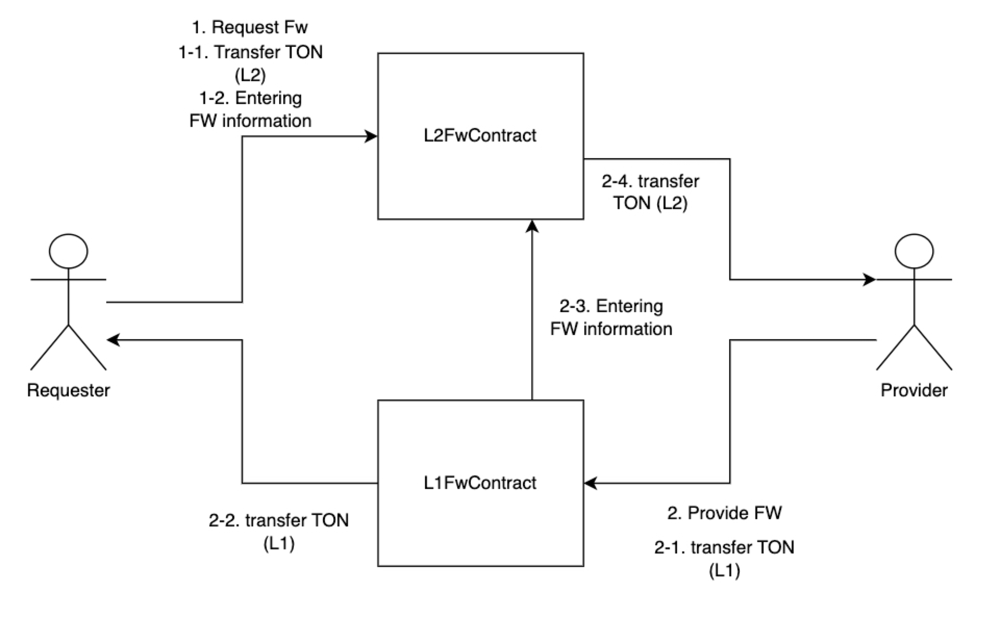
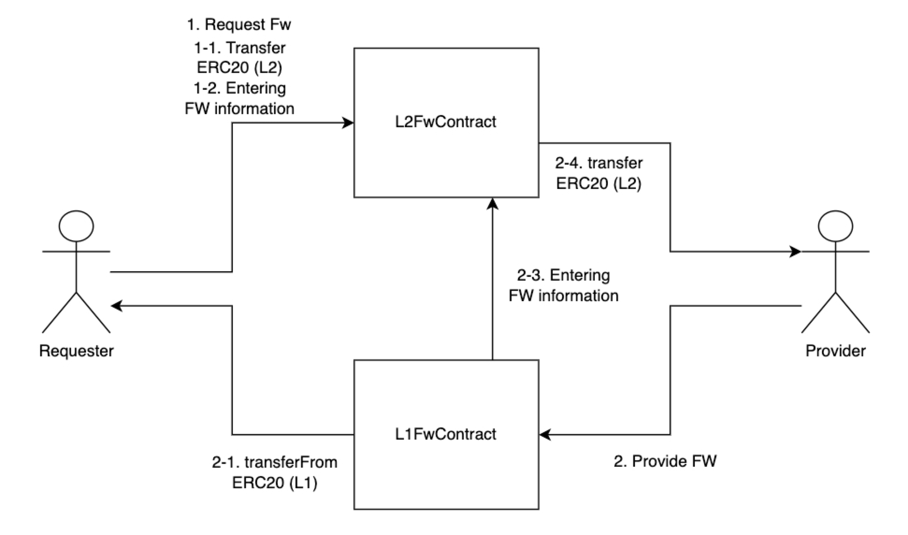
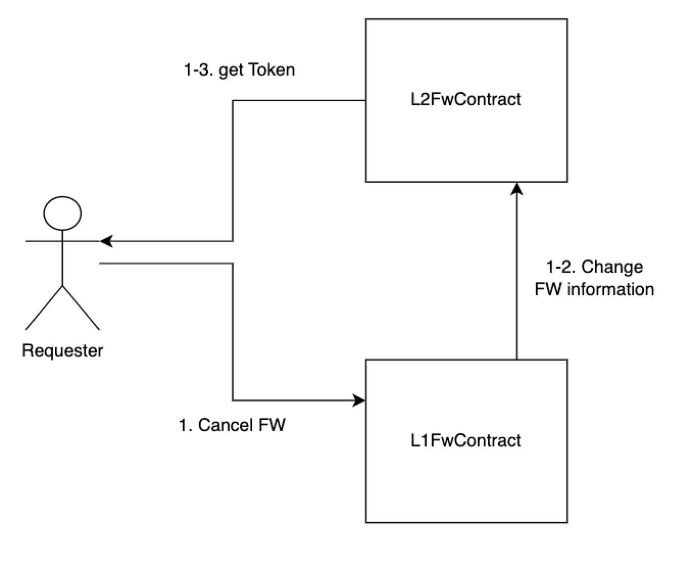
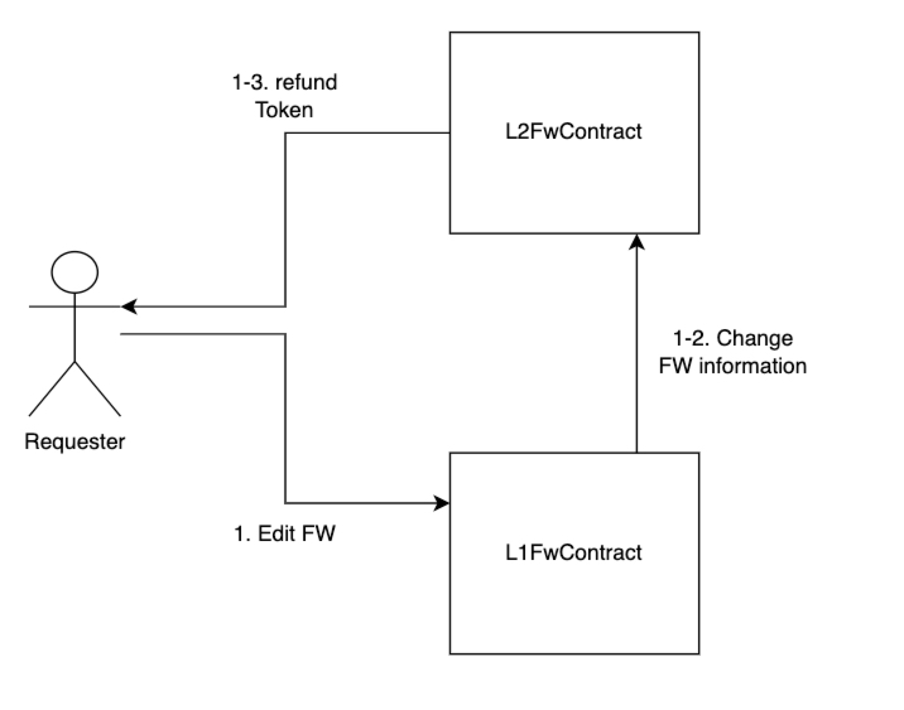
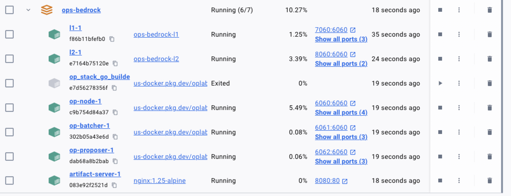
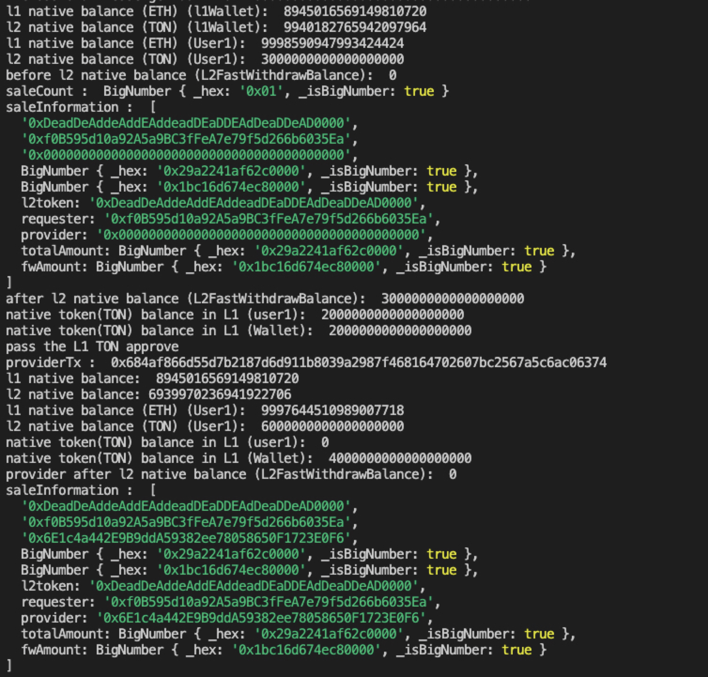
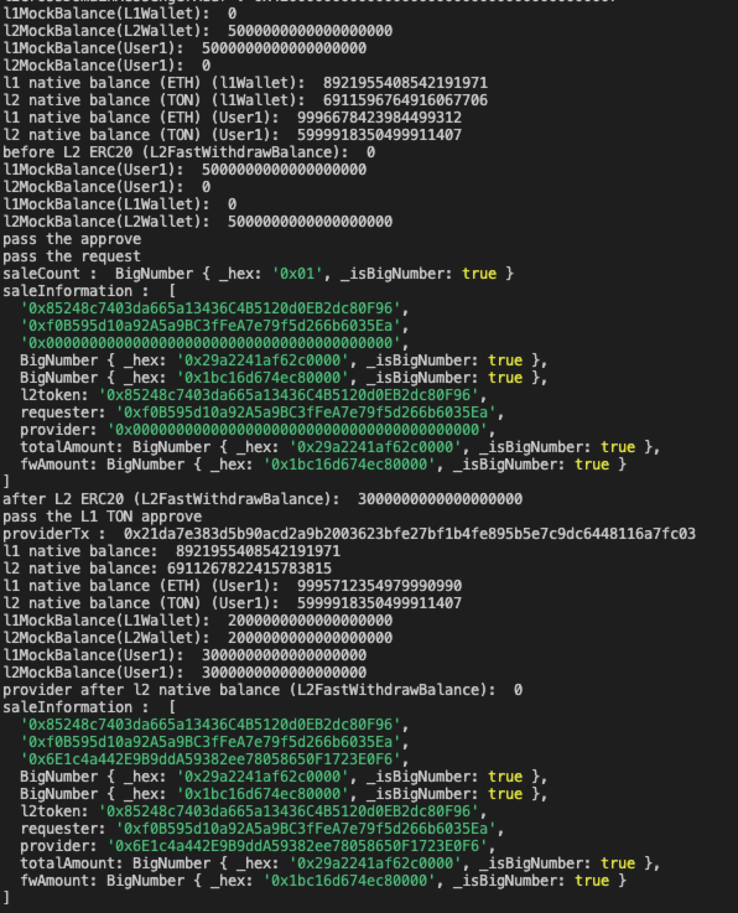
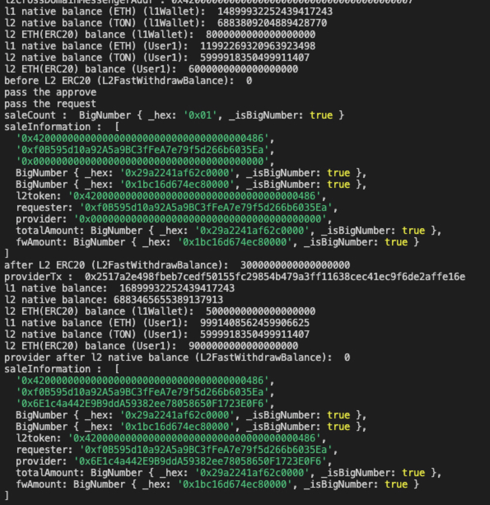

## 테스트 환경 구성 방법

repo : [https://github.com/tokamak-network/tokamak-titan-canyon/tree/develop-L2-FWContract](https://github.com/tokamak-network/tokamak-titan-canyon/tree/develop-L2-FWContract)(commit: 8f40245f68d861ad17165431c7c93806bcf6bda0에서 test 진행) (NativeTON버전)

```shell
Build
> make build

devnet start
> make devnet-up

devnet stop
> make devnet-down

devmet delete
> make devnet-clean
```

## 컨트랙트 개발 

repo : [https://github.com/tokamak-network/L2-FastWithdraw](https://github.com/tokamak-network/L2-FastWithdraw) 

## 컨트랙트 구성

1. 기본기능




  1. 현재 구성은 TON, ERC20 내부로직은 다르지만 Request, Provider가 하는 행동은 같습니다.
  1. Request는 RequestFW, Provider는 ProvideFW 각 function 실행으로 FW과정은 끝납니다.
1. Request 변경기능
  1. Request는 FW 등록된 정보를 변경하고 싶으면 L1에서 cancel or Edit을 실행할 수 있습니다.
  1. cancel은 request된 FW를 취소하고 전체금액을 refund합니다.
  1. edit은 L1에서 요청시에는 totalAmount를 줄이는 방향으로만 가능합니다.
  1. 
    1. cancel

    1. Edit

    1. 

## 테스트 방법

1. 로컬 L1, L2 서버 start
  1. [https://github.com/tokamak-network/tokamak-titan-canyon/tree/develop-L2-FWContract](https://github.com/tokamak-network/tokamak-titan-canyon/tree/develop-L2-FWContract) 에서 make build
  1. build 후 make devnet-up 으로 docker 실행
  1. 실행 후 확인

1. new test environment
  1. repo : [https://github.com/tokamak-network/L2-FastWithdraw](https://github.com/tokamak-network/L2-FastWithdraw) 
  1. .env.example를 복사하여서 .env로 변경 (PRIVATE_KEY, PRIVATE_KEY2 값 세팅)
  1. update env json
```shell
contracts-bedrock/deployments 변경


```
  1. start the test
```shell

# get L1 ETH
cast send --from 0xf39fd6e51aad88f6f4ce6ab8827279cfffb92266 --rpc-url http://127.0.0.1:8545 --unlocked --value 9ether YOUR_PUBLICKEY
cast send --from 0xf39fd6e51aad88f6f4ce6ab8827279cfffb92266 --rpc-url http://127.0.0.1:8545 --unlocked --value 9ether YOUR_PUBLICKEY2

# run test
# 0. NativeTON Test (deposit, request, provider)
npx hardhat test test/0.FWbasicTest.ts --network devnetL1

# 1. ERC20 Test (mint, request, provider)
npx hardhat test test/1.FWERC20Test.ts --network devnetL1

# 2. ETH Test (request, provider)
npx hardhat test test/2.FWETHTest.ts --network devnetL1

# 3. NativeTON Edit, cancel Test
npx hardhat test test/3.FWNativeTONEditCancel.ts --network devnetL1 

# 4. ERC20 Edit, cancel Test
npx hardhat test test/4.FWERC20EditCancel.ts --network devnetL1

# 5. ETH Edit, cancel Test
npx hardhat test test/5.FWETHEditCancel.ts --network devnetL1

# 6. USDC Test (request, provider)
npx hardhat test test/6.FW_USDC_Test.ts --network devnetL1

# 7. USDC Edit, cancel Test 
npx hardhat test test/7.FW_USDC_EditCancel.ts --network devnetL1

```
1. 로컬 환경에 테스트
```shell
# change folder
> cd packages/tokamak/sdk

# Test account setup
> export PRIVATE_KEY=TEST PRIVATE_KEY
> export PRIVATE_KEY2=TEST PRIVATE_KEY2
> export L1_URL=http://localhost:8545
> export L2_URL=http://localhost:9545

# get L1 ETH
cast send --from 0xf39fd6e51aad88f6f4ce6ab8827279cfffb92266 --rpc-url http://127.0.0.1:8545 --unlocked --value 9ether YOUR_PUBLICKEY

# run test
# 1. Native TON Test
> npx hardhat deposit-nativetoken --network devnetL1
> npx hardhat fastwithdraw-native-token --network devnetL1

# 2. ERC20 Test
> npx hardhat deposit-ERC20token --network devnetL1
# Please change the Mock address before running.
> npx hardhat fastwithdraw-ERC20token --network devnetL1

# 3. ETH Test
> npx hardhat deposit-ETH --network devnetL1
> npx hardhat fastwithdraw-ETH --network devnetL1
```
1. Test Result
  1. NativeTON FW과정 테스트
    1. wallet은 L2에서 requestFW를 요청 (totalAmount = 3TON, fwAmount = 2TON)
    1. user1은 L1에서 providerFW를 요청 
    1. 결과

    1. 결과 해석
      1. FW실행 전 
        1. Wallet 금액 (요청자)
          1. L1 ETH = 약 9 ETH
          1. L2 NativeTON = 약 10TON
          1. L1 TON = 2 TON
        1. User1 금액 (공급자)
          1. L1 ETH = 약 10 ETH
          1. L2 NativeTON = 3 TON
          1. L1 TON = 2TON
      1. FW 실행 후
        1. Wallet 금액 (요청자)
          1. L1 ETH = 약 9 ETH
          1. L2 NativeTON = 약 7 TON (3TON감소)
          1. L1 TON = 4 TON (2TON증가)
        1. User1 금액 (공급자)
          1. L1 ETH = 약 10 ETH
          1. L2 NativeTON = 6 TON (3TON 증가) 
          1. L1 TON = 0 TON (2TON 감소)
  1. ERC20 FW과정 테스트
    1. wallet은 L2에서 requestFW를 요청 (totalAmount = 3 Token, fwAmount = 2Token)
    1. user1은 L1에서 providerFW를 요청 
    1. 결과

    1. 결과 해석
      1. FW실행 전 
        1. Wallet 금액 (요청자)
          1. L1 ETH = 약 9 ETH
          1. L2 NativeTON = 약 7TON
          1. L1 ERC20 Token = 0 Token
          1. L2 ERC20 Token = 5 Token
        1. User1 금액 (공급자)
          1. L1 ETH = 약 10 ETH
          1. L2 NativeTON = 약 6 TON
          1. L1 ERC20 Token = 5 Token
          1. L2 ERC20 Token = 0 Token
      1. FW 실행 후
        1. Wallet 금액 (요청자)
          1. L1 ETH = 약 9 ETH
          1. L2 NativeTON = 약 7 TON
          1. L1 ERC20 Token = 2 Token (2 Token 증가)
          1. L2 ERC20 Token = 2 Token (3 Token 감소)
        1. User1 금액 (공급자)
          1. L1 ETH = 약 10 ETH
          1. L2 NativeTON = 6 TON
          1. L1 ERC20 Token = 3 Token (2 Token 감소)
          1. L2 ERC20 Token = 3 Token (3 Token 증가)
  1. ETH FW과정 테스트
    1. wallet은 L2에서 requestFW를 요청 (totalAmount = 3 ETH, fwAmount = 2 ETH)
    1. user1은 L1에서 providerFW를 요청 
    1. 결과

    1. 결과해석
      1. FW실행 전 
        1. Wallet 금액 (요청자)
          1. L1 ETH = 약 15 ETH
          1. L2 NativeTON = 약 7TON
          1. L2 ETH Token = 8 ETH
        1. User1 금액 (공급자)
          1. L1 ETH = 약 12 ETH
          1. L2 NativeTON = 약 6 TON
          1. L2 ETH Token = 6 ETH
      1. FW 실행 후
        1. Wallet 금액 (요청자)
          1. L1 ETH = 약 17 ETH (2 ETH 증가)
          1. L2 NativeTON = 약 7 TON
          1. L2 ETH Token = 5 ETH (3 ETH 감소)
        1. User1 금액 (공급자)
          1. L1 ETH = 약 10 ETH (2 ETH 감소)
          1. L2 NativeTON = 약 6 TON
          1. L2 ETH Token = 9 ETH (3 Token 증가)

## 공격 시나리오 테스트

```shell
# 시나리오 1 테스트 
> npx hardhat test test/8.AttackScenario1.ts --network devnetL1

# 시나리오 2 테스트 
> npx hardhat test test/9.AttackScenario2.ts --network devnetL1

# 총 공격 시나리오 테스트 (공격 시나리오의 공격이 통하지 않는 것을 확인하는 테스트)
> npx hardhat test test/11.totalAttackScenario.ts --network devnetL1
```

  1. L1에서 Provider 함수를 호출 할때 초기 Request에 등록한 amount보다 작게 입력 시 (FWAmount)
    1. L2에서 revert나서 Provider는 L1 지불하였지만 L2에서 금액을 받지 못함. (공격자가 손해보는 상황)
    1. 막으면 좋을 것 같다. 
    1. order에 hash를 심는다 (L2에서 Hash나 어떤 정보들의 조합을 해서 L1에서 edit, cancel할때 기록) (edit의 이전 기록, 최근 기록)
  1. L1에서 공격전용 Contract개발 후  L2FastWithdraw에 message 호출 (provideFW, cancel, edit)
    1. providerFW 공격은 이득을 취함
    1. cancel, edit 공격은 공격자가 실질적 이득을 취하지는 못함
    1. optimism에서 L1호출 Contract 주소를 알 수 있는 function이 있음
  1. L1에서 Provider할때 다른 L1Token을 입력했을때 (이부분은 로직 수정으로 해결가능)

요구사항 변경 : DB 추가 L1token(기본은 입력하지않음, 만약 L2token이 USDC처럼 특이한 형태일때(OptimismFactoryERC20을 사용하지않은형태) L1token주소를 따로 입력하게 함), origin(chainID), destination(chainID)

해결방안

  1. ~~L1CrossDomainMessenger에 L1FastWithdarwProxy, L2FastWithdrawProxy주소를 저장하고 L2FastWithdrawProxy주소로 sendMessage를 보낼때는 L1FastWithdrawProxy에서만 호출할 수 있도록 해야함 (L1CrossDomainMessenger를 수정하지 않고 해결할 수 있는 방안이 생각나시면 말씀부탁드립니다.)~~
  1. L2FWContract에서 L1Contract 체크로 해결

[[Other FWContract project research]]