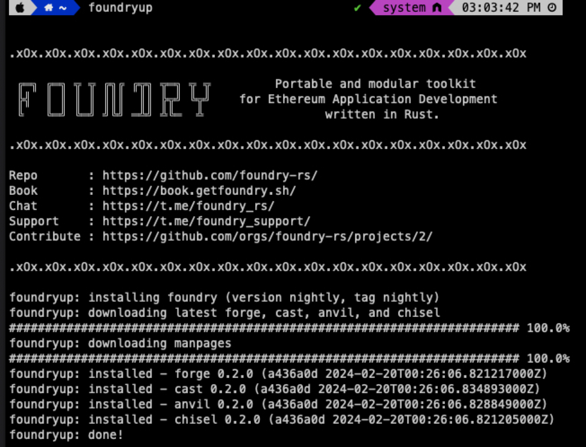
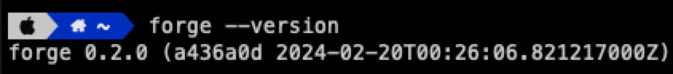
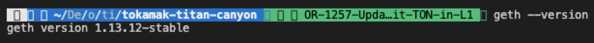

Record installation and execution in Mac environment

## 1. Install and run tokamak-titan-canyon

```shell
git clone https://github.com/tokamak-network/tokamak-titan-canyon.git
cd tokamak-titan-canyon
git checkout OR-1257-Update-smart-contracts-for-deposit-TON-in-L1

make build
make devnet-up
```

## 2. Run result

```shell
> make devnet-up
./ops/scripts/geth-version-checker.sh && \
                (echo "Geth versions match, not installing geth..."; true) || \
                (echo "Versions do not match, installing geth!"; \
                        go install -v github.com/ethereum/go-ethereum/cmd/geth@v1.13.4; \
                        echo "Installed geth!"; true)
./ops/scripts/geth-version-checker.sh: line 4: geth: command not found
Geth version does not match!
geth version: v
.gethrc version: v1.13.4-stable
Versions do not match, installing geth!
/bin/sh: go: command not found
Installed geth!
make -C ./op-program op-program
env GO111MODULE=on GOOS= GOARCH= go build -v -ldflags "-X main.GitCommit=d8f9244ebbb9b531aaffada69bc54fb3274dc6d7 -X main.GitDate=1708335580 -X github.com/ethereum-optimism/optimism/op-program/version.Version=v0.0.0 -X github.com/ethereum-optimism/optimism/op-program/version.Meta=" -o ./bin/op-program ./host/cmd/main.go
env: go: No such file or directory
make[2]: *** [op-program-host] Error 127
make[1]: *** [op-program] Error 2
make: *** [pre-devnet] Error 2
```

## 3. Error cause analysis and resolution process

1. Check installed environment
```shell
> git --version
git version 2.31.1

> go version
go version go1.22.0 darwin/amd64

> node --version
v16.19.0

> pnpm --version
8.5.1

> forge --version
zsh: command not found: forge

> make --version
GNU Make 3.81
Copyright (C) 2006  Free Software Foundation, Inc.
This is free software; see the source for copying conditions.
There is NO warranty; not even for MERCHANTABILITY or FITNESS FOR A
PARTICULAR PURPOSE.

This program built for i386-apple-darwin11.3.0

~~> python --version
zsh: command not found: python~~

> python3 --version                        
Python 3.6.6

> geth version
zsh: command not found: geth
```
1. How to install foundry (to solve forge --version)
  1. Installation Note Link ([https://book.getfoundry.sh/getting-started/installation#precompiled-binaries](https://book.getfoundry.sh/getting-started/installation#precompiled-binaries))
  1. install **Foundryup**
```shell
> curl -L https://foundry.paradigm.xyz | bash
% Total    % Received % Xferd  Average Speed   Time    Time     Time  Current
                                 Dload  Upload   Total   Spent    Left  Speed
  0     0    0     0    0     0      0      0 --:--:-- --:--:-- --:--:--     0
100  1975  100  1975    0     0   2193      0 --:--:-- --:--:-- --:--:--     0
Installing foundryup...

warning: libusb not found. You may need to install it manually on MacOS via Homebrew (brew install libusb).

Detected your preferred shell is zsh and added foundryup to PATH.
Run 'source /Users/harvey/.zshenv' or start a new terminal session to use foundryup.
Then, simply run 'foundryup' to install Foundry.
```
  1. Install libusb before installing Foundryup
```shell
> brew install libusb
```
  1. retry install **Foundryup**
```shell
> curl -L https://foundry.paradigm.xyz | bash

  % Total    % Received % Xferd  Average Speed   Time    Time     Time  Current
                                 Dload  Upload   Total   Spent    Left  Speed
  0     0    0     0    0     0      0      0 --:--:-- --:--:-- --:--:--     0
100  1975  100  1975    0     0   2317      0 --:--:-- --:--:-- --:--:--     0
Installing foundryup...

Detected your preferred shell is zsh and added foundryup to PATH.
Run 'source /Users/harvey/.zshenv' or start a new terminal session to use foundryup.
Then, simply run 'foundryup' to install Foundry.
```
  1. run foundryup

  1. check forge

  1. 
1.  How to install geth (to solve geth --version)
  1. Installation Note Link ([https://geth.ethereum.org/docs/getting-started/installing-geth](https://geth.ethereum.org/docs/getting-started/installing-geth))
  1. install geth
```shell
> brew tap ethereum/ethereum
==> Tapping ethereum/ethereum
Cloning into '/usr/local/Homebrew/Library/Taps/ethereum/homebrew-ethereum'...
remote: Enumerating objects: 10732, done.
remote: Counting objects: 100% (231/231), done.
remote: Compressing objects: 100% (157/157), done.
remote: Total 10732 (delta 132), reused 147 (delta 70), pack-reused 10501
Receiving objects: 100% (10732/10732), 1.45 MiB | 1.22 MiB/s, done.
Resolving deltas: 100% (5651/5651), done.
Tapped 7 formulae (20 files, 1.8MB).

> brew install ethereum
==> Downloading https://formulae.brew.sh/api/formula.jws.json
############################################################################################################################################### 100.0%
==> Downloading https://formulae.brew.sh/api/cask.jws.json
############################################################################################################################################### 100.0%
==> Downloading https://ghcr.io/v2/homebrew/core/ethereum/manifests/1.13.12
############################################################################################################################################### 100.0%
==> Fetching ethereum
==> Downloading https://ghcr.io/v2/homebrew/core/ethereum/blobs/sha256:58273f8703ba01d1c6ea03bbecf1592e1f19fe58d2e2cabbaad9375d46719830
############################################################################################################################################### 100.0%
==> Pouring ethereum--1.13.12.sonoma.bottle.tar.gz
🍺  /usr/local/Cellar/ethereum/1.13.12: 17 files, 258.7MB
==> Running `brew cleanup ethereum`...
Disable this behaviour by setting HOMEBREW_NO_INSTALL_CLEANUP.
Hide these hints with HOMEBREW_NO_ENV_HINTS (see `man brew`).
```
  1. check geth

1. retry
```shell
> make devnet-up   
./ops/scripts/geth-version-checker.sh && \
                (echo "Geth versions match, not installing geth..."; true) || \
                (echo "Versions do not match, installing geth!"; \
                        go install -v github.com/ethereum/go-ethereum/cmd/geth@v1.13.4; \
                        echo "Installed geth!"; true)
Geth version does not match!
geth version: v1.13.12-stable
.gethrc version: v1.13.4-stable
Versions do not match, installing geth!
/bin/sh: go: command not found
Installed geth!
make -C ./op-program op-program
env GO111MODULE=on GOOS= GOARCH= go build -v -ldflags "-X main.GitCommit=d8f9244ebbb9b531aaffada69bc54fb3274dc6d7 -X main.GitDate=1708335580 -X github.com/ethereum-optimism/optimism/op-program/version.Version=v0.0.0 -X github.com/ethereum-optimism/optimism/op-program/version.Meta=" -o ./bin/op-program ./host/cmd/main.go
env: go: No such file or directory
make[2]: *** [op-program-host] Error 127
make[1]: *** [op-program] Error 2
make: *** [pre-devnet] Error 2
```
1. change .gethrc
```javascript
v1.13.4 -> v1.13.12
```
1. retry
```shell
> make devnet-up
생략
./ops/scripts/newer-file.sh .devnet/allocs-l1.json ./packages/contracts-bedrock \
                || make devnet-allocs
./ops/scripts/geth-version-checker.sh && \
                (echo "Geth versions match, not installing geth..."; true) || \
                (echo "Versions do not match, installing geth!"; \
                        go install -v github.com/ethereum/go-ethereum/cmd/geth@v1.13.12; \
                        echo "Installed geth!"; true)
Geth version v1.13.12-stable is correct!
Geth versions match, not installing geth...
PYTHONPATH=./bedrock-devnet python3 ./bedrock-devnet/main.py --monorepo-dir=. --allocs
Traceback (most recent call last):
  File "./bedrock-devnet/main.py", line 1, in <module>
    import devnet
  File "/Users/harvey/Desktop/onther/titan/tokamak-titan-canyon/bedrock-devnet/devnet/__init__.py", line 23, in <module>
    parser.add_argument('--allocs', help='Only create the allocs and exit', type=bool, action=argparse.BooleanOptionalAction)
AttributeError: module 'argparse' has no attribute 'BooleanOptionalAction'
make[1]: *** [devnet-allocs] Error 1
make: *** [devnet-up] Error 2
```
1. need to change Foundry version
  1. install rust (use the cargo)
```shell
> curl --proto '=https' --tlsv1.2 -sSf https://sh.rustup.rs | sh

info: downloading installer

Welcome to Rust!

This will download and install the official compiler for the Rust
programming language, and its package manager, Cargo.

Rustup metadata and toolchains will be installed into the Rustup
home directory, located at:

  /Users/harvey/.rustup

This can be modified with the RUSTUP_HOME environment variable.

The Cargo home directory is located at:

  /Users/harvey/.cargo

This can be modified with the CARGO_HOME environment variable.

The cargo, rustc, rustup and other commands will be added to
Cargo's bin directory, located at:

  /Users/harvey/.cargo/bin

This path will then be added to your PATH environment variable by
modifying the profile files located at:

  /Users/harvey/.profile
  /Users/harvey/.bash_profile
  /Users/harvey/.zshenv

You can uninstall at any time with rustup self uninstall and
these changes will be reverted.

Current installation options:


   default host triple: x86_64-apple-darwin
     default toolchain: stable (default)
               profile: default
  modify PATH variable: yes

1) Proceed with installation (default)
2) Customize installation
3) Cancel installation
>1

info: profile set to 'default'
info: default host triple is x86_64-apple-darwin
info: syncing channel updates for 'stable-x86_64-apple-darwin'
info: latest update on 2024-02-08, rust version 1.76.0 (07dca489a 2024-02-04)
info: downloading component 'cargo'
info: downloading component 'clippy'
info: downloading component 'rust-docs'
 14.7 MiB /  14.7 MiB (100 %)   9.0 MiB/s in  1s ETA:  0s
info: downloading component 'rust-std'
 25.3 MiB /  25.3 MiB (100 %)  13.3 MiB/s in  1s ETA:  0s
info: downloading component 'rustc'
 55.1 MiB /  55.1 MiB (100 %)  14.6 MiB/s in  3s ETA:  0s
info: downloading component 'rustfmt'
info: installing component 'cargo'
info: installing component 'clippy'
info: installing component 'rust-docs'
 14.7 MiB /  14.7 MiB (100 %)   3.1 MiB/s in  4s ETA:  0s
info: installing component 'rust-std'
 25.3 MiB /  25.3 MiB (100 %)  10.9 MiB/s in  2s ETA:  0s
info: installing component 'rustc'
 55.1 MiB /  55.1 MiB (100 %)  11.5 MiB/s in  4s ETA:  0s
info: installing component 'rustfmt'
info: default toolchain set to 'stable-x86_64-apple-darwin'

  stable-x86_64-apple-darwin installed - rustc 1.76.0 (07dca489a 2024-02-04)


Rust is installed now. Great!

To get started you may need to restart your current shell.
This would reload your PATH environment variable to include
Cargo's bin directory ($HOME/.cargo/bin).

To configure your current shell, run:
source "$HOME/.cargo/env
```
  1. change the foundry version (You must make changes by running a new terminal rather than running it from the terminal where Rust was installed.)
```shell
> foundryup -C ee5d02c3ef5f55a06b069e4a70a820661a9130c8


.xOx.xOx.xOx.xOx.xOx.xOx.xOx.xOx.xOx.xOx.xOx.xOx.xOx.xOx.xOx.xOx.xOx.xOx

 ╔═╗ ╔═╗ ╦ ╦ ╔╗╔ ╔╦╗ ╦═╗ ╦ ╦         Portable and modular toolkit
 ╠╣  ║ ║ ║ ║ ║║║  ║║ ╠╦╝ ╚╦╝    for Ethereum Application Development
 ╚   ╚═╝ ╚═╝ ╝╚╝ ═╩╝ ╩╚═  ╩                 written in Rust.

.xOx.xOx.xOx.xOx.xOx.xOx.xOx.xOx.xOx.xOx.xOx.xOx.xOx.xOx.xOx.xOx.xOx.xOx

Repo       : https://github.com/foundry-rs/
Book       : https://book.getfoundry.sh/
Chat       : https://t.me/foundry_rs/
Support    : https://t.me/foundry_support/
Contribute : https://github.com/orgs/foundry-rs/projects/2/

.xOx.xOx.xOx.xOx.xOx.xOx.xOx.xOx.xOx.xOx.xOx.xOx.xOx.xOx.xOx.xOx.xOx.xOx

'foundry'에 복제합니다...
remote: Enumerating objects: 41377, done.
remote: Counting objects: 100% (805/805), done.
remote: Compressing objects: 100% (528/528), done.
remote: Total 41377 (delta 432), reused 566 (delta 272), pack-reused 40572
오브젝트를 받는 중: 100% (41377/41377), 19.16 MiB | 19.28 MiB/s, 완료.
델타를 알아내는 중: 100% (28567/28567), 완료.
Note: switching to 'origin/master'.

생략

foundryup: warning: overwriting existing forge in /Users/harvey/.foundry/bin
foundryup: warning: overwriting existing cast in /Users/harvey/.foundry/bin
foundryup: warning: overwriting existing anvil in /Users/harvey/.foundry/bin
foundryup: warning: overwriting existing chisel in /Users/harvey/.foundry/bin
foundryup: done

```
1. ~~install the python~~
```shell
> brew install python
```
1. Change Python global version
  1. need the pyenv
```shell
> pyenv -v                   
zsh: command not found: pyenv

> brew install pyenv
```
  1. check install version
```shell
> pyenv install --list
```
  1. install python
```shell
> pyenv install 3.9.18
```
  1. global version set
```shell
> pyenv global 3.9.18
```
1. Change node version
  1. install nvm
```shell
> nvm install v20.10.0
```
  1. change nvm version
```shell
> nvm use v20.10.0
```
1. Change Python3 version
  1. install python3
```shell
> brew install python3
```
  1. Change Python configuration file
```shell
> echo 'eval "$(pyenv init --path)"' >> ~/.zshrc
> echo 'eval "$(pyenv init -)"' >> ~/.zshrc
```
  1. Apply environment file
```shell
> source ~/.zshrc
```
  1. check python3
```shell
> python3 --version
Python 3.9.18
```
1. execution result
```shell
> make devnet-up

DEBUG[02-21|00:07:00.177] Journalled diff layer                    root=38adce..cf3f3a parent=6cb8d0..ebb974
    devnet_l1_genesis(paths)
  File "/Users/harvey/Desktop/onther/titan/tokamak-titan-canyon/bedrock-devnet/devnet/__init__.py", line 180, in devnet_l1_genesis
    raise Exception(f"Exception occurred in child process: {err}")
INFO [02-21|00:07:00.177] Blockchain stopped
Exception: Exception occurred in child process: Command '['cast', 'send', '--from', '0x505a08542b7fcd6232f3bb8bd2a6dadc4dee7f71', '--rpc-url', 'http://127.0.0.1:8545', '--unlocked', '--value', '1ether', '0x3fAB184622Dc19b6109349B94811493BF2a45362']' returned non-zero exit status 1.
make[1]: *** [devnet-allocs] Error 1
make: *** [devnet-up] Error 2
```
1. Check installed environment
```shell
> git --version                                                                                                                   
git version 2.31.1

> go version                                                                                         
go version go1.22.0 darwin/amd64

> node --version                                                                                          
v20.10.0

> pnpm --version          
8.5.1

> forge --version        
forge 0.2.0 (ee5d02c 2024-02-20T07:10:20.908841000Z)

> make --version       
GNU Make 3.81
Copyright (C) 2006  Free Software Foundation, Inc.
This is free software; see the source for copying conditions.
There is NO warranty; not even for MERCHANTABILITY or FITNESS FOR A
PARTICULAR PURPOSE.

This program built for i386-apple-darwin11.3.0

> python3 --version             
Python 3.9.18

> geth version      
Geth
Version: 1.13.12-stable
Architecture: amd64
Go Version: go1.21.7
Operating System: darwin
GOPATH=
GOROOT=
```
1. 에러가 나는 이유
  1. geth 버전이 다름 → geth는 따로 설치 하지 않아도됨 → make devnet-up을 실행할때 버전이 다르면 설치함
  1. go 버전이 다름 → 1.21 버전이여야 geth 1.13.4 버전을 지원함
1. geth 삭제 및 geth 1.13.4 버전 설치
```shell
> brew uninstall ethereum


```
1. go 삭제 및 go 1.21 버전 설치
```shell
go 삭제

>go env 
GO111MODULE=''
GOARCH='amd64'
GOBIN=''
GOCACHE='/Users/harvey/Library/Caches/go-build'
GOENV='/Users/harvey/Library/Application Support/go/env'
GOEXE=''
GOEXPERIMENT=''
GOFLAGS=''
GOHOSTARCH='amd64'
GOHOSTOS='darwin'
GOINSECURE=''
GOMODCACHE='/Users/harvey/go/pkg/mod'
GONOPROXY=''
GONOSUMDB=''
GOOS='darwin'
GOPATH='/Users/harvey/go'
GOPRIVATE=''
GOPROXY='https://proxy.golang.org,direct'
GOROOT='/usr/local/go'
GOSUMDB='sum.golang.org'
GOTMPDIR=''
GOTOOLCHAIN='auto'
GOTOOLDIR='/usr/local/go/pkg/tool/darwin_amd64'
GOVCS=''
GOVERSION='go1.22.0'
GCCGO='gccgo'
GOAMD64='v1'
AR='ar'
CC='clang'
CXX='clang++'
CGO_ENABLED='1'
GOMOD='/Users/harvey/Desktop/onther/titan/tokamak-titan-canyon/go.mod'
GOWORK=''
CGO_CFLAGS='-O2 -g'
CGO_CPPFLAGS=''
CGO_CXXFLAGS='-O2 -g'
CGO_FFLAGS='-O2 -g'
CGO_LDFLAGS='-O2 -g'
PKG_CONFIG='pkg-config'
GOGCCFLAGS='-fPIC -arch x86_64 -m64 -pthread -fno-caret-diagnostics -Qunused-arguments -fmessage-length=0 -ffile-prefix-map=/var/folders/gf/9rppj11d6ks1n00zf2jx049r0000gn/T/go-build4212121095=/tmp/go-build -gno-record-gcc-switches -fno-common'

> which go
/usr/local/go/bin/go

> sudo rm -rf /usr/local/go
> sudo rm -rf /Users/harvey/go
```

```shell
go 설치
> brew install go@1.21
> brew link --force go@1.21

> go version
go version go1.21.7 darwin/amd64
```
1. 계속 에러
```shell
[Errno 2] No such file or directory: 'cast'
Traceback (most recent call last):
  File "/Users/harvey/Desktop/onther/titan/tokamak-titan-canyon/./bedrock-devnet/main.py", line 9, in <module>
INFO [02-21|22:20:14.112] Got interrupt, shutting down...
DEBUG[02-21|22:20:14.112] RPC server shutting down
INFO [02-21|22:20:14.112] HTTP server stopped                      endpoint=127.0.0.1:8545
    main()
  File "/Users/harvey/Desktop/onther/titan/tokamak-titan-canyon/./bedrock-devnet/main.py", line 5, in main
    devnet.main()
  File "/Users/harvey/Desktop/onther/titan/tokamak-titan-canyon/bedrock-devnet/devnet/__init__.py", line 97, in main
DEBUG[02-21|22:20:14.112] RPC server shutting down
INFO [02-21|22:20:14.112] IPC endpoint closed                      url=/var/folders/gf/9rppj11d6ks1n00zf2jx049r0000gn/T/geth.ipc
DEBUG[02-21|22:20:14.112] RPC server shutting down
DEBUG[02-21|22:20:14.112] RPC connection read error                err=EOF
INFO [02-21|22:20:14.112] Ethereum protocol stopped
INFO [02-21|22:20:14.113] Transaction pool stopped
DEBUG[02-21|22:20:14.113] Journalled generator progress            progress=done
DEBUG[02-21|22:20:14.113] Journalled disk layer                    root=77ed83..5bd600
INFO [02-21|22:20:14.113] Blockchain stopped
    devnet_l1_genesis(paths)
  File "/Users/harvey/Desktop/onther/titan/tokamak-titan-canyon/bedrock-devnet/devnet/__init__.py", line 181, in devnet_l1_genesis
    raise Exception(f"Exception occurred in child process: {err}")
Exception: Exception occurred in child process: [Errno 2] No such file or directory: 'cast'
make[1]: *** [devnet-allocs] Error 1
make: *** [devnet-up] Error 2
```
1.  foundry 삭제 후 재설치 
```shell
삭제
> sudo rm -rf /Users/harvey/.foundry

재설치
> curl -L https://foundry.paradigm.xyz | bash
> foundryup -C ee5d02c3ef5f55a06b069e4a70a820661a9130c8

```
1. go 삭제 후 재설치
```shell
삭제
> sudo rm -rf /usr/local/go
```

[https://go.dev/dl/](https://go.dev/dl/)에서 1.21.4버전으로 자신의 OS버전에 맞게 설치

brew install jq

go 언어 재설치

## 4. Summary of final tested versions and installation methods

### software Dependencies

| Dependency | Version | Version Check Command |
| --- | --- | --- |
| git | git version 2.31.1 | git --version |
| go | go1.21.4 darwin/amd64 | go version |
| node | v20.9.0 | node --version |
| pnpm | 8.5.1 | pnpm --version |
| rust | rustc 1.76.0 (07dca489a 2024-02-04) | rustc —version |
| foundry | forge 0.2.0 (ee5d02c 2024-02-21T13:36:23.785515000Z) | forge --version |
| make | 3.81 | make --version |
| python3 | Python 3.9.18 | python3 --version |
| jq | jq-1.7.1 | jq --version |

### Precautions when installing

1. When installing GO 
  1. When installing GO, it is better to download it directly from the Go site and install it rather than using brew.
    1. [https://go.dev/dl/](https://go.dev/dl/)
  1. After installing GO, create a src folder in the folder where GO is installed and download it there using git.
1. When installing Geth
  1. If you have properly installed the GO version, you do not need to install geth separately. When running make devnet-up, install the appropriate geth version.
1. When installing foundry
  1. Rust installation is required because you need to install a specific version of foundry, not the latest version.
```shell
> curl --proto '=https' --tlsv1.2 -sSf https://sh.rustup.rs | sh
```
  1. After installing Rust, you can install a specific foundry version with the following command:
```shell
> foundryup -C ee5d02c3ef5f55a06b069e4a70a820661a9130c8
```
1. When installing python3
  1. To easily manage Python version, it is recommended to install and use pyenv.
```shell
#pyenv install
> brew install pyenv

#check python version list
> pyenv install --list 

#install python version
> pyenv install 3.9.18

#pyenv global setting
> pyenv global 3.9.18
```
  1. After installing pyenv, install python3 and set the version.
```shell
#python3 install
> brew install python3

#python3 environment setting
> echo 'eval "$(pyenv init --path)"' >> ~/.zshrc
> echo 'eval "$(pyenv init -)"' >> ~/.zshrc

#python3 apply environment
> source ~/.zshrc
```
  1. check python3 version
```shell
> python3 --version
Python 3.9.18
```
1. When installing node
  1. Install nvm to easily manage node versions.
```shell
> brew install nvm
```
  1. Create nvm directory
```shell
mkdir ~/.nvm
```
  1. Setting environment variables
```shell
> vi ~/.bash_profile

export NVM_DIR="$HOME/.nvm"
[ -s "/usr/local/opt/nvm/nvm.sh" ] && \. "/usr/local/opt/nvm/nvm.sh"  # This loads nvm
[ -s "/usr/local/opt/nvm/etc/bash_completion.d/nvm" ] && \. "/usr/local/opt/nvm/etc/bash_completion.d/nvm"  # This loads nvm bash_completion
```
  1. Applying environment variables
```shell
> source ~/.bash_profile
```
  1. install node v20.9.0
```shell
#node version list
> nvm ls

#install node
> nvm install 20.9.0
```
  1. use node version
```shell
> nvm use v20.9.0
```

### How to test

```shell
# change folder
> cd packages/tokamak/sdk

# Test account setup
> export PRIVATE_KEY=TEST PRIVATE_KEY
> export L1_URL=http://localhost:8545
> export L2_URL=http://localhost:9545

# run test
> npx hardhat deposit-native-token --network devnetL1
> npx hardhat withdraw-native-token --network devnetL1
```

### How to get ETH

```shell
# tokamak/contracts-bedrock
cast send --from 0xf39fd6e51aad88f6f4ce6ab8827279cfffb92266 --rpc-url http://127.0.0.1:8545 --unlocked --value 9ether 0x8626f6940E2eb28930eFb4CeF49B2d1F2C9C1199
cast send --from 0xf39fd6e51aad88f6f4ce6ab8827279cfffb92266 --rpc-url http://127.0.0.1:8545 --unlocked --value 9ether 0xf0B595d10a92A5a9BC3fFeA7e79f5d266b6035Ea
```

## Test repo

repo : [https://github.com/tokamak-network/tokamak-titan-canyon/tree/CT-3-audit-Harvey](https://github.com/tokamak-network/tokamak-titan-canyon/tree/CT-3-audit-Harvey)

1. nativeTON Test
  1. deposit
    1. npx hardhat deposit-native-token --network devnetL1
  1. withdraw
    1. npx hardhat withdraw-native-token --network devnetL1
1. erc20Token Test
  1. deposit
    1. npx hardhat deposit-erc20-token --network devnetL1
  1. withdraw (need to change MockL1, MockL2 address)
    1. npx hardhat withdraw-erc20-token --network devnetL1
1. ETH Test
  1. deposit
    1. npx hardhat deposit-eth-token --network devnetL1
  1. withdraw
    1. npx hardhat withdraw-eth-token --network devnetL1

> To start, run (in the root directory of the monorepo) `make devnet-up`.
> The first time it runs it will be relatively slow because it needs to download the images, after that it will be faster.

> To stop, run (in the root directory of the monorepo) `make devnet-down`.

> To clean everything, run (in the root directory of the monorepo) `make devnet-clean`.