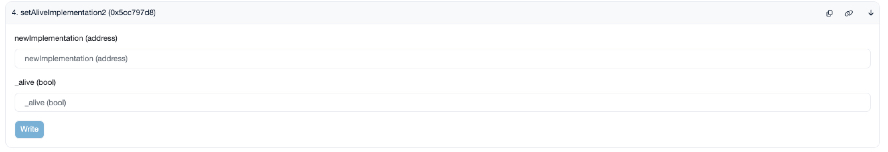
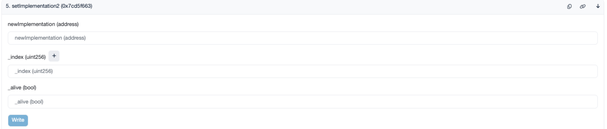
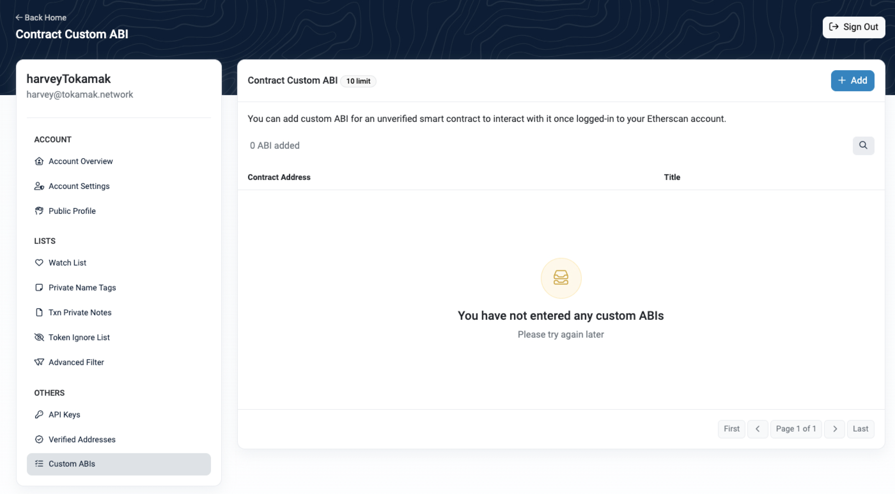
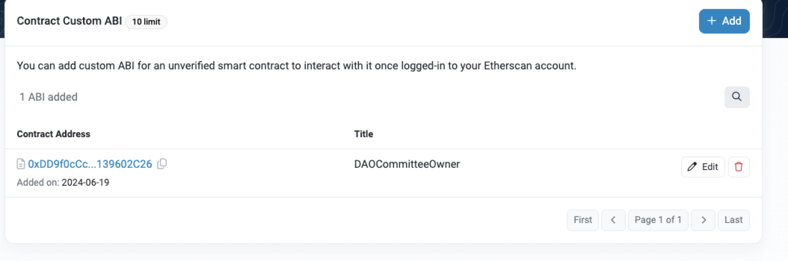
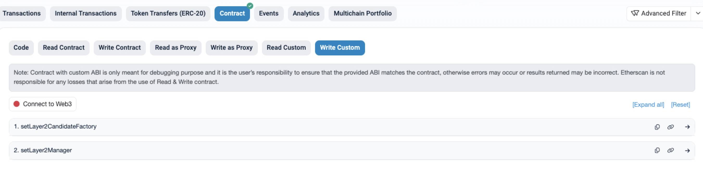

# Which function should be executed

1. upgradeTo : DAOCommitteeProxy → DAOCommitteeProxy2 
  1. Upgrade to distributed Proxy2 to change the DAO structure
  1. [https://etherscan.io/address/0xDD9f0cCc044B0781289Ee318e5971b0139602C26#writeContract#F6](https://etherscan.io/address/0xDD9f0cCc044B0781289Ee318e5971b0139602C26#writeContract#F6)
  1. input : DAOCommitteeProxy2_Address (need Deploy)
1. upgradeTo2 : DAOCommitteeProxy2 → DAOCommittee_V1 
  1. Set the first logic of DAOProxy2 to DAOCommittee_V1.
  1. [https://sepolia.etherscan.io/address/0xa2101482b28e3d99ff6ced517ba41eff4971a386#writeProxyContract#F7](https://sepolia.etherscan.io/address/0xa2101482b28e3d99ff6ced517ba41eff4971a386#writeProxyContract#F7) (this is just example) (After step 1, it will be updated later on the mainnet etherscan.)
  1. input : DAOCommittee_V1_Address (need Deploy)
1. setAliveImplementation2 : DAOCommitteeProxy2 → DAOCommitteeOwner
  1. Set to use DAOCommitteeOwner logic using the setAliveImplementation2 function.
  1. [https://sepolia.etherscan.io/address/0xa2101482b28e3d99ff6ced517ba41eff4971a386#writeProxyContract#F4](https://sepolia.etherscan.io/address/0xa2101482b28e3d99ff6ced517ba41eff4971a386#writeProxyContract#F4) (this is just example) (After step 2, it will be updated later on the mainnet etherscan.)

  1. input data
    1. newImplementation : DAOCommitteeOwner_Address
    1. _alive : true
1. setImplementation2 : DAOCommitteeProxy2 → DAOCommitteeOwner
  1. Set to use DAOCommitteeOwner logic using the setImplementation2 function.
  1. [https://sepolia.etherscan.io/address/0xa2101482b28e3d99ff6ced517ba41eff4971a386#writeProxyContract#F5](https://sepolia.etherscan.io/address/0xa2101482b28e3d99ff6ced517ba41eff4971a386#writeProxyContract#F5) (this is just example) (After step 2, it will be updated later on the mainnet etherscan.)

  1. input data
    1. newImplementation : DAOCommitteeOwner_Address
    1. _index : 1
    1. _alive : true
1. setSelectorImplementations2 : DAOCommitteeProxy2 → DAOCommitteeOwner
  1. Set up functions used in DAOCommitteeOwner logic.
  1. [https://sepolia.etherscan.io/address/0xa2101482b28e3d99ff6ced517ba41eff4971a386#writeProxyContract#F6](https://sepolia.etherscan.io/address/0xa2101482b28e3d99ff6ced517ba41eff4971a386#writeProxyContract#F6) (this is just example) (After step 2, it will be updated later on the mainnet etherscan.)
  1. input data
    1. _selectors : [ '0x2a5c2a9c', '0xbaa12536', '0x4e24ce49', '0x09a353a6', '0xe9152a33', '0x4a15efa7', '0x342478c2', '0x7657f20a', '0xa1f3ac2a', '0xefd57979', '0x81bfe42c', '0x38d1b17c', '0x9d65b531', '0xebf97be6', '0x0ef646ad', '0x0c536c52', '0x4b799db1', '0x2af60ff4', '0x49c39f14', '0x047f52f2', '0x4d288fec', '0xaef2c585', '0x6da8f3ce', '0xc1ba4e59', '0x50e8f17d', '0x74d58f48', '0x5ebe7622', '0x69154295', '0x5c43030f', '0xb4f69b6a', '0x23d09fdf', '0xc0bc5304', '0x69b1227a' ]
    1. _imp : DAOCommitteeOwner_Address
1. setLayer2CandidateFactory & setLayer2Manager
  1. How to set layer2CandidateFactory and layer2Manager values
  1. using the etherscan Custom ABI
  1. etherscan login and click the my profile and click Custom ABIs

  1. Click Add
    1. Title : DAOCommitteeOwner (any name is okay)
    1. Address : 0xDD9f0cCc044B0781289Ee318e5971b0139602C26 (DAOProxyAddress)
    1. Custom ABI

```javascript
[{
      "inputs": [
        {
          "internalType": "address",
          "name": "_layer2CandidateFactory",
          "type": "address"
        }
      ],
      "name": "setLayer2CandidateFactory",
      "outputs": [],
      "stateMutability": "nonpayable",
      "type": "function"
    },
    {
      "inputs": [
        {
          "internalType": "address",
          "name": "_layer2Manager",
          "type": "address"
        }
      ],
      "name": "setLayer2Manager",
      "outputs": [],
      "stateMutability": "nonpayable",
      "type": "function"
    }]
```
  1. Result

  1. Available from DAOProxyContract for etherscan.
